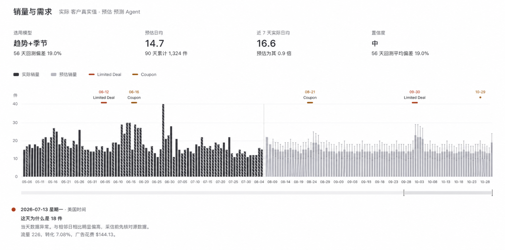
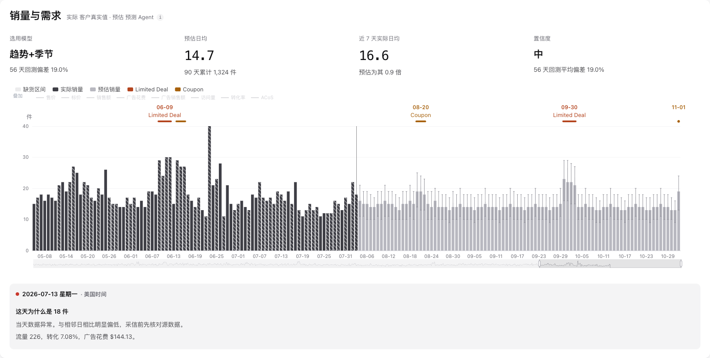

# 视觉基准要则（V6）

**性质** 这是**规则**，不是某个模块的实现记录，也不是施工单。
任何模块要做板块、指标格、图表、详情区，照这里的档位做。

**这份不规定谁去改什么。** 套到哪个模块、什么时候套、由谁套，不在本文范围。

---

## 参照物

两张图都在本文同目录，跟着文档走，不依赖会被清理的临时路径。

### 设计图（基准来源）

`00-通用方法与规范/06-视觉基准-设计图.png` · 1568×779 · 1x



2026-08-31 用户给的销量与需求板块设计图。本文所有数值都是从这张图逐像素量出来的：
按行扫暗像素密度得字形高度，再反推字号（CJK 字形约占 0.88 em，
拉丁大写与数字约 0.72 em）。

**对着它看这几处**，也正是最容易做偏的几处：

- 板块标题与指标值的量级 —— 比直觉大一档以上
- 「趋势+季节」与「14.7」视觉重量接近，但字号差 8px（第一节）
- 事件标注是三层：日期 / 名称 / 横条，**名称与横条之间留着明显一段空白**（第三节）
- `11-01` 那个单日事件只有日期和一个圆点，没有名称也没有横条
- 图例只有一排且很短，没有被叠加指标占满（第五节）
- 分界处只有一条极淡的竖线，没有文字标签

### 参考实现（已对齐到 ≤1px）

`00-通用方法与规范/06-视觉基准-参考实现.png` · 库存模块单品盘点页的同一板块



代码在 `03-前端Demo/web/app.css` 的 token 块与 `web/daychart.js` 的
`FS` / `ANNO` / `FONT` 常量。这是唯一一处已经跑到位的样子。

对齐结果（同一把尺量两张图，差 ≤1px 视为一致）：

| 项 | 设计图 | 实现 |
| --- | --- | --- |
| 横条厚度 | 4px | 4px |
| 日期字形高 | 9px | 9px |
| 名称字形高 | 10px | 10px |
| 日期底 → 名称顶 | 8px | 8px |
| 名称底 → 横条顶 | 9px | 9px |
| 日期顶 → 横条顶 | 36px | 35px |

**与设计图的四处差异都是有意的**，别当成没做到：

| 差异 | 原因 |
| --- | --- |
| 垂直节奏收到 0.8 倍 | 设计图是单板块特写，真实页面一屏要放七八个板块（第四节） |
| 多一排「叠加」图例 | 设计图没有可切换的折线；实现要能切，所以另起一排从属图例（第五节） |
| 多一项「缺货区间」图例 | 设计图那个对象没有缺货日，这个对象有 48 天 |
| 事件日期差 1~2 天 | 两边数据状态不同，不是排版差异 |

---

## 一、字号只用这几级

原始八档是从设计图量出来的，值不许动；第九档 `--fs-page` 是 2026-08-31 批准的例外，
理由见本节末。**除此之外不再新增。**
（本文早前写作「七级」，实际列了八行；2026-08-31 一并改正。）

| 档位 | 值 | 用途 |
| --- | --- | --- |
| `--fs-axis` | 11px | 图表轴刻度、dataZoom 文字 |
| `--fs-anno` | 12px | 图上标注的日期 |
| `--fs-meta` | 13px | 指标标签、图例、板块副标题、图上标注的名称 |
| `--fs-body` | 14px | 正文、指标脚注、详情区各级 |
| `--fs-sub` | 16px | 次级小标题、**整句陈述**（结论条那种一句话结论） |
| `--fs-value` | 22px | 指标值：文字型，以及**放不下 30 的复合值与日期** |
| `--fs-title` | 24px | 板块标题 |
| `--fs-page` | 由调参器定（>24） | **页面标题**（外壳的 `.wb-head h1`）。见下方「第九档」 |
| `--fs-num` | 30px | 指标值：单个数字 |

**不新增档位。** 遇到没覆盖的场景，向上或向下取最近一档，
不要插 `15px`、`18px` 这种中间值。上表是从设计图量出来的实际分布，
插值只会让层级读不出来。

### 第九档 `--fs-page`：为什么破了「不新增档位」

**2026-08-31 王楠批准新增。** 这是目前唯一的例外，破例的理由要写清楚，
否则下一个人会照着这个先例继续加。

设计图是**单板块特写**，它上面没有页面标题这一层，所以量出来的阶梯顶端就是
板块标题 24。但工作台实际有三层：页面标题（外壳的「广告分类与数据查看」）>
板块标题（模块的「横向对比」）> 次级小标题。而 30 已经被「指标值：单个数字」占掉。

不加这一档，页面标题只能挤在 24 以下 —— 实测外壳原来是 19px，
于是**页面标题比它所包含的板块标题还小，层级读反**。

另外两条路都有代价，记下来备查：把页面标题放到 30 会和「单个数字」共用一档；
把板块标题退到 22 会和指标值抢视觉重量，正是 16/22 分界要避免的那件事。

**值不写死在本文里**，由 `?tune=1` 拖定。约束只有一条，门禁 G19 守着：
必须严格大于 `--fs-title`。

### 16 与 22 的分界：陈述归 16，值归 22

一句话结论（「预计 2026-08-08 库存见底」这种）**归 16**，不要因为它重要就升到 22。
22 那档留给指标值。理由是**页面里最大的东西应该是数字**：
结论句占了 22，它就会跟指标值抢视觉重量，而结论句本身已经有状态圆点和加粗，
不需要再靠字号强调。降到 16 之后 30px 的数字明确成为板块里最重的东西。

反过来，**放不下 30 的指标值降到 22，不要降到 16**。
复合值（`$12.97 / $0.00`、`342 / 5 / 15`）和日期（`2026-08-08`）在 30px 下会撑破格子，
但它们仍然是值不是陈述，所以落在 22 而不是 16。
实现上用一个修饰类（库存模块是 `.big.compact`），
**不要在标记里内联 `font-size`** —— 内联字号在 CSS 层扫不到，门禁管不住它。

### 图标字形不在阶梯里

ⓘ 这种画在固定尺寸圆里的标记是图标，不是文本层级。
它取 `--fs-axis`，理由只是"在 16px 的圆里放得下"，与文本层级无关。
不要为图标新开档位，也不要因为它比正文小就以为层级出了问题。

### 两条容易做反的

**文字型指标值和数字型指标值不同档：22 与 30。**
设计图里「趋势+季节」和「14.7」视觉重量接近，但字号差 8px ——
因为数字字形比 CJK 矮，同样的观感需要更大的字号。
按同一档写会让数字看着缩水。数字另加等宽与 `tabular-nums`。

**图上标注的名称比日期大一档：13 与 12。**
名称是信息（「Limited Deal」），日期只是定位。设计图里名称字形 10px、
日期 9px，方向明确。直觉容易把加粗的日期做大，那是反的。

---

## 二、字体栈

正文与图表**必须是同一个栈**。

**图表要显式注入。** Canvas 里画的字不继承 CSS，不注入就落到浏览器默认
`sans-serif`，和页面不是同一套字形。这是最容易漏的一处不一致，因为两边单独看都没问题。

注入位置有两处，都要给：

- 图表库的全局 `textStyle.fontFamily`
- 自己在 `renderItem` 里手画的每个文字元素，单独带 `fontFamily`

数字用等宽栈，其余用无衬线栈。

### 就是系统字体，而且全站只用它一种

**已定（2026-08-31）**：`--sans` 以 `-apple-system` 起头。

设计图用的字体是 **SF Pro**，这是量出来的，不是猜的。方法是**字形宽度比值指纹** ——
比值与缩放无关，所以一张放大过的截图也能用来定字族（绝对 px 就不能）：

| 候选 | 平均偏差 |
| --- | --- |
| **SF Pro Text** | **0.0220** |
| Helvetica | 0.0390 |
| Geneva | 0.0523 |
| Helvetica Neue | 0.0733 |
| SF Mono | 0.1115 |

**不要用等宽字体显示数字。** 等宽字体为了让 `1` 填满字身会给它画底衬线，
所以 `1` 和 `6` 几乎同宽（指纹 0.60 / 0.56），而设计图里是 0.375 / 0.667 ——
`1` 只有 `6` 的一半多一点。屏幕上的差别是"数字看着机械且偏宽"。

需要多行数字列对齐时，用 `font-variant-numeric: tabular-nums`。
**比例字体加它一样能对齐**，不必为了对齐牺牲字形。代价是字母数字混排
（ASIN 这类）失去逐位竖向对齐 —— 那是取舍，不是 bug。

**声明顺序要让匹配是确定的，不是偶然的。** 曾经的栈是
`"IBM Plex Sans", Inter, -apple-system, …`，而本机两个都没装，
靠连续 miss 两次才落到 SF Pro。谁装了 Inter，页面就会静默变成另一种字体。
把系统字体放最前，Plex/Inter 留在后面给非 macOS 兜底。

> **判断字族不能看截图。** 无头浏览器的字体集很小：实测 `IBM Plex Sans`、`Inter`、
> `-apple-system`、`SF Mono` 在里面渲染 `14.7` 的宽度**全是 54.4px** ——
> 四个不同字体不可能同宽，说明一个都没装、全回落到同一个默认字体。
> 要判断字族，量比值指纹，或读 `getComputedStyle` 确认声明，不要靠眼睛看渲染结果。

---

## 三、图上标注的垂直排布

设计图量得，这一组是**成套的**，改一个要重算其余：

| 项 | 值 |
| --- | --- |
| 横条厚度 | 4px |
| 日期字形高 | 9px（12px 数字） |
| 名称字形高 | 10px（13px 拉丁） |
| 日期底 → 名称顶 | 8px |
| **名称底 → 横条顶** | **9px** |
| 日期顶 → 横条顶 | 36px |

**行高由间隔算出，不写死。**

```
nameTop = 横条厚/2 + 名称底距横条顶 + 名称字形高
dateTop = nameTop  + 日期底距名称顶 + 日期字形高
行高    = ceil(dateTop + 横条厚/2 + 呼吸)
```

写死行高的后果是：任何一个间隔调整之后，标注会顶出格或留白，
而且要人去重算 —— 而重算这件事必然会漏。

**间隔量的是墨迹之间的距离，不是行盒之间的距离。**
文字定位 API 通常按行盒顶部对齐，而墨迹在行盒内还有一段空白，
两者差 1~2px。按行盒排会把 9px 排成 7px，视觉上就是"贴着"。

### 标注避让

**按中心距判，不按横条间隙判。** 文字居中在横条上，两条标注会不会压字取决于
中心距；横条间隙对多日区间会严重低估可用宽度，本来放得下的名称会被误藏。

**阈值取半宽**（文字居中，相邻两条各让出一半就不重叠）。
允许挨着，不允许压字。

**降级分三级**：空间够给日期+名称 → 紧了留日期 → 极紧才都不画。
全有全无会在中等间距时白丢掉信息 —— 日期只有五个字符，比名称窄得多。

---

## 四、垂直节奏

设计图是单板块特写，真实页面一屏要放七八个板块。
**字号严格照做，节奏按 0.8 倍收。**

| 位置 | 设计图 | 本要则 |
| --- | --- | --- |
| 板块标题 → 首个内容块 | 50px | 26px + 内容自身上边距 |
| 指标标签 → 值 | 17px | 14px |
| 值 → 脚注 | 15px | 12px |
| 指标行 → 图表 | 54px | 40px |
| 详情区各行 | 12~14px | 4px 外边距 + 1.75 行高 |

全按特写的松度，首屏只装得下两个板块。这一条是有意偏离，
不是没做到 —— 如果哪天判断变了，把这一栏改回设计图值即可，字号不动。

---

## 五、图例的分工

**图例分两排，各回答一个问题。**

- **第一排：这张图是什么。** 量（柱）+ 那几天做了什么（事件区间）。
  必须干净。图标：柱用方块，区间用短横线 —— 形状本身就说明了它是"量"还是"段"。
- **第二排：能额外压什么上去。** 可选的叠加指标。从属样式（更小更淡、
  线状图标、可翻页），**全部默认关闭**。

**内部序列不上图例。** 承载分界线的空序列、属于某条柱的误差线，
这些是实现手段不是数据维度，出现在图例里就是噪音。

**默认开启的子集本身是设计。** 十几条一起画会糊成一片。
默认只开一个可读的子集，其余让人自己加。

---

## 六、叠加折线的轴

**必须从 0 起（`min: 0`，关掉自动缩放）。**

开自动缩放的后果是具体的：一条实测只波动 1.5% 的价格线（$50.13~$58.99）
会被拉满整个绘图高度，画成大起大落 —— 而叠加轴通常是隐藏的，
看的人无法判断量级，只能读到一个错误的印象。从 0 起之后，平的就看着是平的。

**按量纲分轴，不按数量分轴。** 金额 / 计数 / 比率至少三根。
比率不能跟计数共轴：转化率 0~0.15 跟访问量几百放一起，
会被压成贴着零轴的一条直线。

**状态量用台阶画，流量用折线画。** 价格是"保持到下次变动"的状态，
用台阶才对；金额、访问量是逐日发生的量，用折线。

**折线配色避开事件色。** 事件类型的颜色是有语义的，
折线是叠加参考，占用同一批色相会让人以为两者相关。

---

## 七、这些规则怎么验

要则不靠人眼守，靠门禁守。建议至少这几条，**且必须打在真有该特征的对象上**：

| 门禁 | 断言 |
| --- | --- |
| 图例分工 | 第一排项数有上限、不含内部序列；第二排全部默认关闭 |
| 叠加轴 | 每一根都 `min: 0` |
| 标注层 | 在独立的上层区域，不与量的绘图区共用 |
| 标注配色 | 同一对象的各类事件颜色两两不同 |
| 序列长度 | 各数组与日期轴等长（错位一天会把标注贴到错误的柱子上） |
| 字号 | 模块样式里不出现字号字面量，只出现档位变量 |
| 内联字号 | 模块 JS 里不出现 `font-size:` —— 内联的在 CSS 层扫不到 |
| canvas 镜像 | 图表侧那份字号常量的每一项都落在阶梯档位上 |
| 硬编码 | 图表 option 里不出现绕过字号常量的字面值 |

**查之前先剥注释。** 注释里会写「原来是 font-size:17px」这类说明，那是文档不是规则。
一个被注释误报的门禁，早晚会被人加白名单绕过，最后一样失效。

**没有检查对象的门禁比没有门禁更糟。** 一个既无事件也无缺货的对象上，
"标注 0 条 / 缺货柱 0 根"照样打勾，给的是虚假的安全感。
挑靶子时按特征挑，并把靶子写进门禁的注释里。

---

## 八、量的方法（要复核或扩展时用）

按行扫暗像素密度，把连续的暗行聚成一个文字行，取其高度当字形高度，
再按字形类别反推字号（CJK ÷0.88、拉丁大写与数字 ÷0.72）。
实现侧读计算样式核对，不靠反推。

判定标准：**差 ≤1px 视为一致。**

现成的尺：`03-前端Demo/_measure_both.py`，用同一套逻辑量两张图并列输出。
用法 `/usr/bin/python3 _measure_both.py <设计图> <截图>`。
