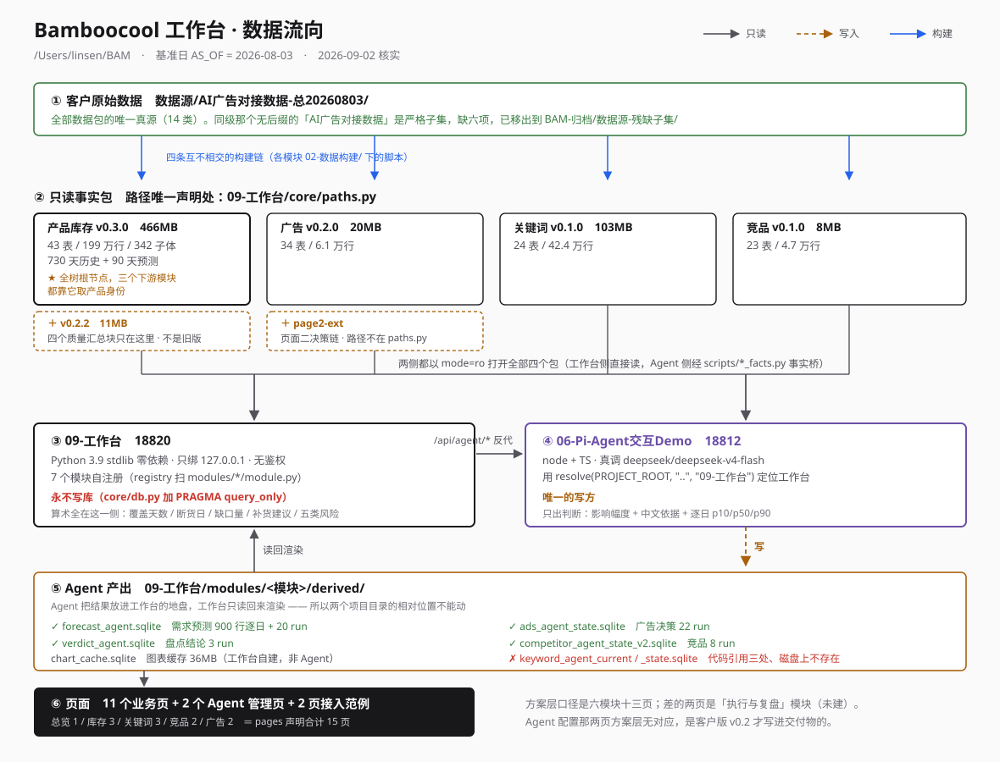

# BAM 项目总入口

> **给新会话 / 新 agent 的第一份文档。读完这份就知道去哪、别踩什么。**
>
> 生成于 2026-08-31 23:45，依据四路只读勘查（上游方案层 / 06- 文档层 / 数据层 / 代码层）。
> 所有「实测」数字都是这个时刻的快照。**本次整理没有移动、改名、删除任何文件。**
>
> 维护约定：这份是索引，不是新的事实来源。任何冲突以它指向的权威文档为准；
> 发现指错了就改这份，不要在别处另开一份索引。

---

> **待解决的问题看 `00-待解决问题.md`**

## 0. 三十秒版本

给亚马逊卖家（竹纤维家纺，GMV 头部，4 个运营）做的 AI 运营工作台。
**六个模块、十三个业务页面、56 项能力**是方案层的口径；工作台里实做了 **11 个业务页 + 2 个 Agent 管理页**，差的两页是「执行与复盘」模块（没建）。

跑起来的东西只有两个进程：

```
工作台      18820   /Users/linsen/BAM/09-工作台
                    Python 3.9 stdlib 零依赖，只绑 127.0.0.1、无鉴权
Agent 侧    18812   /Users/linsen/BAM/06-Pi-Agent交互Demo
                    node + TS，真调 deepseek/deepseek-v4-flash
```

浏览器**只跟 18820 说话**，`/api/agent/*` 由 `server.py:_proxy_agent` 转发到 18812。
**另有 18810 / 18811 / 18813 三个端口也在监听，但它们是没人收的残留 daemon，不是主线。**

启停必须 `/usr/bin/python3 start.py {start|stop|restart|status}`（3.9.6）。

---

## 1. ★ 最新状态：今晚两次会推翻了什么

**这一节最要紧。** 2026-08-31 13:58–14:53 开了两个会，记录今晚 23:10/23:11 才落盘：

```
/Users/linsen/BAM/04-原始访谈与会议/2026-08-31｜bam方案定稿与内部评审会｜文字记录.md
/Users/linsen/BAM/04-原始访谈与会议/2026-08-31｜bam2工作边界与合作节奏讨论会｜文字记录.md
```

**关键时序**：对外方案 `客户版_v0.2` 的 mtime 是 13:43，比会议开始早 15 分钟——
**v0.2 就是被评审的那一版，所以会上定的改动一条都还没进去。**

参会：winton（林森，产品经理，做方案与 demo）、Eren（商务与项目主导）、feiya + 超华（开发）。

### 1.1 会上定的七条产品改动，现在全部没做

| # | 决定 | 现状 | 性质 |
|---|---|---|---|
| 1 | 有 AI/Agent 能力的板块要加 **AI logo 标识**，让人分清「看板」和「agent」 | 全树零命中 | 新增 |
| 2 | 逐日销量那类图**必须能导出 Excel**（客户是「用文件下单」） | 无任何导出能力 | 新增 |
| 3 | 预测算法**开源成方案下拉**：默认/方案一/二/三，客户可自建（自建的是可转卖资产） | 只有 34 个门槛参数可调 | **与 v0.2 交付物定义矛盾** |
| 4 | **每个 Agent 加前置输入口径**，不再点一下跑全量（省 token、少 bug） | 关键词硬编码 `{"scope":"all"}`；竞品 20 个族在数据构建期定死 | **直接矛盾** |
| 5 | 关键词**拆成两个 Agent**（只分析词 / 分析 ASIN） | 方案层已对齐，工作台只有一个任务 | 实现层矛盾 |
| 6 | 产品/关键词/竞品/广告**各出一份可导出的汇报文档** | v0.2 只承诺「总览结论与周报草稿」 | 范围扩大，**报价未含** |
| 7 | 竞品/关键词报告模板向对方账户经理索取 | — | 待办 |

### 1.2 商业侧与边界（v0.2 里缺的）

- **年包 + 按月/季迭代费与维护费**，报价里要单起一节声明迭代包含什么（理由：房地产那个项目正在免费帮客户迭代）。v0.2 报价四项里无任何按月按季条目。
- **方案要新增两块内容**：①对方需要配合的事项清单（逐条列，哪些他们主导、哪些配合我们）②执行人的工作待办清单（谁、哪个阶段、做什么、什么时候）。理由是老板只拍板，真正接入的人拿着方案不知从哪下手。
- 数据安全走**客户自有云账号**，不做本地部署。
- 客户 ERP 是**领星，可完全开源接给我们**，比原始导出干净。
- **驻场一周**：Eren 同意，要写进方案备注。但 v0.2 §05 把驻场归入「走 Change Order / SOW」——同一件事两种商务性质，客户读到会矛盾。
- 节奏：周一~周三改完 demo+方案 → **周五拉会** → 下周做细项/报价/合同。
- 过会对象：客户「老二和老三」（其中一个叫 Damon），老大 60 多岁不看这个。

### 1.3 角色边界（第二个会的全部内容）

- **林森 = 产品经理**，职责不止交 demo：要**验收开发出来的功能并出验收报告**，当客户与开发之间的润滑剂，也参与 Agent 调试。
- **feiya + 超华 = 开发**。feiya 明确在功能与交互定稿前不做准备，并指出新 demo 与旧 demo 差别很大。
- 当前目标只有两个：**把功能定下来、把 demo 交互定下来**，然后才开发。

### 1.4 一条口径需要澄清

会上口述「实际应该有 1000 多个 ASIN，我只输入了 300 多」，而**全部方案文档与 06- 文档都写 342 个在售子 ASIN**。342 是「全部在售」还是「抽样」，直接决定客户版方案那句话对不对、周五会上会不会被当场质疑。

---

## 2. 目录地图

2026-09-01 重构过：原来真项目埋在 `06-Bamboocool-Demo重建/` 里，现在那层前缀去掉了，
无关的移出到 `/Users/linsen/BAM-归档/`（含 23 步回滚脚本 `_回滚.sh`）。

```
/Users/linsen/BAM/                 ← 项目本身
├── AGENTS.md                      ★ agent 起步规则（已重写，覆盖旧的 Organic Soft-Tech 基线）
├── 00-项目总入口.md                ★ 本文件
├── 00-通用方法与规范/              ★ 跨模块契约 12 份
├── 01-方案与数据需求/              库存这条线的方案与契约 9 份
├── 01-客户数据源索引/              客户 53 文件 / 152 Sheet 底账
├── 02-产品销售库存模块/            数据构建 v0.1.0→v0.3.0 + 方案 5 份
├── 04-广告分析模块/                源表勘查 + 数据构建 3 版 + 方案 6 份 + 验收
├── 06-Pi-Agent交互Demo/            ★ Agent 侧 18812（王楠主导，动它要先要授权）
├── 07-关键词分析模块/              数据构建 v0.1.0 + 方案 8 份
├── 08-竞品分析模块/                方案 6 份 + 数据构建 v0.1.0 + 验收
├── 09-工作台/                      ★ 主线 18820
├── 10-产品方案/                    ★ 业务口径权威（原「bamboocool 产品方案」）
├── 11-页面框架与决策/              ★ 含优先级最高的《全局信息设计原则》
├── 12-会议与访谈/                  ★ 9 份逐字稿（08-31 那两份是最新决定）
└── 数据源/AI广告对接数据-总20260803/  构建唯一真源

/Users/linsen/BAM-归档/            ← 与新 demo 无关的
├── _回滚.sh                       23 步回滚
├── AGENTS.md-原版 / README.md-原版
├── 02-项目方案与PRD/              过期：七工作面口径
├── 03-Demo与页面结构/             废弃：旧前端 + 942MB node_modules
├── 05-客户提供资料/               未被构建脚本引用
├── 99-历史与技术备份/             历史留档 48 件
├── V5-项目方案与成品/             信息架构已回流，运行时不迁移（956MB）
├── 数据源-残缺子集/               ⚠️ 缺六项，读它会得出错结论
└── 旧Demo/                        03-前端Demo / 04-UICraft测试 / 05-广告前端Demo / 10-LiquidGlass测试
```

**上提时只重命名了上游那三个**（产品方案 / 页面框架决策 / 会议访谈），
因为不改会在 BAM 根撞出三个 `01-` 和两个 `04-`。
`06-` 内部的目录名一个都没动——文档里十几处交叉引用写的是相对名，改名会全部打断。

## 3. 按问题找文档

| 我想知道 | 读这份 |
|---|---|
| 为什么做这个、客户在意什么 | `04-原始访谈与会议/2026-07-28｜…业务访谈与广告复盘讨论会（上/下）｜文字记录.md` |
| **现在最新定了什么** | `04-原始访谈与会议/2026-08-31｜…` 两份（见 §1） |
| 某个模块的页面职责与板块 | `bamboocool 产品方案/Bamboocool-<模块>模块{三页/两页}架构方案.md` |
| 某个模块要算出什么业务结果 | `bamboocool 产品方案/Bamboocool-<模块>模块必备逻辑与能力清单.md` |
| 全局架构、跨模块标准结果 | `bamboocool 产品方案/Bamboocool-AI运营工作台方案.md`（按 §号引用它） |
| **业务逻辑怎么变成页面** | `01-当前页面框架与决策/Bamboocool-工作台全局信息设计原则.md` ← **全项目优先级最高**，模块接入契约自己写「冲突时以它为准」 |
| 一个页面动笔前要先产出什么 | `01-当前页面框架与决策/Bamboocool-产品与库存页屏幕决策设计.md`（范式样板，G10 门禁的核对对象） |
| 对客户怎么说 | `bamboocool 产品方案/Bamboocool-AI运营工作台合作方案_客户版_v0.2.md`（**注意 v0.1 同名同日，已废**） |
| **新模块怎么并进工作台** | `06-/00-通用方法与规范/02-模块接入契约.md`（版本号不可信，见 §6） |
| **怎么给 Agent 写需求而不把它压成复印机** | `06-/00-通用方法与规范/08-Agent需求与数据契约要则.md` v1.1 ← Agent 侧最上位 |
| Agent 落库的统一语义 | `06-/00-通用方法与规范/07-Agent运行与落库口径.md` v1.0 |
| 字号、间距、颜色档位 | `06-/00-通用方法与规范/06-视觉基准要则.md` + 同目录两张 png |
| 库存这条线现在到哪了 | `06-/01-方案与数据需求/08-当前进度与下一步.md`（部分过期） |
| 外壳侧到哪了 | `06-/01-方案与数据需求/09-外壳与Agent交互交接.md`（部分过期，写的 18821 已死） |
| Agent 侧哪几份规格已批准/已作废 | `06-/06-Pi-Agent交互Demo/Product-Spec.md` ← Agent 侧规格总入口 |
| 客户原始数据有哪些字段 | `06-/01-客户数据源索引/02A`（非广告）/ `02B`（广告）/ `客户数据源索引.json` |

**四个真正的入口**：库存线看 `08-当前进度`，外壳线看 `09-外壳与Agent交互交接`，
各模块看它自己的「交底包/完整交底」，Agent 侧看 `Product-Spec.md`。

---

## 4. 数据：一条真链，两个模块各开两个库



```
数据源/AI广告对接数据-总20260803/     ← 客户原始，14 类，全部数据包的唯一输入
        ↓ 四条互不相交的构建链
产品库存 v0.3.0  466MB   43 表 / 199 万行 / 342 子体 × 730 天历史 + 90 天预测  ★ 全树根节点
广告     v0.2.0   20MB   34 表 / 6.1 万行
关键词   v0.1.0  103MB   24 表 / 42.4 万行
竞品     v0.1.0    8MB   23 表 / 4.7 万行
        ↓ core/paths.py 声明（全站唯一声明处，含 AS_OF=2026-08-03）
        ↓ 各模块 data.py 以 mode=ro 打开
页面
```

### 四个模块各自读什么（2026-09-01 逐个核实过存在）

| 模块 | 读的库 | 大小 | 声明在哪 |
|---|---|---|---|
| 产品与库存 | `02-产品销售库存模块/02-数据构建/v0.3.0/…v0.3.0.sqlite` | 466MB | `paths.PRODUCT_DB` |
| | **加** `…/v0.2.2/…v0.2.2.sqlite` —— 页面要的四个质量汇总块只在这里 | 11MB | `modules/inventory/data.py:26` |
| 广告 | `04-广告分析模块/02-数据构建/v0.2.0/advertising_demo.sqlite` | 20MB | `paths.ADS_DB` |
| | **加** `…/page2-ext/page2_decision_ext.sqlite` —— 页面二整条决策链 | 小 | `modules/ads/data.py:32` |
| 关键词 | `07-关键词分析模块/02-数据构建/v0.1.0/keyword_demo.sqlite` | 103MB | `paths.KEYWORD_DB` |
| 竞品 | `08-竞品分析模块/02-数据构建/v0.1.0/competitor_demo.sqlite` | 8MB | `paths.COMPETITOR_DB` |

**两个反直觉的地方：**

**库存的 `v0.2.2` 不是旧版。** v0.3.0 把 `quality_report.json` 换成了扁平检查表，
页面要的四个质量汇总块只剩 v0.2.2 有，所以两个同时在读。别按版本号大小清理数据包。

**广告的扩展库路径不在 `paths.py` 里**，写在 `modules/ads/data.py`，
因为契约禁止模块改 `core/`。只看 `paths.py` 会以为广告只用一个库。

### Agent 写的是另一套

上面那些是**只读的事实包**。Agent 产出落在工作台自己的 `derived/` 里，
工作台只读回来渲染（**工作台永不写库**，`core/db.py` 额外加 `PRAGMA query_only`）：

```
modules/inventory/derived/forecast_agent.sqlite      需求预测   900 行逐日 + 20 run
modules/inventory/derived/verdict_agent.sqlite       盘点结论   3 run
modules/inventory/derived/chart_cache.sqlite         图表缓存   36MB（工作台自建，非 Agent）
modules/ads/derived/ads_agent_state.sqlite           广告决策   22 run
modules/competitor/derived/competitor_agent_state_v2.sqlite   竞品 v2   8 run
modules/keyword/derived/keyword_agent_current.sqlite + _state.sqlite   ⚠️ 见下
```

**唯一的缺口在关键词**：那两个正式落点被三处代码引用（工作台读取层、Agent 侧、
Agent 输出记录页），但**磁盘上都不存在**——关键词 Agent 至今没成功落过一次正式结果，
只有 3 次 Loop Smoke 全部 MODEL_TIMEOUT。所以关键词页现在读的全是基础数据包。

### 一个已被结构消掉的陷阱

原来 `数据源/` 下有两个目录，`AI广告对接数据`（无后缀那个）是权威包的**严格子集**，
缺广告、销售报表、利润测算、仓储费、运输时效等六项。只读它会得出
「客户没提供广告数据」然后去虚构——这个错犯过。
2026-09-01 已把它移到 `BAM-归档/数据源-残缺子集/`，现在 `数据源/` 下只有权威那一份。

## 5. 九个 Agent 的真实状态

登记表在 `06-/09-工作台/modules/agentcfg/registry_seed.py`，配置页 `/agentcfg`。

| Agent | 登记状态 | 实际落表 | 备注 |
|---|---|---|---|
| 盘点结论 | 已接通 | 3 run（06:57） | 22 个数字与确定性层交叉核对过；**但 `inventory-verdict.ts` 没接进 `server.ts`，页面上没有按钮能重跑它** |
| 需求预测 | 未接通 | **20 run / 900 行逐日预测（14:13）** | ⚠️ **登记状态已过期**——它已经在出 90 天 p10/p50/p90 了。20 run 中 10 成 10 败，失败全是模型余额 402 |
| 广告异常与决策 | 待声明 | 22 run，20 成 2 败，5 个子 ASIN | 十回合链；**反向依赖工作台**（回调 `18820/api/ads/context`），工作台停机它跑不了 |
| 竞品威胁判定 | 待声明 | v2 8 run（08:12） | v1 库仍被「Agent 输出记录」页读着，删 v1 要同时改登记表 |
| 关键词机会与风险 | 待声明 | **0 次成功** | 3 次 Loop Smoke 全部 MODEL_TIMEOUT；正式落点两个库**代码里被三处引用、磁盘上不存在** |
| 库存总体分析 | 待声明 | — | 按分组整合子 Agent 结论，王楠 08-31 提出 |
| 子体关键词布局 | 待声明 | — | 对应模块声明的第三个判断对象（关键词 × 子ASIN × 当前目标） |
| 广告目的标签 | 未接通 | 0 次 | 代码/路由/落表形状都有（`loop-a1`），从没成功跑过；页面上那 54 个标签是数据包烤好的，其中 11 个「无法识别」正是它该补的位置 |
| 运营总览 | 待声明 | — | 总览页现在的结论是人写的示例文案，页面已如实标注 |

**触发方式四种不统一**：库存预测和关键词走 HTTP；竞品走 HTTP 发起但**状态轮询直接读库台账**
（`run_id` 入队时分配，外壳 25 秒等不到 63–106 秒的结果）；广告是**子进程 + 反向回调**。

---

## 6. 十个陷阱

**一、`/Users/linsen/BAM/AGENTS.md` 是最危险的一处**，因为 agent 会无条件读它。
它写「以 Organic Soft-Tech 作为当前 UI 设计基线」并指 `03-Demo与页面结构/前端代码/...` 为当前前端；
而 `06-/00-通用方法与规范/02-模块接入契约.md:43` 明确「**不采用** Organic Soft-Tech，沿用工作台已定型的浅色 token 体系」。
照 AGENTS.md 干活 = 去改一个废弃项目、套一套被否掉的视觉。它比契约旧 20 天，末尾还留着 Windows 路径。

**二、`数据源/AI广告对接数据/` 错得没有症状。** 它和权威的 `-总20260803` 只差目录名后缀，
是后者的**严格子集**，缺的正好是 13.广告、11.销售数据报表、12.利润测算、6.仓储费、7.运输时效。
只读它的人会得出「客户没提供广告数据」然后去虚构——这个错以前犯过，
`02-产品销售库存模块/01-方案与数据需求/06-…门禁.md` 已写死「其他目录不用于判断源数据是否齐全」。

**三、契约版本号不可信，门禁清单被劈成两半。**
`02-模块接入契约.md` 头部写 `v1.1`、变更清单已到 `v1.4`、四个引用方各写一版（v1.2/v1.3/v1.3/v1.4）。
更要紧的是门禁：

```
契约 §12 定义:  G1-G17（+ G25 只在变更清单里被点名，§12 里没有定义段落）
实际在跑:       G1-G9, G12-G14, G16-G25    实跑 24/24
```

**实际在跑的 G18–G24（视觉基准七条：字号阶梯、禁等宽、禁内联字号）根本没写进契约**，
它们住在 `06-视觉基准要则.md` 里。照契约读会以为只有 17 条。

**四、`modules/keyword/` 会遮蔽 Python 标准库的 `keyword`。**
在 `09-工作台/modules/` 目录里跑任何 python 脚本都会炸在 `from keyword import iskeyword`，
报错信息跟你的代码毫无关系。服务本身没事（`server.py` 走的是 `modules.keyword`）。
**别 cd 进 `modules/` 跑 python。**

**五、两个「看起来能删」其实不能删：**
- `06-Pi-Agent交互Demo/src/competitor-agent.ts`（v1）—— v2 从它 `import type` 九个类型，删了编译不过
- `06-/03-前端Demo`（18810）—— `modules/inventory/tests/_cmp_ports.py` 运行时真去抓它的载荷做递归比对，
  那是「与 18810 数字逐位一致」这条验收标准的唯一执行手段。归档它 = 放弃这条手段。

同理 `05-广告前端Demo` 前端可归档，**但它产出的 `page2-ext/page2_decision_ext.sqlite` 是主线活依赖。**

**六、关键词看起来接好了 Agent，其实页面读的全是基础数据包。**
`keyword_agent_current.sqlite` + `keyword_agent_state.sqlite` 要同时在、manifest 与台账一致才用 Agent 结果；
**这两个文件现在都不存在**，一律回落。别看到 `derived/` 里有 `keyword_agent_loop_state.sqlite`
就以为结论已上屏——那只是 Loop 运行态，而且 3 次全 MODEL_TIMEOUT。

**七、关键词包里两个 107MB sqlite 只有一个是权威。**
`keyword_demo.sqlite`（权威）与 `bamboocool_keyword_v0.1.0.sqlite`（改名前的源库）逐表行数完全相同，
区别只在表名前缀。按文件名「哪个像正式版本号」去挑会挑错。

**八、三种时间戳格式并存**（`+08:00` / `.Z` / 无偏移）。
跨库取「最新」必须解析后比，**不能 `ORDER BY created_at DESC`**——带 `Z` 的会被判成前一天，
更新的记录被更旧的盖掉且界面上完全看不出异常。这个坑已经踩过两次（库存、Agent 输出记录页），
两次都修了，**但至今没有任何门禁挡回归**。正确参照实现：`modules/agentcfg/module.py._stamp`。

**九、五个端口在听，只有两个是主线。** 18810/18811/18813 是没人收的残留 daemon
（`start.py` 双 fork + `setsid` 专门为了不被清理），源码分别停在 08-31 01:48 / **08-29 19:28** / 08-31 00:12。
**端口活着 ≠ 还在开发。**

**十、几个「假入口」：**
- 两份「完整项目上下文」（`01-当前页面框架与决策/00-` 与 `V5-.../00-V5版`）名字最像入口，
  实际都是 08-03 的**单运营口径**（「只面向一个确定运营、不做团队汇总」），与现在四运营+跨模块总览冲突
- `02-项目方案与PRD/` 目录名带 PRD 最像需求权威，实际讲七个工作面，与现行六模块十三页不同构
- 主方案从 `## 3. 总体架构` 开始，**没有 §1 §2**；找「项目定位」的人会掉进上面那份过期的 PRD
- `06-/00-通用方法与规范/07-需求判断上屏交底.md` 点名的 `forecast_judgment.py` / `probe_forecast_judgment.py`
  已不存在（现为 `agent_forecast.py` / `probe_demand_forecast.py`），而它把这些写成「已经做好的，不要重做」

---

## 7. 等王楠拍的决定

**周五过会前必须定的（会影响对外方案）**

1. **342 vs 1000+ 的 ASIN 口径**（§1.4）
2. **执行与复盘模块本期做到哪一步**——客户版方案写着「六个模块十三个业务页面」，工作台里没有这个模块。做动作记录页 = 12 页，两页都推 = 11 页
3. **「方案一/二/三」这层抽象归谁做**——Eren 要整套预测算法可切换且客户可自建；现有的是 34 个门槛参数。这不是一件事的两种说法，前者要新增「方案」这个一等对象（存哪、版本怎么管、切换后历史结论怎么办），属契约级改动
4. **驻场是一期建议还是变更项**——会上定「写进方案备注」，v0.2 §05 写「走 Change Order / SOW」，同一件事两种商务性质
5. **汇报文档四份 + Excel 导出的报价**——范围扩大了，v0.2 报价未含

**工程上要拍的**

6. **342 vs 521**：契约 §2 钉死脊椎 342 并点名广告那套 521 子体「是目前唯一需要返工的地方」，
   而广告数据构建范围文档至今按 521 写、数据包也已按 521 建成。改数据包还是给广告开例外？
7. **`AGENTS.md` 怎么处置**（陷阱一）——它是最容易让新 agent 走错的一处
8. **两个 `quarantine-*` 目录的隔离原因全树没有书面记录**，只有目录名（勘查是按代码时间线推断的）。
   合计约 215MB，隔离的数据还需不需要？
9. **关键词正式落点是「还没跑出来」还是「被清掉了」**
10. **`13-需求预测Agent分段运行需求.md` 的 R2「单步 ≤25 秒」**：实测第 5 步 28.6 秒稳定超标，
    其余 11 步全合规。调门槛还是再切一刀？
11. **编号撞号要不要真改名**——改名会打断十几处交叉引用
12. **时间戳门禁**：这个坑修过两次，至今无门禁挡回归。要不要补一条？

**可释放的空间（都要先确认没有别的会话在写）**

```
03-Demo与页面结构/前端代码/         942MB  含 node_modules，06- 全树零引用
V5-项目方案与成品/01-V5前端成品/    956MB  运行时明确不迁移，但 08-29 还被跑过
keyword/derived/ 隔离与恢复文件      322MB  原子写修复前的残留
三份字节相同的 chart_cache.sqlite    108MB  只有一份被读
```

---

## 8. 不要碰什么

- **`06-Pi-Agent交互Demo/` 是王楠主导的项目。** 回答问题、给写法、改他点名的段落可以；
  动手实现、发明表结构写进他的契约，**必须先要到授权**。
- **模块里不要改外壳文件**（`core/`、`shell.js`、`tokens.css`、`base.css`、`index.html`）。
- **工作台永不写库**（契约 6.1，`core/db.py` 额外加 `PRAGMA query_only`）。写库全在 Agent 侧，
  落点在工作台自己的 `modules/*/derived/` 里——**所以两个项目目录的相对位置不能动**。
- **不要在 `03-前端Demo` / `04-UICraft测试` / `05-广告前端Demo` / `10-LiquidGlass测试` 里新建功能**，
  它们是合并前的独立 demo。
- **动任何目录前先查 mtime**（`find -newermt`）和端口是否还在响应。
  多会话并行时「以为废弃了」和「实际还在被改」经常不一致——今天就撞上过两次。
- **`10-LiquidGlass测试` 归档时留一下 `web/perf.js` + `web/scenarios.js` + `_gate.py`**，
  那是帧率/Long Task 测量的现成工具，全树没有第二份。
