# Bamboocool AI 运营工作台总体产品方案

## 3. 总体架构

### 3.1 系统生成顺序

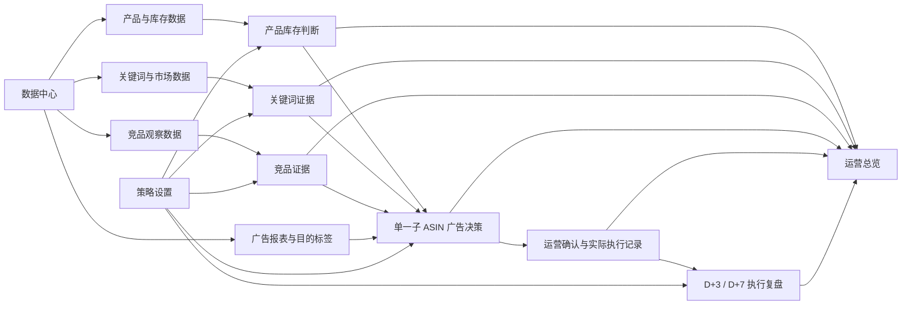
```mermaid
flowchart LR
    A[产品与库存数据] --> B[产品库存判断]
    C[关键词与市场数据] --> D[关键词证据]
    E[竞品观察数据] --> F[竞品证据]

    B --> G[单一子 ASIN 广告决策]
    D --> G
    F --> G
    H[广告报表与目的标签] --> G

    G --> I[运营确认与实际执行记录]
    I --> J[D+3 / D+7 执行复盘]

    B --> K[运营总览]
    D --> K
    F --> K
    G --> K
    I --> K
    J --> K

    L[数据中心] --> A
    L --> C
    L --> E
    L --> H
    M[策略设置] --> B
    M --> D
    M --> F
    M --> G
    M --> J
```

系统先计算专业模块结果，再形成广告决策与总览。总览不另建一套分析口径。

### 3.2 运营使用顺序

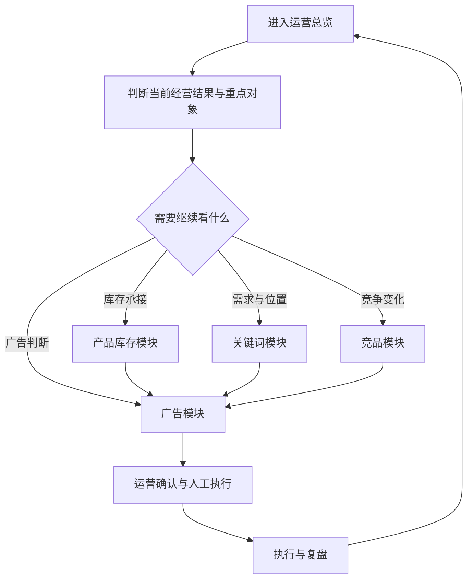
```mermaid
flowchart TD
    A[进入运营总览] --> B[判断当前经营结果与重点对象]
    B --> C{需要继续看什么}
    C -->|库存承接| D[产品库存模块]
    C -->|需求与位置| E[关键词模块]
    C -->|竞争变化| F[竞品模块]
    C -->|广告判断| G[广告模块]
    D --> G
    E --> G
    F --> G
    G --> H[运营确认与人工执行]
    H --> I[执行与复盘]
    I --> A
```

总览是运营入口；产品库存、关键词和竞品负责把原因与证据讲清楚；广告模块负责形成最终广告判断；执行与复盘负责记录结果并把反馈带回下一轮运营。

### 3.3 开发实施主线

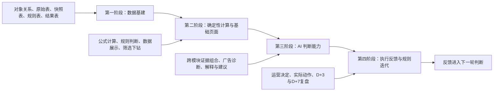
```mermaid
flowchart LR
    A[第一阶段：数据基建] --> B[第二阶段：确定性计算与基础页面]
    B --> C[第三阶段：AI 判断能力]
    C --> D[第四阶段：执行反馈与规则迭代]

    A1[对象关系、原始表、快照表、规则表、结果表] --> A
    B1[公式计算、规则判断、数据展示、筛选下钻] --> B
    C1[跨模块证据组合、广告诊断、解释与建议] --> C
    D1[运营决定、实际动作、D+3与D+7复盘] --> D
    D --> E[反馈进入下一轮判断]
```

开发先解决数据能否正确关联，再完成不依赖 AI 的计算和页面，之后接入 AI 判断，最后通过执行与复盘形成反馈闭环。

## 4. 六个模块与十三个业务页面

### 4.1 运营总览：1 页

- 运营总览：让运营看到当前经营结果、本周期结论、重点风险与机会、待本人判断事项，以及可修改和复制的简要周报。

### 4.2 产品库存：3 页

- 异常总览：集中查看缺货、超量、库存可用性、库龄和仓储费风险；
- 库存全览：查看当前范围内各子 ASIN 的库存位置、库存状态、库龄费用和承接情况；
- 单一子 ASIN 盘点：把销量预测、BD/Deal 输入、当前及未来库存、覆盖余缺、库龄和费用放在同一条判断链中。

### 4.3 关键词分析：3 页

- 关键词动态与机会总览：查看需求、覆盖、位置和机会变化；
- 市场关键词库与单词深研：查看共享市场词池及单个关键词的市场事实、产品关系和竞品证据；
- 子 ASIN 关键词盘点：查看某个子 ASIN 在当前目标下的关键词覆盖、自然位、广告位、变化和证据结论。

### 4.4 竞品分析：2 页

- 竞品威胁总览：查看重点竞品产品族的价格、活动、市场、关键词和流量变化；
- 单一竞品分析：围绕一个竞品产品族查看身份、产品族、市场表现、价格促销、关键词流量和共同时间线。

### 4.5 广告分析：2 页

- 广告分类与数据查看：按广告目的、类型、投放对象和状态组织广告对象，查看区间表现、数值异常、横向对比和标签历史；
- 单一子 ASIN 广告决策：把产品目标、库存约束、关键词与竞品证据、应有任务、现有结构、表现和历史动作组合成广告诊断与调整方案。

### 4.6 执行与复盘：2 页

- 动作确认与执行记录：记录运营对建议的接受、修改、拒绝或暂缓，以及最终实际执行内容和时间；
- 执行复盘：按 D+3、D+7 节点查看等长窗口结果、同期变化、复盘结论和下一步方向。

## 5. 六个模块之间的标准结果

### 5.1 产品库存模块输出

围绕子 ASIN 输出需求预测、当前与未来可用库存、覆盖与余缺、库龄费用、风险结果和库存承接能力。广告模块直接读取“当前库存能否承接目标与新增流量”。

### 5.2 关键词模块输出

围绕市场关键词、关键词 × 子 ASIN、关键词 × 子 ASIN × 当前目标，输出需求与竞争事实、自然/广告位置、覆盖变化、机会、缺口和风险证据。竞品模块与广告模块读取同一份关键词证据。

### 5.3 竞品模块输出

围绕重点竞品产品族输出带时间的价格、促销、市场、关键词和流量变化，以及共同时间线、关注程度和可能影响范围。关键词与广告模块使用这些结果作为竞争证据。

### 5.4 广告模块输出

广告数据页输出广告对象、目的标签、区间表现、数值异常和可比较结果；子 ASIN 决策页输出应有广告任务、现有结构差距、综合诊断、调整方向、观察要求和待运营确认事项。

### 5.5 执行与复盘模块输出

围绕一条可追溯的实际广告动作记录，输出运营决定、实际执行、D+3/D+7 资格与状态、目标匹配的前后结果、同期变化、复盘结论和下一步方向。

### 5.6 运营总览模块输出

围绕当前业务范围与经营周期，输出经营结果快照、本周期经营结论、重点风险与机会顺序、待运营判断事项、来源模块入口和简要周报草稿。

## 6. 跨模块业务对象与关系

工作台需要统一维护以下关系：

```text
站点 / 品线
  └─ 款号 / 产品族
      └─ 父 ASIN
          └─ 子 ASIN
              ├─ 当前产品阶段与产品目标
              ├─ 库存位置、状态、需求与风险
              ├─ 关键词覆盖、自然位与广告位
              ├─ 受影响的竞品产品族与竞争证据
              ├─ 广告活动 / 广告组 / Target / Search Term
              └─ 广告建议 / 运营决定 / 实际动作 / D+3与D+7复盘
```

其中需要特别保留三类边界：

- 共享或混合多个子 ASIN 的广告对象保留归因边界，不把全部表现强行归给单一子 ASIN；
- 竞品、价格、促销、排名和流量等同期变化先作为共同证据，经过验证后再形成因果结论；
- 日、周、30 天、月度和活动周期各自保留正式统计口径，总览负责并列解释，不强制改成同一周期。


---

## 7. 六个模块页面架构方案

本部分集中呈现工作台全部页面架构。阅读顺序与运营使用顺序一致：先看总览，再进入产品库存、关键词、竞品、广告以及执行复盘。

### 7.1 运营总览模块

#### 1. 模块边界

##### 1.1 总览负责什么

总览负责让运营快速完成四件事：

1. 判断当前品线的经营结果整体怎么样；
2. 找到当前最值得继续查看的少量风险、机会和变化；
3. 找到确实需要运营本人判断或确认的事项；
4. 按需生成可以修改和复制的简要经营周报。

##### 1.2 总览不负责什么

总览不负责：

- 重新计算产品库存、关键词、竞品和广告模块内部的专业结论；
- 展开关键词池、竞品明细、广告组明细或子 ASIN 完整盘点；
- 根据未经确认的阈值自行创造异常或广告动作；
- 把所有风险、系统计算过程和数据缺口自动变成待办任务；
- 直接修改广告、补货、价格或促销配置；
- 承担团队管理、多运营比较或多品线切换。

##### 1.3 最小业务对象

总览同时使用两类标准业务对象。

###### 经营结果

一个经营结果对应：

```text
当前业务范围 × 一个正式经营口径 × 一个统计周期 × 一个比较周期
```

例如销售结果可以按月统计并与去年同月比较，市场份额可以按月统计并与上月比较。页面每天可以打开，但每个结果仍使用自己的正式周期。

###### 经营关注项

一个经营关注项对应：

```text
来源模块 × 业务对象 × 发生时间或影响窗口 × 一条标准模块结论
```

业务对象可以是子 ASIN、关键词、竞品、广告对象或一条广告执行记录。总览不改变来源模块的判断对象和结论口径。

##### 1.4 上下游关系

总览读取以下上游结果：

- 销售、目标、利润、市场份额及库存资金约束形成的经营结果；
- 产品库存模块形成的单一子 ASIN 盘点结果和风险结果；
- 关键词模块形成的需求、覆盖、位置变化和机会证据；
- 竞品模块形成的威胁对象、市场变化和可核验证据；
- 广告模块形成的广告目的、架构诊断和待确认建议；
- 执行与复盘模块形成的人工决策、实际动作及 D+3、D+7 观察状态。

总览向下游提供：

- 带原对象、时间范围和来源结论的模块回查入口；
- 运营当前需要判断的事项入口；
- 可修改、可复制并保留生成依据的简要周报草稿。

#### 2. 一页总体架构

运营总览由六个连续板块组成：

1. 业务范围与数据状态；
2. 经营结果看板；
3. 本周期经营结论；
4. 重点风险与机会；
5. 待运营判断事项；
6. 核心数据与简要周报。

AI 作为贯穿页面的解释和总结能力，不单独占据一个与业务内容并列的大板块。

页面阅读主线为：

```text
先确认看的是哪个范围和哪段数据
        ↓
判断经营结果整体变好还是变差
        ↓
找到最值得继续看的业务对象
        ↓
处理确实需要本人判断的事项
        ↓
进入来源模块深挖，或生成简要周报
```

#### 3. 系统生成逻辑

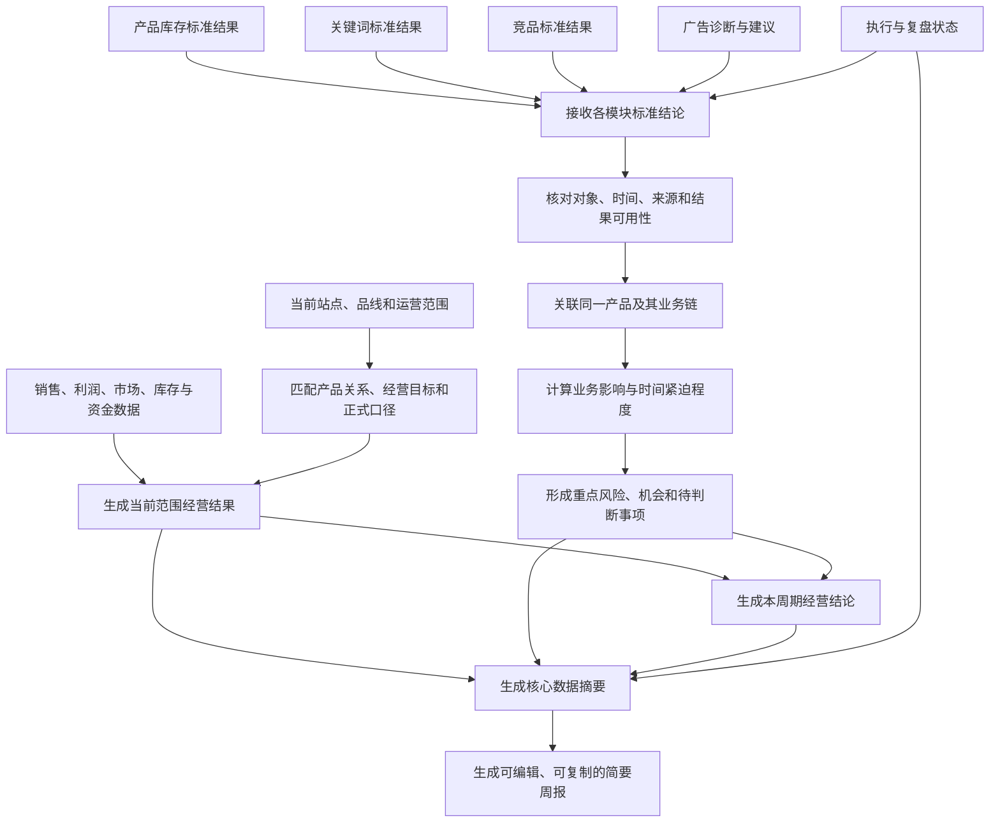
```mermaid
flowchart TD
    A[当前站点、品线和运营范围] --> B[匹配产品关系、经营目标和正式口径]
    C[销售、利润、市场、库存与资金数据] --> D[生成当前范围经营结果]
    B --> D

    E[产品库存标准结果] --> J[接收各模块标准结论]
    F[关键词标准结果] --> J
    G[竞品标准结果] --> J
    H[广告诊断与建议] --> J
    I[执行与复盘状态] --> J

    J --> K[核对对象、时间、来源和结果可用性]
    K --> L[关联同一产品及其业务链]
    L --> M[计算业务影响与时间紧迫程度]
    M --> N[形成重点风险、机会和待判断事项]

    D --> O[生成本周期经营结论]
    N --> O
    D --> P[生成核心数据摘要]
    N --> P
    O --> P
    I --> P
    P --> Q[生成可编辑、可复制的简要周报]
```

系统先形成经营结果和各模块标准结论，再生成总览。总览只对已有结果做范围匹配、关系连接、影响评价和优先顺序组织，不替代来源模块重新分析。

#### 4. 运营查看路径

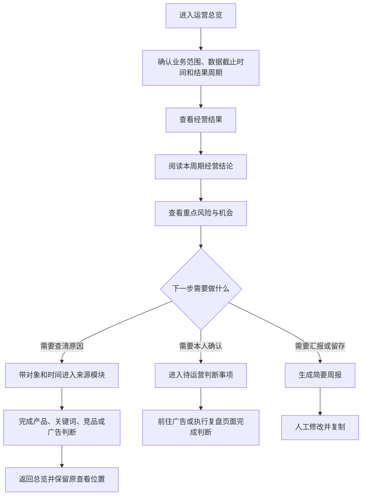
```mermaid
flowchart TD
    A[进入运营总览] --> B[确认业务范围、数据截止时间和结果周期]
    B --> C[查看经营结果]
    C --> D[阅读本周期经营结论]
    D --> E[查看重点风险与机会]
    E --> F{下一步需要做什么}

    F -->|需要查清原因| G[带对象和时间进入来源模块]
    G --> H[完成产品、关键词、竞品或广告判断]
    H --> I[返回总览并保留原查看位置]

    F -->|需要本人确认| J[进入待运营判断事项]
    J --> K[前往广告或执行复盘页面完成判断]

    F -->|需要汇报或留存| L[生成简要周报]
    L --> M[人工修改并复制]
```

#### 5. 板块一：业务范围与数据状态

##### 5.1 板块目标

先让运营确认当前总览代表哪个站点、哪个品线、哪个数据截止时间，避免把不同范围和不同更新周期的数据误认为同一时点结果。

##### 5.2 板块关系

本板块把三类信息放在一起：

- 当前固定业务范围；
- 页面整体的数据截止时间和最近更新时间；
- 经营结果与外部市场数据之间不同的刷新周期。

页面默认显示简短状态。运营需要核对时，可以继续查看数据来源、更新时间、正式口径、缺失项和待确认参数。

##### 5.3 板块输出

运营可以明确知道：

- 当前页面代表的业务范围；
- 哪些结果已经更新到当前周期；
- 哪些结果仍停留在较早周期；
- 哪些结论因为数据缺失或口径待确认只能谨慎使用。

#### 6. 板块二：经营结果看板

##### 6.1 板块目标

回答“当前这条品线经营得怎么样”，而不是罗列所有经营指标。

##### 6.2 经营结果结构

经营结果分为三组业务关系。

###### 规模与目标

把当前销售结果、既定目标和正式比较基准放在一起，说明销售规模是否达到计划，以及相对去年同期或其他确认周期发生了什么变化。

###### 利润与经营质量

把当前利润结果和正式利润口径放在一起，说明销售增长是否同时带来健康利润。利润口径未确认或财务数据尚未更新时，不输出伪精确结论。

###### 市场位置与经营约束

把市场份额或类目位置与当前最重要的库存、库龄、资金占用或下单约束放在一起，说明市场增长是否具备承接条件。

市场份额按客户实际可用周期展示。头部类目的市场份额主要按月判断时，必须明确显示月度结果，不能包装成日变化。

##### 6.3 展示原则

- 每个结果必须同时说明统计周期和比较周期；
- 页面每天可打开，不代表每项结果都按日变化；
- 广告成本口径在 ACoS、TACoS、ACoAS 等术语未正式统一前，不混用名称或写入固定判断；
- 库存和资金约束用于解释经营承接，不把全部库存指标复制到总览；
- 经营结果的数量保持克制，未进入整体判断的指标留在来源模块或数据说明中。

##### 6.4 板块输出

经营结果看板最终输出一份当前业务范围的经营结果快照，明确规模、利润、市场位置和关键经营约束各自处于什么状态。

#### 7. 板块三：本周期经营结论

##### 7.1 板块目标

把经营结果和最重要的模块变化整理成一条可读结论，让运营不用自己拼接多个数字。

##### 7.2 结论结构

本周期经营结论固定回答：

1. 整体结果变好、变差还是基本稳定；
2. 哪个业务变化最值得关注；
3. 当前最大的承接限制或不确定项是什么；
4. 建议先进入哪个来源模块继续判断。

##### 7.3 结论边界

- 结论必须能够回到经营结果或来源模块；
- 只有经过验证的关系才可以写成原因；
- 价格、促销、排名、流量等同期变化，默认表达为共同发生的信号，不直接断言因果；
- 数据不足时明确写出缺失内容，不用自然语言掩盖不确定性。

#### 8. 板块四：重点风险与机会

##### 8.1 板块目标

把产品库存、关键词、竞品和广告模块当前最值得继续查看的少量对象放在同一个顺序中，让运营知道先看哪里。

##### 8.2 关注项范围

本板块可以承接：

- 产品库存已经确认的缺货、超量、可用性、库龄或仓储费风险；
- 关键词已经确认的需求增长、覆盖缺口、自然位或广告位变化；
- 竞品已经确认的价格、促销、排名、销量量级、流量或关键词入口变化；
- 广告已经确认的目的不清、结构混合、重复覆盖、表现与既定目的不一致等诊断；
- 执行与复盘中已经到达观察节点、需要回看的广告动作。

##### 8.3 关注项表达

每条关注项需要让运营看懂：

- 发生在什么业务对象上；
- 发生了什么；
- 发生时间或预计影响窗口；
- 为什么会影响当前产品目标或经营结果；
- 结论来自哪个模块，当前是否可靠；
- 应进入哪个来源模块查清完整证据。

这是一组跨模块的经营重点，不按四个模块平均分配展示数量。某个周期没有高影响结果的模块可以不出现。

##### 8.4 排序原则

排序优先考虑：

1. 对当前经营目标和产品目标的影响；
2. 风险或机会发生的时间紧迫程度；
3. 是否会阻断库存承接、流量获取或广告判断；
4. 产品阶段、产品定位和业务重要性；
5. 来源结果的可靠程度和确认状态。

正式优先级权重和阈值由后续业务共创确认。总览在规则未确认前保留来源模块的严重程度和明确时间窗口，不自行编造数值权重。

##### 8.5 板块输出

本板块输出当前周期的经营重点顺序。运营可以直接从任一关注项进入来源模块，并在返回后继续原来的浏览位置。

#### 9. 板块五：待运营判断事项

##### 9.1 板块目标

集中呈现确实需要运营做选择、确认或记录的少量事项，避免把“值得关注”误写成“必须执行”。

##### 9.2 纳入范围

第一版主要纳入：

- 需要运营确认的广告目的或标签；
- 已有证据支持、需要运营决定是否采纳的广告调整方向；
- 需要补充实际执行内容或拒绝原因的广告动作；
- 已到 D+3 或 D+7 节点、需要人工完成判断的复盘记录。

产品库存、关键词和竞品的风险或机会，默认留在重点风险与机会板块。只有来源模块明确要求运营作出业务选择时，才进入待判断事项。

##### 9.3 状态关系

本板块同步展示事项当前处于待判断、已接受、修改后接受、已拒绝、已记录动作或进入复盘的哪一阶段。

运营在来源页面完成判断后，总览同步最新状态；已完成事项退出当前待判断范围，但保留在来源模块和历史记录中。

##### 9.4 板块输出

运营得到一组可执行的人工判断入口，但总览本身不执行广告修改，也不成为完整任务管理系统。

#### 10. 板块六：核心数据与简要周报

##### 10.1 板块目标

减少运营从经营结果、周报看板和动作记录中重复抄写数据的工作。

##### 10.2 核心数据摘要

核心数据摘要从当前已经形成的经营结果中提取，保持与页面显示的周期、口径和数据版本一致。运营可以直接复制，不再人工拼接销售、利润、风险和动作进度。

##### 10.3 简要周报

简要周报按需生成，不要求每天主动推送，也不占据首屏主要位置。

周报草稿围绕以下内容组织：

- 本周期经营结果；
- 最重要的风险、机会和变化；
- 已完成、待判断和进入复盘的广告动作；
- 下一周期需要继续观察的事项；
- 数据截止时间、统计周期和重要不确定项。

生成后允许运营修改和复制。生成记录保留当时使用的数据版本和结论版本，避免后续数据更新后无法解释原报告。

##### 10.4 板块输出

本板块输出可复制的核心数据摘要，以及一份可修改、可追溯的简要周报草稿。

#### 11. AI 在总览中的作用

总览 AI 绑定当前业务范围、当前周期和当前页面结果，可以完成：

- 解释当前经营结果；
- 说明为什么某个对象排在前面；
- 指出结论来自哪个业务模块；
- 说明不同结果的周期差异和缺失数据；
- 建议先进入哪个模块继续查看；
- 根据同一套结果生成简要周报草稿。

AI 不在总览中自行创造产品库存规则、关键词机会规则、竞品因果结论或广告调整数值。

#### 12. 页面统一规则

##### 12.1 统一业务范围

总览、来源模块和报告使用同一个站点、品线和运营范围。第一版不加入多运营、多品线和管理者视角切换。

##### 12.2 统一周期表达

每个经营结果和模块结论保留自己的统计周期、比较周期和更新时间。总览不强行把日、周、30 天和月度结果改成同一周期。

##### 12.3 统一结论来源

每条重点风险、机会和待判断事项只能引用一个可追溯的来源结果。来源结果更新后，总览同步新版本，不产生另一套独立判断。

##### 12.4 统一数据状态

原始数据、系统计算、第三方估算、业务确认结果和模拟演示数据必须区分。真实业务页面不把 Demo 模拟数据当作经营事实。

##### 12.5 统一页面上下文

从总览进入来源模块时，保留业务对象、时间范围、来源结论和当前查看位置；返回总览后保留原有浏览状态。

##### 12.6 统一人工决策边界

AI 提供结论、依据和建议方向，运营完成最终判断。第一版不由系统直接修改广告、价格、促销或补货计划。

#### 13. 页面标准输出

运营总览最终向运营输出：

1. 当前业务范围的经营结果快照；
2. 一条有来源、有周期、有不确定性说明的经营结论；
3. 当前最值得继续查看的风险、机会和变化顺序；
4. 确实需要运营本人判断的事项；
5. 带完整上下文的来源模块入口；
6. 可修改、可复制并可追溯的简要周报草稿。

#### 14. 后续详细设计顺序

建议按照以下顺序继续落地：

1. 确认经营结果正式口径、统计周期和比较周期；
2. 确认各模块向总览交付的标准结果及可用状态；
3. 共创重点风险、机会和待判断事项的优先顺序规则；
4. 确认简要周报的固定问题、生成周期和复制格式；
5. 进入总览所需数据表、字段、来源和更新机制设计；
6. 再完成页面屏幕结构、组件、交互和视觉实现。

---

### 7.2 产品库存模块

#### 1. 模块目标

产品库存模块以子 ASIN 为最小盘点单元，将销量、需求预测、库存位置、库存状态、库龄和仓储费用组织为统一的产品库存结果。

这套结果服务于三个业务场景：

1. 从风险出发，查看当前哪些产品存在库存问题；
2. 从业务分类出发，盘点某一范围内的全部产品库存；
3. 从单个产品出发，查看完整库存构成及其计算逻辑。

#### 2. 三页总体架构

##### 2.1 页面分工

###### 异常总览

从全部子 ASIN 的盘点结果中识别风险，按照风险类型和严重程度组织问题产品，帮助运营优先找到需要关注的库存问题。

###### 库存全览

按照品类、父体、负责人、产品阶段和产品定位等业务分类组织全部产品，帮助运营完成一定范围内的库存盘点。

###### 单一子 ASIN 盘点页

整合一个子 ASIN 的销售、需求、库存、库龄和仓储费，形成完整、可保存的产品库存盘点结果，是异常总览与库存全览的共同基础。

##### 2.2 系统生成逻辑

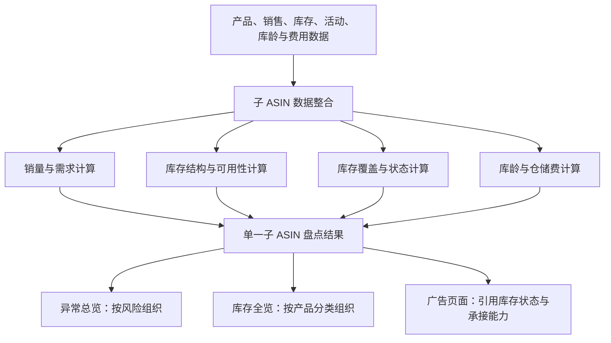
```mermaid
flowchart TD
    A[产品、销售、库存、活动、库龄与费用数据] --> B[子 ASIN 数据整合]
    B --> C[销量与需求计算]
    B --> D[库存结构与可用性计算]
    B --> E[库存覆盖与状态计算]
    B --> F[库龄与仓储费计算]
    C --> G[单一子 ASIN 盘点结果]
    D --> G
    E --> G
    F --> G
    G --> H[异常总览：按风险组织]
    G --> I[库存全览：按产品分类组织]
    G --> J[广告页面：引用库存状态与承接能力]
```

##### 2.3 运营查看路径

运营可以从风险或业务分类进入产品详情，两类入口最终汇入同一套子 ASIN 盘点结果。


```mermaid
flowchart LR
    A[异常总览] -->|选择风险产品| C[单一子 ASIN 盘点页]
    B[库存全览] -->|选择父体或子 ASIN| C
    C -->|返回并保留风险上下文| A
    C -->|返回并保留分类范围| B
```

#### 3. 页面一：异常总览

##### 3.1 页面目标

异常总览负责把分散在不同子 ASIN 中的库存风险集中呈现，让运营快速知道：

- 当前主要存在哪些类型的库存问题；
- 每一类风险涉及多少产品、集中在哪里；
- 哪些产品问题更严重；
- 某个风险由什么库存关系形成。

##### 3.2 页面结构

页面由四个板块组成：风险概览、风险分类、分类风险看板、风险产品区域。

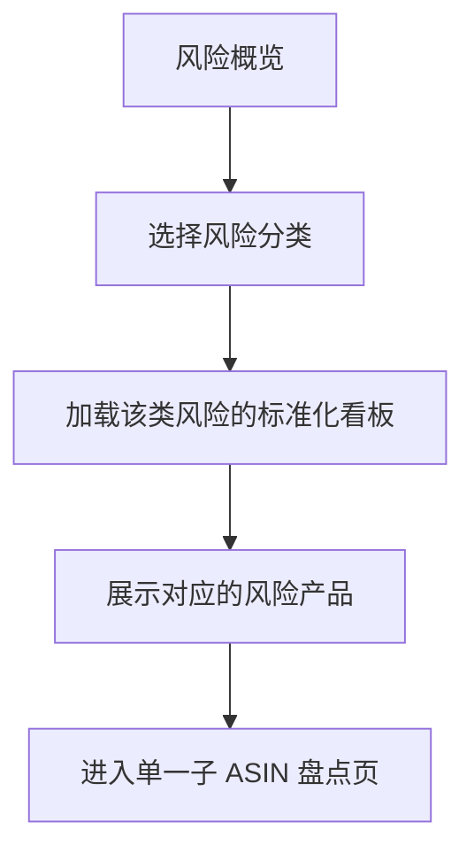
```mermaid
flowchart TD
    A[风险概览] --> B[选择风险分类]
    B --> C[加载该类风险的标准化看板]
    C --> D[展示对应的风险产品]
    D --> E[进入单一子 ASIN 盘点页]
```

##### 3.3 风险概览

风险概览展示当前业务范围内的库存风险全貌，主要包括：

- 风险产品的总体规模；
- 各类风险的数量和占比；
- 不同严重程度的风险分布；
- 风险在品类、父体或负责人之间的集中情况；
- 当前最值得优先查看的风险类型。

该板块既是风险摘要，也是风险分类的入口。运营选择某一类风险后，页面切换到对应的风险分析内容。

##### 3.4 风险分类

系统从多个角度识别当前库存风险：

###### 库存不足

识别当前可销售库存与销售消耗不匹配的产品，反映库存对当前需求的承接压力。

###### 超量备货

识别库存规模明显超过销售消化能力的产品，反映库存积压和资金占用压力。

###### 库存可用性异常

识别总库存与实际可售库存差异较大的产品，反映库存被预留、待调仓、入库中、不可售等状态占用的情况。

###### 库龄风险

识别库存老化程度较高的产品，反映高库龄库存的规模、占比和集中位置。

###### 仓储费风险

识别仓储费用较高或费用负担较重的产品，反映库存结构带来的仓储成本压力。

一个子 ASIN 可以同时命中多类风险，系统分别记录风险类型、严重程度和判断依据。

##### 3.5 分类风险看板

不同风险采用各自的标准化可视化模板。模板保持统一的页面语言，但围绕该类风险最关键的业务关系组织内容。

###### 库存不足看板

主要展示当前可售库存、销售消耗和其他库存状态之间的关系，帮助运营理解库存不足的程度，以及问题主要来自库存总量、库存位置还是可用状态。

###### 超量备货看板

主要展示库存规模与销售消化能力的关系，帮助运营理解库存积压程度、库存主要集中位置以及超量库存的组成。

###### 库存可用性看板

主要展示总库存与实际可售库存之间的结构差异，帮助运营识别哪些库存状态造成“有货但无法销售”。

###### 库龄风险看板

主要展示不同库龄区间的库存结构、高库龄库存的集中程度，以及库龄与当前销售消化能力之间的关系。

###### 仓储费风险看板

主要展示仓储费用的规模与构成、费用主要来源，以及仓储费在销售或利润中的压力程度。

##### 3.6 风险产品区域

风险产品区域展示当前风险分类下受到影响的产品，并按照严重程度组织。

该区域采用与风险类型相匹配的产品摘要模板：

- 同一类风险使用稳定、一致的表达结构；
- 不同风险突出各自最重要的判断信息；
- 每个产品摘要呈现风险程度、核心关系和进入详情的入口；
- 运营可以在当前风险分类下继续按品类、父体或负责人缩小范围。

点击产品后进入单一子 ASIN 盘点页，并定位到与当前风险对应的分析板块。

##### 3.7 页面输出

异常总览最终向运营输出：

- 当前风险版图；
- 各类风险的影响范围；
- 按严重程度组织的问题产品；
- 每个风险产品对应的完整盘点入口。

#### 4. 页面二：库存全览

##### 4.1 页面目标

库存全览负责组织全部产品，让运营能够围绕一个明确的业务范围查看整体销售与库存情况，并快速定位父体或子 ASIN。

它主要回答：

- 当前查看范围内有多少产品；
- 整体销售规模与库存规模如何；
- 库存主要分布在哪里、处于什么状态；
- 当前范围内的风险、库龄和仓储费情况如何；
- 哪些父体或子 ASIN 值得进一步查看。

##### 4.2 页面结构

页面由四个板块组成：分类与筛选、范围概览、库存结构、产品库存区域。

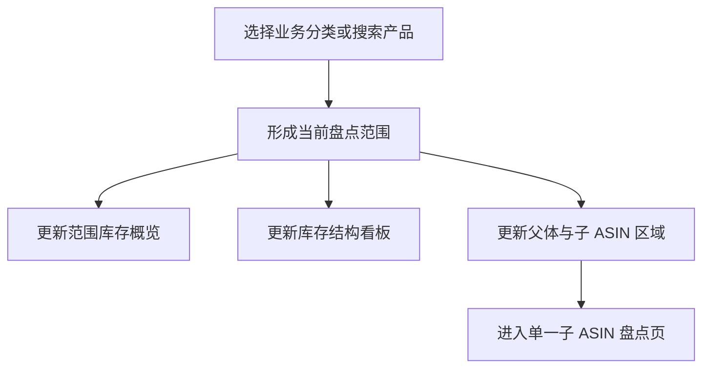
```mermaid
flowchart TD
    A[选择业务分类或搜索产品] --> B[形成当前盘点范围]
    B --> C[更新范围库存概览]
    B --> D[更新库存结构看板]
    B --> E[更新父体与子 ASIN 区域]
    E --> F[进入单一子 ASIN 盘点页]
```

##### 4.3 分类与筛选

分类与筛选用于确定本次盘点范围，支持运营按照日常管理产品的方式组织数据，包括：

- 站点与负责人；
- 品类与父体；
- 产品阶段与产品定位；
- 售卖状态；
- 产品、子 ASIN 或 SKU 搜索；
- 当前库存状态。

筛选结果同时作用于范围概览、库存结构和产品库存区域，形成一个连续的库存盘点视图。

##### 4.4 当前范围库存概览

该看板展示当前分类下的整体库存情况，主要包括：

- 产品及子 ASIN 的总体规模；
- 整体销售规模与库存规模；
- 各库存位置的总体分布；
- 当前库存状态和风险分布；
- 库龄结构与仓储费规模。

它帮助运营先建立对当前分类的整体认知，再进入库存结构或具体产品。

##### 4.5 库存结构看板

库存结构看板用于解释当前范围内的库存由什么组成，主要展示三类结构：

###### 库存位置结构

展示库存分布在 FBA、AWD、海外仓、国内仓等不同位置的情况。

###### 库存状态结构

展示库存处于可售、预留、不可售、待调仓、入库中、在途等不同状态的情况。

###### 库龄与费用结构

展示正常库龄与高库龄库存的构成，以及这些库存对应的仓储费用压力。

该看板帮助运营理解整体库存数字背后的构成，并识别库存集中或结构失衡的问题。

##### 4.6 产品库存区域

产品库存区域承载当前范围内的父体和子 ASIN，是库存全览的主要查看区域。

###### 全盘状态

页面按照父体组织产品：父体负责汇总同一产品族的销售和库存情况，展开后查看各子 ASIN 的库存摘要。

###### 筛选状态

页面直接呈现符合条件的子 ASIN，帮助运营快速查看某个特定分类下的产品库存情况。

###### 产品摘要

产品摘要围绕以下内容组织：

- 产品身份及业务分类；
- 近期销售表现；
- 主要库存位置和可用情况；
- 当前库存状态；
- 库龄与仓储费信号。

点击任一子 ASIN 后进入完整盘点页。返回库存全览时，页面保留原分类范围、父体展开状态和浏览位置。

##### 4.7 页面输出

库存全览最终向运营输出：

- 当前业务范围的库存全貌；
- 库存位置、状态、库龄和费用结构；
- 按父体或筛选条件组织的产品库存摘要；
- 单一子 ASIN 的完整盘点入口。

#### 5. 页面三：单一子 ASIN 盘点页

##### 5.1 页面目标

单一子 ASIN 盘点页负责还原一个产品的完整销售与库存状态，并将相关数据转化为一份结构化、可保存的库存盘点结果。

这份结果既供运营查看，也向异常总览、库存全览和广告页面提供统一的库存依据。

##### 5.2 页面结构

页面由六个核心看板和一个盘点记录区域组成。

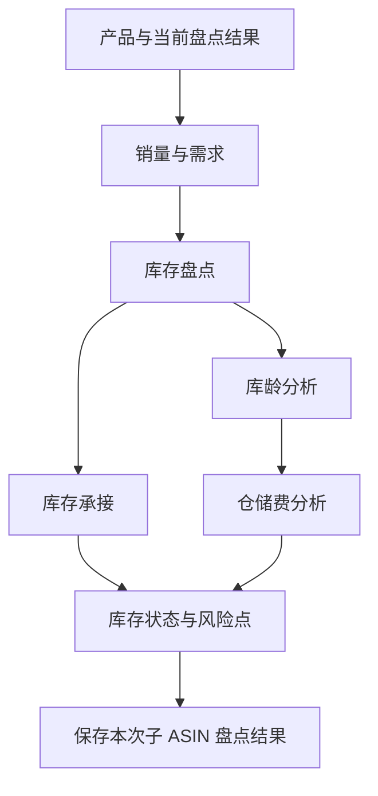
```mermaid
flowchart TD
    A[产品与当前盘点结果] --> B[销量与需求]
    B --> C[库存盘点]
    C --> D[库存承接]
    C --> E[库龄分析]
    E --> F[仓储费分析]
    D --> G[库存状态与风险点]
    F --> G
    G --> H[保存本次子 ASIN 盘点结果]
```

##### 5.3 产品与盘点结果看板

该看板是详情页的结果索引，展示：

- 当前产品及其父体归属；
- 产品阶段、产品定位和售卖状态；
- 当前销售状态与库存状态；
- 已识别的主要风险点；
- 本次盘点的数据时间。

运营可以从这里快速了解产品当前状态，并进入对应分析看板查看形成原因。

##### 5.4 销量与需求看板

该看板形成库存盘点所使用的需求基础，主要展示：

- 不同周期的销量表现；
- 日均销量及趋势变化；
- 未来需求预测；
- BD、Deal及大促等活动对需求的影响。

它帮助运营理解当前库存需要承接怎样的销售需求，也为库存覆盖和库存状态计算提供需求输入。

##### 5.5 库存盘点看板

该看板完整展示当前产品的库存构成，主要包括：

- FBA、AWD、海外仓、国内仓等库存位置；
- 可售、预留、不可售、待调仓、入库中、在途等库存状态；
- 当前可立即销售、已知后续可用和暂时无法销售的库存关系；
- 各批在途库存的状态及预计可售时间。

它回答“货有多少、在哪里、处于什么状态”，并为库存可用性分析提供基础。

##### 5.6 库存承接看板

该看板把销售需求与库存放在同一逻辑中展示，主要体现：

- 当前可售库存能够支撑的销售周期；
- 不同库存范围对销售需求的承接能力；
- 在途库存转为可售后带来的库存变化；
- 当前库存与安全库存要求之间的关系；
- 当前需求与库存之间的缺口或余量。

它是库存不足和超量备货判断的主要依据，也是广告页面判断库存能否承接新增需求的重要输入。

##### 5.7 库龄看板

该看板展示库存年龄结构和库存老化程度，主要包括：

- 不同库龄区间的库存分布；
- 高库龄库存的数量和占比；
- 高库龄库存集中在哪些库存位置或状态；
- 库龄结构与当前销售消化能力之间的关系。

它形成独立的库龄风险结果，同时为超量备货和仓储费分析提供依据。

##### 5.8 仓储费看板

该看板展示当前库存形成的仓储成本，主要包括：

- 当前仓储费用规模；
- 正常仓储费与超龄费用的构成；
- 不同库龄库存对应的费用结构；
- 仓储费与销售额、利润之间的关系；
- 费用压力主要来自哪些库存部分。

它形成仓储费风险结果，并帮助运营理解库存积压带来的经营成本。

##### 5.9 库存状态与风险点

系统综合销量与需求、库存规模、库存可用性、库存覆盖、库龄和仓储费，形成当前子 ASIN 的库存状态，并记录可能同时存在的多个风险点。

盘点结果主要包括：

- 当前库存状态；
- 库存覆盖与供需关系；
- 各类库存风险及严重程度；
- 每个风险的主要形成原因；
- 可供其他页面调用的结构化判断依据。

##### 5.10 盘点记录

系统保存每次子 ASIN 盘点的关键结果，包括数据时间、销量与需求结果、库存快照、库存状态、库龄结果、仓储费结果以及使用的规则版本。

历史盘点记录用于查看同一产品的状态变化，也确保异常总览、库存全览和广告页面引用的是同一套盘点结果。

##### 5.11 页面输出

单一子 ASIN 盘点页最终输出一份标准化盘点结果，包含：

- 产品及业务分类；
- 销量与需求结果；
- 库存位置和库存状态；
- 库存覆盖与承接能力；
- 当前库存状态及风险点；
- 库龄结构；
- 仓储费结果；
- 数据时间与规则版本。

#### 6. 三页之间的统一规则

##### 6.1 统一判断对象

子 ASIN 是库存盘点和风险判断的最小单元。父体负责产品归属、分组和汇总展示。

##### 6.2 统一结果来源

异常总览和库存全览共同读取单一子 ASIN 的盘点结果。不同页面改变结果的组织方式，不改变底层库存口径。

##### 6.3 统一风险记录

每个子 ASIN 可以拥有多个风险点。每个风险点包含风险类型、严重程度和判断依据，并在对应风险模板中展示。

##### 6.4 统一页面上下文

从异常总览进入详情时，详情页保留风险类型并定位到对应分析板块；从库存全览进入详情时，详情页保留当前产品分类。返回入口页后，原有筛选、展开状态和浏览位置保持不变。

##### 6.5 统一对外输出

产品库存模块向其他业务页面输出稳定的结构化结果，包括库存状态、库存风险、库存覆盖、库存可用性、库龄、仓储费和库存承接能力。

#### 7. 后续详细设计顺序

后续按照底层结果优先的顺序继续展开：

1. 单一子 ASIN 盘点页：确认盘点逻辑、看板关系和标准输出；
2. 异常总览：确认风险分类及每类风险的标准化可视化模板；
3. 库存全览：确认分类方式、范围概览和父子产品组织方式；
4. 数据设计：根据三个页面的功能，整理所需数据表、字段、来源及计算关系。

---

### 7.3 关键词分析模块

#### 1. 模块目标

关键词分析模块需要帮助运营完成三类不同任务：

1. 每日快速发现市场需求、核心词位置和产品覆盖发生了哪些重要变化；
2. 查看固定品线的共享市场关键词库，并理解单个关键词的需求、竞争和头部产品结构；
3. 盘点一个子 ASIN 在共享词库中的覆盖、自然位置、广告位置和变化，并结合当前产品目标与库存承接能力形成证据结论。

模块最终需要回答的不是“这个词好不好”，而是：

```text
在什么市场事实下
哪个子 ASIN
围绕什么当前产品目标
在这个关键词上出现了什么机会、缺口或风险
当前库存是否能够承接
还需要竞品页或广告页继续验证什么
```

#### 2. 页面总体架构

##### 2.1 页面分工

关键词分析模块拆分为三个页面。

###### 页面一：关键词动态与机会总览

服务“今天发生了什么、最需要看哪里”的任务。

页面从市场需求、词组变化、自有子 ASIN 的核心词覆盖与位置变化中，选出当前最重要的异常和机会，帮助运营确定当天的分析顺序。

###### 页面二：市场关键词库与单词深研

服务“市场里有哪些词、一个词本身意味着什么”的任务。

页面维护固定品线共用的市场关键词库，组织关键词分类、需求、购买、竞争和头部 ASIN 等市场事实；选择某个关键词后，进入完整的单词深研。

###### 页面三：子 ASIN 关键词盘点

服务“一个产品在整个关键词市场中表现如何”的任务。

页面以一个子 ASIN 为盘点对象，查看其在共享词库中的覆盖、自然位置、广告位置、变化、缺口和业务约束，形成标准化关键词盘点结果。

##### 2.2 统一业务对象

三个页面共用三层业务对象。

###### 市场关键词

市场关键词是市场事实对象，记录关键词自身的需求、购买、竞争、头部 ASIN、分类、来源和时间。

在未绑定产品时，系统只能说明关键词的市场事实，不能判断该词是否值得某个产品投入。

###### 关键词与子 ASIN 的关系

`关键词 × 子 ASIN` 是产品关系对象，记录一个子 ASIN 对该词的匹配情况、自然覆盖、广告覆盖、自然位置、广告位置及其历史变化。

同一关键词可以分别与不同子 ASIN 建立产品关系，但每一条覆盖和位置结果都独立落到具体子 ASIN。

###### 关键词业务判断上下文

完整业务判断的最小上下文为：

```text
关键词 × 子 ASIN × 当前产品目标
```

产品目标、产品阶段和库存承接能力由产品库存模块或策略设置提供。关键词模块引用这些结果，不在本模块重新计算产品目标和库存状态。

##### 2.3 系统生成逻辑

系统先生成关键词与子 ASIN 的标准结果，再向上形成总览。

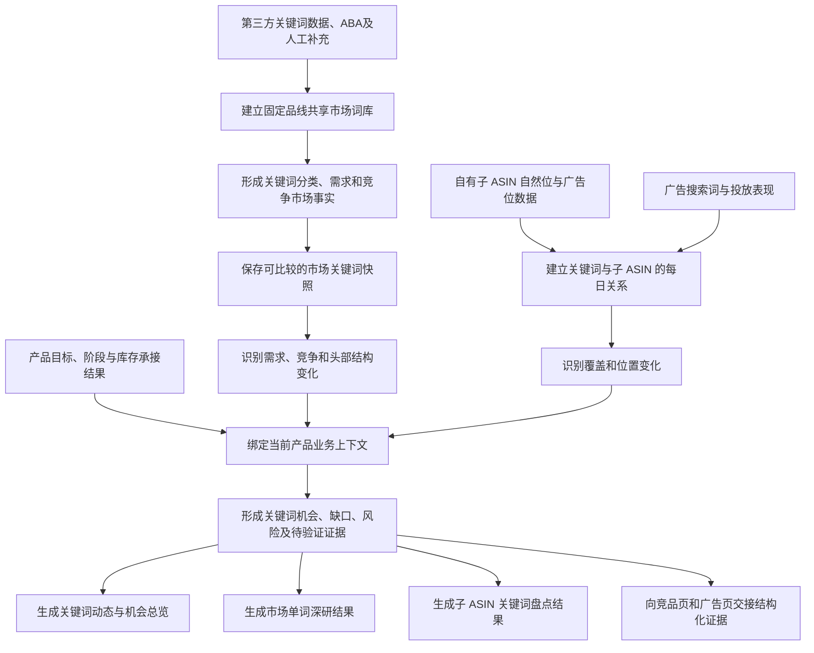
```mermaid
flowchart TD
    A[第三方关键词数据、ABA及人工补充] --> B[建立固定品线共享市场词库]
    B --> C[形成关键词分类、需求和竞争市场事实]
    C --> D[保存可比较的市场关键词快照]
    E[自有子 ASIN 自然位与广告位数据] --> F[建立关键词与子 ASIN 的每日关系]
    G[广告搜索词与投放表现] --> F
    D --> H[识别需求、竞争和头部结构变化]
    F --> I[识别覆盖和位置变化]
    J[产品目标、阶段与库存承接结果] --> K[绑定当前产品业务上下文]
    H --> K
    I --> K
    K --> L[形成关键词机会、缺口、风险及待验证证据]
    L --> M[生成关键词动态与机会总览]
    L --> N[生成市场单词深研结果]
    L --> O[生成子 ASIN 关键词盘点结果]
    L --> P[向竞品页和广告页交接结构化证据]
```

广告搜索词和投放报表能够说明关键词获得了怎样的付费流量和转化，但不能直接替代真实广告位置采集。自然位置与广告位置必须分别保留来源和口径。

##### 2.4 运营查看路径

运营从总览发现变化，再根据问题属于“词”还是“产品”进入不同页面。

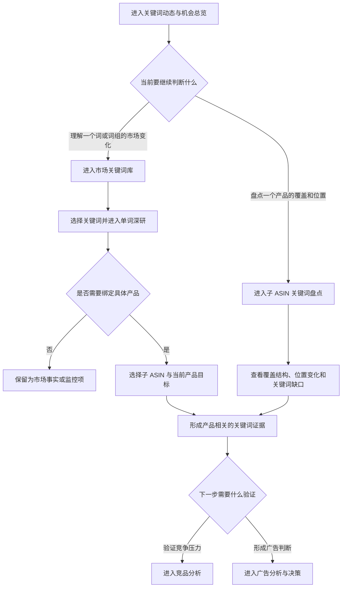
```mermaid
flowchart TD
    A[进入关键词动态与机会总览] --> B{当前要继续判断什么}
    B -->|理解一个词或词组的市场变化| C[进入市场关键词库]
    C --> D[选择关键词并进入单词深研]
    D --> E{是否需要绑定具体产品}
    E -->|否| F[保留为市场事实或监控项]
    E -->|是| G[选择子 ASIN 与当前产品目标]
    G --> H[形成产品相关的关键词证据]
    B -->|盘点一个产品的覆盖和位置| I[进入子 ASIN 关键词盘点]
    I --> J[查看覆盖结构、位置变化和关键词缺口]
    J --> H
    H --> K{下一步需要什么验证}
    K -->|验证竞争压力| L[进入竞品分析]
    K -->|形成广告判断| M[进入广告分析与决策]
```

##### 2.5 三页共用一套底层结果

三个页面不是三套独立词库：

- 总览页按照变化重要性组织关键词和产品关系；
- 市场词库页按照关键词本身组织市场事实；
- 子 ASIN 盘点页按照产品组织关键词关系。

页面改变的是查看入口和组织方式，不改变关键词定义、位置口径、产品目标和证据结论。

#### 3. 页面一：关键词动态与机会总览

##### 3.1 页面目标

关键词动态与机会总览负责回答：

> 当前比较周期内，市场关键词、自有核心词位置和子 ASIN 覆盖发生了哪些重要变化，运营今天应该先查看什么？

页面不铺开全部关键词，也不要求运营先设置复杂筛选，而是从完整词库和产品关系中挑出少量重要变化。

##### 3.2 页面结构

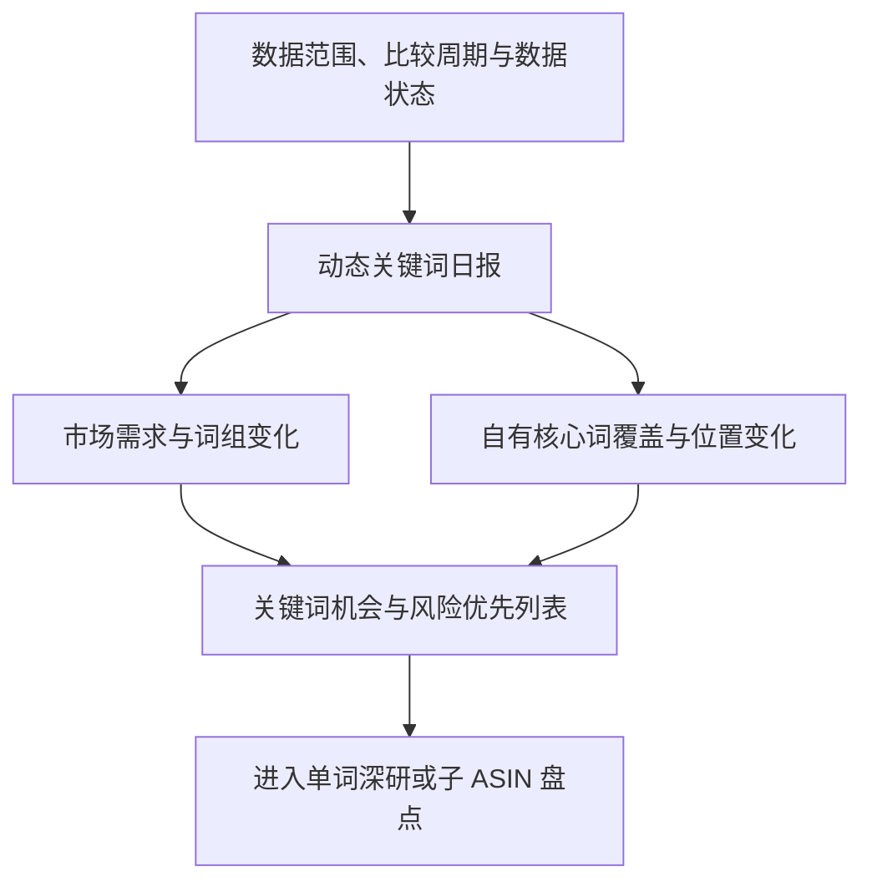
```mermaid
flowchart TD
    A[数据范围、比较周期与数据状态] --> B[动态关键词日报]
    B --> C[市场需求与词组变化]
    B --> D[自有核心词覆盖与位置变化]
    C --> E[关键词机会与风险优先列表]
    D --> E
    E --> F[进入单词深研或子 ASIN 盘点]
```

##### 3.3 数据范围与数据状态

页面首先说明本次总览覆盖的站点、固定品线、数据日期、比较周期、刷新时间和来源。

如果页面使用“流量获取”“市场份额”或其他推导结果，必须同时说明其测量定义。第三方预估值、亚马逊官方值和系统推导值不得混写为同一口径。

当自然位置、广告位置、搜索需求或产品目标缺失时，总览需要明确指出受影响的判断范围，不能用默认值补成完整结论。

##### 3.4 动态关键词日报

动态关键词日报每天回答五个固定问题，但答案由当期数据决定：

1. 当前品线或品牌获得关键词流量的整体结果如何，相对比较期发生了什么变化；
2. 哪些关键词或词组贡献了主要增长和下降，变化是否集中在特定需求类型；
3. 自有核心词的覆盖、自然位置和广告位置发生了哪些重要变化，包括新增覆盖和丢失覆盖；
4. 出现了哪些新的异常或机会信号，影响了哪些子 ASIN；
5. 当前最值得继续分析的是哪一小组关键词，判断依据是什么，应进入哪个页面查看。

日报只负责总结和指路。每项结论都要能够进入市场单词深研或子 ASIN 盘点查看依据。

##### 3.5 市场需求与词组变化看板

该看板把单个关键词的变化重新组织到需求词组中，帮助运营理解市场变化发生在哪一类需求，而不是只看到一串上涨和下降的词。

看板主要组织以下关系：

- 通用类目词、品牌词、材质词、功能词、场景词、款式词和长尾词的需求变化；
- 搜索需求变化与购买表现变化是否一致；
- 竞争程度和头部 ASIN 结构是否同时变化；
- 变化来自少量大词，还是来自一组相近的细分需求词；
- 场景化和长尾需求是否出现连续增长信号。

它帮助运营判断“市场需求结构变了”还是“只是单个词短期波动”，并进入对应词组或关键词继续分析。

##### 3.6 自有核心词覆盖与位置变化看板

该看板集中监控运营已确认需要持续关注的关键词，展示自有子 ASIN 在这些词上的覆盖和位置变化。

看板把以下业务关系放在一起：

- 关键词当前需求规模与重要性；
- 哪些子 ASIN 当前拥有自然覆盖或广告覆盖；
- 自然位置与广告位置分别处于什么状态；
- 相对比较期出现了上涨、下降、新增覆盖还是丢失覆盖；
- 位置变化影响的是主推子 ASIN、辅助子 ASIN 还是其他产品。

该看板只陈述位置和覆盖事实。广告位置上涨或下降不自动等同于广告策略正确或错误，最终广告判断仍需结合广告表现和产品目标。

##### 3.7 关键词机会与风险优先列表

该区域将市场变化、产品关系和业务约束组合成需要继续分析的事项。

典型结果包括：

- 市场需求持续上涨、产品匹配，但自有子 ASIN 尚未形成有效覆盖；
- 核心词需求稳定，但主推子 ASIN 自然位置明显下降或丢失覆盖；
- 场景词或长尾词形成连续增长，自有产品已有初步位置但证据仍不足；
- 某个词的市场机会明显，但当前库存或补货能力无法承接额外需求；
- 某个词的头部 ASIN 或竞争结构发生变化，需要进入竞品页验证；
- 市场需求较大，但产品匹配度不足，不应仅因搜索量高而认定为机会。

列表按照潜在影响、变化紧迫性、产品目标匹配程度和证据完整度组织顺序。每项结果说明“发生了什么、影响谁、为什么重要、还缺什么证据”，不直接给广告动作。

##### 3.8 页面输出

关键词动态与机会总览最终输出：

- 当前品线的动态关键词日报；
- 主要需求词组和竞争结构变化；
- 自有核心词覆盖与自然位、广告位变化；
- 需要优先处理的关键词机会、缺口和风险；
- 进入市场单词深研、子 ASIN 盘点、竞品分析或广告决策的上下文入口。

#### 4. 页面二：市场关键词库与单词深研

##### 4.1 页面目标

市场关键词库与单词深研负责回答：

> 当前固定品线的关键词市场由哪些需求组成，一个关键词的真实市场情况如何，它与哪些自有产品可能有关？

市场关键词库是固定品线共用的市场底图，不按每个产品重复建立一套词库。

##### 4.2 页面结构

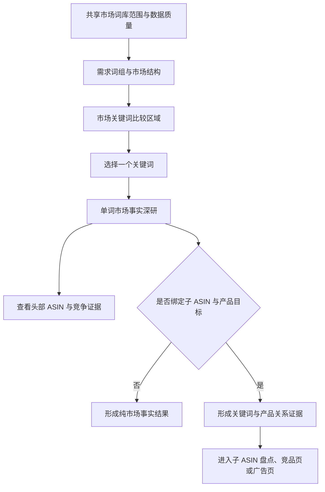
```mermaid
flowchart TD
    A[共享市场词库范围与数据质量] --> B[需求词组与市场结构]
    B --> C[市场关键词比较区域]
    C --> D[选择一个关键词]
    D --> E[单词市场事实深研]
    E --> F[查看头部 ASIN 与竞争证据]
    E --> G{是否绑定子 ASIN 与产品目标}
    G -->|否| H[形成纯市场事实结果]
    G -->|是| I[形成关键词与产品关系证据]
    I --> J[进入子 ASIN 盘点、竞品页或广告页]
```

##### 4.3 共享词库范围与数据质量

该区域说明当前词库属于哪个站点和固定品线、包含多少有效关键词、最近一次更新时间，以及各来源的覆盖情况。

词库需要区分：

- 已确认属于当前品线的有效词；
- 需要运营确认分类或相关性的词；
- 明显噪声、跨类目或不应进入当前分析范围的词；
- 运营临时加入、等待后续数据采集的监控词；
- 数据过期、来源缺失或暂时无法比较的词。

运营可以把临时关注的关键词加入监控范围，也可以确认或修正关键词分类。修正结果进入后续词库更新，而不是只改变当前页面显示。

##### 4.4 需求词组与市场结构看板

该看板按照关键词表达的需求组织市场，而不是只按照搜索量从大到小排列。

主要需求维度包括：

- 品牌与竞品品牌；
- 通用类目和款式；
- 材质；
- 功能；
- 使用场景；
- 人群；
- 尺码、颜色和数量；
- 节日、季节及其他长尾需求。

一个关键词可以同时属于多个属性标签，但在词组汇总时需要避免重复计算。

“品牌、材质、功能”等用于解释词的需求属性；“核心词、探索词、长尾词、待验证词”等属于运营角色。两类分类分别维护，避免把市场语义和运营策略混成一套标签。

该看板帮助运营理解市场流量集中在哪些需求类型，哪些需求已经形成稳定规模，哪些需求处于增长、下降或数据不足状态。

##### 4.5 市场关键词比较区域

该区域以每个关键词的市场事实为核心，支持运营在同一市场口径下比较：

- 当前需求规模及历史方向；
- 搜索后的购买表现；
- 市场供给和广告竞争；
- 点击与转化是否集中在少量头部 ASIN；
- 当前主要头部 ASIN 及其变化；
- 关键词所属需求词组；
- 数据来源、数据时间和可比较状态。

页面不把第三方工具能够提供的全部字段原样搬入工作台，只保留能够支持市场判断、产品关系判断和下游证据交接的结果。

##### 4.6 单词市场事实深研

选择一个关键词后，先分析关键词本身，不立即输出产品建议。

市场事实深研把以下关系放在同一分析中：

- 搜索需求和购买表现随时间的变化；
- 市场供给、广告竞争和建议竞价所反映的竞争压力；
- 头部 ASIN 的点击、转化或位置集中情况；
- 头部 ASIN 是否发生明显替换；
- 当前变化属于短期波动、连续趋势还是暂时无法判断；
- 不同数据来源之间是否存在定义差异或相互矛盾。

这一层最终形成“该词当前是什么市场状态”的结果，例如需求增长、需求稳定、竞争加剧、头部集中度变化或数据不足。

##### 4.7 关键词与产品关系区

只有绑定具体子 ASIN 及其当前产品目标后，页面才进一步判断这个词对产品意味着什么。

该区域组合：

- 关键词市场状态；
- 关键词与产品属性、卖点和现有流量的匹配关系；
- 子 ASIN 当前自然覆盖、广告覆盖和位置；
- 覆盖与位置的历史变化；
- 产品当前目标、阶段和主推/辅助关系；
- 库存及补货是否能够承接额外需求。

页面由此形成证据级结论，例如：

- 需求上涨、产品匹配、当前位置偏弱；
- 市场规模稳定，主推子 ASIN 丢失自然覆盖；
- 长尾需求增长，但当前只有广告覆盖，仍需继续观察；
- 关键词与产品相关，但库存不能承接扩量；
- 搜索量高但产品匹配不足，不构成当前产品机会。

##### 4.8 头部 ASIN 与竞品证据入口

单词深研可以展示该关键词下的头部 ASIN、主要份额和位置变化，用于识别值得继续查看的竞争对象。

市场头部 ASIN 不自动等同于已确认竞品。需要验证价格、促销、销量、排名和关键词入口共同变化时，页面携带关键词、时间范围和候选 ASIN 进入竞品分析页。

##### 4.9 页面输出

市场关键词库与单词深研最终输出：

- 固定品线共享市场词库及其需求结构；
- 每个关键词的标准市场事实和历史状态；
- 一个关键词的需求、竞争和头部 ASIN 深研结果；
- 绑定子 ASIN 与产品目标后的产品关系证据；
- 需要持续监控、进入子 ASIN 盘点或交给竞品页验证的关键词。

#### 5. 页面三：子 ASIN 关键词盘点

##### 5.1 页面目标

子 ASIN 关键词盘点负责回答：

> 一个具体子 ASIN 在共享关键词市场中覆盖了什么、缺少什么、位置如何变化，结合当前产品目标与库存后，哪些结果需要交给广告决策继续处理？

该页面是关键词模块形成产品级标准结果的主要页面。

##### 5.2 页面结构

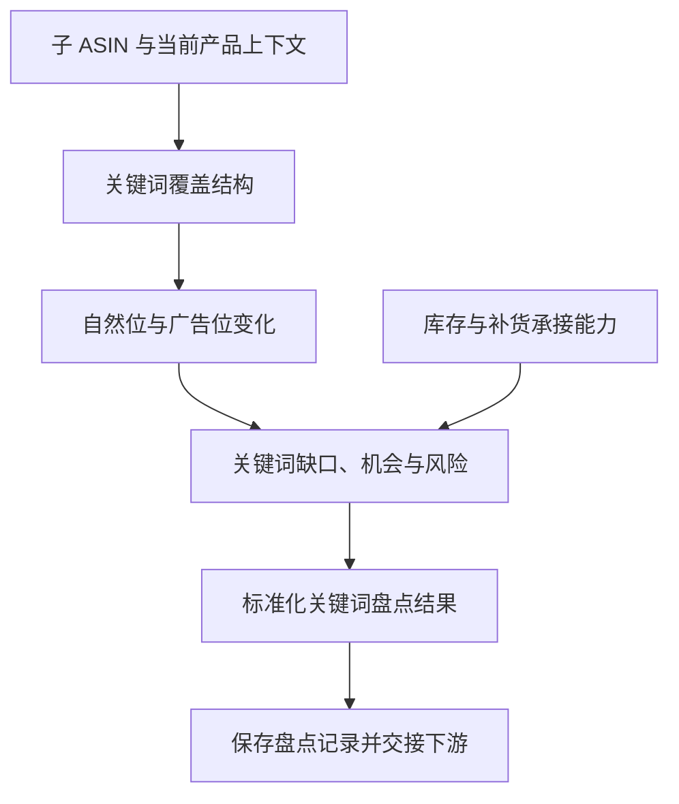
```mermaid
flowchart TD
    A[子 ASIN 与当前产品上下文] --> B[关键词覆盖结构]
    B --> C[自然位与广告位变化]
    C --> D[关键词缺口、机会与风险]
    E[库存与补货承接能力] --> D
    D --> F[标准化关键词盘点结果]
    F --> G[保存盘点记录并交接下游]
```

##### 5.3 子 ASIN 与当前产品上下文

页面首先说明当前盘点对象及判断上下文，包括：

- 子 ASIN 及其父体归属；
- 产品阶段、产品定位和主推/辅助关系；
- 当前产品目标；
- 当前销售与库存承接状态；
- 本次关键词、位置和产品数据的时间。

如果产品目标或库存承接结果缺失，页面仍可展示覆盖和位置事实，但不能形成完整的产品机会结论。

##### 5.4 关键词覆盖结构看板

该看板以共享市场词库为参照，说明当前子 ASIN 覆盖了哪些市场需求、缺少哪些需求。

看板分别组织：

- 通用类目和款式词覆盖；
- 品牌及竞品品牌词覆盖；
- 材质、功能和产品卖点词覆盖；
- 场景、人群、尺码、颜色和数量词覆盖；
- 长尾和新出现需求词覆盖；
- 运营确认的核心词覆盖。

自然覆盖和广告覆盖分别判断。一个词只有广告流量，不代表已经形成自然覆盖；自然有位置，也不代表当前广告投放有效。

覆盖结构帮助运营理解产品当前依靠哪些需求入口获得流量，以及目标相关的关键词是否存在明显空白。

##### 5.5 自然位与广告位变化看板

该看板按时间组织子 ASIN 在关键词上的自然位置和广告位置，重点说明：

- 当前哪些词有可观测自然位置和广告位置；
- 相对比较期哪些词位置上涨或下降；
- 哪些词形成新增覆盖或丢失覆盖；
- 位置变化发生时，市场需求是否也在变化；
- 核心词和普通词的变化是否集中在同一需求词组；
- 变化是单日波动还是连续趋势。

“没有排名数据”必须区分为真实未覆盖、超过采集深度、当天采集失败或来源未接入，不能全部解释为丢失覆盖。

##### 5.6 关键词缺口、机会与风险看板

该看板将市场需求、产品匹配、覆盖位置、产品目标和库存约束组合成产品级判断。

主要结果包括：

- 目标相关但尚未覆盖的关键词缺口；
- 已有覆盖但位置明显弱于当前产品目标的关键词；
- 自然位或广告位持续下降的核心词风险；
- 需求增长且已经出现初步覆盖的场景词或长尾词机会；
- 市场机会存在但库存无法承接的受限机会；
- 竞争结构变化明显、需要竞品页继续验证的关键词；
- 数据或目标不完整、暂时不能形成结论的待补证据项。

每项结果必须说明主要依据、影响的产品目标、库存限制、证据完整度和下一步验证页面。

##### 5.7 关键词盘点记录

系统保存每次子 ASIN 关键词盘点的关键结果，包括：

- 本次使用的共享词库范围；
- 关键词覆盖和位置快照；
- 产品目标、阶段和库存承接结果；
- 识别出的新增覆盖、丢失覆盖和位置变化；
- 关键词缺口、机会、风险及证据状态；
- 数据时间、来源和使用的规则版本。

历史盘点记录用于比较同一子 ASIN 的关键词状态变化，并确保总览、单词深研、竞品分析和广告决策引用的是同一份关键词结果。

##### 5.8 页面输出

子 ASIN 关键词盘点最终输出一份标准化产品关键词结果，包含：

- 当前产品上下文；
- 共享市场词库覆盖结构；
- 自然位置、广告位置和历史变化；
- 关键词缺口、机会、风险及限制；
- 需要竞品验证或进入广告决策的结构化证据；
- 数据时间、来源和规则版本。

#### 6. 为什么三页必须共用同一套判断

三个页面分别负责“发现变化”“研究一个词”和“盘点一个产品”，但它们读取的是同一批关键词和产品数据。

设置本节不是为了增加新的页面功能，而是为了避免以下问题：总览说某个词上涨，进入详情却显示下降；市场页把它归为场景词，产品页又把它归为功能词；广告展示份额被误当成广告排名；数据缺失时 AI 仍然生成完整结论。

因此，三页需要遵守下面六个一致性要求。

##### 6.1 同一个关键词在三页中必须是同一个对象

固定品线只维护一套共享市场关键词库。关键词名称、别名、分类和词组一旦确认，三个页面共同使用。

设置目的：保证运营从总览进入单词深研或子 ASIN 盘点时，看到的仍然是同一个词，不会因为页面不同而重复计算或改变分类。

##### 6.2 市场事实和产品判断必须分开

关键词的需求、购买和竞争情况属于市场事实；某个子 ASIN 是否适合这个词，必须再绑定该子 ASIN 的覆盖位置和当前产品目标。

设置目的：避免把“搜索量很大”直接写成“这个产品应该投”，也避免给所有产品套用同一个关键词结论。

##### 6.3 各类排名和份额不能混用

自然位置、广告位置、ABA 排名、搜索词展示量份额和广告搜索结果首页份额分别表示不同事情，页面必须按真实名称表达。

广告展示、点击或展示份额不能被换算成一个未经采集的广告位置。

设置目的：保证运营看到的“排名上涨”确实是对应排名发生变化，而不是把另一项广告数据误当成排名。

##### 6.4 总览中的变化必须能够在详情中复核

只有站点、关键词、来源、统计周期和测量定义一致时，系统才计算上涨、下降、新增覆盖或丢失覆盖。

总览使用的变化结果必须能够下钻到对应的关键词快照或子 ASIN 位置记录。条件不满足时，页面显示“暂不可比较”及原因。

设置目的：避免总览生成看似明确、但进入详情后找不到依据的结论。

##### 6.5 页面跳转时不能丢失当前分析条件

从总览进入单词深研、子 ASIN 盘点、竞品页或广告页时，需要继续携带当前站点、品线、时间范围、比较周期、关键词、子 ASIN 和产品目标。

设置目的：运营不需要每换一个页面就重新查词、选产品和设置时间，也能保证后续页面继续分析的是同一个问题。

##### 6.6 数据不完整时必须明确停在哪里

三个页面需要一致识别市场数据缺失、位置未采集、第三方估算、来源口径变化、数据过期、产品目标缺失、库存结果缺失、历史样本不足和竞品尚未验证等状态。

这些状态下可以展示已经确认的事实，但不能补默认值或生成超出证据范围的完整结论。AI 总结必须放在可核验数据之后。

设置目的：让运营分清“产品确实没有覆盖”和“系统今天没有采到数据”，也防止 AI 把未知情况写成业务判断。

##### 6.7 与其他模块的职责边界

###### 产品库存模块

提供子 ASIN、父体归属、产品阶段、产品定位、当前产品目标和库存承接能力。关键词模块只引用这些结果。

###### 竞品分析模块

负责验证候选竞品在价格、促销、销量、排名、流量和关键词入口上的共同变化。关键词模块只提供关键词下的候选 ASIN 和竞争信号。

###### 广告分析与决策模块

负责结合关键词证据、广告架构和广告表现形成最终调整建议。加词、否词、出价、预算和暂停等动作不在关键词模块生成。

###### 数据中心

负责关键词文件导入、数据源配置、采集状态、字段对应、更新时间和数据质量。关键词页面只显示与当前判断直接相关的数据状态。

#### 7. 对 V4.1.2 Demo 的承接与调整

##### 7.1 保留的成熟逻辑

- 保留动态关键词日报；
- 保留市场关键词和产品覆盖两种业务视角；
- 保留关键词、产品名称和子 ASIN 的统一查询入口；
- 保留市场事实、产品关系和竞品证据分层；
- 保留从关键词证据进入下游页面的逻辑。

##### 7.2 本方案的结构调整

- 将一个页面内的两种模式拆为“总览、市场词库、子 ASIN 盘点”三个任务页；
- 将单词详情从窄抽屉升级为可承载历史关系和完整证据的深研内容；
- 将客户要求的每日核心词位置监控放入动态总览；
- 将词库质量、噪声和临时监控词纳入市场词库管理；
- 不把 Demo 中根据产品角色推导的排名数值当作正式业务逻辑。

##### 7.3 不承接的历史表达

- 不在关键词模块直接生成否词、加词、调价或暂停广告动作；
- 不把“成熟款位置”“增长款位置”固化为永久的市场词库列；
- 不把静态模拟日报或模拟趋势当作客户事实；
- 不复制第三方关键词工具的全部功能和字段。

#### 8. 当前方案的待确认项

以下事项不影响三页架构成立，但需要在数据设计和策略设置阶段明确：

1. 共享市场词库的正式纳入、移除和人工确认规则；
2. 关键词日报的默认比较周期；
3. “关键词流量获取”的正式测量定义和可用来源；
4. 自然位置与广告位置的采集来源、采集深度和更新频率；
5. 核心词、场景词、长尾词和待验证词的确认方式；
6. 产品目标、产品阶段和主推/辅助关系的正式字段与规则；
7. 关键词机会、风险和优先级的阈值或评价方式；
8. 库存承接结果向关键词模块提供的更新机制；
9. 关键词证据交给竞品页和广告页的结构化格式。

#### 9. 后续详细设计顺序

三页架构确认后，后续按照以下顺序继续落地：

1. 使用《Bamboocool-关键词分析模块必备逻辑与能力清单》确认完整计算链；
2. 在数据中心方案中设计关键词主数据、市场快照、子 ASIN 位置关系、产品上下文和证据记录所需的数据表与字段；
3. 确认数据来源、上传方式、采集频率和数据质量规则；
4. 细化三个页面的具体信息层级、表格内容和交互；
5. 按 Organic Soft-Tech 设计规范形成页面原型；
6. 选择一个代表性子 ASIN 跑通词库、位置采集、盘点、竞品验证和广告交接链路，再扩展到同一品线其他产品。

---

### 7.4 竞品分析模块

#### 1. 模块目标

竞品分析模块围绕少量重点竞品持续建立观察记录，将竞品的产品关系、价格与活动、市场表现、关键词位置和流量变化组织成统一的竞品分析结果。

模块的标准判断对象为**重点竞品产品族**：

- 以父 ASIN 作为产品族的主要识别和汇总对象；
- 子 ASIN、具体报价和关键词作为底层观察对象；
- 子 ASIN 的变化只有能够代表整个产品族时才向上汇总；
- 无法归并的差异保留在对应子 ASIN、报价或关键词上，不用产品族结论覆盖。

这套结果服务于三个业务场景：

1. 从全部重点竞品中发现近期值得关注的变化；
2. 从一个竞品出发，核对价格、活动、市场结果和关键词位置之间的时间关系；
3. 将已经核验的竞品证据交给关键词或广告页面继续形成经营判断。

竞品模块是经营判断的证据层。它输出“竞品发生了什么、可能影响哪里、证据是否充分”，不直接输出预算、出价、广告开关或执行命令。

#### 2. 两页总体架构

##### 2.1 页面分工

###### 竞品威胁总览

从全部重点竞品的标准分析结果中识别近期变化，按照变化类型、关注程度和可能影响范围组织竞品，帮助运营决定先看哪个竞品以及为什么需要关注。

###### 单一竞品分析页

整合一个重点竞品产品族的产品关系、价格与活动、市场表现、关键词位置和流量变化，形成完整、可保存、可追溯的竞品分析结果，是竞品威胁总览的共同基础。

##### 2.2 系统生成逻辑

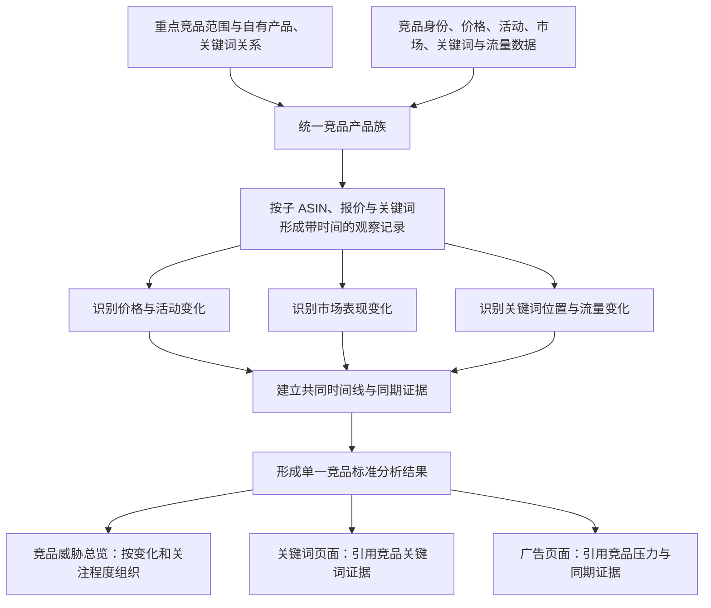
```mermaid
flowchart TD
    A[重点竞品范围与自有产品、关键词关系] --> C[统一竞品产品族]
    B[竞品身份、价格、活动、市场、关键词与流量数据] --> C
    C --> D[按子 ASIN、报价与关键词形成带时间的观察记录]
    D --> E[识别价格与活动变化]
    D --> F[识别市场表现变化]
    D --> G[识别关键词位置与流量变化]
    E --> H[建立共同时间线与同期证据]
    F --> H
    G --> H
    H --> I[形成单一竞品标准分析结果]
    I --> J[竞品威胁总览：按变化和关注程度组织]
    I --> K[关键词页面：引用竞品关键词证据]
    I --> L[广告页面：引用竞品压力与同期证据]
```

##### 2.3 运营查看路径

运营可以从全部竞品中发现变化，也可以带着关键词、产品或广告上下文直接进入单一竞品分析。所有入口最终汇入同一套竞品分析结果。

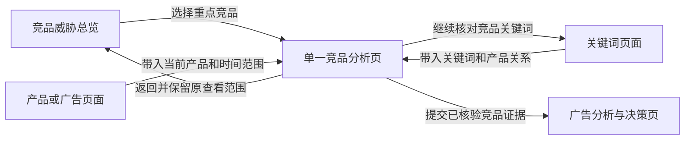
```mermaid
flowchart LR
    A[竞品威胁总览] -->|选择重点竞品| D[单一竞品分析页]
    B[关键词页面] -->|带入关键词和产品关系| D
    C[产品或广告页面] -->|带入当前产品和时间范围| D
    D -->|继续核对竞品关键词| B
    D -->|提交已核验竞品证据| E[广告分析与决策页]
    D -->|返回并保留原查看范围| A
```

#### 3. 页面一：竞品威胁总览

##### 3.1 页面目标

竞品威胁总览负责把分散在不同竞品中的近期变化集中呈现，让运营快速知道：

- 当前监控的是哪些重点竞品；
- 最近哪些竞品发生了值得关注的变化；
- 变化主要来自活动与价格、市场表现、关键词位置还是流量结构；
- 哪些变化可能涉及自己的产品或重点关键词；
- 哪些竞品需要进入详情继续核对；
- 当前结论使用了什么时间范围，证据是否完整。

##### 3.2 页面结构

页面由五个板块组成：监控范围与数据状态、竞品动态报告、变化版图、重点竞品区域、分析入口。

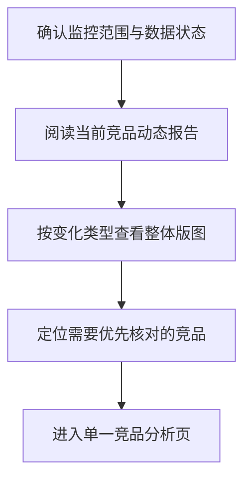
```mermaid
flowchart TD
    A[确认监控范围与数据状态] --> B[阅读当前竞品动态报告]
    B --> C[按变化类型查看整体版图]
    C --> D[定位需要优先核对的竞品]
    D --> E[进入单一竞品分析页]
```

##### 3.3 监控范围与数据状态

该板块说明当前总览建立在什么业务范围和数据基础上，主要展示：

- 当前站点、品线、子类目和观察时间；
- 已纳入持续监控的重点竞品范围；
- 重点竞品与自有产品、重点关键词之间的已知竞争关系；
- 各类竞品数据更新到什么时间；
- 当前哪些结果来自可直接观察的数据，哪些来自第三方估算或系统推导；
- 是否存在数据过期、观察中断或关键证据缺失。

该板块帮助运营先确认“这份总览覆盖了谁、覆盖到什么时候”，再阅读后续判断。重点竞品范围的增减进入策略设置流程，调整后重新生成总览结果。

##### 3.4 竞品动态报告

竞品动态报告从当前范围内的标准竞品分析结果中，提取本周期最值得关注的变化。

报告围绕具体业务事实组织内容：

- 哪个竞品发生了什么变化；
- 变化从什么时候开始、持续了多长时间；
- 哪些价格、活动、市场或关键词证据支撑该变化；
- 可能涉及哪些自有产品或重点关键词；
- 当前能够确认什么、仍需要继续观察什么。

报告内容随当前观察结果变化，但表达结构保持稳定。每项结论都提供对应竞品和证据时间段的分析入口，使运营能够直接进入详情核验。

##### 3.5 竞品变化版图

竞品变化版图按照运营实际关心的四类信号组织当前竞争环境：

###### 活动与价格变化

展示哪些重点竞品正在参加活动、结束活动、降价、恢复价格或扩大与自有产品的价格差，以及变化涉及哪些子 ASIN 或报价。

###### 市场表现变化

展示哪些重点竞品的销量量级、类目位置或整体可见度出现明显变化，帮助运营判断竞争压力是否正在扩大或减弱。

###### 关键词位置变化

展示哪些重点竞品在核心品类词、材质词、竞品词或其他重点词上的自然位置、广告位置或覆盖范围发生变化，并标识与自有产品共同竞争的关键词。

###### 流量结构变化

展示哪些重点竞品的主要流量入口或自然、广告、其他流量构成出现变化。第三方只能提供估算时，页面同步说明数据性质和可用范围。

同一竞品可以同时进入多个变化分类。页面保留各类变化的独立证据，不把同期出现的多个信号直接写成因果关系。

##### 3.6 重点竞品区域

重点竞品区域按照当前关注程度组织重点竞品产品族，是运营从总览进入深度分析的主要入口。

每个竞品摘要围绕以下业务关系组织：

- 竞品身份、产品定位及与自有产品的竞争关系；
- 当前价格或价格带及近期活动状态；
- 最近发生的主要市场、关键词或流量变化；
- 变化发生在哪些子 ASIN、报价或关键词上；
- 当前关注程度及其明确依据；
- 证据来源、更新时间和完整程度；
- 与自有产品或重点关键词的已知影响范围。

运营可以围绕竞品、品牌、ASIN、变化类型、时间范围和证据状态缩小查看范围。打开一个竞品后进入单一竞品分析页，并保留当前时间、变化类型和关联关键词上下文。

关注优先级以可观察变化、业务竞争关系、可能影响范围和证据完整程度为基础。正式规则确认前，页面采用规则结果与运营手工关注相结合的顺序，不使用缺少业务依据的精确综合分数。

##### 3.7 页面输出

竞品威胁总览最终向运营输出：

- 当前重点竞品的监控范围和数据状态；
- 本周期竞品动态报告；
- 按活动价格、市场表现、关键词位置和流量结构组织的变化版图；
- 有明确依据的重点竞品关注顺序；
- 每个重点竞品的完整分析入口。

#### 4. 页面二：单一竞品分析页

##### 4.1 页面目标

单一竞品分析页负责还原一个重点竞品产品族在指定时间范围内发生的变化，并将分散证据转化为一份结构化、可保存的竞品分析结果。

它主要回答：

- 当前分析的竞品是谁，与自有产品是什么竞争关系；
- 变化发生在整个产品族，还是某个子 ASIN、报价或关键词；
- 价格、活动、市场表现、关键词位置和流量分别发生了什么；
- 多类变化是否在同一时间段共同出现；
- 哪些是事实、哪些是推导、哪些关系暂时不能确认；
- 这些证据可能涉及哪些自有产品和关键词；
- 哪些信息可以交给关键词或广告页面继续判断。

##### 4.2 页面结构

页面由七个核心板块和一个分析记录区域组成。

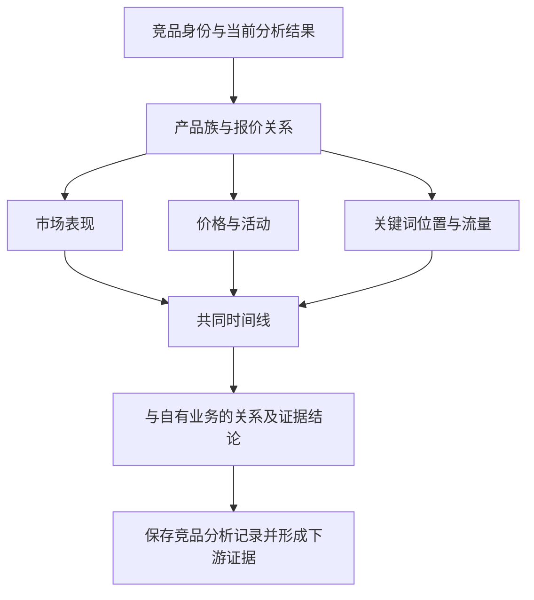
```mermaid
flowchart TD
    A[竞品身份与当前分析结果] --> B[产品族与报价关系]
    B --> C[市场表现]
    B --> D[价格与活动]
    B --> E[关键词位置与流量]
    C --> F[共同时间线]
    D --> F
    E --> F
    F --> G[与自有业务的关系及证据结论]
    G --> H[保存竞品分析记录并形成下游证据]
```

##### 4.3 竞品身份与当前分析结果

该板块是详情页的结果索引，展示：

- 当前竞品产品族及其父 ASIN；
- 品牌、品类、产品定位和主要卖点；
- 与自有产品的竞争关系及主要竞争范围；
- 当前活动、价格和市场状态；
- 当前关注程度、主要变化及判断依据；
- 本次分析采用的时间范围和数据状态。

运营可以从这里快速理解“当前为什么要看这个竞品”，并进入对应板块核对形成原因。

##### 4.4 产品族与报价关系

该板块解释一个竞品产品族由哪些实际销售对象构成，主要展示：

- 父 ASIN 与子 ASIN 的归属关系；
- 尺码、颜色、包装数等变体差异；
- 同一子 ASIN 下不同报价或卖家的关系；
- 各子 ASIN 的销售状态、价格区间和活动状态差异；
- 本次变化实际发生在哪个子 ASIN 或报价；
- 哪些变化可以代表整个产品族，哪些只能保留在局部对象。

该板块为后续所有趋势和变化提供准确对象基础，避免把单一变体或报价的动作归因到整个竞品产品族。

##### 4.5 市场表现看板

该看板展示竞品在指定时间内的市场结果及其变化，主要包括：

- 销量或销售量级的变化；
- 类目与子类目位置的变化；
- 整体可见度或市场表现趋势；
- 评分、评论等产品基础表现的变化；
- 变化开始时间、持续时间和当前状态；
- 结果来自直接观察、第三方估算还是系统推导。

运营通过该看板判断竞品的市场压力是在扩大、维持还是减弱，并定位需要放入共同时间线核对的结果变化。

##### 4.6 价格与活动看板

该看板还原竞品价格和活动状态的变化过程，主要展示：

- 日常价格、活动价格和最终成交价格之间的关系；
- Coupon、Deal、折扣和其他可观察活动的开始、变化与结束；
- 价格变化的幅度、持续时间和涉及对象；
- 竞品与对应自有产品之间价格差的变化；
- 活动结束后价格是否恢复以及恢复到什么区间；
- 数据中断或无法确认最终成交价的时间段。

运营通过该看板判断当前竞争压力是否来自短期活动、持续降价或价格带改变，并为共同时间线提供清晰的经营事件。

##### 4.7 关键词位置与流量看板

该看板展示竞品通过哪些关键词和流量入口获得可见度，以及这些入口如何变化，主要包括：

- 当前主要关键词入口及其业务分类；
- 重点关键词上的自然位置和可观察广告位置；
- 新增、提升、下降或丢失的关键词覆盖；
- 自有产品与竞品在同一关键词上的位置关系；
- 自然、广告和其他流量构成及其变化；
- 第三方估算无法支持的广告花费、出价或站外流量细节。

运营可以带着竞品、关键词、产品和时间范围进入关键词页面继续核对，不在竞品页重复完成关键词机会判断。

##### 4.8 共同时间线

共同时间线是单一竞品分析页的核心证据看板。它将不同来源、不同粒度的观察结果对齐到同一个时间范围，形成至少三条业务轨道：

1. 市场结果轨：销量量级、类目位置和整体可见度；
2. 价格活动轨：价格、Coupon、Deal 和其他经营事件；
3. 关键词流量轨：关键词位置、覆盖范围和流量结构。

必要时增加数据状态轨，标识数据缺失、来源变化和更新中断。

时间线重点表达：

- 每类变化的发生时间、持续时间和结束状态；
- 多类变化是否同期出现；
- 事件发生前后可用于比较的观察窗口；
- 不同数据粒度如何对齐；
- 哪些同期关系有完整证据，哪些关系仍需要更长周期观察。

共同时间线用于建立同期证据，不将相关性直接写成因果。运营可以从分析结论定位到具体对象、时间和证据轨道。

##### 4.9 与自有业务的关系及证据结论

该板块将竞品变化放回 Bamboocool 的产品和关键词语境，形成可被下游使用的业务结论，主要展示：

- 当前竞品变化可能涉及哪些自有产品；
- 双方共同竞争哪些重点关键词或市场位置；
- 价格差、活动状态和关键词位置发生了什么变化；
- 已确认的事实、基于规则的推导和仍待核对的假设；
- 当前关注程度及其业务依据；
- 证据覆盖是否足以进入关键词或广告判断；
- 当前需要继续观察的数据和时间窗口。

该板块输出的是证据结论与影响范围，不在这里生成具体广告动作。

##### 4.10 分析记录与证据交付

该区域保存本次竞品分析的标准结果，包括分析对象、时间范围、主要变化、同期证据、关注程度、可能影响范围、数据来源和未确认事项。

分析记录支持：

- 与同一竞品的历史分析结果比较；
- 查看关注状态的新增、持续、减弱和解除；
- 从结论追溯到对应观察记录和数据来源；
- 带着竞品、时间、变化类型、关联产品和关键词进入下游页面；
- 在广告页面中引用竞品证据，同时保留返回详情核验的入口。

##### 4.11 页面输出

单一竞品分析页最终向运营输出：

- 一个重点竞品产品族的完整对象关系；
- 市场表现、价格活动、关键词位置和流量变化；
- 多类变化在共同时间线上的同期关系；
- 与自有产品和关键词相关的证据结论；
- 事实、推导、假设和缺失数据的明确边界；
- 可保存、可比较、可追溯并可交给下游使用的竞品分析记录。

#### 5. 两个页面之间的统一规则

##### 5.1 统一业务对象

两个页面共同使用“重点竞品产品族”作为标准判断对象。父 ASIN 承载产品族身份，子 ASIN、报价和关键词承载具体观察。总览中的任何结论都能够回到详情中的具体对象和时间证据。

##### 5.2 统一时间范围

总览、详情、关键词页面和广告页面在流转时保留同一观察时间。不同来源粒度不一致时，系统明确展示各自覆盖时间和对齐方式，不把月度估算伪装成每日事实。

##### 5.3 统一证据表达

所有竞品结果区分：

- 可直接观察的事实；
- 第三方估算；
- 依据已确认规则形成的系统推导；
- 运营或系统提出、仍需验证的假设；
- 缺失、过期或无法对齐的数据。

每项结果都保留数据来源、数据时间和分析时间。

##### 5.4 统一关注程度

关注程度由可观察变化、竞争关系、可能影响范围和证据完整程度共同形成。页面同步展示判断依据；正式规则未确认时保留运营手工调整，不产生无法解释的精确威胁分数。

##### 5.5 统一因果边界

价格、活动、市场结果和关键词位置同期出现时，系统表达为“同期变化”或“可能相关”。只有获得能够支持因果判断的额外证据后，才升级为更强结论。

##### 5.6 统一页面上下文

从总览、关键词、产品或广告页面进入详情时，保留来源页面、当前产品、关键词、竞品、时间范围和变化类型。返回时恢复原查看范围和浏览位置。

#### 6. 与其他模块的关系

##### 6.1 上游输入

竞品分析模块使用：

- 策略设置中的重点竞品范围和竞争关系；
- 产品模块中的自有产品身份、产品定位和当前业务目标；
- 关键词模块中的重点关键词、产品关系和位置结果；
- 数据中心中的竞品身份、价格、活动、市场表现、关键词和流量观察数据。

##### 6.2 向运营总览输出

运营总览读取本周期最值得关注的竞品变化、涉及范围和证据状态，用于说明当前经营环境，不替代竞品详情。

##### 6.3 向关键词页面输出

关键词页面读取竞品在具体关键词上的覆盖、位置及变化证据，用于判断一个关键词当前由谁占据、竞争压力如何以及是否需要继续研究。

##### 6.4 向广告页面输出

广告页面读取已经保存的竞品分析记录，包括竞品、时间范围、压力维度、关联产品、关联关键词、可观察事实、证据完整程度和详情入口。广告页面再结合产品、库存、关键词和广告自身表现形成动作判断。

#### 7. 当前方案边界

当前竞品模块覆盖：

- 少量重点竞品的持续监控；
- 竞品产品族及父子 ASIN、报价关系；
- 价格、活动、市场表现、关键词位置和流量变化；
- 共同时间线、关注顺序和动态报告；
- 与自有产品、关键词及广告判断的证据关系。

当前方案的输出边界为“形成竞品证据并交给下游判断”。以下内容进入其他阶段或其他模块：

- 竞品库存探测依赖大量买家账号且准确性不足，不作为当前竞品分析结果；
- 竞品广告出价、预算和花费在没有可靠数据来源时不生成估算结论；
- 广告预算、出价和投放动作由广告分析与决策模块形成；
- 完整市场选品、全类目竞品研究和第三方工具全部功能不在当前工作台范围；
- 季节性等尚未被当前业务确认的因素不进入默认关注规则。

#### 8. 当前数据基础与落地前提

项目现有竞品表可以支持竞品池、父子 ASIN 关系、品牌品类信息，以及价格、销量量级、类目位置和关键词等静态基线。

现有资料暂时不能单独支撑完整动态分析：

- 当前竞品表是指定周期的静态快照，不能直接形成每日价格、活动和位置时间线；
- 客户已存在每日价格监控流程，但对应历史记录尚未进入项目资料；
- 现有竞品表中的广告与活动相关数据存在缺失，不能视为已经具备稳定监控能力；
- SIF、秀吧、卖家精灵、Softtime 等工具是客户实际使用来源，具体接口、导出方式和可用权限仍需逐项确认；
- V4.1.2 和 V5 中的竞品数值与事件为演示数据，只用于验证页面结构。

因此，页面可以先按两页架构完成详细设计；共同时间线、动态报告和关注顺序的正式运行，需要后续数据设计补齐带观察时间的连续记录。

#### 9. 后续详细设计顺序

1. 明确首批重点竞品产品族，以及与自有产品和重点关键词的关系；
2. 设计竞品数据表和字段，明确身份、观察记录、经营事件、关键词位置、流量结构及数据来源；
3. 确认第三方来源、获取方式、更新频率、可用历史和缺失处理；
4. 确认价格活动、市场表现、关键词位置等变化的识别口径；
5. 与运营共同确认关注程度规则和动态报告模板；
6. 细化竞品威胁总览的看板内容与页面状态；
7. 细化单一竞品分析页的共同时间线和标准分析记录；
8. 最后定义竞品证据进入关键词和广告判断时的交接结构。

---

### 7.5 广告分析模块

#### 1. 模块目标

广告分析模块需要解决四件事：

1. 把分散在 SP、SB、SD 及不同广告报表中的广告对象、推广商品、投放对象和经营结果整理到同一套关系中；
2. 允许运营为广告组或 Target 建立产品、投放对象、广告目的、广告属性和自定义标签，并在任意标签组合下查看区间数据、横向对比和数值异常；
3. 把产品目标、库存约束、关键词机会和竞品压力带入单一子 ASIN，判断现有广告是否支撑当前经营目标；
4. 形成可以由运营接受、修改或拒绝的广告调整方案，再交给执行与复盘模块记录实际动作和 D+3 / D+7 结果。

两个页面使用不同的分析对象：

- 第一页的数据分析对象是“广告对象 × 标签版本 × 时间范围”，默认广告对象为广告组，需要深挖时下钻到 Target；
- 第二页的策略判断对象是“子 ASIN × 当前产品目标 × 决策时间”。

子 ASIN 可以作为第一页的产品标签和筛选条件，但第一页不据此判断产品广告策略。

广告目的需要带生效时间。一个广告组当前承担的目的不能直接用于解释它全部历史表现。

#### 2. 两页总体架构

##### 2.1 页面分工

###### 广告分类与数据查看

从广告组或 Target 出发，通过标签组织和查看广告数据，让运营能够：

- 给确定的广告对象建立产品、投放对象、广告目的、广告类型和运营自定义标签；
- 按任意标签组合筛选广告对象；
- 查看筛选结果在指定时间内的广告数据；
- 对同一批可比对象进行横向比较；
- 按已配置数值条件、相对自身历史或同组偏离识别异常对象。

该页只回答“这些广告对象的数据表现如何”，不判断广告是否支撑产品目标，也不生成广告调整策略。

###### 单一子 ASIN 广告决策

围绕一个子 ASIN，把产品目标、库存承接、关键词和竞品证据、应有广告任务、现有广告结构与表现放在一起，回答：

- 当前广告应该帮助这个产品完成什么；
- 现有广告实际上在做什么；
- 现有结构和表现是否支撑目标；
- 哪些地方需要保持、观察、调整、暂停、补建或测试；
- 每项建议依据什么、仍有什么不确定性、后续观察什么。

现有广告结构是本页形成判断的核心证据，因此不再拆成独立页面。

##### 2.2 系统生成逻辑

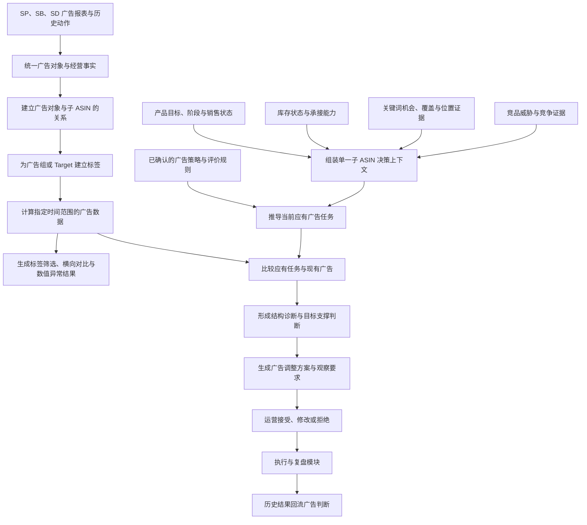
```mermaid
flowchart TD
    A[SP、SB、SD 广告报表与历史动作] --> B[统一广告对象与经营事实]
    B --> C[建立广告对象与子 ASIN 的关系]
    C --> D[为广告组或 Target 建立标签]
    D --> E[计算指定时间范围的广告数据]
    E --> Q[生成标签筛选、横向对比与数值异常结果]
    P[产品目标、阶段与销售状态] --> F[组装单一子 ASIN 决策上下文]
    I[库存状态与承接能力] --> F
    K[关键词机会、覆盖与位置证据] --> F
    R[竞品威胁与竞争证据] --> F
    T[已确认的广告策略与评价规则] --> G[推导当前应有广告任务]
    F --> G
    E --> H[比较应有任务与现有广告]
    G --> H
    H --> J[形成结构诊断与目标支撑判断]
    J --> L[生成广告调整方案与观察要求]
    L --> M[运营接受、修改或拒绝]
    M --> N[执行与复盘模块]
    N --> O[历史结果回流广告判断]
```

系统内部先完成广告事实还原，再形成业务判断。这个生成顺序不要求运营在多个页面之间来回切换。

##### 2.3 运营查看路径

```mermaid
flowchart LR
    A[广告分类与数据查看] --> B[选择对象粒度、标签和时间范围]
    B --> C[查看区间数据、横向对比与数值异常]
    C -->|需要结合产品目标判断| D[选择关联子 ASIN]
    D --> E[单一子 ASIN 广告决策]
    E -->|接受、修改或拒绝方案| F[动作确认与执行记录]
    F -->|查看原判断依据| E
    G[复盘结果] -->|形成新的广告问题| E
```

运营的典型路径是：

1. 进入广告分类与数据查看，选择广告组或 Target 粒度；
2. 组合产品、投放对象、广告目的、广告属性或自定义标签；
3. 查看筛选对象在指定时间内的数据、横向比较和数值异常；
4. 如果只需查数，到此完成；
5. 如果需要判断“为什么、是否符合产品目标、应该怎么做”，选择关联子 ASIN 进入第二页；
6. 在第二页核对目标、证据、结构、诊断和建议；
7. 接受、修改或拒绝建议，已接受或修改后的建议进入执行与复盘模块。

##### 2.4 两页划分原则

两页按照运营任务划分，而不是按照系统计算步骤划分：

- 为广告对象打标签、按标签查数、横向比较和识别数值异常，是一项对象数据分析任务，放在广告分类与数据查看；
- 围绕一个子 ASIN 理解现状并形成方案，是一项完整决策任务，放在单一子 ASIN 广告决策；
- 子 ASIN 在第一页是标签，在第二页才是策略判断对象；
- 广告结构拆解与广告决策使用同一个子 ASIN、同一批证据和同一次判断上下文，因此在第二页连续呈现；
- 系统仍然先还原结构、再推导策略、最后形成建议，但不把这三个步骤机械拆成三个页面。

#### 3. 页面一：广告分类与数据查看

##### 3.1 页面目标

广告分类与数据查看负责让运营完成一套稳定的广告查数流程：

- 确定本次查看广告组还是 Target；
- 为广告对象补充或确认标签；
- 用标签组合选出一批对象；
- 查看这批对象在指定时间范围内的广告效果；
- 横向比较同粒度、同口径的对象；
- 找出满足数值异常条件或明显偏离的对象。

该页不读取产品目标、库存承接、关键词机会或竞品压力，不判断结构是否支撑产品策略，也不生成预算、竞价、否词、启停或新建广告建议。

##### 3.2 页面结构

页面由八个板块组成：

1. 当前范围、对象粒度与数据状态；
2. 广告对象标签体系；
3. 标签组合与对象筛选；
4. 筛选结果数据概览；
5. 数值异常对象；
6. 横向对比；
7. 广告对象数据清单；
8. 广告对象详情与标签历史。

##### 3.3 当前范围、对象粒度与数据状态

该板块先确定本次分析的统一粒度：

- 默认以广告组为分析对象；
- 需要深挖时切换到 Target，包括关键词、商品、类目、自动匹配对象或受众；
- Campaign 用于限定范围和查看归属，不与广告组或 Target 混在同一横向比较中；
- 同一次筛选、汇总和比较只使用一种对象粒度。

页面同时说明当前站点、品线、广告类型和时间范围，并明确：

- SP、SB、SD 中哪些数据已经接入；
- 推广商品、投放、搜索词、广告位、预算等关系是否完整；
- 当前广告结果使用什么归因周期和数据截止时间；
- 哪些数据过期、缺失、映射失败或等待人工确认；
- 当前范围内有多少广告对象具备可比较数据。

##### 3.4 广告对象标签体系

标签用于描述和选择广告对象，不直接代表策略判断。标签包括：

- 产品关系标签：关联子 ASIN、父体、款式或产品组；
- 投放对象标签：核心词、长尾词、场景词、竞品 ASIN、类目、受众等；
- 广告目的标签：运营已确认的广告任务，以及 AI 建议、待确认或无法识别状态；
- 广告属性标签：SP、SB、SD，手动或自动，匹配方式、广告位等报表已有属性；
- 运营自定义标签：主力组、测试组、历史遗留、观察组等内部分类。

广告后台已有属性自动进入标签，不要求运营重复维护。AI 可以建议产品关系、投放对象角色或广告目的标签，但必须展示依据和确认状态。

广告组标签可以由其下 Target 继承；Target 需要更细分类时可以增加自身标签。系统需要保留标签来自广告组继承、系统属性、AI 建议还是运营确认，不能把不同来源覆盖成一个结果。

目的标签只说明这个对象被归入什么业务类别。第一页不判断这个目的是否正确、是否支撑产品目标或是否应该调整。

即使广告目的暂时无法识别，运营仍然可以使用产品、广告类型、投放对象和自定义标签查数。

##### 3.5 标签组合与对象筛选

运营先选择广告组或 Target 粒度，再组合一个或多个标签和时间范围，形成当前对象集合。例如：

- 某个子 ASIN 下的全部 SP 广告组；
- 某类产品中承担同一广告目的的广告组；
- 投放某个关键词或某类关键词的全部 Target；
- 某种广告类型下被标记为测试组的对象；
- 同时满足产品、广告目的和投放对象条件的一批广告对象。

筛选结果始终说明对象粒度、标签条件、时间范围和对象数量，使后续汇总、异常和比较都基于同一个明确范围。

##### 3.6 筛选结果数据概览

该板块汇总当前对象集合在所选时间范围内的广告效果，包括报表能够支持的流量、花费、订单、广告销售和效率结果。

汇总结果需要保留广告类型、归因周期、共享推广商品和数据缺失等限制。不同归因周期或不能直接相加的结果分开呈现。

该板块回答“筛选出的这批对象总体数据如何”，不回答“这些数据是否符合产品策略”。

##### 3.7 数值异常对象

该板块从当前筛选结果中挑出数值异常对象。异常来源限定为：

- 触发运营已经配置的数值阈值；
- 相比同一对象自身历史触发已经配置的变化条件；
- 相比当前同粒度、同口径对象集合触发已经配置的偏离条件；
- 数据缺失、回补异常、对象映射异常或统计口径异常。

每条异常只说明对象、指标、时间、比较基准和偏离程度。例如“花费超过已配置上限”“转化率较上一周期下降”“同标签对象中 ACoS 明显偏高”。

第一页不继续解释异常为什么发生、是否影响产品目标，也不生成提高竞价、降低预算、否词、暂停或新建广告等动作。

没有配置异常规则时，页面只展示数值变化、排序和比较，不把对象标记为异常。

##### 3.8 横向对比

运营可以选中当前筛选结果中的多个广告对象，查看它们在同一时间范围和同一指标口径下的差异。

横向比较必须满足：

- 比较对象处于同一分析粒度；
- 使用相同时间范围和归因口径；
- 指标在相应广告类型和报表中可比；
- 共享或无法归因的结果明确标记；
- 不可比对象不进入排名或均值偏离判断。

运营通过标签自行定义比较范围。系统负责保证粒度和指标口径一致，不替运营把比较结果上升为产品策略结论。

##### 3.9 广告对象数据清单

清单中的每一项对应当前选择粒度下的一个广告对象，连续呈现：

- 广告对象及其 Campaign、广告组归属；
- 当前标签及确认状态；
- 所选时间范围内的广告数据；
- 与上一比较周期的数值变化；
- 当前触发的数值异常；
- 共享、混合、缺失或不可比状态。

运营可以在清单中补充或确认标签、选择对象横向比较，或进入对象详情。

##### 3.10 广告对象详情与标签历史

运营打开一个广告组或投放对象后，可以查看：

- 它在 Campaign、广告组和投放层级中的位置；
- 关联子 ASIN 与共享范围；
- 当前和历史业务目的；
- 所选时间范围内的完整广告数据和历史趋势；
- 投放对象、搜索词、广告位、预算和推广商品之间的关系；
- 数据来源、时间范围、归因口径和不可归因部分；
- 当前标签的来源、确认状态、生效时间和历史变化。

详情用于核验标签和数据，不展示产品目标、策略诊断或调整建议。

##### 3.11 页面输出

广告分类与数据查看最终输出：

1. 当前对象粒度、标签条件、时间范围和数据可用状态；
2. 广告组或 Target 的标签及其确认状态；
3. 筛选对象集合在指定时间内的广告数据；
4. 同粒度、同口径对象之间的横向比较；
5. 按已配置条件、自身历史或同组偏离识别出的数值异常；
6. 可被第二页引用的广告对象、标签、数据事实和异常证据。

#### 4. 页面二：单一子 ASIN 广告决策

##### 4.1 页面目标

单一子 ASIN 广告决策负责把一个产品的经营目标、上游证据、应有广告任务、现有广告结构和经营表现放在同一个判断上下文中，让运营能够回答：

- 当前产品为什么需要投广告；
- 广告需要完成哪些任务，又受哪些条件限制；
- 当前广告是否已经覆盖这些任务；
- 当前表现是否支撑各自目的；
- 哪些问题需要先补数据或确认目的；
- 哪些地方需要保持、观察、调整、暂停、补建或测试。

##### 4.2 页面结构

页面由九个板块组成：

1. 子 ASIN 决策上下文；
2. 产品目标与经营约束；
3. 关键词与竞品证据；
4. 应有广告任务；
5. 现有广告结构与目的；
6. 目标—结构—表现对照；
7. 广告诊断与优先级；
8. 广告调整方案；
9. 运营决定与执行交接。

##### 4.3 子 ASIN 决策上下文

页面首先明确当前正在判断哪个子 ASIN，并说明：

- 产品归属、阶段、定位和当前经营目标；
- 本次广告判断使用的数据截止时间和观察周期；
- 当前目标、广告目的和策略规则是否已经确认；
- 广告数据、库存数据、关键词证据和竞品证据是否完整；
- 当前结论是正式判断、条件性判断还是暂时无法判断。

当产品目标、库存状态或上游证据已经变化时，页面需要提示原广告判断可能过期，并重新生成当前版本。

##### 4.4 产品目标与经营约束

该板块承接产品库存模块的标准结果，说明：

- 产品当前主要追求规模增长、位置建立、稳定经营、利润改善还是库存处理；
- 当前销量趋势和产品阶段是否支持继续扩量；
- 库存及补货是否能够承接更高流量；
- 是否临近 BD、促销、缺货、入库或高库龄等关键事件；
- 当前可接受的成本、流量和库存边界是否已经配置；
- 哪些限制是硬性条件，哪些只是需要持续观察的条件。

产品目标和约束决定后续广告任务的方向。没有确认的目标和规则不能由广告页面自行补造。

##### 4.5 关键词与竞品证据

该板块承接关键词和竞品模块已经形成的证据级结论，不重新复制两页的全部数据。

关键词证据需要说明：

- 哪些关键词存在需求机会；
- 产品与关键词是否匹配；
- 当前自然位置、广告位置和覆盖是否存在缺口；
- 哪些关键词已经取得位置或正在丢失位置；
- 哪些机会受到库存或产品目标限制。

竞品证据需要说明：

- 当前主要竞争压力来自哪些竞品；
- 压力发生在价格、促销、排名、销量、流量还是关键词入口；
- 该信号发生在什么时间、使用什么来源；
- 哪些关系只是同期变化或待验证假设，不能直接写成确定因果。

每条证据可以返回原关键词或竞品页面核验。

##### 4.6 应有广告任务

系统根据产品目标、库存约束、关键词和竞品证据，以及客户已确认的广告策略规则，推导当前广告需要承担的任务。

每项任务需要说明：

- 任务服务哪个产品目标；
- 需要争取或保护什么流量；
- 主要作用于哪些关键词、商品、类目、受众或位置；
- 当前优先级和适用时间；
- 需要满足什么成本、库存或风险条件；
- 后续用什么结果判断任务是否得到支持。

正式任务类型由客户确认。当前访谈中出现的大词抢位或冲量、稳定流量、长尾或场景探索、品牌防守、竞品流量、再营销等可以作为任务体系的业务输入，不直接固化为最终标签。

当策略规则尚未确认时，本板块只输出“需要解决的广告任务”和待确认条件，不自动生成精确广告结构、预算或竞价。

##### 4.7 现有广告结构与目的

该板块在同一页还原当前子 ASIN 的实际广告结构，包括：

- SP、SB、SD 及其 Campaign、广告组和投放对象；
- 推广商品、关键词、商品、类目、受众、搜索词和广告位之间的关系；
- 每个广告组当前承担的业务目的及确认状态；
- 共享多个子 ASIN 或混合多个目的的真实范围；
- 每个广告目的当前取得的主要经营结果；
- 当前结构中已经确认的缺失、重复、重叠和不可解释区域。

运营可以从诊断或建议定位到具体结构节点，也可以在本页发起目的确认。批量打标签、筛选、查数和横向比较仍回到广告分类与数据查看。

##### 4.8 目标—结构—表现对照

该板块是广告决策页的核心。它把“应该完成的任务”和“当前实际广告”逐项对应起来，说明：

- 每项应有任务当前由哪些广告对象承担；
- 当前结构是否缺少承担者、存在多个重复承担者或混合多个目的；
- 当前投放对象和流量来源是否与任务匹配；
- 当前广告结果是否支撑已经确认的目的；
- 当前结构是否受到共享归因、数据缺失或样本不足限制；
- 哪些差距来自结构，哪些来自表现，哪些只是证据尚未补齐。

对照使用与广告目的匹配的指标和比较条件，不用统一 ACoS 判断全部广告。可用判断依据按优先顺序包括：

1. 客户已经确认的目标和阈值；
2. 同一广告对象的自身历史；
3. 相同目的和可比条件下的其他广告对象；
4. 当前产品目标、关键词位置和库存约束形成的条件判断。

以上依据都不具备时，页面只展示现状和证据缺口。

##### 4.9 广告诊断与优先级

系统基于目标—结构—表现对照形成诊断。诊断范围包括：

- 产品目标与广告目的不一致；
- 必要广告任务缺失；
- 多个广告组重复承担相同任务；
- 一个广告组混合多个难以同时评价的目的；
- 广告对象与子 ASIN 的关系不清或无法合理归因；
- 当前表现不支撑已经确认的广告目的；
- 关键词机会存在，但广告覆盖或位置不足；
- 竞品压力存在，但当前广告没有形成对应任务；
- 库存无法承接现有或计划中的广告强度；
- 数据、目的、规则或样本不足，暂时无法判断。

每条诊断必须包含：

1. 发生了什么；
2. 影响哪个产品目标或广告任务；
3. 依据哪些广告事实和上游证据；
4. 当前判断有多可靠；
5. 仍缺少什么；
6. 为什么被排在当前优先级。

诊断不把同期变化直接写成因果关系。

##### 4.10 广告调整方案

系统把高优先诊断转成运营可以确认的广告调整方案。方案可以包括：

- 保持当前结构和设置；
- 继续观察，等待更完整的数据或样本；
- 调整预算、竞价、广告位、投放对象、匹配方式或否词方向；
- 拆分、合并、暂停、恢复或重新整理现有广告结构；
- 为缺失的广告任务补建新广告或低成本测试；
- 因库存、产品目标或其他前置条件不满足，暂缓扩量或先处理前置问题；
- 先补充目的、映射、阈值或数据，再生成正式建议。

每项方案需要说明：

- 服务的产品目标和广告目的；
- 建议作用的广告对象；
- 建议方向和必要时的建议值；
- 支撑证据与诊断来源；
- 执行前置条件和主要风险；
- 建议观察的结果及 D+3 / D+7 观察要求；
- 当前仍存在的不确定项。

只有客户已确认计算规则、适用条件和调整边界时，系统才输出精确预算、竞价或广告位幅度。规则不足时只输出方向、对象和需要补齐的判断条件。

完整新广告方案属于本页的结构补足能力。当前可以先指出缺少什么任务以及建议测试什么；正式生成 Campaign、广告组、投放对象、预算和竞价方案，需要策略模板和历史验证结果进一步确认。

##### 4.11 运营决定与执行交接

运营可以对每项方案：

- 接受 AI 原建议；
- 修改建议后接受；
- 拒绝并记录原因；
- 暂缓，等待数据、规则或外部条件补齐。

进入执行与复盘模块时，需要交接：

- 子 ASIN 和真实广告对象范围；
- 当前广告目的和产品目标；
- 原诊断问题及其证据；
- AI 原建议、运营修改后的计划和未确认项；
- 建议观察方向和必要的时间窗口；
- 本次建议使用的规则、数据和结论版本。

广告决策页不记录实际执行结果，也不计算 D+3 / D+7 效果。实际执行、动作拆解、执行前后值和复盘结论由执行与复盘模块负责。

##### 4.12 页面输出

单一子 ASIN 广告决策最终输出：

1. 当前子 ASIN 的产品目标、经营约束和数据状态；
2. 与当前目标相关的关键词和竞品证据；
3. 当前广告应该承担的任务及其判断条件；
4. 可核验的现有广告结构、业务目的和经营表现；
5. 应有任务与现有结构之间的缺失、重复、混合和表现差距；
6. 带证据、可信程度和优先级的广告诊断；
7. 可由运营接受、修改、拒绝或暂缓的广告调整方案；
8. 可直接交给执行与复盘模块的标准建议结果。

#### 5. 两页之间的统一规则

##### 5.1 统一判断对象

第一页和第二页使用不同的最小对象：

- 第一页的最小数据分析对象是一个广告组或 Target 在某一标签版本和时间范围内的广告数据；
- 第二页的最小策略判断对象是一个子 ASIN 在当前产品目标和决策时间下的广告判断。

子 ASIN 在第一页只用于描述广告对象与产品的关系和筛选数据，不产生产品策略结论。

第二页的广告经营判断最终落到子 ASIN。广告结构可以发生在 Campaign、广告组、投放对象、搜索词、广告位、预算或推广商品层级，但必须说明其服务的子 ASIN 范围。

共享广告对象保留多子 ASIN 关系，不为了页面简化强制归到单一子 ASIN。

##### 5.2 统一广告目的

两页使用同一套广告目的、确认状态和历史版本。广告目的发生变化时，需要记录生效时间，并重新确定变化前后的比较范围。

平台已有属性、产品映射、业务目的和运营自定义标签分别管理，不能混为同一类标签。

##### 5.3 统一经营结果

两页使用同一套广告经营结果和归因口径。SP、SB、SD 的归因周期、可用指标和业务目的不同，不能直接混加或按统一标准评价。

第一页只做数值汇总、差异比较和数值异常识别；第二页才能结合产品目标和上游证据解释这些数据意味着什么。

##### 5.4 统一证据与时间

广告事实、产品目标、库存结果、关键词证据和竞品证据都需要保留来源、时间范围、更新时间和数据状态。

当不同证据的时间不一致、数据过期或口径冲突时，页面明确提示，并降低判断的确定程度。

##### 5.5 统一建议边界

第一页不生成任何广告策略建议。数值异常只说明对象、指标、时间、比较基准和偏离程度。

第二页的建议必须由产品目标、应有广告任务、现有结构、经营表现和证据共同形成。没有正式规则时，不输出伪精确的预算、竞价、广告位或结果预测。

第一阶段 AI 只提供判断和建议，运营人工确认并在 Amazon 后台执行。

##### 5.6 统一状态与版本

广告目的待确认、关系待确认、诊断已生成、建议待确认、运营已接受、运营已修改、运营已拒绝、等待执行和已交接是不同业务状态。

产品目标、广告目的、规则、数据或上游证据变化后，需要生成新的判断版本，不能覆盖旧结论。

##### 5.7 统一页面上下文

从广告分类与数据查看进入单一子 ASIN 广告决策时，保留当前广告对象、标签和时间范围，并由运营选择需要判断的关联子 ASIN。返回第一页时保留原筛选、排序和定位位置。

从诊断、建议或复盘返回时，直接定位到对应的子 ASIN、广告任务和广告结构节点。

##### 5.8 统一对外输出

广告分类与数据查看可以向运营总览输出数值异常数量和数据状态，但不输出子 ASIN 策略优先级或调整建议。

单一子 ASIN 广告决策向执行与复盘模块输出标准广告建议。执行与复盘模块向广告决策回流历史动作、复盘结论和下一步问题，不直接覆盖原策略规则。

#### 6. 与其他模块的关系

##### 6.1 产品库存模块

提供子 ASIN 的产品阶段、经营目标、销量趋势、库存状态、库存承接能力和关键活动。广告模块使用这些结果确定广告方向和限制条件，不重新计算库存。

##### 6.2 关键词模块

提供关键词需求、产品匹配、覆盖、自然位置、广告位置和机会或限制结论。广告模块决定是否以及如何把这些证据转成广告任务。

##### 6.3 竞品模块

提供竞品价格、促销、排名、销量、流量和关键词入口的可核验证据。广告模块把竞争信号与产品目标和现有广告一起判断，不把竞品同期变化直接当成执行命令。

##### 6.4 策略设置

为第一页提供数值异常条件、比较周期和指标口径；为第二页提供产品目标、广告目的体系、策略模板、目标阈值和调整边界。两类规则分开配置，避免把数值异常直接当成策略结论。

##### 6.5 执行与复盘模块

接收广告建议和运营决定，记录实际动作，建立 D+3 / D+7 观察结果，并把复盘结论和历史经验回流广告决策。

##### 6.6 运营总览

接收第一页形成的数值异常和数据缺口，以及第二页形成的高优先策略问题和待确认建议。运营总览只负责集中定位，不重新计算广告数据或诊断。

#### 7. 后续详细设计顺序

1. 确认第一页支持的广告对象粒度，以及广告组与 Target 的关系；
2. 确认产品、投放对象、广告目的、广告属性和自定义标签体系；
3. 设计广告数据表、对象关系、字段口径、归因周期和更新方式；
4. 确认标签筛选后的汇总口径、横向可比条件和数值异常规则；
5. 确认广告组与子 ASIN 的映射、共享关系和可归因边界；
6. 确认产品库存、关键词和竞品模块向第二页交接的标准结果；
7. 确认广告目的体系、产品目标与广告任务之间的对应关系；
8. 设计两页的详细屏幕结构、默认展开状态和下钻方式；
9. 建立第二页诊断类型、建议类型、优先级和不确定性表达；
10. 对齐广告建议与执行复盘模块的交接结构；
11. 选择代表性广告组和子 ASIN，用真实报表分别跑通“标签查数—横向比较—数值异常”和“单品判断—人工执行—D+3 / D+7 复盘”。

---

### 7.6 执行与复盘模块

#### 1. 模块目标

执行与复盘模块以“可追溯的广告动作记录”为最小业务对象，将以下事实连接起来：

```text
AI 建议
→ 运营决定
→ 实际执行
→ 3 天 / 7 天观察
→ 复盘结论
→ 下一步广告判断
```

模块解决两个运营任务：

1. 记录：运营决定是否执行 AI 建议，并记录自己最终在广告后台做了什么；
2. 复盘：运营集中找到已到观察时间的动作，展开查看执行前后变化并形成简短结论。

第一版只闭环广告动作。价格、Deal、库存、页面内容和竞品变化作为同期影响进入复盘，不作为本模块独立管理的动作。

AI 负责提出建议、整理数据和生成复盘草案；运营负责接受、修改或拒绝建议，在 Amazon 广告后台实际执行，并确认最终结论。第一版不由系统直接修改广告后台。

#### 2. 两页总体架构

##### 2.1 页面分工

###### 页面一：动作确认与执行记录

承接广告分析与决策页形成的建议。运营查看建议和依据，选择接受、修改、拒绝或暂缓，并在人工执行后记录实际动作和值。

该页回答：

- 系统建议做什么；
- 运营决定怎么处理；
- 运营最终实际做了什么；
- 从什么时候开始观察结果。

###### 页面二：执行复盘

汇总已经执行的广告动作，按观察状态组织为一张复盘清单。运营先在列表中找到到期、异常或需要继续观察的动作，再直接展开该行查看一个适度完整的复盘区。

该页回答：

- 现在哪些动作需要看；
- 动作执行后关键结果怎么变化；
- 是否达到当前广告目的；
- 是否受到其他变化影响；
- 下一步保持、回退、继续观察还是重新判断。

##### 2.2 系统生成逻辑

```mermaid
flowchart TD
    A[广告分析与决策页形成 AI 建议] --> B[动作确认与执行记录]
    B --> C{运营决定}
    C -->|拒绝或暂缓| D[保存决定与原因]
    C -->|接受或修改| E[运营在 Amazon 广告后台执行]
    E --> F[记录实际动作、实际值与执行时间]
    F --> G[生成 D+3 观察节点]
    G --> H[归集执行前后广告数据与同期影响]
    H --> I[执行复盘清单]
    I -->|展开动作| J[前后变化、影响说明与复盘结论]
    J -->|证据不足| K[继续 D+7 观察]
    J -->|形成下一步方向| L[回流广告分析与决策]
    K --> I
```

##### 2.3 运营查看路径

```mermaid
flowchart LR
    A[广告分析与决策] -->|提交建议| B[动作确认与执行记录]
    B -->|记录实际执行| C[执行复盘]
    C -->|展开一条动作| D[当前页复盘展开区]
    D -->|收起并查看下一条| C
    D -->|形成新调整方向| A
```

模块不再设置独立“单次动作复盘页”。复盘展开区属于执行复盘页的一部分，并保留当前筛选和列表位置。

#### 3. 页面一：动作确认与执行记录

##### 3.1 页面目标

该页负责把广告建议转成可追踪的运营决定和执行事实，让运营清楚记录：

- AI 为什么提出建议；
- 建议对应哪个子 ASIN 和广告对象；
- 运营是否接受；
- 运营是否修改了建议；
- 运营实际执行了什么；
- 什么时候开始观察结果。

该页是一张广告动作记录，不扩展为全站任务中心、团队派单系统或审批系统。

##### 3.2 页面结构

页面由以下板块组成：

1. 动作处理概览；
2. 待确认建议；
3. 运营决定与实际执行；
4. 已处理动作记录。

##### 3.3 动作处理概览

该板块说明当前查看范围内有多少动作处于：

- 待运营判断；
- 已接受或已修改，等待实际执行；
- 已执行，等待观察；
- 已拒绝或暂缓。

这些数量只用于找到需要处理的动作，不作为经营 KPI。

运营可以按子 ASIN、广告类型、广告对象、动作类型、决定状态和时间范围查看记录。

##### 3.4 待确认建议

每条建议以一项可以独立决定的广告调整为单位，展示：

- 子 ASIN 和广告对象；
- 当前广告目的和产品目标；
- 当前发现的问题；
- AI 建议调整什么；
- 希望改善什么结果；
- 主要依据与尚未确认的信息。

如果一条建议包含多个可独立执行的动作，系统拆成多个动作项，同时保留它们属于同一批建议的关系。

运营需要更完整的广告架构、关键词、竞品或库存依据时，返回广告分析与决策页查看，不在动作页重复铺设完整分析内容。

##### 3.5 运营决定与实际执行

运营可以形成四种决定：

###### 接受

同意 AI 建议的方向和值。记录进入“待实际执行”，但不能因为接受就视为已经执行。

###### 修改后接受

同意建议方向，但修改动作对象、调整值或范围。页面同时保留 AI 原建议、运营计划和修改原因。

###### 拒绝

不执行建议。页面保存拒绝原因和决定时间，不进入效果复盘。

###### 暂缓

当前缺少广告目的、阈值、库存、Deal 或利润口径等信息。页面记录暂缓原因和需要补充的信息。

运营在 Amazon 广告后台完成操作后，继续记录：

- 实际调整对象；
- 实际动作和值；
- 调整前后差异；
- 实际执行日期或时间；
- 执行人；
- 与原计划不同的原因。

实际执行可以手工填写，也可以从客户现有动作调整表或约定模板导入。系统保留原始记录，并让运营确认系统拆出的广告对象、动作类型和前后值。

客户现有动作表通常只记录执行日期。只有日期、没有具体时刻时，系统标记“时间精确到日”，从下一个完整数据日开始观察，不补造具体执行时刻。

一段记录中包含多项广告调整时，系统尽量拆成多个动作；如果这些动作同时作用于同一对象且无法独立观察，则作为一个组合动作复盘。

##### 3.6 已处理动作记录

该板块展示已经接受、修改、拒绝、暂缓或实际执行的记录，帮助运营核对：

- 哪些建议已经处理；
- 哪些动作已经接受但尚未执行；
- AI 建议与实际执行是否一致；
- 哪些动作已经进入复盘；
- 哪些建议因为拒绝或暂缓而结束。

已执行的记录可以进入执行复盘页；建议记录可以返回原广告诊断查看依据。

##### 3.7 页面输出

动作确认与执行记录页最终输出：

1. 运营对 AI 建议的决定；
2. AI 建议、运营计划与实际执行的差异；
3. 一条可复盘的实际广告动作记录；
4. 以实际执行日期或时间为起点的观察计划；
5. 拒绝、暂缓或未执行的原因记录。

#### 4. 页面二：执行复盘

##### 4.1 页面目标

执行复盘页把总览和单条动作复盘合并在一起。运营先通过清单确定“现在哪些动作值得看”，再在当前页面展开动作，查看足够支撑判断的前后结果。

页面不追求为每一个小调整生成复杂报告。一次展开只需说明：

- 实际做了什么；
- 执行前后关键结果怎么变化；
- 有没有明显影响判断的其他事件；
- 当前能形成什么简短结论；
- 下一步怎么处理。

##### 4.2 页面结构

页面由以下板块组成：

1. 当前观察范围；
2. 复盘状态概览；
3. 可展开的动作复盘清单；
4. 当前动作复盘展开区；
5. 当前范围复盘结果摘要。

##### 4.3 当前观察范围

运营可以按时间范围、子 ASIN、广告目的、广告类型、动作类型和复盘状态查看动作。

页面说明：

- 当前数据更新到什么时间；
- 当前查看 D+3 还是 D+7 结果；
- 哪些广告数据缺失或仍在回补；
- 当前列表覆盖哪些实际执行动作。

##### 4.4 复盘状态概览

该板块按实际观察进度组织动作：

- D+3 观察中；
- D+3 已到期，可以复盘；
- D+3 已看，需要继续到 D+7；
- D+7 已到期，可以复盘；
- 已形成结论；
- 数据不足或受到其他动作干扰。

状态数量只用于切换清单范围。页面优先显示已经到期、结果异常、数据不完整和多个动作重叠的记录。

##### 4.5 可展开的动作复盘清单

清单每条记录对应一项实际广告动作，收起状态展示：

- 子 ASIN 和广告对象；
- 实际执行动作；
- 执行日期；
- 当前观察节点；
- 关键结果摘要；
- 是否存在同期影响；
- 当前复盘结论。

默认顺序为：已到期未复盘、结果异常、数据或动作有问题、正常观察、已完成。

运营展开一条记录后，复盘内容直接出现在该动作下方或固定的大型展开区中。关闭展开区后仍停留在原列表位置和筛选范围，不进入新的详情页面。

##### 4.6 当前动作复盘展开区

展开区保持克制，只承载完成一次小动作复盘所需的信息。

###### 动作对照

展示 AI 原建议、运营决定和实际执行。若运营修改了建议，明确修改了哪里；如果实际执行与计划不同，以实际执行为复盘对象。

###### 执行前后关键结果

按照当前广告目的选择少量关键指标，对比执行前基线、D+3 和必要时 D+7。

例如：

- 调预算或竞价：花费、点击、订单、广告销售和效率变化；
- 否词或调整投放对象：无效点击、搜索词结构、转化和花费变化；
- 调广告位：对应广告位的流量、CPC、转化和销售变化；
- 拆分或关闭广告组：重复覆盖、流量归属和目标广告组表现变化。

系统不为所有动作统一使用 ACoS 作为唯一判断标准，也不把所有可用指标全部铺出。

###### 同期影响

只展示足以影响本次判断的事件，例如：

- 同一对象又发生其他广告调整；
- 同一子 ASIN 同期发生价格、Coupon 或 Deal 变化；
- 出现缺货、补货到仓或库存承接变化；
- 页面内容、关键词位置或重点竞品发生明显变化。

没有明显同期影响时直接标明“未发现已知重大影响”，不显示空的复杂分析区。

###### 复盘结论与下一步

复盘结论固定回答：

1. 动作是否按记录执行；
2. 关键结果向什么方向变化；
3. 是否达到当前广告目的；
4. 当前能否判断；
5. 下一步保持、回退、继续观察或重新分析。

AI 生成简短草案，运营确认或修改。D+3 能形成结论时直接结束；只有样本不足、变化未稳定或数据尚未完整时才继续观察 D+7。

##### 4.7 当前范围复盘结果摘要

该板块汇总当前清单中已经形成的结论：

- 达到当前目的；
- 方向改善；
- 未达到目的；
- 出现反向变化；
- 需要继续观察；
- 暂时无法判断。

结果可以按子 ASIN、广告目的和动作类型查看。它用于帮助运营发现重复出现的有效或无效调整，不在样本很少时自动生成通用规则。

##### 4.8 页面输出

执行复盘页最终输出：

1. 当前到期、观察中和已经完成的广告动作范围；
2. 每条动作的执行前后关键结果；
3. 对判断有明显影响的同期事件；
4. 达到目的、未达到目的、继续观察或无法判断的简短结论；
5. 经运营确认的下一步方向；
6. 可回流广告分析与决策页的历史动作结果。

#### 5. 两页之间的统一规则

##### 5.1 统一判断对象

模块最小对象是一条可追溯的广告动作记录。每条可复盘记录对应明确的广告对象、实际动作、实际执行日期或时间和观察计划。

子 ASIN 是广告业务判断的主要归属单元；动作可以发生在 Campaign、广告组、投放对象、搜索词、广告位或预算层级。共享广告对象保留多子 ASIN 关系。

##### 5.2 统一动作边界

第一版只对广告动作形成闭环。价格、Deal、库存和页面修改只作为同期影响，不进入动作确认列表，也不单独生成复盘结论。

多个可独立执行、可独立观察的操作拆成多条动作；无法独立观察的同时调整形成一条组合动作。

##### 5.3 统一状态规则

- 接受不等于执行；
- 没有实际执行事实，不进入效果复盘；
- 没有执行日期或时间，不开始 D+3 / D+7 计时；
- 拒绝和暂缓保留决定记录，但不做效果复盘；
- D+3 是第一观察节点；
- 只有 D+3 证据不足或业务需要时才继续 D+7；
- 数据不足、多个动作重叠或同期影响过大时，允许输出“无法判断”。

##### 5.4 统一时间口径

所有观察以实际执行日期或时间为起点。基线和观察期使用可比较的完整时间窗口，并明确数据覆盖日期、数据回补状态和比较口径。

##### 5.5 统一目标口径

复盘指标由当前广告目的、产品目标和动作类型共同决定。系统不能使用统一 ACoS 判断全部动作，也不能在目标或阈值缺失时补造判断标准。

##### 5.6 统一事实表达

页面区分：

1. 运营实际做了什么；
2. 执行后数据发生了什么；
3. 同期还发生了什么；
4. 当前能够形成什么判断。

同期变化不能直接写成由本次动作造成。

##### 5.7 统一数据状态

真实导入、系统拆解、规则计算、AI 草案、运营确认和数据缺失必须明确标识。客户动作表的原始文本保留，系统拆出的广告对象和前后值需要运营确认。

##### 5.8 统一页面上下文

从广告分析页进入动作记录时，保留子 ASIN、广告对象、诊断和建议；从动作记录进入执行复盘时，直接定位对应动作；在复盘清单展开或收起时，保留当前筛选和列表位置。

#### 6. 后续详细设计顺序

建议按以下顺序继续：

1. 根据两页输出和能力清单，设计动作记录与执行复盘所需的数据表和字段；
2. 明确广告动作类型、广告对象层级、状态和组合动作规则；
3. 明确不同广告目的所需的少量复盘指标和 D+3 / D+7 判断条件；
4. 设计动作确认与执行记录页的详细信息结构；
5. 设计执行复盘清单的收起状态和展开状态；
6. 使用客户真实动作调整记录和广告报表验证动作拆解与前后对比。

---

## 8. 六个模块必备逻辑与能力清单

本部分集中呈现生成全部页面结果所需的业务能力。每项能力均对应明确的输入、处理过程和标准输出。

六个模块共需要建设 56 项核心业务能力：

| 序号 | 模块归属 | 能力项 |
| ---: | --- | --- |
| 1 | 运营总览 | 业务范围、产品关系与周期匹配 |
| 2 | 运营总览 | 当前范围经营结果计算 |
| 3 | 运营总览 | 各模块标准结论接收与可用性判断 |
| 4 | 运营总览 | 同一产品业务链连接 |
| 5 | 运营总览 | 重点风险与机会评价 |
| 6 | 运营总览 | 本周期经营结论生成 |
| 7 | 运营总览 | 待运营判断事项整理与状态同步 |
| 8 | 运营总览 | 结论来源与版本追溯 |
| 9 | 运营总览 | 核心数据摘要与简要周报生成 |
| 10 | 产品库存 | 统一产品库存数据 |
| 11 | 产品库存 | 库存规则匹配 |
| 12 | 产品库存 | 销量与需求预测 |
| 13 | 产品库存 | 当前与未来可用库存计算 |
| 14 | 产品库存 | 库存覆盖与余缺计算 |
| 15 | 产品库存 | 库龄、库存成本与仓储费计算 |
| 16 | 产品库存 | 综合库存风险评价 |
| 17 | 产品库存 | 范围汇总与看板结果生成 |
| 18 | 产品库存 | 盘点记录与结果追溯 |
| 19 | 关键词分析 | 共享市场关键词库构建 |
| 20 | 关键词分析 | 关键词分类与需求词组构建 |
| 21 | 关键词分析 | 关键词市场事实与竞争结构计算 |
| 22 | 关键词分析 | 关键词市场快照与变化识别 |
| 23 | 关键词分析 | 关键词与子 ASIN 覆盖位置关系构建 |
| 24 | 关键词分析 | 关键词覆盖与位置变化识别 |
| 25 | 关键词分析 | 产品目标匹配与库存约束绑定 |
| 26 | 关键词分析 | 关键词机会、缺口、风险与待验证证据评价 |
| 27 | 关键词分析 | 范围汇总与动态关键词日报生成 |
| 28 | 关键词分析 | 证据记录、结果追溯与下游交接 |
| 29 | 竞品分析 | 统一重点竞品产品族与竞争关系 |
| 30 | 竞品分析 | 建立带时间的竞品观察记录 |
| 31 | 竞品分析 | 价格与活动变化识别 |
| 32 | 竞品分析 | 市场表现变化识别 |
| 33 | 竞品分析 | 关键词位置与流量变化识别 |
| 34 | 竞品分析 | 共同时间线与同期证据生成 |
| 35 | 竞品分析 | 关注程度与可能影响范围评价 |
| 36 | 竞品分析 | 竞品范围结果与动态报告生成 |
| 37 | 竞品分析 | 竞品分析记录、追溯与证据交付 |
| 38 | 广告分析 | 统一广告数据与对象层级 |
| 39 | 广告分析 | 建立广告对象与子 ASIN 的关系及归因边界 |
| 40 | 广告分析 | 建立并管理广告对象标签 |
| 41 | 广告分析 | 计算广告对象的区间经营表现 |
| 42 | 广告分析 | 组装单一子 ASIN 广告决策证据 |
| 43 | 广告分析 | 推导当前应有广告任务 |
| 44 | 广告分析 | 比较应有任务与现有广告结构 |
| 45 | 广告分析 | 评价目标支撑情况并形成综合诊断 |
| 46 | 广告分析 | 生成广告调整方案与观察要求 |
| 47 | 广告分析 | 生成标签筛选、横向对比与数值异常结果 |
| 48 | 广告分析 | 记录运营决定并衔接历史反馈 |
| 49 | 执行与复盘 | 统一广告建议、运营记录与广告对象 |
| 50 | 执行与复盘 | 拆解并建立标准广告动作 |
| 51 | 执行与复盘 | 记录运营决定与实际执行 |
| 52 | 执行与复盘 | 判定复盘资格并生成观察节点 |
| 53 | 执行与复盘 | 计算与广告目的匹配的执行前后结果 |
| 54 | 执行与复盘 | 识别影响本次判断的同期变化 |
| 55 | 执行与复盘 | 生成简短复盘结论与下一步方向 |
| 56 | 执行与复盘 | 形成动作记录与可展开复盘清单 |

### 8.1 运营总览模块

#### 1. 整体能力链

```mermaid
flowchart TD
    A[站点、品线、运营范围] --> B[能力一：匹配产品关系、目标、口径和周期]
    C[销售、利润、市场、库存与资金数据] --> D[能力二：计算当前范围经营结果]
    B --> D

    E[产品库存结果] --> F[能力三：接收模块结论并判断可用性]
    G[关键词结果] --> F
    H[竞品结果] --> F
    I[广告结果] --> F
    J[执行复盘结果] --> F

    B --> K[能力四：连接同一产品业务链]
    F --> K
    K --> L[能力五：评价业务影响与时间紧迫程度]

    D --> M[能力六：生成本周期经营结论]
    L --> M

    F --> N[能力七：整理待运营判断事项并同步状态]
    L --> N

    F --> O[能力八：保存来源关系和结果版本]
    D --> O
    L --> O

    D --> P[能力九：生成核心数据摘要与简要周报]
    M --> P
    N --> P
    J --> P
    O --> P
```

#### 2. 能力一：业务范围、产品关系与周期匹配

##### 2.1 能力目标

把来自不同报表和业务模块的结果限制在同一个站点、品线和运营范围内，并为每个结果匹配正确的产品归属、统计周期和比较周期。

##### 2.2 核心处理逻辑

系统需要：

- 读取当前固定站点、固定品线和单一运营范围；
- 读取产品、款号、父 ASIN 和子 ASIN 之间的有效关系；
- 读取产品阶段、产品定位和当前产品目标；
- 为销售、利润、市场份额、库存和资金结果匹配已确认的正式口径；
- 为每个经营结果匹配统计周期、比较周期和数据截止时间；
- 保留日、周、30 天和月度结果的周期差异，不强行拼成同一周期；
- 当产品关系、经营目标、口径或比较周期缺失时，标记结果不可直接进入正式结论。

##### 2.3 标准输出

输出当前总览使用的统一业务范围、有效产品关系、产品目标、经营口径和周期配置，供经营结果计算、模块结论连接和报告生成共同使用。

#### 3. 能力二：当前范围经营结果计算

##### 3.1 能力目标

把销售、目标、利润、市场位置和经营约束转成运营可以直接判断的当前业务范围经营结果。

##### 3.2 规模与目标计算

系统按照正式口径：

- 计算当前周期销售结果；
- 计算相对经营目标的完成情况；
- 计算相对去年同期、上周或上月等已确认比较基准的变化；
- 区分实际结果、目标结果和预测结果，不把预测写成已实现经营结果。

##### 3.3 利润与经营质量计算

系统按照客户最终确认的利润口径：

- 计算当前利润额或利润率；
- 计算相对正式目标或比较周期的变化；
- 判断销售增长是否同时伴随利润改善；
- 当产品成本、物流、广告、仓储等关键成本不完整时，降低结果可用性，不输出伪精确利润判断。

##### 3.4 市场位置与经营约束计算

系统需要：

- 按实际可用周期计算市场份额或类目位置变化；
- 对头部类目的市场份额保留月度判断，不转换成日度结果；
- 从库存风险、库龄、资金占用、预投或下单结果中识别当前最重要的经营约束；
- 说明经营增长是否具备库存和资金承接条件。

广告成本口径在 ACoS、TACoS、ACoAS 等术语和公式正式确认前，只保留原始名称和来源，不跨报表混算。

##### 3.5 标准输出

输出当前业务范围的经营结果快照，包括规模与目标、利润与经营质量、市场位置和关键经营约束，以及每项结果的周期、来源和可用状态。

#### 4. 能力三：各模块标准结论接收与可用性判断

##### 4.1 能力目标

把产品库存、关键词、竞品、广告和执行复盘模块输出的不同结果整理成总览可以共同读取的经营关注项，同时保留来源模块的专业判断。

##### 4.2 标准结论接收

系统需要从各模块接收：

- 结论对应的业务对象；
- 发生了什么以及当前状态；
- 发生时间、统计周期或预计影响窗口；
- 来源模块已经确认的严重程度或机会程度；
- 与当前产品目标或经营结果的关系；
- 形成结论的主要依据和不确定项；
- 来源结果的更新时间和确认状态。

总览不把所有模块强行转成同一分析模型。产品库存风险、关键词机会、竞品威胁和广告诊断仍保留各自业务语义。

##### 4.3 结果可用性判断

系统需要检查：

- 业务对象能否匹配到当前范围；
- 结果是否仍在有效周期内；
- 来源数据是否缺失、过期或计算失败；
- 结论是业务确认、系统计算、第三方估算还是模拟数据；
- 形成结论所需的关键参数是否已经确认；
- 来源模块是否允许该结论进入总览。

无效、过期或证据不足的结果不进入正式经营重点，或者以明确的谨慎状态出现。

##### 4.4 标准输出

输出可以进入总览的标准经营关注项，以及被排除或降级使用的结果和原因。

#### 5. 能力四：同一产品业务链连接

##### 5.1 能力目标

把分散在产品库存、关键词、竞品、广告和执行复盘中的结果连接到同一产品及其当前目标上，让总览能够识别它们是彼此独立的变化，还是同一经营问题的不同证据。

##### 5.2 核心处理逻辑

系统需要：

- 通过有效产品关系，把子 ASIN、父 ASIN、款号和产品目标连接起来；
- 把关键词结果连接到对应子 ASIN 及其当前产品目标；
- 把竞品威胁连接到受影响的产品、关键词入口或市场位置；
- 把广告组、投放对象和广告诊断连接到实际推广的子 ASIN；
- 把人工执行记录和 D+3、D+7 复盘连接到原广告建议和原产品；
- 标记共享或混合多个子 ASIN 的广告对象，不强行把全部表现归给单一产品；
- 当多个模块指向同一产品时，形成一组关联结果，但不把同期变化自动写成因果关系。

##### 5.3 标准输出

输出以产品和产品目标为主线的跨模块结果关系，说明同一经营对象当前有哪些库存、需求、竞争、广告和执行证据。

#### 6. 能力五：重点风险与机会评价

##### 6.1 能力目标

从当前可用的经营关注项中选出真正值得运营优先查看的少量对象，并说明为什么它们排在前面。

##### 6.2 业务影响评价

系统综合考虑：

- 该结果是否影响销售目标、利润、市场位置或库存资金承接；
- 该结果是否影响当前产品阶段和产品目标；
- 该结果是风险、机会、结构问题还是复盘节点；
- 该结果影响单一子 ASIN、多个产品还是整个当前品线；
- 多个模块是否同时指向同一产品或同一经营矛盾。

##### 6.3 时间紧迫程度评价

系统综合考虑：

- 缺货、活动、到仓、库龄、仓储费或复盘节点距离当前还有多长时间；
- 关键词位置、竞品变化或广告表现是否仍处在有效观察窗口；
- 延迟判断是否会使库存无法承接、机会失效或复盘窗口错过；
- 来源结果是否已经过期或尚未达到足够观察周期。

##### 6.4 重点顺序生成

系统在保留来源模块严重程度的基础上，结合业务影响、时间紧迫程度、产品重要性、跨模块关联和结果可靠程度形成总览顺序。

正式权重、阈值和展示数量由后续共创确认。在规则未确认前，系统不生成伪精确分数，只输出可解释的优先层级和排序理由。

##### 6.5 标准输出

输出当前周期的重点风险与机会顺序。每个结果包含业务对象、发生事项、影响方向、时间窗口、来源模块、可用状态和排序理由。

#### 7. 能力六：本周期经营结论生成

##### 7.1 能力目标

把经营结果和最高优先级的模块变化整理成一条简短、可回查、不过度推断的经营结论。

##### 7.2 核心处理逻辑

系统需要：

- 判断规模、利润、市场位置和经营约束的总体方向；
- 选取对当前经营结果影响最大的少量模块结论；
- 识别增长与承接之间的主要矛盾，例如需求增长但库存无法承接；
- 说明当前最重要的风险、机会或待确认事项；
- 区分事实、判断和建议下一步；
- 对未经验证的关系使用“同期出现”“需要继续核对”等表达；
- 明确列出缺失数据、周期不一致和待确认参数；
- 指向最适合继续判断的来源模块。

##### 7.3 标准输出

输出一条本周期经营结论，包括整体结果、最重要变化、主要限制或不确定项、建议回查模块和对应依据。

#### 8. 能力七：待运营判断事项整理与状态同步

##### 8.1 能力目标

从各模块结果中识别真正需要运营本人做出选择、确认或记录的事项，并跟踪其业务状态。

##### 8.2 纳入判断

系统只纳入具备明确人工动作要求的结果，例如：

- 广告目的或 AI 标签需要运营确认；
- 广告诊断已经形成建议方向，需要运营接受、修改或拒绝；
- 运营已经执行，需要补充实际动作内容；
- 广告动作已到 D+3 或 D+7 观察节点，需要完成人工复盘。

仅仅“存在风险”“值得查看”或“系统正在计算”的结果，不自动进入待运营判断事项。

##### 8.3 状态同步

系统需要：

- 读取来源事项的当前判断状态；
- 记录运营接受、修改后接受、拒绝或暂不处理的结果；
- 读取实际执行记录和执行时间；
- 根据实际执行时间进入 D+3、D+7 观察阶段；
- 在来源页面状态更新后同步总览；
- 已完成事项退出当前待判断范围，但保留完整历史。

##### 8.4 标准输出

输出当前仍需要运营处理的人工判断事项，以及每个事项的来源、业务对象、建议方向、当前状态和下一业务节点。

#### 9. 能力八：结论来源与版本追溯

##### 9.1 能力目标

确保总览中的每个经营结果、重点关注项和报告结论都能回到形成它的原始范围、来源模块和结果版本。

##### 9.2 核心处理逻辑

系统需要：

- 保存经营结果使用的业务范围、数据截止时间、统计周期和比较周期；
- 保存经营关注项对应的来源模块、业务对象和来源结果；
- 保存模块结果更新前后的有效版本；
- 保存总览重点顺序和经营结论生成时引用的结果版本；
- 保证运营进入来源模块后看到同一对象、同一时间范围和同一结论依据；
- 当来源结果更新时，生成新的总览版本，不静默改写已经生成的历史报告；
- 对无法追溯的数据或模拟数据明确降级使用。

##### 9.3 标准输出

输出经营结果、经营关注项、经营结论和报告草稿之间的完整来源关系，供页面回查、状态同步和历史解释共同使用。

#### 10. 能力九：核心数据摘要与简要周报生成

##### 10.1 能力目标

把当前周期已经确认的经营结果、重点变化和广告动作状态整理成可复制的核心数据摘要与可修改的简要周报草稿。

##### 10.2 核心数据摘要生成

系统需要：

- 从当前经营结果快照中选择已确认且可直接对外表达的结果；
- 保持销售、利润、市场、库存和动作进度的周期与页面一致；
- 明确标记估算、待确认或未更新结果；
- 生成可以直接复制的简短经营数据摘要；
- 避免为了凑齐固定格式而使用不可靠数据。

##### 10.3 简要周报生成

系统需要：

- 按选择的报告周期冻结当时的数据和结论版本；
- 汇总本周期经营结果和相对比较周期的变化；
- 选取最重要的风险、机会和业务限制；
- 汇总广告建议的人工判断、实际执行及 D+3、D+7 进度；
- 生成下一周期需要继续观察的事项；
- 写明数据截止时间、口径、来源和重要不确定项；
- 允许运营修改后复制，不将 AI 草稿视为已确认报告；
- 保存生成时间和使用的结果版本。

简要周报的固定问题、正式生成周期和复制格式仍需与客户共创确认。

##### 10.4 标准输出

输出一份可复制的核心数据摘要，以及一份可修改、可复制、可追溯的简要周报草稿和报告版本记录。

#### 11. 九项能力与页面板块的关系

##### 11.1 业务范围与数据状态

主要读取：

- 能力一输出的业务范围、产品关系和周期配置；
- 能力三输出的结果可用状态；
- 能力八输出的来源和版本关系。

##### 11.2 经营结果看板

主要读取：

- 能力一输出的经营口径和比较周期；
- 能力二输出的当前范围经营结果；
- 能力八输出的数据版本和来源关系。

##### 11.3 本周期经营结论

主要读取：

- 能力二输出的经营结果快照；
- 能力四输出的跨模块业务链；
- 能力五输出的重点顺序；
- 能力六输出的经营结论；
- 能力八输出的结论依据。

##### 11.4 重点风险与机会

主要读取：

- 能力三输出的可用经营关注项；
- 能力四输出的同一产品业务链；
- 能力五输出的业务影响、时间紧迫程度和重点顺序；
- 能力八输出的来源结果。

##### 11.5 待运营判断事项

主要读取：

- 能力三输出的模块标准结论；
- 能力七输出的待判断事项和最新状态；
- 能力八输出的原建议、来源结果和版本关系。

##### 11.6 核心数据与简要周报

主要读取：

- 能力二输出的经营结果；
- 能力六输出的本周期经营结论；
- 能力七输出的人工判断与复盘进度；
- 能力八输出的结果版本；
- 能力九输出的核心数据摘要和周报草稿。

#### 12. 能力盘点结论

运营总览不是一组静态指标，也不是各业务页面的缩略版。它需要完成以下完整业务转换：

```text
统一当前业务范围与正确周期
        ↓
形成当前范围经营结果
        ↓
接收各模块已经形成的标准结论
        ↓
连接同一产品的库存、需求、竞争、广告和执行结果
        ↓
选出当前最重要的风险、机会和待判断事项
        ↓
生成有来源、有边界的经营结论
        ↓
形成可回查的运营入口和可复制的简要周报
```

下一阶段应基于这九项能力继续拆解总览所需的数据表、字段、来源、更新频率和结果版本关系，再进入页面屏幕和前端实现设计。

---

### 8.2 产品库存模块

#### 1. 整体能力链

```mermaid
flowchart TD
    A[统一产品库存数据] --> B[匹配产品对应规则]
    B --> C[预测未来销量需求]
    C --> D[计算当前与未来可用库存]
    D --> E[计算库存覆盖、缺口和余量]
    E --> F[计算库龄、库存成本和仓储费]
    F --> G[评价库存风险与库存承接能力]
    G --> H[生成异常总览与库存全览结果]
    H --> I[保存盘点记录并支持结果追溯]
```

九项能力共同构成一条连续计算链。前一环节的结果进入下一环节，最终形成统一的子 ASIN 盘点结果，并向三个页面及广告判断提供数据。

#### 2. 能力一：统一产品库存数据

##### 2.1 能力目标

将分散在不同数据源中的产品、销售、库存、库龄和费用记录，整理为统一的子 ASIN 库存台账。

##### 2.2 核心处理逻辑

- 统一父 ASIN、子 ASIN、SKU、MSKU、FNSKU、SPU 等产品标识的对应关系；
- 建立父体、子体、款式、颜色、尺码和组合之间的产品归属；
- 统一 FBA、AWD、海外仓、国内仓等库存位置；
- 统一可售、预留、不可售、待调仓、入库中、在途等库存状态；
- 通过货件、批次、采购单或库存事件识别同一批库存，避免重复计算；
- 处理共享库存、一货多店和多站点汇总等关系；
- 将销售、库存、库龄和费用数据对齐到同一个盘点时间。

##### 2.3 标准输出

输出每个子 ASIN 在当前盘点时间下的统一库存台账，明确库存数量、所在位置、当前状态和产品归属。

#### 3. 能力二：库存规则匹配

##### 3.1 能力目标

根据产品的业务属性，为当前子 ASIN 选择对应的计算和评价标准。

##### 3.2 核心处理逻辑

- 根据站点、品类、产品阶段、产品定位和售卖状态匹配规则；
- 匹配对应的销量预测方式；
- 匹配合理库存周期和安全库存标准；
- 匹配库存覆盖、库龄和仓储费评价标准；
- 记录本次计算使用的规则及其版本。

##### 3.3 标准输出

输出当前子 ASIN 使用的完整规则组合，供后续销量预测、库存计算、费用计算和风险评价共同调用。

#### 4. 能力三：销量与需求预测

##### 4.1 能力目标

将历史销售数据和已知经营活动转化为未来销量需求。

##### 4.2 核心处理逻辑

- 计算不同周期的销量、日均销量和变化趋势；
- 识别断货、活动和异常数据造成的销售失真；
- 区分正常销售与活动期间销售；
- 将 BD、Deal、大促和日常折扣与历史销量进行对齐；
- 计算活动对销量带来的增量影响；
- 结合基础销售速度、近期趋势、周期性、季节性和活动计划生成未来需求预测；
- 按日输出预计销量，并形成一定周期内的累计预计销量；
- 持续比较预测销量与实际销量，根据偏差校准预测参数。

##### 4.3 标准输出

输出未来每日销量、累计销量需求、活动增量以及预测可信程度，作为库存消耗计算的需求输入。

#### 5. 能力四：当前与未来可用库存计算

##### 5.1 能力目标

在统一库存台账的基础上，计算当前以及指定日期真正可以承接销售的库存。

##### 5.2 核心处理逻辑

- 从总库存中识别当前可以立即销售的库存；
- 区分受限库存和暂不可售库存；
- 判断每批在途、入库中和待调仓库存预计何时转为可售；
- 按预计销量逐日扣减可售库存；
- 在库存确认转为可售的日期增加对应库存；
- 分别计算不同库存范围下的可用库存变化；
- 形成连续的库存余额曲线。

未来某日可用库存的基础关系为：

```text
未来某日可用库存
= 当前可售库存
- 截至该日的累计预计销量
+ 截至该日确认转为可售的库存
```

##### 5.3 标准输出

输出当前可售库存、受限库存、库存可用率、指定日期预计可用库存以及连续库存余额变化。

#### 6. 能力五：库存覆盖与余缺计算

##### 6.1 能力目标

将销量需求和可用库存放入同一计算关系，判断当前库存是否充足、是否过量以及能够支撑多长时间。

##### 6.2 核心处理逻辑

- 计算不同库存范围下的库存覆盖天数；
- 计算库存预计归零时间；
- 计算安全库存被突破的时间和数量；
- 计算一定需求周期内的库存缺口；
- 判断确认可用的后续库存能否覆盖缺口；
- 根据产品对应的合理库存周期计算合理库存上限；
- 计算超过合理库存范围的库存数量；
- 计算现有库存预计需要多长时间消化；
- 分析库存不足或超量主要集中在哪些库存位置和状态。

##### 6.3 标准输出

输出库存覆盖天数、库存缺口或余量、超量库存数量、库存消化周期以及供需关系的主要形成原因。

#### 7. 能力六：库龄、库存成本与仓储费计算

##### 7.1 能力目标

将库存数量进一步转化为库存年龄、库存货值、资金占用和仓储费用。

##### 7.2 库龄计算逻辑

- 根据库存入库批次计算每批库存的在库时间；
- 按库存消耗规则将已经发生的销量分配到对应批次；
- 计算各批次剩余库存的实际库龄；
- 将剩余库存划分到对应库龄区间；
- 计算各库龄区间的库存数量、占比和货值；
- 识别高库龄库存集中在哪些库存位置和状态。

##### 7.3 库存成本计算逻辑

- 根据产品成本计算各位置库存货值；
- 计算可售、受限、在途和高库龄库存的资金占用；
- 计算超量库存对应的资金占用；
- 计算库存资金占用与产品销售规模的关系。

##### 7.4 仓储费计算逻辑

- 根据库存数量、库龄、商品尺寸或计费体积计算费用；
- 匹配淡旺季、库存位置和库龄对应的仓储费率；
- 区分正常仓储费和超龄附加费用；
- 处理费用结算周期、币种和汇率；
- 计算仓储费占销售额和毛利的比例；
- 识别仓储费用主要由哪些库存部分产生。

##### 7.5 标准输出

输出库龄结构、高库龄库存规模、库存货值、资金占用、仓储费用、费用构成和费用压力。

#### 8. 能力七：综合库存风险评价

##### 8.1 能力目标

综合销量需求、库存规模、库存可用性、库存覆盖、库龄和仓储费用，为每个子 ASIN 识别库存风险并判断严重程度。

##### 8.2 风险评价范围

###### 库存不足风险

综合当前可售库存、销售速度、未来需求、库存覆盖、安全库存和确认可用的后续库存进行评价。

###### 超量备货风险

综合库存规模、合理库存周期、未来需求、库存消化周期和库存货值进行评价。

###### 库存可用性风险

综合总库存、实际可售库存和不同受限库存的数量及占比进行评价。

###### 库龄风险

综合高库龄库存的数量、占比、货值和销售消化能力进行评价。

###### 仓储费风险

综合仓储费金额、费用构成，以及费用占销售额和毛利的比例进行评价。

一个子 ASIN 可以同时形成多个风险结果。

##### 8.3 风险程度与原因计算

风险程度综合考虑：

- 计算结果偏离合理标准的程度；
- 涉及的库存数量和货值；
- 对当前销售承接的影响；
- 对仓储费用和利润的影响；
- 产品阶段和产品定位。

系统同时拆解每个风险的主要形成原因。例如，库存不足可以进一步识别为库存总量不足、可售库存不足、销量快速上涨、活动需求增加或后续库存无法及时转为可售。

##### 8.4 库存承接能力

系统将库存风险进一步转化为可以被广告页面使用的库存承接能力，判断当前产品能够承接正常销售、额外流量和活动需求的程度。

##### 8.5 标准输出

输出风险类型、风险程度、风险排序分值、主要形成原因、关键计算依据和库存承接能力。

#### 9. 能力八：范围汇总与看板结果生成

##### 9.1 能力目标

将统一的子 ASIN 盘点结果，按照异常总览和库存全览的业务需要重新组织。

##### 9.2 库存全览汇总逻辑

- 按照父体、品类、负责人、产品阶段和产品定位等范围汇总子 ASIN；
- 汇总销量、库存数量、库存货值和仓储费；
- 重新计算当前范围内的库存位置结构和库存状态结构；
- 重新计算当前范围内的库龄结构；
- 统计不同库存状态、风险类型和风险程度的分布；
- 对覆盖天数、比例和风险等非加总结果使用对应的聚合规则。

##### 9.3 异常总览汇总逻辑

- 将子 ASIN 分别归入其命中的风险分类；
- 汇总每类风险涉及的产品、库存、货值和费用；
- 按风险严重程度组织产品；
- 为不同风险看板生成对应的标准化计算结果；
- 保留风险汇总结果与子 ASIN 盘点结果之间的关系。

##### 9.4 标准输出

输出库存全览所需的业务范围盘点结果，以及异常总览所需的风险版图、分类结果和风险产品顺序。

#### 10. 能力九：盘点记录与结果追溯

##### 10.1 能力目标

保存每次盘点结果，并建立最终判断、计算过程和原始数据之间的完整关系。

##### 10.2 核心处理逻辑

- 保存当次销量预测、库存快照、库存覆盖、库龄、费用和风险结果；
- 保存盘点时间和使用的规则版本；
- 比较当前盘点与历史盘点结果；
- 识别风险的新增、加重、减轻和解除；
- 记录每项结果使用的原始数据；
- 记录原始数据经过的中间计算；
- 记录风险判断所引用的计算结果和规则；
- 建立最终结果到计算过程和原始数据的追溯关系。

##### 10.3 标准输出

输出可保存、可比较、可解释的子 ASIN 盘点记录及完整计算链路。

#### 11. 九项能力与三个页面的关系

##### 11.1 单一子 ASIN 盘点页

单一子 ASIN 盘点页是九项能力的主要承载页面：

- 读取统一产品库存数据和适用规则；
- 使用销量与需求预测计算库存消耗；
- 使用当前与未来可用库存计算形成库存变化；
- 使用库存覆盖与余缺计算形成供需关系；
- 使用库龄、库存成本与仓储费计算形成库存成本结果；
- 使用综合库存风险评价形成当前库存状态与风险点；
- 保存标准化盘点记录并提供计算追溯。

##### 11.2 异常总览

异常总览主要读取：

- 综合库存风险评价结果；
- 风险程度和风险排序结果；
- 风险原因及关键依据；
- 按风险分类生成的汇总结果。

##### 11.3 库存全览

库存全览主要读取：

- 子 ASIN 标准盘点结果；
- 父体及其他业务范围汇总结果；
- 库存位置、库存状态和库龄结构；
- 库存货值、仓储费和风险分布。

##### 11.4 广告页面

广告页面读取综合库存风险评价形成的库存承接能力，将库存状态作为广告扩量、维持或控制新增需求的判断条件。

#### 12. 能力盘点结论

产品库存模块需要形成的核心能力中轴为：

```text
销量预测
    ↓
当前及未来可用库存
    ↓
库存覆盖、缺口与余量
    ↓
库龄、库存成本与仓储费
    ↓
综合库存风险评价
    ↓
异常总览、库存全览与单品盘点结果
```

九项能力以子 ASIN 为统一计算对象，共用一套产品关系、库存口径和规则体系，最终形成可以在不同页面之间复用的标准化盘点结果。

---

### 8.3 关键词分析模块

#### 1. 统一对象与输入输出边界

##### 1.1 统一业务对象

###### 市场关键词对象

记录关键词自身的标准写法、别名、需求属性、市场事实、数据来源和时间。

###### 关键词与子 ASIN 关系对象

记录一个子 ASIN 在某个关键词上的自然覆盖、广告覆盖、自然位置、广告位置、广告搜索词表现和历史变化。

###### 关键词业务证据对象

在 `关键词 × 子 ASIN × 当前产品目标` 上下文中，组合市场变化、产品匹配、覆盖位置、库存约束和待竞品验证信号，形成机会、缺口、风险或数据不足结论。

##### 1.2 主要上游输入

关键词模块使用以下上游数据或结果：

- 第三方关键词工具、ABA 或客户上传文件提供的关键词市场数据；
- 运营人工补充和确认的关键词、分类和监控范围；
- 自有子 ASIN 在关键词下的自然位置和广告位置数据；
- 亚马逊广告搜索词、投放、展示量份额等报表；
- 产品主数据、父子 ASIN 关系和产品属性；
- 产品阶段、产品定位、主推/辅助关系和当前产品目标；
- 产品库存模块形成的库存承接能力；
- 已确认竞品及竞品页面返回的验证结果。

广告搜索词和投放报表只用于补充付费流量和转化证据，不能替代真实广告位置数据。

##### 1.3 标准输出

关键词模块最终形成：

- 固定品线共享市场关键词库；
- 关键词分类、词组和运营角色结果；
- 可比较的关键词市场事实与变化事件；
- 可比较的子 ASIN 覆盖与位置结果；
- 子 ASIN 关键词缺口、机会、风险和限制；
- 动态关键词日报及优先分析事项；
- 可以被竞品页和广告页调用的结构化证据记录。

#### 2. 整体能力链

```mermaid
flowchart TD
    A[构建共享市场关键词库] --> B[形成关键词分类与需求词组]
    B --> C[计算关键词市场事实与竞争结构]
    C --> D[保存快照并识别市场变化]
    A --> E[建立关键词与子 ASIN 覆盖位置关系]
    E --> F[识别覆盖和位置变化]
    D --> G[绑定产品目标、产品阶段与库存约束]
    F --> G
    G --> H[评价关键词机会、缺口、风险和待验证信号]
    H --> I[生成范围汇总与动态关键词日报]
    H --> J[保存证据并向竞品和广告交接]
```

十项能力共同构成一条连续业务链。市场关键词对象和产品关系对象分别形成事实，只有绑定产品目标与库存约束后，系统才形成产品级关键词判断。

#### 3. 能力一：共享市场关键词库构建

##### 3.1 能力目标

将第三方工具、ABA、客户文件和运营补充的关键词整理为固定品线共用的标准市场关键词库。

##### 3.2 核心处理逻辑

- 将关键词记录匹配到对应站点和固定品线；
- 统一大小写、空格、标点、单复数、常见拼写变体和词形差异；
- 为同一市场含义的写法建立标准关键词与别名关系，同时保留原始写法；
- 合并不同来源中的重复关键词，但保留各来源自己的数据和测量定义；
- 识别明显跨类目、无业务含义或来源异常的噪声词；
- 区分有效词、待确认词、噪声词和暂时没有完整数据的监控词；
- 支持运营临时增加希望持续观察的关键词；
- 保存关键词首次出现、最近更新、来源和词库状态。

当前客户关键词文件中已经存在跨类目词、弱相关词和自动分类误差，因此词库构建不能直接把原始文件中的全部记录视为有效市场词。

##### 3.3 标准输出

输出固定品线的标准市场关键词对象，明确标准关键词、原始别名、所属站点和品线、词库状态、来源及更新时间。

#### 4. 能力二：关键词分类与需求词组构建

##### 4.1 能力目标

将分散的关键词组织为能够解释市场需求结构的属性分类、需求词组和运营角色。

##### 4.2 核心处理逻辑

- 识别品牌、通用类目、款式、材质、功能、场景、人群、尺码、颜色、数量、节日和季节等需求属性；
- 允许一个关键词拥有多个需求属性标签；
- 将表达相近需求的关键词归入同一词组，并保留各关键词自身数据；
- 识别品牌词、竞品品牌词、场景词、长尾词等具有明确业务用途的词；
- 将“关键词表达什么需求”与“运营准备如何管理这个词”分为两套分类；
- 对核心词、探索词、待验证词等运营角色保留人工确认状态；
- 接收运营对错误分类、无关词和词组关系的修正；
- 在词组汇总时处理一词多标签带来的重复计算。

##### 4.3 标准输出

输出每个关键词的需求属性、所属需求词组、运营角色和确认状态，并形成可以用于市场结构分析的词组结果。

#### 5. 能力三：关键词市场事实与竞争结构计算

##### 5.1 能力目标

将不同来源提供的需求、购买、供给和竞争数据整理为一个可以解释的关键词市场事实结果。

##### 5.2 核心处理逻辑

- 统一同一关键词在不同来源中的统计站点、时间范围和测量定义；
- 分别保留搜索需求、ABA 排名、购买表现、展示点击、市场供给和竞价等不同性质的市场指标；
- 计算或整理关键词的需求规模、购买表现和需求供给关系；
- 根据商品供给、广告竞争、竞价和头部 ASIN 集中情况解释竞争结构；
- 识别点击、购买或转化是否集中在少量头部 ASIN；
- 识别主要头部 ASIN 及其在关键词下的市场位置；
- 区分亚马逊官方数据、第三方估算数据和系统推导结果；
- 当不同来源结果冲突时保留差异，不强行合并成单一数值；
- 为无法比较或定义不清的数据形成明确状态。

市场搜索量大不自动等同于产品机会。该能力只形成关键词自身的市场事实，不绑定具体产品作出投入判断。

##### 5.3 标准输出

输出每个关键词在指定时间范围内的需求、购买、供给、竞争、头部 ASIN 结构、数据来源和可用状态，形成标准市场事实快照。

#### 6. 能力四：关键词市场快照与变化识别

##### 6.1 能力目标

保存可比较的关键词市场事实，并识别关键词和需求词组随时间发生的有效变化。

##### 6.2 核心处理逻辑

- 按规定频率保存关键词市场事实快照；
- 为每次快照保存站点、来源、测量定义和统计周期；
- 只在来源和统计条件可比较时计算变化；
- 识别搜索需求、购买表现、竞争程度和建议竞价的增长或下降；
- 识别头部 ASIN、点击集中和转化集中结构的变化；
- 将单个词变化汇总到对应需求词组，判断变化是否集中在某类需求；
- 区分单期波动、连续变化和历史样本不足；
- 识别场景词、功能词或长尾词是否形成连续需求信号；
- 当数据来源或口径改变时终止直接同比，并形成不可比状态。

客户关于场景化和长尾需求增加的判断属于运营观察。系统需要通过连续数据验证变化，不把该观察预设为已经证实的平台规律。

##### 6.3 标准输出

输出关键词和需求词组的增长、下降、竞争变化、头部结构变化、趋势状态及其比较依据。

#### 7. 能力五：关键词与子 ASIN 覆盖位置关系构建

##### 7.1 能力目标

为每个自有子 ASIN 建立其与共享市场关键词之间的自然覆盖、广告覆盖和位置关系。

##### 7.2 核心处理逻辑

- 将产品、父体、子 ASIN、SKU 和广告推广对象对应到统一产品关系；
- 将自然位置和广告位置分别匹配到 `关键词 × 子 ASIN × 日期`；
- 记录位置采集来源、采集时间、采集深度和站点；
- 区分自然覆盖、广告覆盖、自然与广告同时覆盖及未确认覆盖；
- 将广告搜索词和投放报表匹配到对应子 ASIN，补充付费流量和转化表现；
- 不使用展示、点击、ACOS 或展示量份额直接替代真实广告位置；
- 支持同一关键词关联多个自有子 ASIN；
- 对采集失败、超过采集深度、产品未纳入监控和真实未覆盖形成不同状态。

##### 7.3 标准输出

输出每个关键词与子 ASIN 在指定日期的自然覆盖、广告覆盖、自然位置、广告位置、付费流量补充证据和数据状态。

#### 8. 能力六：关键词覆盖与位置变化识别

##### 8.1 能力目标

在连续的关键词与子 ASIN 关系上，识别新增覆盖、丢失覆盖以及自然位置和广告位置的变化。

##### 8.2 核心处理逻辑

- 比较相同关键词、相同子 ASIN、相同位置类型在不同日期的结果；
- 识别自然位置和广告位置的上涨、下降及连续变化；
- 识别新增自然覆盖、新增广告覆盖、丢失自然覆盖和丢失广告覆盖；
- 区分真实覆盖变化与数据缺失、采集失败或采集深度变化；
- 按需求词组计算子 ASIN 覆盖结构及其变化；
- 识别运营确认的核心词是否出现位置或覆盖异常；
- 将市场需求变化与产品位置变化对齐，形成后续判断所需的关系事件。

##### 8.3 标准输出

输出子 ASIN 的关键词覆盖结构、自然位和广告位变化事件、核心词异常及对应数据状态。

#### 9. 能力七：产品目标匹配与库存约束绑定

##### 9.1 能力目标

把关键词市场事实和产品覆盖位置放入具体产品目标中，判断该词与当前子 ASIN 的业务匹配程度及承接限制。

##### 9.2 核心处理逻辑

- 读取子 ASIN 的产品属性、卖点、产品阶段、产品定位和主推/辅助关系；
- 读取当前产品目标及其生效时间；
- 判断关键词表达的需求与产品属性、卖点和现有流量之间的匹配关系；
- 结合产品目标判断该词当前承担核心流量、细分需求探索、品牌防守或其他业务作用的适配程度；
- 不因为搜索量高就判定为高价值，也不对所有产品统一判定某个词好坏；
- 读取产品库存模块形成的库存承接能力；
- 判断库存是否能够承接正常需求、额外流量或活动需求；
- 当产品目标、产品关系或库存结果缺失时，降低证据完整度并停止完整机会判断；
- 保存本次判断使用的产品目标、库存结果及其版本。

##### 9.3 标准输出

输出 `关键词 × 子 ASIN × 当前产品目标` 的产品匹配结果、业务作用、库存承接状态、限制原因和证据完整度。

#### 10. 能力八：关键词机会、缺口、风险与待验证证据评价

##### 10.1 能力目标

综合市场变化、产品匹配、覆盖位置、产品目标和库存约束，为关键词与子 ASIN 形成可以直接进入页面和下游模块的证据结论。

##### 10.2 评价范围

###### 市场需求机会

识别需求持续增长、购买表现可验证且竞争结构允许继续研究的关键词或需求词组。

###### 产品覆盖缺口

识别与产品和目标匹配，但当前没有自然覆盖、广告覆盖或有效位置的关键词。

###### 核心位置风险

识别核心词自然位或广告位持续下降、丢失覆盖或与当前产品目标明显不匹配的情况。

###### 场景与长尾信号

识别场景词、功能词和长尾词中出现的连续需求或初步产品覆盖信号，并标记其证据是否足够。

###### 库存受限机会

识别市场和产品关系均支持，但当前库存或补货能力无法承接的机会。

###### 待竞品验证信号

识别头部 ASIN、市场竞争或自有位置发生明显变化，但仍需结合竞品价格、促销、销量和流量结构验证的信号。

###### 数据不足

识别关键词来源、位置历史、产品目标、库存结果或竞品证据不足，当前不能形成可靠结论的情况。

##### 10.3 优先级与证据强度

系统按照以下因素组织机会、缺口和风险：

- 关键词当前需求规模及变化幅度；
- 对当前产品目标的影响程度；
- 自然覆盖和广告覆盖的缺口程度；
- 位置变化的连续性和紧迫性；
- 涉及的是主推子 ASIN、辅助子 ASIN 还是普通产品；
- 库存是否能够承接；
- 数据来源、历史长度和证据完整度；
- 是否已有竞品或广告表现支持。

优先级表示“先分析什么”，不等同于“必须执行什么广告动作”。

##### 10.4 标准输出

输出证据类型、影响对象、优先级、证据结论、主要依据、产品目标、库存限制、证据完整度和下一步验证方向。

#### 11. 能力九：范围汇总与动态关键词日报生成

##### 11.1 能力目标

将关键词市场结果和子 ASIN 关键词结果重新组织为运营每天可以快速阅读的品线总览。

##### 11.2 市场范围汇总逻辑

- 按需求词组汇总关键词规模、需求和变化；
- 识别增长和下降主要集中在哪些词或词组；
- 识别头部 ASIN 和竞争结构的重要变化；
- 对搜索量、排名、比例和集中度使用各自正确的汇总方式；
- 避免一词多标签造成重复计入；
- 区分完整数据范围与本期可比较范围。

##### 11.3 产品范围汇总逻辑

- 汇总自有核心词的自然覆盖、广告覆盖和位置变化；
- 汇总新增覆盖、丢失覆盖、上涨和下降涉及的子 ASIN；
- 识别变化是否集中在主推产品、辅助产品或某个父体；
- 汇总产品关键词机会、缺口、风险和库存受限结果；
- 保留总览事项与原关键词、子 ASIN 和盘点记录之间的关系。

##### 11.4 动态日报生成逻辑

日报固定回答：

1. 品线或品牌的关键词流量获取结果及变化；
2. 主要增长和下降的关键词或词组；
3. 自有核心词覆盖和位置变化；
4. 新出现的异常和机会；
5. 当前最值得继续分析的少量关键词。

如果“流量获取”缺少正式测量来源，日报只能使用已经定义的可观察结果，并明确其为代理指标，不能把搜索量、广告展示或展示量份额混合成未经定义的流量份额。

##### 11.5 标准输出

输出指定站点、品线和比较周期下的动态关键词日报、主要市场变化、核心词位置变化以及优先分析事项。

#### 12. 能力十：证据记录、结果追溯与下游交接

##### 12.1 能力目标

保存每次关键词判断的事实、上下文和计算依据，并以结构化方式交给竞品分析和广告决策继续使用。

##### 12.2 核心处理逻辑

- 保存关键词市场事实及其来源、时间和测量定义；
- 保存关键词与子 ASIN 的覆盖位置快照；
- 保存市场变化、覆盖变化和位置变化事件；
- 保存本次使用的产品目标、产品阶段和库存承接结果；
- 保存机会、缺口、风险、待验证信号和数据不足结论；
- 保存证据优先级、完整度和使用的规则版本；
- 建立总览结果、单词深研和子 ASIN 盘点之间的引用关系；
- 比较当前证据与历史证据，识别新增、持续、加重、减轻和解除；
- 向竞品页交付关键词、候选 ASIN、时间范围和待验证竞争信号；
- 接收竞品页返回的验证结果并补充证据状态；
- 向广告页交付关键词、子 ASIN、产品目标、覆盖位置、市场变化、库存约束和竞品验证结果；
- 保证自然语言总结能够返回原始事实和中间结果核验。

##### 12.3 标准输出

输出可保存、可比较、可解释的关键词业务证据记录，以及供竞品页和广告页调用的结构化交接结果。

#### 13. 十项能力与三个页面的关系

##### 13.1 关键词动态与机会总览

该页面主要读取：

- 关键词分类和需求词组结果；
- 关键词市场变化结果；
- 自有子 ASIN 覆盖和位置变化结果；
- 关键词机会、缺口、风险和待验证证据；
- 范围汇总和动态关键词日报；
- 数据状态及证据追溯关系。

##### 13.2 市场关键词库与单词深研

该页面主要读取：

- 共享市场关键词库；
- 关键词分类、需求词组和运营角色；
- 关键词市场事实、竞争结构和历史变化；
- 绑定子 ASIN 后的产品目标匹配与库存限制；
- 头部 ASIN 及待竞品验证信号；
- 单个关键词的完整证据记录。

##### 13.3 子 ASIN 关键词盘点

该页面主要读取：

- 关键词与子 ASIN 覆盖位置关系；
- 关键词覆盖和位置变化；
- 产品目标匹配和库存承接结果；
- 产品级关键词机会、缺口和风险；
- 历史盘点及证据记录。

##### 13.4 竞品分析页面

竞品分析页面读取关键词模块形成的候选 ASIN 和竞争变化信号，继续验证竞品价格、促销、销量、排名、流量和关键词入口的共同变化。

##### 13.5 广告分析与决策页面

广告页面读取已经绑定产品目标和库存约束的关键词证据，再结合广告架构、广告目的、搜索词表现和广告组历史形成最终广告建议。

关键词模块提供的是：

```text
为什么这个词值得关注
+ 当前产品在这个词上的覆盖和位置
+ 产品目标与库存限制
+ 竞品是否已经验证
```

关键词模块不直接提供的是：

```text
应该加多少预算
+ 应该出价多少
+ 是否立即否定、暂停或新增投放
```

#### 14. 当前数据基础与能力缺口

##### 14.1 已有数据能够直接支持的部分

客户现有关键词文件已经包含约两千条关键词的市场快照，并能够支持：

- 市场关键词及翻译；
- 需求属性和词组初步分类；
- 搜索需求、购买表现和 ABA 排名；
- 市场供给、广告竞争和竞价；
- 头部 ASIN 及点击、转化集中情况；
- 固定品线市场词库的第一版构建。

客户现有广告报表能够支持：

- 投放关键词和客户搜索词识别；
- 展示、点击、花费、订单、销售和转化表现；
- 搜索词展示量份额等广告侧补充证据；
- 关键词与广告活动、广告组的关系识别。

##### 14.2 当前必须补充的部分

目前资料中尚未形成稳定的以下数据链：

- 自有子 ASIN 每日自然位置历史；
- 自有子 ASIN 每日广告位置历史；
- 真实新增覆盖和丢失覆盖事件；
- 可比较的关键词市场连续快照；
- 产品目标、产品阶段和主推/辅助关系的标准结果；
- 库存承接能力与关键词关系的稳定接口；
- 关键词证据与竞品、广告模块之间的结构化记录。

V4.1.2 Demo 中部分非核心产品的关键词位置由产品角色和成熟度推导，仅用于页面演示，不能作为正式位置数据或计算规则。

##### 14.3 数据质量问题

现有关键词文件中已经可见：

- 跨类目或明显无关关键词；
- 自动分类误判和一词多标签重复；
- 不同文件对同一关键词的分类或市场数值存在差异；
- 部分第三方数据缺少明确采集时间或测量定义；
- 部分字段为估算值，不能当作亚马逊官方事实。

因此，共享词库构建、数据状态和可比较性判断属于正式能力链的一部分，不能把原始 Excel 直接当作页面结果。

#### 15. 后续数据设计需要回答的问题

本能力清单不在当前阶段定义具体表名和字段，但后续数据中心方案必须回答：

1. 如何保存标准关键词、别名、分类、词组和监控状态；
2. 如何保存每个来源的市场事实快照及测量定义；
3. 如何保存 `关键词 × 子 ASIN × 日期` 的自然位和广告位；
4. 如何区分真实未覆盖、超过采集深度和采集失败；
5. 如何保存产品目标、产品阶段和库存承接结果的生效版本；
6. 如何保存市场变化、覆盖变化和位置变化事件；
7. 如何保存机会、缺口、风险和待验证证据；
8. 如何建立关键词证据与竞品验证、广告决策之间的引用关系；
9. 每类数据由谁提供、如何导入、多久更新、失败后如何提示；
10. 如何保证同一关键词在市场页、产品页、竞品页和广告页使用同一身份与时间口径。

#### 16. 能力盘点结论

关键词分析模块需要形成的核心能力中轴为：

```text
共享市场关键词库
    ↓
关键词分类、需求和竞争市场事实
    ↓
市场变化与需求词组变化
    ↓
子 ASIN 覆盖、自然位和广告位关系
    ↓
产品目标匹配与库存约束
    ↓
机会、缺口、风险和待验证证据
    ↓
动态总览、单词深研、子 ASIN 盘点及下游交接
```

十项能力分别形成市场事实、产品关系和业务证据。只有当关键词绑定到具体子 ASIN、当前产品目标和库存承接结果后，系统才输出产品级判断；否则只输出关键词市场事实和数据状态。

---

### 8.4 竞品分析模块

#### 1. 整体能力链

```mermaid
flowchart TD
    A[统一重点竞品产品族与竞争关系] --> B[建立带时间的竞品观察记录]
    B --> C[识别价格与活动变化]
    B --> D[识别市场表现变化]
    B --> E[识别关键词位置与流量变化]
    C --> F[建立共同时间线与同期证据]
    D --> F
    E --> F
    F --> G[评价关注程度与可能影响范围]
    G --> H[生成竞品范围结果与动态报告]
    G --> I[保存单竞品分析记录并形成下游证据]
    H --> J[竞品威胁总览]
    I --> K[单一竞品分析页]
    I --> L[关键词与广告判断]
```

九项能力共同形成一条连续结果链。价格、市场、关键词和流量变化分别计算，再通过共同时间线形成证据，最终生成总览结果和可交给下游使用的单竞品分析记录。

#### 2. 能力一：统一重点竞品产品族与竞争关系

##### 2.1 能力目标

将不同来源中的竞品产品和运营指定的监控范围，整理为统一的重点竞品产品族，并建立与自有产品、重点关键词之间的竞争关系。

##### 2.2 核心处理逻辑

- 统一品牌、父 ASIN、子 ASIN、商品标题、变体和报价等竞品身份；
- 建立父 ASIN 与子 ASIN 的归属关系；
- 识别同一子 ASIN 下不同卖家、报价和配送方式，避免把报价变化误认为产品族整体变化；
- 按站点、品线和子类目限定当前监控范围；
- 接收运营指定的核心竞品，并记录开始监控、暂停监控和移出监控的状态；
- 记录竞品与自有产品之间的定位、材质、价格带和市场位置等已确认竞争关系；
- 记录竞品与重点关键词之间的已知覆盖关系；
- 保留无法确认父子关系、报价归属或竞争关系的对象，进入待核对状态；
- 记录本次关系建立所使用的来源和规则版本。

##### 2.3 标准输出

输出统一的重点竞品产品族清单，明确每个产品族的父子 ASIN、报价关系、监控状态、对应自有产品、关联重点关键词和数据来源。

#### 3. 能力二：建立带时间的竞品观察记录

##### 3.1 能力目标

将不同时间、不同来源和不同粒度的竞品数据转化为可以连续比较的观察记录，为各类变化识别和共同时间线提供统一基础。

##### 3.2 核心处理逻辑

- 按实际观察时间接收竞品身份、价格、活动、市场表现、关键词位置和流量数据；
- 将数据保留在其真实观察对象上，区分产品族、子 ASIN、报价和关键词；
- 区分数据覆盖周期、采集时间和进入系统的时间；
- 统一不同来源的时间口径、单位和业务含义；
- 区分可直接观察的数据、第三方估算、系统推导和运营补充事件；
- 识别重复记录、来源冲突、观察中断、更新过期和异常跳变；
- 数据冲突时保留各来源记录和差异，不用单一数值覆盖；
- 将当前观察与同一对象的历史观察连接，形成连续变化基础；
- 记录每项观察的来源、时间、数据性质和可用状态。

##### 3.3 标准输出

输出按产品族、子 ASIN、报价和关键词组织的竞品观察序列，明确每项观察的数值或状态、观察时间、覆盖周期、数据来源和可用程度。

#### 4. 能力三：价格与活动变化识别

##### 4.1 能力目标

将连续的竞品价格和活动观察转化为可用于总览和共同时间线的价格活动事件。

##### 4.2 核心处理逻辑

- 区分日常价格、划线价格、Coupon、Deal、折扣和其他可观察活动；
- 在数据允许时还原运营实际能够看到的最终成交价格；
- 比较当前价格与上一观察、正常价格区间和指定历史周期；
- 识别降价、涨价、活动开始、活动变化、活动结束和价格恢复；
- 计算价格变化幅度、活动持续时间和恢复后的价格区间；
- 识别竞品与对应自有产品之间价格差的变化；
- 判断变化发生在整个产品族、某个子 ASIN还是某个具体报价；
- 多个子 ASIN发生相同变化时，按照覆盖范围判断是否形成产品族事件；
- 数据不足以确认活动价或最终成交价时，输出明确的缺失状态。

##### 4.3 标准输出

输出竞品价格活动事件，明确变化类型、发生对象、开始与结束时间、变化幅度、持续时间、当前状态、与自有产品的价格差变化及证据来源。

#### 5. 能力四：市场表现变化识别

##### 5.1 能力目标

将竞品销量量级、类目位置和其他市场表现观察转化为可比较的市场结果变化。

##### 5.2 核心处理逻辑

- 计算同一竞品在连续周期内的销量、销售量级或销售趋势变化；
- 计算类目和子类目位置的提升、下降和持续时间；
- 根据可用数据形成整体可见度或市场表现变化；
- 识别评分、评论等产品基础表现的变化及其发生时间；
- 区分直接观察到的类目位置与第三方估算的销量结果；
- 不同来源的估算口径不一致时分别比较，不跨口径形成伪精确增减；
- 识别短期跳变、持续变化和数据中断；
- 将子 ASIN结果归并到产品族时，保留覆盖范围和代表程度；
- 记录变化使用的比较周期和数据完整程度。

##### 5.3 标准输出

输出竞品市场表现变化结果，明确变化方向、变化程度、发生时间、持续状态、涉及对象、数据性质和可信程度。

#### 6. 能力五：关键词位置与流量变化识别

##### 6.1 能力目标

将竞品关键词入口、自然位置、可观察广告位置和流量结构数据，转化为竞品在市场入口上的变化结果。

##### 6.2 核心处理逻辑

- 统一不同来源中的关键词表达，建立同词、近义词和词组关系；
- 将关键词归入品类词、材质词、功能词、场景词、品牌词和竞品词等业务分类；
- 建立竞品产品族、子 ASIN 与关键词之间的覆盖关系；
- 比较同一竞品在同一关键词上的自然位置和可观察广告位置；
- 识别关键词覆盖的新增、提升、下降、丢失和恢复；
- 计算竞品在指定关键词范围内的覆盖变化和主要流量入口变化；
- 在绑定自有产品时，比较双方在同一关键词上的位置关系；
- 比较自然、广告和其他流量构成的变化，并保留第三方估算性质；
- 不用流量占比反推无法直接获得的竞品广告花费、预算或出价；
- 记录关键词位置的观察时间、覆盖范围和来源完整程度。

##### 6.3 标准输出

输出竞品关键词与流量变化结果，明确主要关键词入口、位置变化、覆盖变化、流量结构变化、与自有产品的共同竞争关系及数据来源。

#### 7. 能力六：共同时间线与同期证据生成

##### 7.1 能力目标

将价格活动、市场表现、关键词位置和流量变化对齐到同一时间范围，形成可以核验的同期证据。

##### 7.2 核心处理逻辑

- 将市场结果、价格活动和关键词流量变化放入统一观察区间；
- 保留各类数据原始粒度，并说明日、周、月等不同粒度的对齐方式；
- 识别各类事件的开始、持续、结束和重叠时间；
- 为关键事件建立发生前、发生中和发生后的可比较窗口；
- 识别多个信号共同出现、先后出现、独立变化或证据中断的情况；
- 将分析结论连接到具体对象、时间段和原始观察；
- 把可观察事实、系统推导、分析假设和无法确认的关系分开记录；
- 将价格活动与市场结果同期出现表达为同期证据，不直接升级为因果结论；
- 根据信号覆盖和数据完整程度评价本次同期证据是否足以进入下游判断。

##### 7.3 标准输出

输出一个重点竞品产品族的共同时间线，包含各类变化轨道、关键事件、前后观察窗口、同期关系、证据性质、未确认事项和证据完整程度。

#### 8. 能力七：关注程度与可能影响范围评价

##### 8.1 能力目标

综合竞品变化、竞争关系和同期证据，判断一个竞品当前是否值得优先关注，以及可能涉及哪些自有产品和关键词。

##### 8.2 核心处理逻辑

- 读取竞品与自有产品、重点关键词之间的已确认竞争关系；
- 评价竞品是否发生价格下降、活动加深、价格差扩大等价格压力；
- 评价竞品市场表现和类目位置是否持续改善或减弱；
- 评价竞品是否在共同竞争的重点关键词上提升位置或扩大覆盖；
- 评价竞品流量入口和流量结构是否发生值得关注的变化；
- 结合变化幅度、持续时间、涉及范围和产品族覆盖程度判断关注程度；
- 结合数据来源、更新时间和证据完整程度调整结论强度；
- 识别可能涉及的自有产品、共同关键词和市场位置；
- 规则未确认时采用可解释的分级结果和运营手工关注，不产生伪精确综合分数；
- 保存本次评价使用的规则版本和判断依据。

##### 8.3 标准输出

输出竞品关注程度、关注顺序、主要依据、可能影响的自有产品和关键词、证据完整程度，以及需要继续观察的事项。

#### 9. 能力八：竞品范围结果与动态报告生成

##### 9.1 能力目标

将单一竞品的标准分析结果按照当前业务范围重新组织，形成竞品威胁总览和本周期动态报告。

##### 9.2 核心处理逻辑

- 按站点、品线、子类目、观察周期和监控状态确定当前汇总范围；
- 按活动价格、市场表现、关键词位置和流量结构组织竞品变化；
- 统计各类变化涉及的竞品产品族和可能影响范围；
- 按关注程度、证据完整程度和运营手工关注组织重点竞品顺序；
- 对一个竞品的多类变化保留共同归属，同时避免重复计算竞品数量；
- 从当前范围内提取最值得关注的变化，生成稳定结构的动态报告；
- 报告说明变化对象、发生时间、支撑证据、可能影响范围和未确认事项；
- 将每项报告结论连接到单一竞品的具体分析记录；
- 数据不足时生成范围和缺失说明，不用模拟内容填充报告。

##### 9.3 标准输出

输出竞品监控范围结果、变化版图、重点竞品顺序、本周期竞品动态报告及对应的单竞品分析入口。

#### 10. 能力九：竞品分析记录、追溯与证据交付

##### 10.1 能力目标

保存每次单一竞品分析结果，建立结论与观察数据之间的追溯关系，并形成关键词和广告页面可以直接读取的竞品证据。

##### 10.2 核心处理逻辑

- 保存当次竞品对象、分析时间、观察范围和竞争关系；
- 保存价格活动、市场表现、关键词流量和共同时间线结果；
- 保存关注程度、可能影响范围、事实、推导、假设和未确认事项；
- 保存使用的数据来源、数据状态和规则版本；
- 比较当前记录与同一竞品的历史记录；
- 识别关注状态的新增、持续、加重、减弱和解除；
- 建立最终结论到共同时间线、变化结果和原始观察记录的追溯关系；
- 为关键词页面生成包含竞品、关键词、位置变化、时间和证据来源的上下文；
- 为广告页面生成包含竞品、关联产品、压力维度、共同关键词、可观察事实、证据完整程度和详情入口的上下文；
- 下游页面引用后仍保留原分析版本，避免后续数据更新改变当时的判断依据。

##### 10.3 标准输出

输出可保存、可比较、可解释的单一竞品分析记录，以及可被关键词页面和广告页面引用的结构化竞品证据。

#### 11. 九项能力与两个页面的关系

##### 11.1 单一竞品分析页

单一竞品分析页是九项能力的主要承载页面：

- 读取统一的重点竞品产品族、父子 ASIN、报价和竞争关系；
- 使用连续观察记录作为全部分析基础；
- 分别读取价格活动、市场表现、关键词位置和流量变化；
- 使用共同时间线核对多类变化的同期关系；
- 使用关注程度与影响范围评价形成当前竞品结论；
- 保存标准分析记录并提供完整证据追溯；
- 形成关键词和广告页面可以继续使用的竞品证据。

##### 11.2 竞品威胁总览

竞品威胁总览主要读取：

- 当前重点竞品范围和竞争关系；
- 单一竞品的最新标准分析结果；
- 各类竞品变化及其发生时间；
- 关注程度、可能影响范围和证据完整程度；
- 按当前业务范围生成的变化版图、重点竞品顺序和动态报告。

##### 11.3 关键词页面

关键词页面读取竞品在具体关键词上的覆盖、自然位置、可观察广告位置、变化时间和证据来源，用于继续判断市场需求、竞争状态和自有产品位置。

##### 11.4 广告分析与决策页面

广告页面读取已经保存的竞品证据，将竞品价格活动、市场表现和关键词位置变化，与产品目标、库存承接、关键词机会和广告自身表现共同放入广告判断。竞品模块本身不生成广告动作。

##### 11.5 运营总览

运营总览读取竞品范围结果中最值得关注的变化、可能影响范围和数据状态，用于形成当天或本周期经营环境摘要。

#### 12. 能力盘点结论

竞品分析模块需要形成的核心能力中轴为：

```text
统一重点竞品产品族与竞争关系
        ↓
建立连续竞品观察记录
        ↓
识别价格活动、市场表现、关键词位置与流量变化
        ↓
建立共同时间线与同期证据
        ↓
评价关注程度和可能影响范围
        ↓
生成威胁总览、动态报告和单竞品分析记录
        ↓
向关键词与广告页面交付可追溯竞品证据
```

九项能力最终形成两类标准结果：

1. 面向竞品威胁总览的范围结果，回答“近期先关注谁、发生了什么”；
2. 面向单一竞品分析和下游判断的对象结果，回答“证据是什么、发生在哪里、可能影响什么”。

这两类结果共同把竞品分析从第三方工具中的分散数据，转化为 Bamboocool 经营判断可以直接引用的证据。

---

### 8.5 广告分析模块

#### 1. 整体能力链

```mermaid
flowchart TD
    A[统一 SP、SB、SD 广告数据] --> B[映射广告对象与子 ASIN]
    B --> C[建立并确认广告对象标签]
    C --> D[计算广告对象的区间经营表现]
    D --> J[生成标签筛选、横向对比与数值异常结果]
    P[产品库存标准结果] --> E[组装单一子 ASIN 决策证据]
    K[关键词标准结果] --> E
    R[竞品标准结果] --> E
    E --> F[推导当前应有广告任务]
    D --> G[比较应有任务与现有广告]
    F --> G
    G --> H[形成综合广告诊断]
    H --> I[生成广告调整方案与观察要求]
    I --> L[记录运营决定并交接执行复盘]
    M[历史动作与复盘结论] --> E
```

十一项能力共同构成一条连续业务链：

1. 前四项把分散广告数据变成可理解、可比较的当前广告经营事实；
2. 第十项使用这些事实生成第一页的标签筛选、横向对比和数值异常结果；
3. 第五至第九项把产品、库存、关键词和竞品结果转成第二页的应有广告任务、诊断与建议；
4. 第十一项记录运营决定，并与执行复盘形成闭环。

#### 2. 能力一：统一广告数据与对象层级

##### 2.1 能力目标

将分散在 SP、SB、SD 及不同广告报表中的记录，整理为同一套可关联的广告经营事实。

##### 2.2 核心处理逻辑

- 识别 SP、SB、SD 的 Campaign、广告组、推广商品、投放对象、搜索词、广告位、预算和购买商品等对象；
- 还原广告组合、Campaign、广告组、投放对象和推广商品之间的上下级关系；
- 统一广告名称变化、启停状态和对象历史版本，保留前后对应关系；
- 区分关键词投放、商品投放、类目投放、自动投放、受众投放和广告位等不同业务对象；
- 对齐站点、货币、时区、统计日期和数据截止时间；
- 区分 SP 常见的 7 天归因结果与 SB、SD 常见的 14 天归因结果，不直接混成同一口径；
- 保留广告商品销售、其他商品销售、品牌新客、展示份额、预算损失和无效流量等报表能够提供的独立事实；
- 识别重复导入、缺失报表、时间不一致和对象无法关联等数据问题；
- 每项事实保留原始来源、统计范围和数据状态。

##### 2.3 标准输出

输出一套统一广告事实集，明确每个广告对象的广告类型、层级位置、关联对象、有效时间、经营结果、归因口径、来源和数据完整程度。

#### 3. 能力二：建立广告对象与子 ASIN 的关系及归因边界

##### 3.1 能力目标

确定每个广告对象实际服务哪些子 ASIN，以及当前经营结果可以归到什么范围。

##### 3.2 核心处理逻辑

- 通过广告 SKU、广告 ASIN、推广商品报表和产品资料建立广告对象与子 ASIN 的直接关系；
- 建立子 ASIN、父 ASIN、款式和广告对象之间的产品归属；
- 识别一个广告组或 Campaign 同时推广多个子 ASIN 的共享关系；
- 识别投放对象相同但推广商品不同、或推广商品相同但目的不同的交叉关系；
- 区分直接可归因结果、只能归到共享广告对象的结果和无法合理拆分的结果；
- 使用购买商品报表识别广告后实际成交商品与推广商品的差异，不把其他 SKU 销售全部视为当前子 ASIN 贡献；
- 关系随广告结构变化时保留生效时间和历史版本；
- 自动映射无法确认时进入人工核对，不强制归到单一子 ASIN。

##### 3.3 标准输出

输出每个广告对象的子 ASIN 服务范围、共享或混合状态、关系来源、生效时间、可归因范围和不可归因说明。

#### 4. 能力三：建立并管理广告对象标签

##### 4.1 能力目标

为广告组或 Target 建立可筛选、可追溯的多维标签，使运营即使暂时无法完成广告策略拆解，也能按确定标签稳定查看广告数据。

##### 4.2 核心处理逻辑

- 将 SP、SB、SD、匹配方式、投放类型、广告位等报表已有属性转成系统属性标签；
- 将子 ASIN、父体、款式或产品组关系转成产品关系标签；
- 根据 Target 的实际内容建立关键词、商品、类目、自动匹配对象或受众等投放对象标签；
- 从广告名称、投放对象和运营已有记录中提取广告目的线索，并提出待运营确认的目的标签建议；
- 支持运营建立主力组、测试组、观察组、历史遗留等自定义标签；
- 区分系统已有属性、自动映射、广告组继承、AI 建议和运营确认等标签来源；
- 广告组标签可以由其下 Target 继承，Target 可以增加自身标签，但不能静默覆盖继承来源；
- 支持运营接受、修改、拒绝或标记无法识别；
- 一个广告对象关联多个产品或包含多个目的时，保留共享或混合状态，不为了分类强行选择单一标签；
- 每个标签记录确认状态、生效时间和历史变化；
- 标签发生变化后，历史数据使用当时有效的标签版本组织，不使用当前标签覆盖过去；
- 正式广告目的和运营自定义标签体系由客户确认，系统不自行把示例固化成规则。

##### 4.3 标准输出

输出每个广告组或 Target 的多维标签、标签来源、确认状态、共享或混合状态、生效时间和历史版本。

#### 5. 能力四：计算广告对象的区间经营表现

##### 5.1 能力目标

把广告事实转换为广告组或 Target 在指定时间范围内的经营表现，为第一页标签查数、横向比较和第二页单品判断提供共同事实。

##### 5.2 核心处理逻辑

- 分别计算 Campaign、广告组、推广商品、Target、搜索词和广告位层级的可用结果；
- 计算展示、点击、点击率、点击成本、花费、订单、广告销售、转化率、ACoS 和 ROAS 等基础经营结果；
- 在数据具备时计算品牌新客、搜索词展示份额、预算错失、广告商品与其他商品销售、无效流量等专项结果；
- 按广告类型和归因周期保留独立结果，不把不同归因窗口直接相加；
- 按运营选择的时间范围计算区间结果，并明确实际覆盖日期；
- 计算相同广告对象相对自身历史的变化；
- 在对象粒度、标签条件、广告类型、时间和归因口径可比时，形成横向比较结果；
- 标记样本不足、归因不完整、共享广告、数据回补和不可比情况；
- 本能力只形成经营事实和数值差异，不解释是否符合产品目标，也不生成调整建议。

##### 5.3 标准输出

输出每个广告对象在指定时间范围内的经营结果、自身历史变化、可比对象差异、数据完整程度和比较限制。

#### 6. 能力五：组装单一子 ASIN 广告决策证据

##### 6.1 能力目标

将广告判断所需的产品、库存、关键词、竞品和历史复盘结果整理为同一个子 ASIN 决策上下文。

##### 6.2 核心处理逻辑

- 读取产品库存模块形成的产品阶段、产品定位、经营目标、销量趋势、库存状态和库存承接能力；
- 读取 BD、促销、预计缺货、预计到货和库龄风险等关键业务事件；
- 读取关键词模块形成的需求机会、产品匹配、覆盖、自然位置、广告位置和位置缺口；
- 读取竞品模块形成的价格、促销、销量、排名、流量和关键词入口威胁证据；
- 读取历史动作、D+3 / D+7 复盘结论和后续建议，作为当前判断的历史证据；
- 将关键词和竞品证据绑定到当前子 ASIN 和当前产品目标；
- 对齐各模块的对象、时间范围、数据截止时间和来源；
- 标记证据过期、时间错位、结论冲突和缺失项；
- 将“观察到的事实”“系统推导的结论”和“运营已确认的目标”分开保存。

##### 6.3 标准输出

输出一个带时间、来源和数据状态的子 ASIN 广告决策证据包，包含当前产品目标、经营约束、关键词机会、竞品压力和历史经验。

#### 7. 能力六：推导当前应有广告任务

##### 7.1 能力目标

根据产品目标和可核验证据，说明广告当前应该帮助子 ASIN 完成哪些经营任务。

##### 7.2 核心处理逻辑

- 读取运营已确认的产品目标、产品阶段和广告策略模板；
- 将 GMV、费用或效率、关键词位置、流量获取、品牌保护和库存处理等上层目标拆成广告需要承担的任务；
- 根据关键词需求、匹配程度、覆盖和位置缺口确定需要争取、维持、保护或测试的流量；
- 根据竞品价格、促销、位置和流量信号确定需要继续验证或应对的竞争任务；
- 根据库存承接、补货、Deal 和库龄状态限制扩量时点和强度；
- 区分必须满足的经营约束和可以逐步优化的目标；
- 为每项任务确定适用对象、优先级、适用时间、评价方向和停止条件；
- 正式广告任务类型、目标层级和约束规则由客户确认；
- 规则不足时只输出需要解决的广告任务和待确认条件，不编造具体结构、预算或竞价。

##### 7.3 标准输出

输出当前子 ASIN 的应有广告任务清单，明确每项任务服务的产品目标、流量对象、优先级、经营约束、评价方向和未确认条件。

#### 8. 能力七：比较应有任务与现有广告结构

##### 8.1 能力目标

把当前应有广告任务与现有 SP、SB、SD 结构逐项对应，找出结构覆盖和业务目的上的差距。

##### 8.2 核心处理逻辑

- 将每项应有广告任务匹配到当前承担该任务的 Campaign、广告组和投放对象；
- 判断一项任务是否缺少广告对象承担；
- 判断多个广告对象是否重复承担相同任务；
- 判断一个广告对象是否混合多个难以独立评价的目的；
- 判断关键词、商品、类目、受众和广告位是否与任务目标匹配；
- 识别相同投放对象在多个广告组中的重叠关系及潜在竞争风险；
- 识别共享广告对象导致的归属和结果解释限制；
- 区分结构缺失、结构重复、目的不清、对象不匹配和数据不足；
- 结构复杂或共享不直接等同于错误，是否需要调整还要进入综合诊断。

##### 8.3 标准输出

输出一份“应有广告任务—现有广告对象”对应结果，明确已覆盖任务、缺失任务、重复承担、混合目的、对象不匹配和归因限制。

#### 9. 能力八：评价目标支撑情况并形成综合诊断

##### 9.1 能力目标

综合结构差距、目的表现、产品约束和上游证据，判断当前广告是否支撑子 ASIN 的经营目标。

##### 9.2 核心处理逻辑

- 先确认产品目标、广告目的和适用规则是否完整；
- 使用客户已确认的目标或阈值评价广告目的是否得到支持；
- 没有正式阈值时，使用同一广告对象自身历史或可比广告对象形成条件性判断；
- 将结构缺失、重复、目的混合和对象不匹配与实际经营结果一起评价；
- 判断关键词机会是否已经被广告覆盖，以及广告位置和自然位置是否与当前目标相符；
- 判断竞品压力是否与当前广告任务存在明显缺口；
- 判断当前投放强度是否与库存承接、产品阶段和关键活动冲突；
- 识别数据不足、目的待确认、样本不足、共享归因和同期事件造成的判断限制；
- 对诊断进行优先排序，并说明影响目标、证据充分程度和处理时效；
- 把事实、分析判断、证据、不确定项和检查方向分开；
- 不因为两个指标同时变化就直接输出确定因果。

##### 9.3 标准输出

输出带影响目标、问题类型、优先级、支撑证据、可信程度、不确定项和检查方向的广告诊断结果。

#### 10. 能力九：生成广告调整方案与观察要求

##### 10.1 能力目标

将综合诊断转换为运营可以理解、确认和交给执行复盘的广告调整方案。

##### 10.2 核心处理逻辑

- 每项方案必须绑定子 ASIN、产品目标、广告目的、诊断问题和真实广告对象；
- 根据诊断生成保持、继续观察、调整、暂停、恢复、拆分、合并、补建或测试等方案方向；
- 对存量广告，可以覆盖预算、竞价、广告位、投放对象、匹配方式、否词和启停等调整方向；
- 当应有任务没有现有结构承接时，可以生成结构补足或低成本测试方向；
- 当库存、目标、规则或数据不满足时，优先生成暂缓、补信息或先处理前置问题的方案；
- 说明建议对象、建议方向、主要依据、前置条件、风险和不确定项；
- 根据广告目的说明后续应该观察什么结果；
- 为执行与复盘模块提供 D+3 和必要时 D+7 的建议观察方向，具体观察资格和时间计算由执行与复盘模块完成；
- 只有规则、适用条件和调整边界已确认时，才计算精确预算、竞价或广告位建议值；
- 不承诺无法由数据支持的销量、排名、利润或自然位结果。

##### 10.3 标准输出

输出标准广告建议，包括目标、广告目的、建议对象、建议方向或建议值、诊断依据、执行条件、主要风险、不确定项和建议观察方向。

#### 11. 能力十：生成标签筛选、横向对比与数值异常结果

##### 11.1 能力目标

把广告组或 Target 按标签和时间范围组织成可直接查数、比较和识别数值异常的对象集合。

##### 11.2 核心处理逻辑

- 先确定广告组或 Target 粒度，同一批结果不混合不同对象层级；
- 使用产品关系、投放对象、广告目的、广告属性和运营自定义标签定义对象集合；
- 子 ASIN 只作为产品关系标签参与筛选，不触发产品目标判断；
- 按选择的时间范围和归因口径计算对象集合的广告数据；
- 生成每个对象相对自身历史的数值变化；
- 在粒度、时间和指标口径一致时，生成对象之间的横向比较、排序和偏离程度；
- 根据运营已配置的数值阈值识别异常对象；
- 使用运营已配置的变化条件识别相对自身历史的异常；
- 使用运营已配置的偏离条件识别相对当前可比对象集合的异常；
- 没有配置相应异常规则时，只输出数值变化、排序和比较，不标记异常；
- 汇总已确认、待确认、无法识别、共享、混合、数据缺失和映射失败等标签或数据状态；
- 不读取产品目标、库存、关键词或竞品结论，不生成结构诊断、策略优先级和调整建议；
- 页面范围变化时重新计算当前对象集合，不把上一范围的比较结论沿用到新范围。

##### 11.3 标准输出

输出当前广告对象集合、标签条件、时间范围、广告数据、历史变化、横向比较、数值异常和数据限制。

#### 12. 能力十一：记录运营决定并衔接历史反馈

##### 12.1 能力目标

保留广告建议如何被运营处理，并把建议、执行和复盘结果串成可追溯的广告决策历史。

##### 12.2 核心处理逻辑

- 保存 AI 原建议、建议依据、建议对象、使用的数据和规则版本；
- 记录运营接受、修改、拒绝或暂缓的决定；
- 运营修改建议时，保留原建议和修改后的计划，不覆盖原值；
- 将已接受或修改后的建议交给执行与复盘模块；
- 交接子 ASIN、广告目的、诊断问题、广告对象、建议方向、观察要求和未确认项；
- 接收执行与复盘模块回流的实际动作、D+3 / D+7 结论、同期变量和下一步问题；
- 把历史复盘作为后续判断证据，不因单次成功或失败自动升级为通用策略；
- 新一轮建议与原诊断、原动作和复盘结果建立来源关系，不覆盖旧记录；
- 产品目标、广告目的、规则或数据变化后生成新决策版本。

##### 12.3 标准输出

输出一条完整广告决策记录，包含原判断、AI 建议、运营决定、执行交接状态、历史复盘关系和当前版本。

#### 13. 十一项能力与两页及上下游模块的关系

##### 13.1 广告分类与数据查看

该页主要使用：

1. 统一广告数据与对象层级；
2. 建立广告对象与子 ASIN 的关系及归因边界；
3. 建立并管理广告对象标签；
4. 计算广告对象的区间经营表现；
5. 生成标签筛选、横向对比与数值异常结果。

该页的核心输出是广告组或 Target 的标签、区间数据、横向比较和数值异常。它不使用第五至第九项策略能力，不输出子 ASIN 策略优先级、原因诊断或调整方案。

##### 13.2 单一子 ASIN 广告决策

该页使用第一至第九项和第十一项能力形成完整判断：

1. 读取统一广告事实、产品关系和目的结果；
2. 组装产品、库存、关键词、竞品和历史复盘证据；
3. 推导当前应有广告任务；
4. 比较应有任务与现有广告；
5. 评价目标支撑情况并形成诊断；
6. 生成广告调整方案；
7. 记录运营决定并交接执行复盘。

该页的标准结果是“一个子 ASIN 在当前目标和证据下的广告决策版本”。

##### 13.3 产品库存、关键词与竞品模块

广告模块只消费这些模块已经形成的标准业务结果：

- 产品库存模块提供产品目标、销量状态、库存状态和承接能力；
- 关键词模块提供需求、匹配、覆盖、位置和机会或限制证据；
- 竞品模块提供可核验的竞争压力和时间证据。

广告模块不重新建设三套上游分析逻辑，而是负责把它们转成广告任务和最终广告判断。

##### 13.4 执行与复盘模块

广告模块输出标准建议和运营决定。执行与复盘模块负责：

- 拆解标准广告动作；
- 记录计划与实际执行差异；
- 建立执行前基线和 D+3 / D+7 窗口；
- 计算动作结果并识别同期变量；
- 形成复盘结论和下一步问题。

广告模块接收这些历史结果作为下一次判断证据，但不在本模块内重复计算动作效果。

#### 14. 能力盘点结论

##### 14.1 已有基础

现有 V4.1.2 Demo 和客户广告报表已经证明以下方向具备基础：

- SP、SB、SD 广告结构展示；
- 广告组与子 ASIN 的关联；
- 推广商品、投放、搜索词、广告位、预算、受众和购买商品等多类广告数据；
- 广告目的建议、运营确认和共享或混合状态；
- 基于结构、目的、历史变化和证据缺口的基础诊断；
- AI 建议、运营决定和执行复盘的页面衔接。

这些基础不代表完整能力已经落地。现有 Demo 数据属于模拟数据，不能作为客户业务规则或正式阈值。

##### 14.2 优先需要确认

广告判断真正可落地前，优先确认：

1. 第一页以广告组和 Target 为分析对象时的正式定义与切换边界；
2. 产品关系、投放对象、广告目的、广告属性和运营自定义标签体系；
3. 标签筛选后的汇总指标、时间范围、归因口径和横向可比条件；
4. 绝对阈值、自身历史变化和同组偏离对应的数值异常规则；
5. 子 ASIN、广告组、推广商品和投放对象的稳定映射方式；
6. 共享广告与混合目的的识别和可归因边界；
7. 正式广告目的体系及每类目的定义；
8. 产品目标如何拆成广告任务；
9. 不同目的需要观察的指标、周期、目标和阈值；
10. 广告费率、ACoS、TACoS 等术语的正式口径和适用层级；
11. 精确预算、竞价、广告位和新广告方案的生成边界；
12. 产品库存、关键词、竞品和复盘模块的标准交接结果。

##### 14.3 完整能力闭环

十一项能力全部具备后，广告分析模块才能形成完整闭环：

```text
广告事实整理清楚
        ↓
广告对象关系与标签明确
        ├─→ 按标签查数 → 横向比较 → 数值异常
        │
        └─→ 进入单一子 ASIN 策略判断
        ↓
产品目标和上游证据进入判断
        ↓
形成当前应有广告任务
        ↓
比较现有结构、目的和经营表现
        ↓
输出带证据和边界的广告诊断
        ↓
生成可由运营确认的调整方案
        ↓
人工执行并进入 D+3 / D+7 复盘
        ↓
历史结果回到下一次广告判断
```

广告模块最复杂的能力不是展示广告数据，而是把产品目标、库存约束、关键词机会、竞品压力、现有广告结构和历史结果组织成一条可核验的判断链，并在规则不足时明确停止在事实或条件判断层，不生成伪精确建议。

---

### 8.6 执行与复盘模块

#### 1. 整体能力链

```mermaid
flowchart TD
    A[统一广告建议、运营记录与广告对象] --> B[拆解并建立标准广告动作]
    B --> C[记录运营决定与实际执行]
    C --> D[判定复盘资格并生成 D+3 / D+7 观察节点]
    D --> E[计算与广告目的匹配的执行前后结果]
    E --> F[识别影响本次判断的同期变化]
    F --> G[生成简短复盘结论与下一步方向]
    G --> H[形成动作记录与可展开复盘清单]
    H --> I[保存历史并回流广告决策]
```

八项能力共同形成一条连续业务链。前三项将建议和人工记录变成真实动作；中间三项形成可以复盘的前后事实；后两项生成页面结果并保存历史。

#### 2. 能力一：统一广告建议、运营记录与广告对象

##### 2.1 能力目标

把广告分析页形成的 AI 建议、运营手工记录、客户现有动作调整表和广告后台对象整理到同一条关系中。

##### 2.2 核心处理逻辑

- 接收广告分析与决策页输出的子 ASIN、广告目的、诊断问题、证据、AI 建议和预期观察方向；
- 读取运营手工填写或导入的动作记录，并保留原始文本、原始日期和来源；
- 统一 Campaign、广告组、广告 SKU、广告 ASIN、投放对象、搜索词、广告位和预算对象等层级；
- 建立广告对象与子 ASIN、父 ASIN、款式和产品目标的关系；
- 共享或混合多个子 ASIN 的广告对象保留真实范围，不强制归属到单一子 ASIN；
- 将客户动作表中的款号或产品名称映射到工作台产品对象，无法确认时交给运营核对；
- 识别价格、标题、Deal 等非广告记录，并转入同期影响范围。

##### 2.3 标准输出

输出统一的“AI 建议—运营记录—广告对象—产品对象”关系，为动作确认、实际执行和复盘提供共同对象。

#### 3. 能力二：拆解并建立标准广告动作

##### 3.1 能力目标

把一段可能包含多个操作的自然语言记录，转换为可以分别确认和复盘的标准广告动作。

##### 3.2 核心处理逻辑

- 识别新建、关闭、暂停、恢复、调整预算、修改竞价、修改广告位比例、增删投放对象、否词、修改匹配方式和拆分广告组等动作；
- 从文本中识别广告对象、调整前值、调整后值、调整方向和适用范围；
- 一段文本包含多项操作时，按可独立执行和可独立观察的边界拆分；
- 多项操作同时作用于同一对象且无法独立观察时，合并为组合动作；
- 保留多条动作来自同一天、同一批次或同一条上游建议的关系；
- 对象不明确、前后值不完整或无法拆分时，保留原文并标记需要运营确认；
- 根据原始来源、广告对象、执行日期和动作内容识别重复导入。

##### 3.3 标准输出

输出标准广告动作，包括动作类型、广告对象、产品范围、前后值、原始来源、批次关系、组合关系和确认状态。

#### 4. 能力三：记录运营决定与实际执行

##### 4.1 能力目标

区分 AI 建议、运营决定和实际执行，确定后续真正需要观察的动作。

##### 4.2 核心处理逻辑

- 保存 AI 原建议的对象、方向、建议值和建议依据；
- 记录运营接受、修改后接受、拒绝或暂缓的决定；
- 运营修改建议时，保存修改后的计划和修改原因；
- 接受或修改不直接视为执行，记录保持“待实际执行”；
- 记录真实执行对象、真实前后值、执行日期或时间和执行人；
- 实际执行与运营计划不一致时，保留差异和说明；
- 导入记录只有日期时，标明“时间精确到日”，不补造小时或分钟；
- 拒绝、暂缓、取消和未执行分别保存，不合并成笼统未完成状态；
- 没有可靠实际执行事实的记录不进入效果复盘。

##### 4.3 标准输出

输出 AI 建议、运营决定、计划动作和实际执行的完整对照，以及明确的执行状态和复盘对象。

#### 5. 能力四：判定复盘资格并生成观察节点

##### 5.1 能力目标

判断动作能否进入复盘，并根据实际执行事实生成 D+3 和必要时 D+7 的观察节点。

##### 5.2 核心处理逻辑

- 只有存在实际广告动作、执行日期或时间和可识别广告对象的记录才具备复盘资格；
- 拒绝、暂缓、取消、尚未执行和实际信息不完整的记录不进入效果观察；
- 以实际执行日期或时间为起点，确定 D+3 的数据覆盖范围和可复盘日期；
- 只有执行日期时，从下一个完整数据日开始观察；
- 根据广告报表更新和归因回补状态，判断当前数据是否已经可以读取；
- D+3 是第一观察节点；样本不足、变化未稳定或数据尚未完整时再生成 D+7 节点；
- 同一广告对象在观察期内再次发生调整时，判断继续组合观察、重新起算或无法单独复盘；
- 区分观察中、已到期、数据迟到、执行信息缺失和已完成等状态。

##### 5.3 标准输出

输出复盘资格、观察起点、D+3 / D+7 日期、当前观察状态和不能复盘的具体原因。

#### 6. 能力五：计算与广告目的匹配的执行前后结果

##### 6.1 能力目标

为一条小型广告动作计算少量、可比较且与当前广告目的有关的执行前后结果。

##### 6.2 核心处理逻辑

- 以实际执行日期或时间为分界，建立可比较的执行前基线和执行后观察窗口；
- D+3 使用执行前后三个完整数据日，必要时 D+7 使用七个完整数据日；
- 排除执行当天的不完整数据，并标明数据缺失或广告归因仍在回补的日期；
- 将前后数据统一到相同站点、货币、广告层级、广告对象和归因口径；
- 读取已确认的广告目的、产品目标和适用阈值；
- 调预算或竞价时，重点计算流量、花费、订单、广告销售和效率变化；
- 否词或调整投放对象时，重点计算无效点击、搜索词结构、转化和花费变化；
- 调整广告位时，重点计算对应位置的流量、CPC、转化和销售变化；
- 拆分或关闭广告组时，重点计算重复覆盖、流量归属和目标广告组表现变化；
- 不使用统一 ACoS 判断所有动作，也不把所有可用广告指标都作为复盘输出；
- 目标或阈值未确认、样本过小或数据不完整时，只输出事实变化和不足原因。

##### 6.3 标准输出

输出与当前动作匹配的执行前、D+3 和必要时 D+7 关键结果，包括变化值、变化方向、数据完整程度和是否具备判断条件。

#### 7. 能力六：识别影响本次判断的同期变化

##### 7.1 能力目标

找出观察窗口内足以影响本次小动作复盘的其他变化，避免把同期结果全部归到本次动作。

##### 7.2 核心处理逻辑

- 匹配同一广告对象在观察期内发生的其他预算、竞价、投放、广告位、否词和启停动作；
- 匹配同一子 ASIN 其他广告组的重大调整；
- 匹配价格、Coupon、Deal 和折扣变化；
- 匹配缺货、补货到仓和库存承接变化；
- 匹配标题、主图、五点描述等页面内容修改；
- 匹配关键词位置和重点竞品的明显变化；
- 根据事件时间、对象和产品范围判断与本次动作的重叠程度；
- 只输出足以影响解释的事件，不为普通动作生成冗长环境分析；
- 没有发现已知重大影响时，输出明确的无影响状态；
- 存在多项同期影响时，降低结论确定程度，而不是删除复盘结果。

##### 7.3 标准输出

输出影响本次判断的同期广告动作和业务事件，以及其时间、影响范围和对结论的限制。

#### 8. 能力七：生成简短复盘结论与下一步方向

##### 8.1 能力目标

将实际执行、前后结果和同期影响整理成运营可以快速确认的复盘结论。

##### 8.2 核心处理逻辑

- 先判断动作是否按记录执行；实际执行与计划不同，则以实际动作评价；
- 将关键结果与当前广告目的和已配置目标比较；
- 区分达到目的、方向改善、无明显变化、未达到目的和反向变化；
- 同时检查样本量、数据完整程度、归因回补、对象混合和同期影响；
- 区分“执行后观察到变化”和“能够确认由本次动作造成”；
- D+3 证据足够时直接形成结论，不强制等待 D+7；
- D+3 证据不足时说明继续 D+7 的具体原因；
- 结论控制为完成判断所需的短内容，不生成独立长篇复盘报告；
- 下一步只在保持、回退、继续观察、补充数据和重新分析中选择；
- 新调整方向返回广告分析与决策页形成新建议，不自动执行；
- AI 生成草案，运营确认或修改后形成最终结论。

##### 8.3 标准输出

输出动作执行情况、关键变化、目标达成状态、同期影响说明、当前结论和下一步方向。

#### 9. 能力八：形成动作记录与可展开复盘清单

##### 9.1 能力目标

将单条动作及其复盘结果组织成两页可以直接使用的记录、状态和摘要，并保存完整历史。

##### 9.2 核心处理逻辑

- 按待运营判断、待实际执行、已执行、已拒绝和已暂缓生成动作记录页状态；
- 按 D+3 观察中、D+3 可复盘、继续 D+7、D+7 可复盘、已形成结论和无法判断生成复盘状态；
- 按到期程度、结果异常、数据问题和正常观察确定复盘清单顺序；
- 为清单收起状态生成动作对象、实际执行、观察节点、关键结果和结论摘要；
- 为清单展开状态生成动作对照、少量前后结果、同期影响、结论和下一步方向；
- 汇总达到目的、方向改善、未达到目的、反向变化、继续观察和无法判断的动作；
- 按子 ASIN、广告目的和动作类型形成范围摘要；
- 保存 AI 原建议、运营决定、实际执行、数据窗口、同期影响、AI 草案和运营最终结论；
- 后续数据回补或结论修改时保留版本，不覆盖已确认的历史事实；
- 新建议由旧复盘产生时，建立旧动作、复盘结论和新建议之间的关系。

##### 9.3 标准输出

输出动作确认页的状态概览和动作记录，执行复盘页的可展开清单、范围摘要，以及可回流广告分析与决策页的历史动作结果。

#### 10. 八项能力与两个页面的关系

##### 10.1 动作确认与执行记录

该页主要依赖：

- 能力一：统一广告建议、运营记录与广告对象；
- 能力二：拆解并建立标准广告动作；
- 能力三：记录运营决定与实际执行；
- 能力四：判定复盘资格并生成观察节点；
- 能力八：形成动作记录与可展开复盘清单。

这些能力共同生成待确认建议、运营决定、实际执行对照、已处理记录和观察起点。

##### 10.2 执行复盘

该页主要依赖：

- 能力四：判定复盘资格并生成观察节点；
- 能力五：计算与广告目的匹配的执行前后结果；
- 能力六：识别影响本次判断的同期变化；
- 能力七：生成简短复盘结论与下一步方向；
- 能力八：形成动作记录与可展开复盘清单。

这些能力共同生成复盘状态、动作清单、动作展开内容、范围结果摘要和下一步方向。

##### 10.3 广告分析与决策页

广告分析与决策页向本模块提供诊断、证据、AI 建议、广告目的和预期观察方向。

本模块向广告分析与决策页返回：

- 运营是否接受以及如何修改建议；
- 运营实际执行的动作和值；
- D+3 / D+7 的关键结果；
- 同期影响和结论限制；
- 最终复盘结论；
- 需要重新分析的下一步方向。

##### 10.4 总览页与数据中心

总览页引用待确认、待记录实际执行和已到复盘节点的数量与摘要，不自行建立另一套动作判断。

数据中心负责广告报表、动作导入、产品与广告映射、价格促销、库存、关键词和竞品数据的接入状态；本模块使用这些数据形成记录与复盘结果。

#### 11. 能力盘点结论

执行与复盘模块需要八项连续能力：

1. 统一广告建议、运营记录与广告对象；
2. 拆解并建立标准广告动作；
3. 记录运营决定与实际执行；
4. 判定复盘资格并生成观察节点；
5. 计算与广告目的匹配的执行前后结果；
6. 识别影响本次判断的同期变化；
7. 生成简短复盘结论与下一步方向；
8. 形成动作记录与可展开复盘清单。

这八项能力支撑两页结构：第一页把 AI 建议变成真实的运营动作记录；第二页把全部已执行动作组织成一张可展开的复盘清单。运营不需要进入独立详情页，也不需要为每一个小调整阅读复杂报告。

---

## 9. 开发实施方案

### 9.1 第一阶段：数据基建

本阶段先建立整个工作台共用的数据底座，让不同来源的数据能够围绕同一业务对象正确关联。

主要建设内容：

- 建立站点、品线、款号、父 ASIN、子 ASIN 和 SKU 的产品关系；
- 建立关键词、竞品产品族、广告活动、广告组、投放对象与子 ASIN 的关系；
- 建立原始数据表、业务过程表、历史快照表、规则配置表和模块结果表；
- 建立销售、库存、物流、补货、关键词、竞品、广告和动作数据的导入与更新机制；
- 记录数据来源、更新时间、时间粒度、数据状态和导入异常；
- 统一跨模块使用的业务主键和历史版本关系。

阶段完成标志：选择一个子 ASIN，可以完整找到与它相关的库存、关键词、竞品、广告和动作数据，并明确每项数据的来源和更新时间。

### 9.2 第二阶段：确定性计算与基础页面

本阶段使用明确公式和业务规则生成结果，并用真实数据完成基础页面，不依赖 AI 形成核心结果。

主要建设内容：

- 完成销量预测、当前与未来可用库存、库存覆盖、余缺、库龄、库存成本和仓储费计算；
- 完成关键词需求、分类、覆盖、自然位、广告位和位置变化计算；
- 完成竞品价格、活动、市场、关键词和流量变化识别；
- 完成广告对象关系、目的标签、区间表现、数值异常和横向对比；
- 完成实际动作记录、复盘资格、D+3与D+7观察节点和等长窗口结果计算；
- 完成数据状态、筛选、下钻、详情、来源和历史记录等基础页面能力。

模块开发顺序：

1. 产品库存；
2. 关键词分析；
3. 竞品分析；
4. 广告分类与数据查看；
5. 执行与复盘基础记录；
6. 运营总览。

阶段完成标志：六个模块可以使用真实数据稳定生成并展示确定性结果，每个结果可以回到计算依据和来源数据。

### 9.3 第三阶段：AI 判断能力

本阶段由 AI 读取第二阶段已经生成的标准结果，完成跨模块证据组合、解释和判断，不直接使用 AI 替代基础数据关系和确定性公式。

主要建设内容：

- 组合产品目标、产品阶段、库存承接、关键词证据、竞品证据和广告结构；
- 推导单一子 ASIN 当前应有的广告任务；
- 比较应有广告任务与现有广告结构，形成综合诊断；
- 生成广告调整方向、优先顺序、观察要求和不确定项；
- 解释库存风险、关键词机会、竞品变化和广告判断的形成原因；
- 生成运营总览结论、复盘结论和简要周报草稿。

AI 能力开发顺序：

1. 单一子 ASIN 广告决策；
2. 广告建议解释与证据回查；
3. 运营总览结论与重点顺序；
4. 执行复盘结论；
5. 简要周报与页面上下文问答。

阶段完成标志：每条 AI 结论都能说明使用了哪些标准结果、为什么形成该判断、缺少什么信息，并交由运营确认。

### 9.4 第四阶段：执行反馈与规则迭代

本阶段把 AI 判断、运营决定、实际执行和结果复盘连接起来，使工作台能够积累真实反馈。

主要建设内容：

- 保存 AI 原建议及其证据版本；
- 记录运营接受、修改后接受、拒绝或暂缓；
- 记录运营实际执行的广告对象、动作、数值和时间；
- 按实际执行时间进入 D+3、D+7 复盘；
- 对比执行前后结果，并同时记录 Deal、价格、库存、关键词和竞品等同期变化；
- 保存复盘结论和下一步方向；
- 统计 AI 建议被接受、修改和拒绝的情况，为规则与提示词迭代提供依据。

阶段完成标志：一条广告判断可以完整追溯到证据、AI 建议、运营决定、实际动作和复盘结果，并进入下一轮广告判断。

## 10. 数据隐私与数据接入方案

### 10.1 总体原则

本文供内部产品、技术和交付同事阅读。方案采用客户自有云账号，数据库、文件、密钥和备份都在客户名下。我们负责部署和维护，客户始终掌握数据和云资源。

### 10.2 数据安全架构

```mermaid
flowchart LR
    A[Excel / CSV] --> C[数据接入层]
    B[Amazon / 领星 / 飞书等 API] --> C

    subgraph CLOUD[客户自有云账号]
        C --> D[对象存储<br/>原始文件只读保存]
        D --> E[安全扫描与数据校验<br/>字段映射、去重、版本记录]
        E --> F[(PostgreSQL<br/>标准业务数据与业务结果)]
        F --> G[规则计算]
        F --> H[AI 安全网关<br/>只提取当前任务所需字段]
        G --> F
        H --> F
        F --> J[业务 API]
        J --> K[工作台]
        J --> L[报告与文件导出]
        J --> M[客户开放 API]
        N[身份权限、加密、审计与备份] -.覆盖全程.-> C
        N -.-> D
        N -.-> F
        N -.-> J
    end

    H --> I[外部大模型 API]
    I --> H
```

这张图里的主线很简单：数据从文件或接口进入客户云，先保存原件，再完成校验和标准化；规则与 AI 都使用整理后的数据，结果通过统一业务 API 提供给工作台、报告和客户自己的系统。

### 10.3 数据采集

文件上传和 API 接入共用同一个数据入口。运营可以上传从 Amazon、领星、SIF、西柚等工具导出的 CSV、XLSX，也可以上传产品跟进表、动作调整表和库存表。数据源具备稳定接口后，改为定时读取，页面和计算逻辑不用重做。

每个外部接口使用独立的集成账号。凭证放在客户云账号的密钥管理服务中，不写入代码、表格或业务数据库。采集账号默认只读，系统写回使用另一套权限。

### 10.4 数据处理和保存

新数据先进入接入区，不直接改变正式经营结果。系统记录来源、统计周期和导入批次，然后检查文件安全、日期时区、货币、广告归因口径及产品和广告对象的映射关系。字段缺失、重复数据或映射冲突留在待处理状态。

通过校验的数据写入 PostgreSQL。不同来源中的同一产品、关键词和广告对象使用统一身份，同时保留原字段、原始值和来源批次。新数据形成新版本，不覆盖已经生成的历史判断和报告。

原始文件保存在客户自己的对象存储中，内部重命名并记录文件哈希，原件只读。解析任务只提取数据，不执行文件内容。系统生成的 Excel、CSV 和报告也保存在这套对象存储中。

### 10.5 AI 使用数据的方式

外部大模型不能直接连接数据库或浏览客户文件。业务模块先确定问题范围，AI 安全网关再从标准数据中提取当前任务需要的字段，去掉凭证、账号信息和无关内容后调用客户批准的模型服务。

模型返回的分析写回客户数据库，并记录业务对象、数据版本、模型和提示词版本。AI 结果不会覆盖原始数据、规则计算或运营已经确认的决定。

### 10.6 数据输出

工作台通过业务 API 读取数据库，浏览器不直接访问数据库。运营总览、库存判断、关键词和竞品证据、广告诊断及执行复盘都从这里取得统一结果。

报告和导出文件由工作台生成，保存在客户对象存储中。客户其他系统可以通过开放 API 读取获授权的数据。需要向 Amazon、领星或飞书写回时，由独立执行通道处理；运营先确认对象和值，系统再提交，并保存执行前值、目标值和外部系统返回结果。

### 10.7 权限和日常运维

客户使用自己的企业身份登录并启用多因素认证。管理员、运营、助理和审计人员按工作职责获得相应权限。文件上传、数据查看、导出、配置修改、AI 调用、API 调用和系统写回都有操作记录。

数据库位于客户云项目的私有网络，不直接对公网开放。数据库、文件和备份在存储时加密，系统传输使用加密连接。我们的维护权限由客户临时授予，到期后自动收回。

整套方案使用 PostgreSQL、对象存储和标准业务 API。客户以后更换云平台或改为内网部署时，可以迁移数据和应用，不需要重做业务逻辑。
