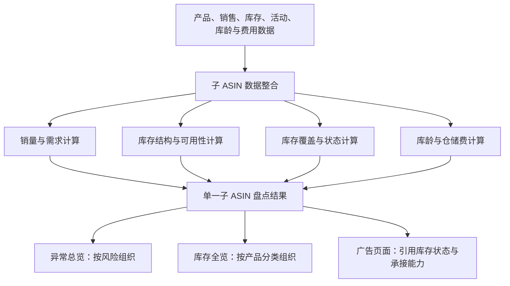
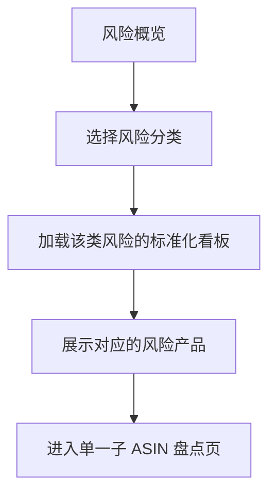
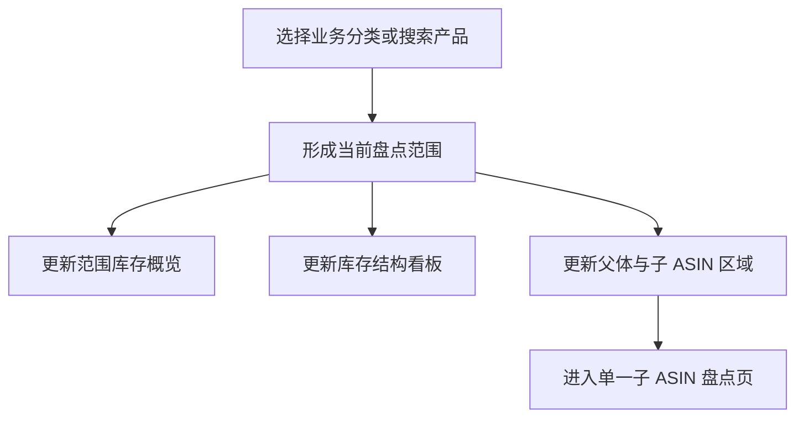
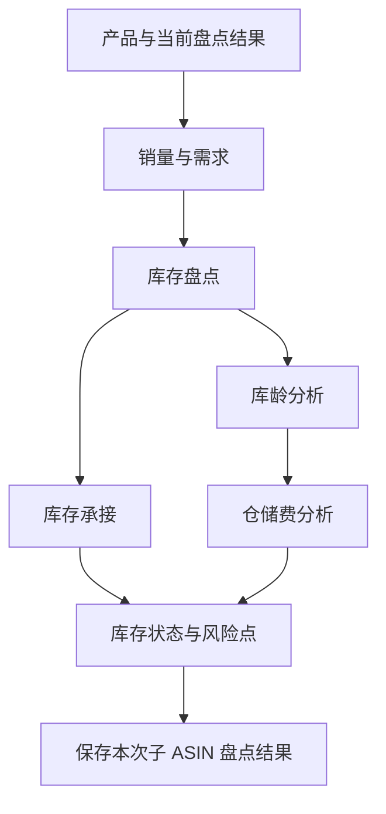

# Bamboocool 产品库存模块三页架构方案

更新时间：2026-08-13

适用范围：异常总览、库存全览、单一子 ASIN 盘点页

方案阶段：页面架构与功能板块确认

## 1. 文档定位

本文档定义产品库存模块的整体架构、三类页面的职责、页面板块及页面之间的流转关系。

当前方案以功能板块为设计颗粒度：明确每个页面承载什么信息、每个看板展示什么业务关系，以及运营如何在三个页面之间完成查看和下钻。具体字段、表头、指标阈值与可视化组件在后续页面详细设计中展开。

## 2. 模块目标

产品库存模块以子 ASIN 为最小盘点单元，将销量、需求预测、库存位置、库存状态、库龄和仓储费用组织为统一的产品库存结果。

这套结果服务于三个业务场景：

1. 从风险出发，查看当前哪些产品存在库存问题；
2. 从业务分类出发，盘点某一范围内的全部产品库存；
3. 从单个产品出发，查看完整库存构成及其计算逻辑。

## 3. 三页总体架构

### 3.1 页面分工

#### 异常总览

从全部子 ASIN 的盘点结果中识别风险，按照风险类型和严重程度组织问题产品，帮助运营优先找到需要关注的库存问题。

#### 库存全览

按照品类、父体、负责人、产品阶段和产品定位等业务分类组织全部产品，帮助运营完成一定范围内的库存盘点。

#### 单一子 ASIN 盘点页

整合一个子 ASIN 的销售、需求、库存、库龄和仓储费，形成完整、可保存的产品库存盘点结果，是异常总览与库存全览的共同基础。

### 3.2 系统生成逻辑

### 3.3 运营查看路径

运营可以从风险或业务分类进入产品详情，两类入口最终汇入同一套子 ASIN 盘点结果。

## 4. 页面一：异常总览

### 4.1 页面目标

异常总览负责把分散在不同子 ASIN 中的库存风险集中呈现，让运营快速知道：

- 当前主要存在哪些类型的库存问题；
- 每一类风险涉及多少产品、集中在哪里；
- 哪些产品问题更严重；
- 某个风险由什么库存关系形成。

### 4.2 页面结构

页面由四个板块组成：风险概览、风险分类、分类风险看板、风险产品区域。

### 4.3 风险概览

风险概览展示当前业务范围内的库存风险全貌，主要包括：

- 风险产品的总体规模；
- 各类风险的数量和占比；
- 不同严重程度的风险分布；
- 风险在品类、父体或负责人之间的集中情况；
- 当前最值得优先查看的风险类型。

该板块既是风险摘要，也是风险分类的入口。运营选择某一类风险后，页面切换到对应的风险分析内容。

### 4.4 风险分类

系统从多个角度识别当前库存风险：

#### 库存不足

识别当前可销售库存与销售消耗不匹配的产品，反映库存对当前需求的承接压力。

#### 超量备货

识别库存规模明显超过销售消化能力的产品，反映库存积压和资金占用压力。

#### 库存可用性异常

识别总库存与实际可售库存差异较大的产品，反映库存被预留、待调仓、入库中、不可售等状态占用的情况。

#### 库龄风险

识别库存老化程度较高的产品，反映高库龄库存的规模、占比和集中位置。

#### 仓储费风险

识别仓储费用较高或费用负担较重的产品，反映库存结构带来的仓储成本压力。

一个子 ASIN 可以同时命中多类风险，系统分别记录风险类型、严重程度和判断依据。

### 4.5 分类风险看板

不同风险采用各自的标准化可视化模板。模板保持统一的页面语言，但围绕该类风险最关键的业务关系组织内容。

#### 库存不足看板

主要展示当前可售库存、销售消耗和其他库存状态之间的关系，帮助运营理解库存不足的程度，以及问题主要来自库存总量、库存位置还是可用状态。

#### 超量备货看板

主要展示库存规模与销售消化能力的关系，帮助运营理解库存积压程度、库存主要集中位置以及超量库存的组成。

#### 库存可用性看板

主要展示总库存与实际可售库存之间的结构差异，帮助运营识别哪些库存状态造成“有货但无法销售”。

#### 库龄风险看板

主要展示不同库龄区间的库存结构、高库龄库存的集中程度，以及库龄与当前销售消化能力之间的关系。

#### 仓储费风险看板

主要展示仓储费用的规模与构成、费用主要来源，以及仓储费在销售或利润中的压力程度。

### 4.6 风险产品区域

风险产品区域展示当前风险分类下受到影响的产品，并按照严重程度组织。

该区域采用与风险类型相匹配的产品摘要模板：

- 同一类风险使用稳定、一致的表达结构；
- 不同风险突出各自最重要的判断信息；
- 每个产品摘要呈现风险程度、核心关系和进入详情的入口；
- 运营可以在当前风险分类下继续按品类、父体或负责人缩小范围。

点击产品后进入单一子 ASIN 盘点页，并定位到与当前风险对应的分析板块。

### 4.7 页面输出

异常总览最终向运营输出：

- 当前风险版图；
- 各类风险的影响范围；
- 按严重程度组织的问题产品；
- 每个风险产品对应的完整盘点入口。

## 5. 页面二：库存全览

### 5.1 页面目标

库存全览负责组织全部产品，让运营能够围绕一个明确的业务范围查看整体销售与库存情况，并快速定位父体或子 ASIN。

它主要回答：

- 当前查看范围内有多少产品；
- 整体销售规模与库存规模如何；
- 库存主要分布在哪里、处于什么状态；
- 当前范围内的风险、库龄和仓储费情况如何；
- 哪些父体或子 ASIN 值得进一步查看。

### 5.2 页面结构

页面由四个板块组成：分类与筛选、范围概览、库存结构、产品库存区域。

### 5.3 分类与筛选

分类与筛选用于确定本次盘点范围，支持运营按照日常管理产品的方式组织数据，包括：

- 站点与负责人；
- 品类与父体；
- 产品阶段与产品定位；
- 售卖状态；
- 产品、子 ASIN 或 SKU 搜索；
- 当前库存状态。

筛选结果同时作用于范围概览、库存结构和产品库存区域，形成一个连续的库存盘点视图。

### 5.4 当前范围库存概览

该看板展示当前分类下的整体库存情况，主要包括：

- 产品及子 ASIN 的总体规模；
- 整体销售规模与库存规模；
- 各库存位置的总体分布；
- 当前库存状态和风险分布；
- 库龄结构与仓储费规模。

它帮助运营先建立对当前分类的整体认知，再进入库存结构或具体产品。

### 5.5 库存结构看板

库存结构看板用于解释当前范围内的库存由什么组成，主要展示三类结构：

#### 库存位置结构

展示库存分布在 FBA、AWD、海外仓、国内仓等不同位置的情况。

#### 库存状态结构

展示库存处于可售、预留、不可售、待调仓、入库中、在途等不同状态的情况。

#### 库龄与费用结构

展示正常库龄与高库龄库存的构成，以及这些库存对应的仓储费用压力。

该看板帮助运营理解整体库存数字背后的构成，并识别库存集中或结构失衡的问题。

### 5.6 产品库存区域

产品库存区域承载当前范围内的父体和子 ASIN，是库存全览的主要查看区域。

#### 全盘状态

页面按照父体组织产品：父体负责汇总同一产品族的销售和库存情况，展开后查看各子 ASIN 的库存摘要。

#### 筛选状态

页面直接呈现符合条件的子 ASIN，帮助运营快速查看某个特定分类下的产品库存情况。

#### 产品摘要

产品摘要围绕以下内容组织：

- 产品身份及业务分类；
- 近期销售表现；
- 主要库存位置和可用情况；
- 当前库存状态；
- 库龄与仓储费信号。

点击任一子 ASIN 后进入完整盘点页。返回库存全览时，页面保留原分类范围、父体展开状态和浏览位置。

### 5.7 页面输出

库存全览最终向运营输出：

- 当前业务范围的库存全貌；
- 库存位置、状态、库龄和费用结构；
- 按父体或筛选条件组织的产品库存摘要；
- 单一子 ASIN 的完整盘点入口。

## 6. 页面三：单一子 ASIN 盘点页

### 6.1 页面目标

单一子 ASIN 盘点页负责还原一个产品的完整销售与库存状态，并将相关数据转化为一份结构化、可保存的库存盘点结果。

这份结果既供运营查看，也向异常总览、库存全览和广告页面提供统一的库存依据。

### 6.2 页面结构

页面由六个核心看板和一个盘点记录区域组成。

### 6.3 产品与盘点结果看板

该看板是详情页的结果索引，展示：

- 当前产品及其父体归属；
- 产品阶段、产品定位和售卖状态；
- 当前销售状态与库存状态；
- 已识别的主要风险点；
- 本次盘点的数据时间。

运营可以从这里快速了解产品当前状态，并进入对应分析看板查看形成原因。

### 6.4 销量与需求看板

该看板形成库存盘点所使用的需求基础，主要展示：

- 不同周期的销量表现；
- 日均销量及趋势变化；
- 未来需求预测；
- BD、Deal及大促等活动对需求的影响。

它帮助运营理解当前库存需要承接怎样的销售需求，也为库存覆盖和库存状态计算提供需求输入。

### 6.5 库存盘点看板

该看板完整展示当前产品的库存构成，主要包括：

- FBA、AWD、海外仓、国内仓等库存位置；
- 可售、预留、不可售、待调仓、入库中、在途等库存状态；
- 当前可立即销售、已知后续可用和暂时无法销售的库存关系；
- 各批在途库存的状态及预计可售时间。

它回答“货有多少、在哪里、处于什么状态”，并为库存可用性分析提供基础。

### 6.6 库存承接看板

该看板把销售需求与库存放在同一逻辑中展示，主要体现：

- 当前可售库存能够支撑的销售周期；
- 不同库存范围对销售需求的承接能力；
- 在途库存转为可售后带来的库存变化；
- 当前库存与安全库存要求之间的关系；
- 当前需求与库存之间的缺口或余量。

它是库存不足和超量备货判断的主要依据，也是广告页面判断库存能否承接新增需求的重要输入。

### 6.7 库龄看板

该看板展示库存年龄结构和库存老化程度，主要包括：

- 不同库龄区间的库存分布；
- 高库龄库存的数量和占比；
- 高库龄库存集中在哪些库存位置或状态；
- 库龄结构与当前销售消化能力之间的关系。

它形成独立的库龄风险结果，同时为超量备货和仓储费分析提供依据。

### 6.8 仓储费看板

该看板展示当前库存形成的仓储成本，主要包括：

- 当前仓储费用规模；
- 正常仓储费与超龄费用的构成；
- 不同库龄库存对应的费用结构；
- 仓储费与销售额、利润之间的关系；
- 费用压力主要来自哪些库存部分。

它形成仓储费风险结果，并帮助运营理解库存积压带来的经营成本。

### 6.9 库存状态与风险点

系统综合销量与需求、库存规模、库存可用性、库存覆盖、库龄和仓储费，形成当前子 ASIN 的库存状态，并记录可能同时存在的多个风险点。

盘点结果主要包括：

- 当前库存状态；
- 库存覆盖与供需关系；
- 各类库存风险及严重程度；
- 每个风险的主要形成原因；
- 可供其他页面调用的结构化判断依据。

### 6.10 盘点记录

系统保存每次子 ASIN 盘点的关键结果，包括数据时间、销量与需求结果、库存快照、库存状态、库龄结果、仓储费结果以及使用的规则版本。

历史盘点记录用于查看同一产品的状态变化，也确保异常总览、库存全览和广告页面引用的是同一套盘点结果。

### 6.11 页面输出

单一子 ASIN 盘点页最终输出一份标准化盘点结果，包含：

- 产品及业务分类；
- 销量与需求结果；
- 库存位置和库存状态；
- 库存覆盖与承接能力；
- 当前库存状态及风险点；
- 库龄结构；
- 仓储费结果；
- 数据时间与规则版本。

## 7. 三页之间的统一规则

### 7.1 统一判断对象

子 ASIN 是库存盘点和风险判断的最小单元。父体负责产品归属、分组和汇总展示。

### 7.2 统一结果来源

异常总览和库存全览共同读取单一子 ASIN 的盘点结果。不同页面改变结果的组织方式，不改变底层库存口径。

### 7.3 统一风险记录

每个子 ASIN 可以拥有多个风险点。每个风险点包含风险类型、严重程度和判断依据，并在对应风险模板中展示。

### 7.4 统一页面上下文

从异常总览进入详情时，详情页保留风险类型并定位到对应分析板块；从库存全览进入详情时，详情页保留当前产品分类。返回入口页后，原有筛选、展开状态和浏览位置保持不变。

### 7.5 统一对外输出

产品库存模块向其他业务页面输出稳定的结构化结果，包括库存状态、库存风险、库存覆盖、库存可用性、库龄、仓储费和库存承接能力。

## 8. 后续详细设计顺序

后续按照底层结果优先的顺序继续展开：

1. 单一子 ASIN 盘点页：确认盘点逻辑、看板关系和标准输出；
2. 异常总览：确认风险分类及每类风险的标准化可视化模板；
3. 库存全览：确认分类方式、范围概览和父子产品组织方式；
4. 数据设计：根据三个页面的功能，整理所需数据表、字段、来源及计算关系。
