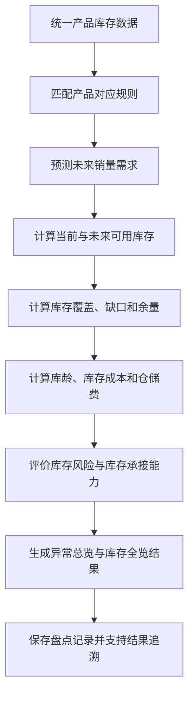

# Bamboocool 产品库存模块必备逻辑与能力清单

更新时间：2026-08-13

上位方案：`Bamboocool-产品库存模块三页架构方案.md`

方案阶段：业务逻辑与计算能力盘点

## 1. 文档定位

本文档承接产品库存模块三页架构，盘点异常总览、库存全览和单一子 ASIN 盘点页共同依赖的业务逻辑与计算能力。

本阶段所指的“功能/能力”，是将原始数据或过程数据按照确定规则进行归并、计算、预测或评价，生成可以被页面直接使用的业务结果。

能力清单围绕以下主线展开：

```text
原始数据与过程数据
        ↓
统一产品库存对象
        ↓
销量、库存、库龄与费用计算
        ↓
库存状态与风险评价
        ↓
生成三类页面可直接使用的结果
```

## 2. 整体能力链



九项能力共同构成一条连续计算链。前一环节的结果进入下一环节，最终形成统一的子 ASIN 盘点结果，并向三个页面及广告判断提供数据。

## 3. 能力一：统一产品库存数据

### 3.1 能力目标

将分散在不同数据源中的产品、销售、库存、库龄和费用记录，整理为统一的子 ASIN 库存台账。

### 3.2 核心处理逻辑

- 统一父 ASIN、子 ASIN、SKU、MSKU、FNSKU、SPU 等产品标识的对应关系；
- 建立父体、子体、款式、颜色、尺码和组合之间的产品归属；
- 统一 FBA、AWD、海外仓、国内仓等库存位置；
- 统一可售、预留、不可售、待调仓、入库中、在途等库存状态；
- 通过货件、批次、采购单或库存事件识别同一批库存，避免重复计算；
- 处理共享库存、一货多店和多站点汇总等关系；
- 将销售、库存、库龄和费用数据对齐到同一个盘点时间。

### 3.3 标准输出

输出每个子 ASIN 在当前盘点时间下的统一库存台账，明确库存数量、所在位置、当前状态和产品归属。

## 4. 能力二：库存规则匹配

### 4.1 能力目标

根据产品的业务属性，为当前子 ASIN 选择对应的计算和评价标准。

### 4.2 核心处理逻辑

- 根据站点、品类、产品阶段、产品定位和售卖状态匹配规则；
- 匹配对应的销量预测方式；
- 匹配合理库存周期和安全库存标准；
- 匹配库存覆盖、库龄和仓储费评价标准；
- 记录本次计算使用的规则及其版本。

### 4.3 标准输出

输出当前子 ASIN 使用的完整规则组合，供后续销量预测、库存计算、费用计算和风险评价共同调用。

## 5. 能力三：销量与需求预测

### 5.1 能力目标

将历史销售数据和已知经营活动转化为未来销量需求。

### 5.2 核心处理逻辑

- 计算不同周期的销量、日均销量和变化趋势；
- 识别断货、活动和异常数据造成的销售失真；
- 区分正常销售与活动期间销售；
- 将 BD、Deal、大促和日常折扣与历史销量进行对齐；
- 计算活动对销量带来的增量影响；
- 结合基础销售速度、近期趋势、周期性、季节性和活动计划生成未来需求预测；
- 按日输出预计销量，并形成一定周期内的累计预计销量；
- 持续比较预测销量与实际销量，根据偏差校准预测参数。

### 5.3 标准输出

输出未来每日销量、累计销量需求、活动增量以及预测可信程度，作为库存消耗计算的需求输入。

## 6. 能力四：当前与未来可用库存计算

### 6.1 能力目标

在统一库存台账的基础上，计算当前以及指定日期真正可以承接销售的库存。

### 6.2 核心处理逻辑

- 从总库存中识别当前可以立即销售的库存；
- 区分受限库存和暂不可售库存；
- 判断每批在途、入库中和待调仓库存预计何时转为可售；
- 按预计销量逐日扣减可售库存；
- 在库存确认转为可售的日期增加对应库存；
- 分别计算不同库存范围下的可用库存变化；
- 形成连续的库存余额曲线。

未来某日可用库存的基础关系为：

```text
未来某日可用库存
= 当前可售库存
- 截至该日的累计预计销量
+ 截至该日确认转为可售的库存
```

### 6.3 标准输出

输出当前可售库存、受限库存、库存可用率、指定日期预计可用库存以及连续库存余额变化。

## 7. 能力五：库存覆盖与余缺计算

### 7.1 能力目标

将销量需求和可用库存放入同一计算关系，判断当前库存是否充足、是否过量以及能够支撑多长时间。

### 7.2 核心处理逻辑

- 计算不同库存范围下的库存覆盖天数；
- 计算库存预计归零时间；
- 计算安全库存被突破的时间和数量；
- 计算一定需求周期内的库存缺口；
- 判断确认可用的后续库存能否覆盖缺口；
- 根据产品对应的合理库存周期计算合理库存上限；
- 计算超过合理库存范围的库存数量；
- 计算现有库存预计需要多长时间消化；
- 分析库存不足或超量主要集中在哪些库存位置和状态。

### 7.3 标准输出

输出库存覆盖天数、库存缺口或余量、超量库存数量、库存消化周期以及供需关系的主要形成原因。

## 8. 能力六：库龄、库存成本与仓储费计算

### 8.1 能力目标

将库存数量进一步转化为库存年龄、库存货值、资金占用和仓储费用。

### 8.2 库龄计算逻辑

- 根据库存入库批次计算每批库存的在库时间；
- 按库存消耗规则将已经发生的销量分配到对应批次；
- 计算各批次剩余库存的实际库龄；
- 将剩余库存划分到对应库龄区间；
- 计算各库龄区间的库存数量、占比和货值；
- 识别高库龄库存集中在哪些库存位置和状态。

### 8.3 库存成本计算逻辑

- 根据产品成本计算各位置库存货值；
- 计算可售、受限、在途和高库龄库存的资金占用；
- 计算超量库存对应的资金占用；
- 计算库存资金占用与产品销售规模的关系。

### 8.4 仓储费计算逻辑

- 根据库存数量、库龄、商品尺寸或计费体积计算费用；
- 匹配淡旺季、库存位置和库龄对应的仓储费率；
- 区分正常仓储费和超龄附加费用；
- 处理费用结算周期、币种和汇率；
- 计算仓储费占销售额和毛利的比例；
- 识别仓储费用主要由哪些库存部分产生。

### 8.5 标准输出

输出库龄结构、高库龄库存规模、库存货值、资金占用、仓储费用、费用构成和费用压力。

## 9. 能力七：综合库存风险评价

### 9.1 能力目标

综合销量需求、库存规模、库存可用性、库存覆盖、库龄和仓储费用，为每个子 ASIN 识别库存风险并判断严重程度。

### 9.2 风险评价范围

#### 库存不足风险

综合当前可售库存、销售速度、未来需求、库存覆盖、安全库存和确认可用的后续库存进行评价。

#### 超量备货风险

综合库存规模、合理库存周期、未来需求、库存消化周期和库存货值进行评价。

#### 库存可用性风险

综合总库存、实际可售库存和不同受限库存的数量及占比进行评价。

#### 库龄风险

综合高库龄库存的数量、占比、货值和销售消化能力进行评价。

#### 仓储费风险

综合仓储费金额、费用构成，以及费用占销售额和毛利的比例进行评价。

一个子 ASIN 可以同时形成多个风险结果。

### 9.3 风险程度与原因计算

风险程度综合考虑：

- 计算结果偏离合理标准的程度；
- 涉及的库存数量和货值；
- 对当前销售承接的影响；
- 对仓储费用和利润的影响；
- 产品阶段和产品定位。

系统同时拆解每个风险的主要形成原因。例如，库存不足可以进一步识别为库存总量不足、可售库存不足、销量快速上涨、活动需求增加或后续库存无法及时转为可售。

### 9.4 库存承接能力

系统将库存风险进一步转化为可以被广告页面使用的库存承接能力，判断当前产品能够承接正常销售、额外流量和活动需求的程度。

### 9.5 标准输出

输出风险类型、风险程度、风险排序分值、主要形成原因、关键计算依据和库存承接能力。

## 10. 能力八：范围汇总与看板结果生成

### 10.1 能力目标

将统一的子 ASIN 盘点结果，按照异常总览和库存全览的业务需要重新组织。

### 10.2 库存全览汇总逻辑

- 按照父体、品类、负责人、产品阶段和产品定位等范围汇总子 ASIN；
- 汇总销量、库存数量、库存货值和仓储费；
- 重新计算当前范围内的库存位置结构和库存状态结构；
- 重新计算当前范围内的库龄结构；
- 统计不同库存状态、风险类型和风险程度的分布；
- 对覆盖天数、比例和风险等非加总结果使用对应的聚合规则。

### 10.3 异常总览汇总逻辑

- 将子 ASIN 分别归入其命中的风险分类；
- 汇总每类风险涉及的产品、库存、货值和费用；
- 按风险严重程度组织产品；
- 为不同风险看板生成对应的标准化计算结果；
- 保留风险汇总结果与子 ASIN 盘点结果之间的关系。

### 10.4 标准输出

输出库存全览所需的业务范围盘点结果，以及异常总览所需的风险版图、分类结果和风险产品顺序。

## 11. 能力九：盘点记录与结果追溯

### 11.1 能力目标

保存每次盘点结果，并建立最终判断、计算过程和原始数据之间的完整关系。

### 11.2 核心处理逻辑

- 保存当次销量预测、库存快照、库存覆盖、库龄、费用和风险结果；
- 保存盘点时间和使用的规则版本；
- 比较当前盘点与历史盘点结果；
- 识别风险的新增、加重、减轻和解除；
- 记录每项结果使用的原始数据；
- 记录原始数据经过的中间计算；
- 记录风险判断所引用的计算结果和规则；
- 建立最终结果到计算过程和原始数据的追溯关系。

### 11.3 标准输出

输出可保存、可比较、可解释的子 ASIN 盘点记录及完整计算链路。

## 12. 九项能力与三个页面的关系

### 12.1 单一子 ASIN 盘点页

单一子 ASIN 盘点页是九项能力的主要承载页面：

- 读取统一产品库存数据和适用规则；
- 使用销量与需求预测计算库存消耗；
- 使用当前与未来可用库存计算形成库存变化；
- 使用库存覆盖与余缺计算形成供需关系；
- 使用库龄、库存成本与仓储费计算形成库存成本结果；
- 使用综合库存风险评价形成当前库存状态与风险点；
- 保存标准化盘点记录并提供计算追溯。

### 12.2 异常总览

异常总览主要读取：

- 综合库存风险评价结果；
- 风险程度和风险排序结果；
- 风险原因及关键依据；
- 按风险分类生成的汇总结果。

### 12.3 库存全览

库存全览主要读取：

- 子 ASIN 标准盘点结果；
- 父体及其他业务范围汇总结果；
- 库存位置、库存状态和库龄结构；
- 库存货值、仓储费和风险分布。

### 12.4 广告页面

广告页面读取综合库存风险评价形成的库存承接能力，将库存状态作为广告扩量、维持或控制新增需求的判断条件。

## 13. 能力盘点结论

产品库存模块需要形成的核心能力中轴为：

```text
销量预测
    ↓
当前及未来可用库存
    ↓
库存覆盖、缺口与余量
    ↓
库龄、库存成本与仓储费
    ↓
综合库存风险评价
    ↓
异常总览、库存全览与单品盘点结果
```

九项能力以子 ASIN 为统一计算对象，共用一套产品关系、库存口径和规则体系，最终形成可以在不同页面之间复用的标准化盘点结果。
