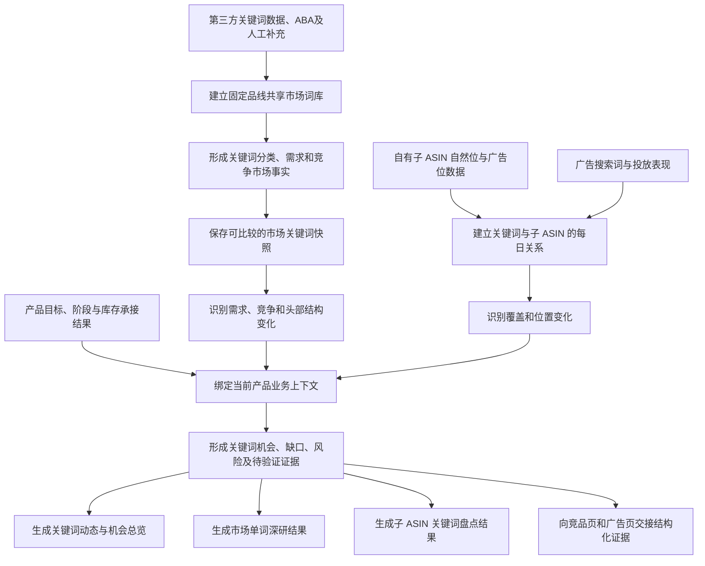
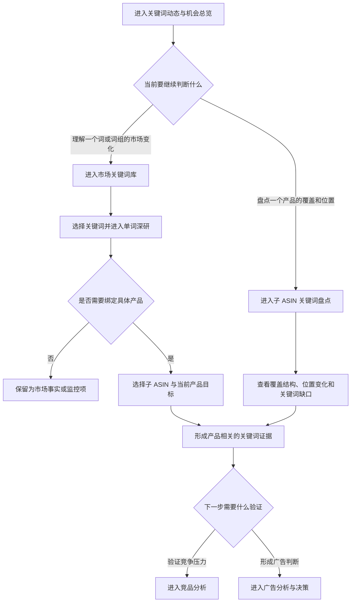
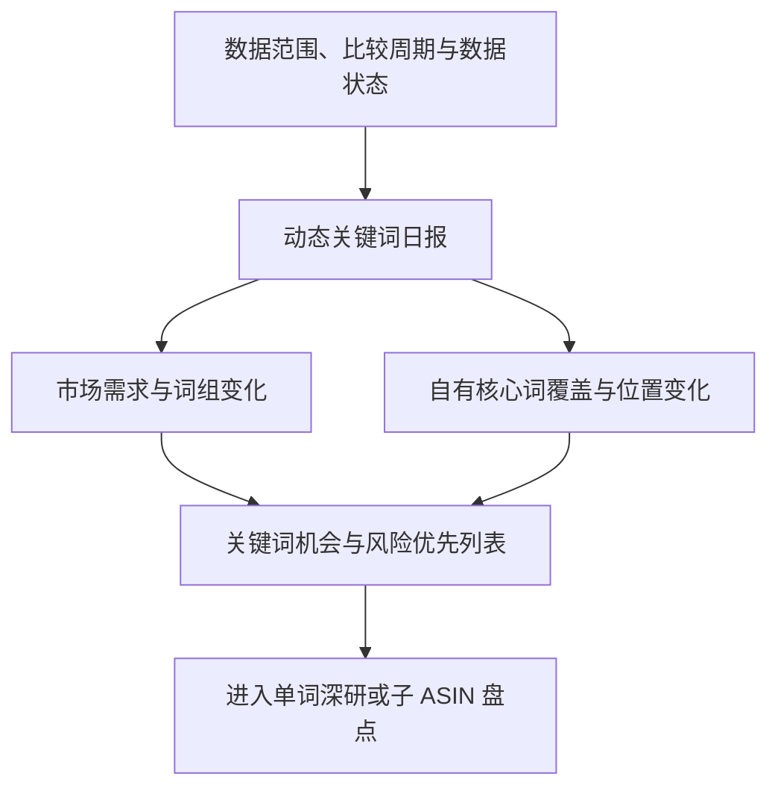
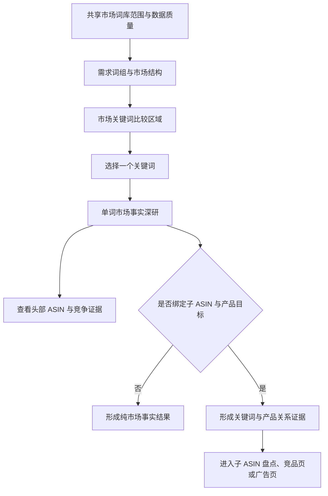
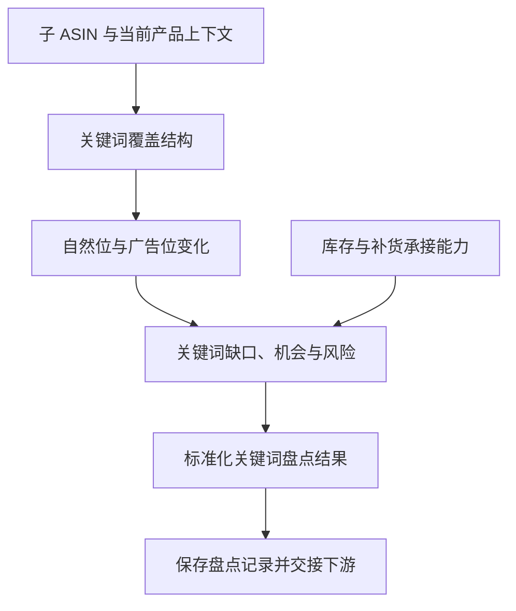

# Bamboocool 关键词分析模块三页架构方案

更新时间：2026-08-13

适用范围：关键词动态与机会总览、市场关键词库与单词深研、子 ASIN 关键词盘点

方案阶段：页面架构与功能板块确认

## 1. 文档定位

本文档确定 Bamboocool 关键词分析模块的三页架构，说明运营在每一页查看什么、各看板组织哪些业务关系，以及三个页面如何共同生成可以交给竞品分析和广告决策继续使用的关键词证据。

本文档只确定页面任务、业务板块和页面流转，不提前固定表格字段、数据表结构、接口或视觉组件。

关键词分析模块的业务边界是：

> 解释市场关键词发生了什么、某个子 ASIN 在关键词市场中处于什么位置，并形成可追溯的判断证据；不在本模块直接生成出价、预算、加词、否词或暂停广告等执行动作。

## 2. 模块目标

关键词分析模块需要帮助运营完成三类不同任务：

1. 每日快速发现市场需求、核心词位置和产品覆盖发生了哪些重要变化；
2. 查看固定品线的共享市场关键词库，并理解单个关键词的需求、竞争和头部产品结构；
3. 盘点一个子 ASIN 在共享词库中的覆盖、自然位置、广告位置和变化，并结合当前产品目标与库存承接能力形成证据结论。

模块最终需要回答的不是“这个词好不好”，而是：

```text
在什么市场事实下
哪个子 ASIN
围绕什么当前产品目标
在这个关键词上出现了什么机会、缺口或风险
当前库存是否能够承接
还需要竞品页或广告页继续验证什么
```

## 3. 页面总体架构

### 3.1 页面分工

关键词分析模块拆分为三个页面。

#### 页面一：关键词动态与机会总览

服务“今天发生了什么、最需要看哪里”的任务。

页面从市场需求、词组变化、自有子 ASIN 的核心词覆盖与位置变化中，选出当前最重要的异常和机会，帮助运营确定当天的分析顺序。

#### 页面二：市场关键词库与单词深研

服务“市场里有哪些词、一个词本身意味着什么”的任务。

页面维护固定品线共用的市场关键词库，组织关键词分类、需求、购买、竞争和头部 ASIN 等市场事实；选择某个关键词后，进入完整的单词深研。

#### 页面三：子 ASIN 关键词盘点

服务“一个产品在整个关键词市场中表现如何”的任务。

页面以一个子 ASIN 为盘点对象，查看其在共享词库中的覆盖、自然位置、广告位置、变化、缺口和业务约束，形成标准化关键词盘点结果。

### 3.2 统一业务对象

三个页面共用三层业务对象。

#### 市场关键词

市场关键词是市场事实对象，记录关键词自身的需求、购买、竞争、头部 ASIN、分类、来源和时间。

在未绑定产品时，系统只能说明关键词的市场事实，不能判断该词是否值得某个产品投入。

#### 关键词与子 ASIN 的关系

`关键词 × 子 ASIN` 是产品关系对象，记录一个子 ASIN 对该词的匹配情况、自然覆盖、广告覆盖、自然位置、广告位置及其历史变化。

同一关键词可以分别与不同子 ASIN 建立产品关系，但每一条覆盖和位置结果都独立落到具体子 ASIN。

#### 关键词业务判断上下文

完整业务判断的最小上下文为：

```text
关键词 × 子 ASIN × 当前产品目标
```

产品目标、产品阶段和库存承接能力由产品库存模块或策略设置提供。关键词模块引用这些结果，不在本模块重新计算产品目标和库存状态。

### 3.3 系统生成逻辑

系统先生成关键词与子 ASIN 的标准结果，再向上形成总览。



广告搜索词和投放报表能够说明关键词获得了怎样的付费流量和转化，但不能直接替代真实广告位置采集。自然位置与广告位置必须分别保留来源和口径。

### 3.4 运营查看路径

运营从总览发现变化，再根据问题属于“词”还是“产品”进入不同页面。



### 3.5 三页共用一套底层结果

三个页面不是三套独立词库：

- 总览页按照变化重要性组织关键词和产品关系；
- 市场词库页按照关键词本身组织市场事实；
- 子 ASIN 盘点页按照产品组织关键词关系。

页面改变的是查看入口和组织方式，不改变关键词定义、位置口径、产品目标和证据结论。

## 4. 页面一：关键词动态与机会总览

### 4.1 页面目标

关键词动态与机会总览负责回答：

> 当前比较周期内，市场关键词、自有核心词位置和子 ASIN 覆盖发生了哪些重要变化，运营今天应该先查看什么？

页面不铺开全部关键词，也不要求运营先设置复杂筛选，而是从完整词库和产品关系中挑出少量重要变化。

### 4.2 页面结构



### 4.3 数据范围与数据状态

页面首先说明本次总览覆盖的站点、固定品线、数据日期、比较周期、刷新时间和来源。

如果页面使用“流量获取”“市场份额”或其他推导结果，必须同时说明其测量定义。第三方预估值、亚马逊官方值和系统推导值不得混写为同一口径。

当自然位置、广告位置、搜索需求或产品目标缺失时，总览需要明确指出受影响的判断范围，不能用默认值补成完整结论。

### 4.4 动态关键词日报

动态关键词日报每天回答五个固定问题，但答案由当期数据决定：

1. 当前品线或品牌获得关键词流量的整体结果如何，相对比较期发生了什么变化；
2. 哪些关键词或词组贡献了主要增长和下降，变化是否集中在特定需求类型；
3. 自有核心词的覆盖、自然位置和广告位置发生了哪些重要变化，包括新增覆盖和丢失覆盖；
4. 出现了哪些新的异常或机会信号，影响了哪些子 ASIN；
5. 当前最值得继续分析的是哪一小组关键词，判断依据是什么，应进入哪个页面查看。

日报只负责总结和指路。每项结论都要能够进入市场单词深研或子 ASIN 盘点查看依据。

### 4.5 市场需求与词组变化看板

该看板把单个关键词的变化重新组织到需求词组中，帮助运营理解市场变化发生在哪一类需求，而不是只看到一串上涨和下降的词。

看板主要组织以下关系：

- 通用类目词、品牌词、材质词、功能词、场景词、款式词和长尾词的需求变化；
- 搜索需求变化与购买表现变化是否一致；
- 竞争程度和头部 ASIN 结构是否同时变化；
- 变化来自少量大词，还是来自一组相近的细分需求词；
- 场景化和长尾需求是否出现连续增长信号。

它帮助运营判断“市场需求结构变了”还是“只是单个词短期波动”，并进入对应词组或关键词继续分析。

### 4.6 自有核心词覆盖与位置变化看板

该看板集中监控运营已确认需要持续关注的关键词，展示自有子 ASIN 在这些词上的覆盖和位置变化。

看板把以下业务关系放在一起：

- 关键词当前需求规模与重要性；
- 哪些子 ASIN 当前拥有自然覆盖或广告覆盖；
- 自然位置与广告位置分别处于什么状态；
- 相对比较期出现了上涨、下降、新增覆盖还是丢失覆盖；
- 位置变化影响的是主推子 ASIN、辅助子 ASIN 还是其他产品。

该看板只陈述位置和覆盖事实。广告位置上涨或下降不自动等同于广告策略正确或错误，最终广告判断仍需结合广告表现和产品目标。

### 4.7 关键词机会与风险优先列表

该区域将市场变化、产品关系和业务约束组合成需要继续分析的事项。

典型结果包括：

- 市场需求持续上涨、产品匹配，但自有子 ASIN 尚未形成有效覆盖；
- 核心词需求稳定，但主推子 ASIN 自然位置明显下降或丢失覆盖；
- 场景词或长尾词形成连续增长，自有产品已有初步位置但证据仍不足；
- 某个词的市场机会明显，但当前库存或补货能力无法承接额外需求；
- 某个词的头部 ASIN 或竞争结构发生变化，需要进入竞品页验证；
- 市场需求较大，但产品匹配度不足，不应仅因搜索量高而认定为机会。

列表按照潜在影响、变化紧迫性、产品目标匹配程度和证据完整度组织顺序。每项结果说明“发生了什么、影响谁、为什么重要、还缺什么证据”，不直接给广告动作。

### 4.8 页面输出

关键词动态与机会总览最终输出：

- 当前品线的动态关键词日报；
- 主要需求词组和竞争结构变化；
- 自有核心词覆盖与自然位、广告位变化；
- 需要优先处理的关键词机会、缺口和风险；
- 进入市场单词深研、子 ASIN 盘点、竞品分析或广告决策的上下文入口。

## 5. 页面二：市场关键词库与单词深研

### 5.1 页面目标

市场关键词库与单词深研负责回答：

> 当前固定品线的关键词市场由哪些需求组成，一个关键词的真实市场情况如何，它与哪些自有产品可能有关？

市场关键词库是固定品线共用的市场底图，不按每个产品重复建立一套词库。

### 5.2 页面结构



### 5.3 共享词库范围与数据质量

该区域说明当前词库属于哪个站点和固定品线、包含多少有效关键词、最近一次更新时间，以及各来源的覆盖情况。

词库需要区分：

- 已确认属于当前品线的有效词；
- 需要运营确认分类或相关性的词；
- 明显噪声、跨类目或不应进入当前分析范围的词；
- 运营临时加入、等待后续数据采集的监控词；
- 数据过期、来源缺失或暂时无法比较的词。

运营可以把临时关注的关键词加入监控范围，也可以确认或修正关键词分类。修正结果进入后续词库更新，而不是只改变当前页面显示。

### 5.4 需求词组与市场结构看板

该看板按照关键词表达的需求组织市场，而不是只按照搜索量从大到小排列。

主要需求维度包括：

- 品牌与竞品品牌；
- 通用类目和款式；
- 材质；
- 功能；
- 使用场景；
- 人群；
- 尺码、颜色和数量；
- 节日、季节及其他长尾需求。

一个关键词可以同时属于多个属性标签，但在词组汇总时需要避免重复计算。

“品牌、材质、功能”等用于解释词的需求属性；“核心词、探索词、长尾词、待验证词”等属于运营角色。两类分类分别维护，避免把市场语义和运营策略混成一套标签。

该看板帮助运营理解市场流量集中在哪些需求类型，哪些需求已经形成稳定规模，哪些需求处于增长、下降或数据不足状态。

### 5.5 市场关键词比较区域

该区域以每个关键词的市场事实为核心，支持运营在同一市场口径下比较：

- 当前需求规模及历史方向；
- 搜索后的购买表现；
- 市场供给和广告竞争；
- 点击与转化是否集中在少量头部 ASIN；
- 当前主要头部 ASIN 及其变化；
- 关键词所属需求词组；
- 数据来源、数据时间和可比较状态。

页面不把第三方工具能够提供的全部字段原样搬入工作台，只保留能够支持市场判断、产品关系判断和下游证据交接的结果。

### 5.6 单词市场事实深研

选择一个关键词后，先分析关键词本身，不立即输出产品建议。

市场事实深研把以下关系放在同一分析中：

- 搜索需求和购买表现随时间的变化；
- 市场供给、广告竞争和建议竞价所反映的竞争压力；
- 头部 ASIN 的点击、转化或位置集中情况；
- 头部 ASIN 是否发生明显替换；
- 当前变化属于短期波动、连续趋势还是暂时无法判断；
- 不同数据来源之间是否存在定义差异或相互矛盾。

这一层最终形成“该词当前是什么市场状态”的结果，例如需求增长、需求稳定、竞争加剧、头部集中度变化或数据不足。

### 5.7 关键词与产品关系区

只有绑定具体子 ASIN 及其当前产品目标后，页面才进一步判断这个词对产品意味着什么。

该区域组合：

- 关键词市场状态；
- 关键词与产品属性、卖点和现有流量的匹配关系；
- 子 ASIN 当前自然覆盖、广告覆盖和位置；
- 覆盖与位置的历史变化；
- 产品当前目标、阶段和主推/辅助关系；
- 库存及补货是否能够承接额外需求。

页面由此形成证据级结论，例如：

- 需求上涨、产品匹配、当前位置偏弱；
- 市场规模稳定，主推子 ASIN 丢失自然覆盖；
- 长尾需求增长，但当前只有广告覆盖，仍需继续观察；
- 关键词与产品相关，但库存不能承接扩量；
- 搜索量高但产品匹配不足，不构成当前产品机会。

### 5.8 头部 ASIN 与竞品证据入口

单词深研可以展示该关键词下的头部 ASIN、主要份额和位置变化，用于识别值得继续查看的竞争对象。

市场头部 ASIN 不自动等同于已确认竞品。需要验证价格、促销、销量、排名和关键词入口共同变化时，页面携带关键词、时间范围和候选 ASIN 进入竞品分析页。

### 5.9 页面输出

市场关键词库与单词深研最终输出：

- 固定品线共享市场词库及其需求结构；
- 每个关键词的标准市场事实和历史状态；
- 一个关键词的需求、竞争和头部 ASIN 深研结果；
- 绑定子 ASIN 与产品目标后的产品关系证据；
- 需要持续监控、进入子 ASIN 盘点或交给竞品页验证的关键词。

## 6. 页面三：子 ASIN 关键词盘点

### 6.1 页面目标

子 ASIN 关键词盘点负责回答：

> 一个具体子 ASIN 在共享关键词市场中覆盖了什么、缺少什么、位置如何变化，结合当前产品目标与库存后，哪些结果需要交给广告决策继续处理？

该页面是关键词模块形成产品级标准结果的主要页面。

### 6.2 页面结构



### 6.3 子 ASIN 与当前产品上下文

页面首先说明当前盘点对象及判断上下文，包括：

- 子 ASIN 及其父体归属；
- 产品阶段、产品定位和主推/辅助关系；
- 当前产品目标；
- 当前销售与库存承接状态；
- 本次关键词、位置和产品数据的时间。

如果产品目标或库存承接结果缺失，页面仍可展示覆盖和位置事实，但不能形成完整的产品机会结论。

### 6.4 关键词覆盖结构看板

该看板以共享市场词库为参照，说明当前子 ASIN 覆盖了哪些市场需求、缺少哪些需求。

看板分别组织：

- 通用类目和款式词覆盖；
- 品牌及竞品品牌词覆盖；
- 材质、功能和产品卖点词覆盖；
- 场景、人群、尺码、颜色和数量词覆盖；
- 长尾和新出现需求词覆盖；
- 运营确认的核心词覆盖。

自然覆盖和广告覆盖分别判断。一个词只有广告流量，不代表已经形成自然覆盖；自然有位置，也不代表当前广告投放有效。

覆盖结构帮助运营理解产品当前依靠哪些需求入口获得流量，以及目标相关的关键词是否存在明显空白。

### 6.5 自然位与广告位变化看板

该看板按时间组织子 ASIN 在关键词上的自然位置和广告位置，重点说明：

- 当前哪些词有可观测自然位置和广告位置；
- 相对比较期哪些词位置上涨或下降；
- 哪些词形成新增覆盖或丢失覆盖；
- 位置变化发生时，市场需求是否也在变化；
- 核心词和普通词的变化是否集中在同一需求词组；
- 变化是单日波动还是连续趋势。

“没有排名数据”必须区分为真实未覆盖、超过采集深度、当天采集失败或来源未接入，不能全部解释为丢失覆盖。

### 6.6 关键词缺口、机会与风险看板

该看板将市场需求、产品匹配、覆盖位置、产品目标和库存约束组合成产品级判断。

主要结果包括：

- 目标相关但尚未覆盖的关键词缺口；
- 已有覆盖但位置明显弱于当前产品目标的关键词；
- 自然位或广告位持续下降的核心词风险；
- 需求增长且已经出现初步覆盖的场景词或长尾词机会；
- 市场机会存在但库存无法承接的受限机会；
- 竞争结构变化明显、需要竞品页继续验证的关键词；
- 数据或目标不完整、暂时不能形成结论的待补证据项。

每项结果必须说明主要依据、影响的产品目标、库存限制、证据完整度和下一步验证页面。

### 6.7 关键词盘点记录

系统保存每次子 ASIN 关键词盘点的关键结果，包括：

- 本次使用的共享词库范围；
- 关键词覆盖和位置快照；
- 产品目标、阶段和库存承接结果；
- 识别出的新增覆盖、丢失覆盖和位置变化；
- 关键词缺口、机会、风险及证据状态；
- 数据时间、来源和使用的规则版本。

历史盘点记录用于比较同一子 ASIN 的关键词状态变化，并确保总览、单词深研、竞品分析和广告决策引用的是同一份关键词结果。

### 6.8 页面输出

子 ASIN 关键词盘点最终输出一份标准化产品关键词结果，包含：

- 当前产品上下文；
- 共享市场词库覆盖结构；
- 自然位置、广告位置和历史变化；
- 关键词缺口、机会、风险及限制；
- 需要竞品验证或进入广告决策的结构化证据；
- 数据时间、来源和规则版本。

## 7. 为什么三页必须共用同一套判断

三个页面分别负责“发现变化”“研究一个词”和“盘点一个产品”，但它们读取的是同一批关键词和产品数据。

设置本节不是为了增加新的页面功能，而是为了避免以下问题：总览说某个词上涨，进入详情却显示下降；市场页把它归为场景词，产品页又把它归为功能词；广告展示份额被误当成广告排名；数据缺失时 AI 仍然生成完整结论。

因此，三页需要遵守下面六个一致性要求。

### 7.1 同一个关键词在三页中必须是同一个对象

固定品线只维护一套共享市场关键词库。关键词名称、别名、分类和词组一旦确认，三个页面共同使用。

设置目的：保证运营从总览进入单词深研或子 ASIN 盘点时，看到的仍然是同一个词，不会因为页面不同而重复计算或改变分类。

### 7.2 市场事实和产品判断必须分开

关键词的需求、购买和竞争情况属于市场事实；某个子 ASIN 是否适合这个词，必须再绑定该子 ASIN 的覆盖位置和当前产品目标。

设置目的：避免把“搜索量很大”直接写成“这个产品应该投”，也避免给所有产品套用同一个关键词结论。

### 7.3 各类排名和份额不能混用

自然位置、广告位置、ABA 排名、搜索词展示量份额和广告搜索结果首页份额分别表示不同事情，页面必须按真实名称表达。

广告展示、点击或展示份额不能被换算成一个未经采集的广告位置。

设置目的：保证运营看到的“排名上涨”确实是对应排名发生变化，而不是把另一项广告数据误当成排名。

### 7.4 总览中的变化必须能够在详情中复核

只有站点、关键词、来源、统计周期和测量定义一致时，系统才计算上涨、下降、新增覆盖或丢失覆盖。

总览使用的变化结果必须能够下钻到对应的关键词快照或子 ASIN 位置记录。条件不满足时，页面显示“暂不可比较”及原因。

设置目的：避免总览生成看似明确、但进入详情后找不到依据的结论。

### 7.5 页面跳转时不能丢失当前分析条件

从总览进入单词深研、子 ASIN 盘点、竞品页或广告页时，需要继续携带当前站点、品线、时间范围、比较周期、关键词、子 ASIN 和产品目标。

设置目的：运营不需要每换一个页面就重新查词、选产品和设置时间，也能保证后续页面继续分析的是同一个问题。

### 7.6 数据不完整时必须明确停在哪里

三个页面需要一致识别市场数据缺失、位置未采集、第三方估算、来源口径变化、数据过期、产品目标缺失、库存结果缺失、历史样本不足和竞品尚未验证等状态。

这些状态下可以展示已经确认的事实，但不能补默认值或生成超出证据范围的完整结论。AI 总结必须放在可核验数据之后。

设置目的：让运营分清“产品确实没有覆盖”和“系统今天没有采到数据”，也防止 AI 把未知情况写成业务判断。

### 7.7 与其他模块的职责边界

#### 产品库存模块

提供子 ASIN、父体归属、产品阶段、产品定位、当前产品目标和库存承接能力。关键词模块只引用这些结果。

#### 竞品分析模块

负责验证候选竞品在价格、促销、销量、排名、流量和关键词入口上的共同变化。关键词模块只提供关键词下的候选 ASIN 和竞争信号。

#### 广告分析与决策模块

负责结合关键词证据、广告架构和广告表现形成最终调整建议。加词、否词、出价、预算和暂停等动作不在关键词模块生成。

#### 数据中心

负责关键词文件导入、数据源配置、采集状态、字段对应、更新时间和数据质量。关键词页面只显示与当前判断直接相关的数据状态。

## 8. 对 V4.1.2 Demo 的承接与调整

### 8.1 保留的成熟逻辑

- 保留动态关键词日报；
- 保留市场关键词和产品覆盖两种业务视角；
- 保留关键词、产品名称和子 ASIN 的统一查询入口；
- 保留市场事实、产品关系和竞品证据分层；
- 保留从关键词证据进入下游页面的逻辑。

### 8.2 本方案的结构调整

- 将一个页面内的两种模式拆为“总览、市场词库、子 ASIN 盘点”三个任务页；
- 将单词详情从窄抽屉升级为可承载历史关系和完整证据的深研内容；
- 将客户要求的每日核心词位置监控放入动态总览；
- 将词库质量、噪声和临时监控词纳入市场词库管理；
- 不把 Demo 中根据产品角色推导的排名数值当作正式业务逻辑。

### 8.3 不承接的历史表达

- 不在关键词模块直接生成否词、加词、调价或暂停广告动作；
- 不把“成熟款位置”“增长款位置”固化为永久的市场词库列；
- 不把静态模拟日报或模拟趋势当作客户事实；
- 不复制第三方关键词工具的全部功能和字段。

## 9. 当前方案的待确认项

以下事项不影响三页架构成立，但需要在数据设计和策略设置阶段明确：

1. 共享市场词库的正式纳入、移除和人工确认规则；
2. 关键词日报的默认比较周期；
3. “关键词流量获取”的正式测量定义和可用来源；
4. 自然位置与广告位置的采集来源、采集深度和更新频率；
5. 核心词、场景词、长尾词和待验证词的确认方式；
6. 产品目标、产品阶段和主推/辅助关系的正式字段与规则；
7. 关键词机会、风险和优先级的阈值或评价方式；
8. 库存承接结果向关键词模块提供的更新机制；
9. 关键词证据交给竞品页和广告页的结构化格式。

## 10. 后续详细设计顺序

三页架构确认后，后续按照以下顺序继续落地：

1. 使用《Bamboocool-关键词分析模块必备逻辑与能力清单》确认完整计算链；
2. 在数据中心方案中设计关键词主数据、市场快照、子 ASIN 位置关系、产品上下文和证据记录所需的数据表与字段；
3. 确认数据来源、上传方式、采集频率和数据质量规则；
4. 细化三个页面的具体信息层级、表格内容和交互；
5. 按 Organic Soft-Tech 设计规范形成页面原型；
6. 选择一个代表性子 ASIN 跑通词库、位置采集、盘点、竞品验证和广告交接链路，再扩展到同一品线其他产品。
