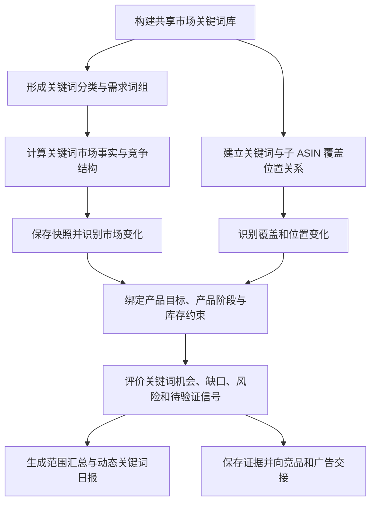

# Bamboocool 关键词分析模块必备逻辑与能力清单

更新时间：2026-08-13

上位方案：`Bamboocool-关键词分析模块三页架构方案.md`

方案阶段：业务逻辑与计算能力盘点

## 1. 文档定位

本文档承接关键词分析模块三页架构，盘点关键词动态与机会总览、市场关键词库与单词深研、子 ASIN 关键词盘点共同依赖的业务逻辑与计算能力。

本阶段所指的“功能/能力”，是将关键词、市场、产品、位置和库存等原始数据或过程数据，按照确定规则进行归并、计算或评价，生成可以被页面和下游模块直接使用的业务结果。

能力清单围绕以下主线展开：

```text
多来源关键词和位置数据
        ↓
固定品线共享市场词库
        ↓
关键词市场事实与历史变化
        ↓
关键词与子 ASIN 的覆盖、位置关系
        ↓
绑定当前产品目标与库存约束
        ↓
形成机会、缺口、风险和待验证证据
        ↓
生成三页结果并交给竞品与广告继续判断
```

关键词模块不承担广告执行动作。出价、预算、加词、否词、暂停和新建广告等建议由广告分析与决策模块结合广告结构和广告表现后形成。

## 2. 统一对象与输入输出边界

### 2.1 统一业务对象

#### 市场关键词对象

记录关键词自身的标准写法、别名、需求属性、市场事实、数据来源和时间。

#### 关键词与子 ASIN 关系对象

记录一个子 ASIN 在某个关键词上的自然覆盖、广告覆盖、自然位置、广告位置、广告搜索词表现和历史变化。

#### 关键词业务证据对象

在 `关键词 × 子 ASIN × 当前产品目标` 上下文中，组合市场变化、产品匹配、覆盖位置、库存约束和待竞品验证信号，形成机会、缺口、风险或数据不足结论。

### 2.2 主要上游输入

关键词模块使用以下上游数据或结果：

- 第三方关键词工具、ABA 或客户上传文件提供的关键词市场数据；
- 运营人工补充和确认的关键词、分类和监控范围；
- 自有子 ASIN 在关键词下的自然位置和广告位置数据；
- 亚马逊广告搜索词、投放、展示量份额等报表；
- 产品主数据、父子 ASIN 关系和产品属性；
- 产品阶段、产品定位、主推/辅助关系和当前产品目标；
- 产品库存模块形成的库存承接能力；
- 已确认竞品及竞品页面返回的验证结果。

广告搜索词和投放报表只用于补充付费流量和转化证据，不能替代真实广告位置数据。

### 2.3 标准输出

关键词模块最终形成：

- 固定品线共享市场关键词库；
- 关键词分类、词组和运营角色结果；
- 可比较的关键词市场事实与变化事件；
- 可比较的子 ASIN 覆盖与位置结果；
- 子 ASIN 关键词缺口、机会、风险和限制；
- 动态关键词日报及优先分析事项；
- 可以被竞品页和广告页调用的结构化证据记录。

## 3. 整体能力链



十项能力共同构成一条连续业务链。市场关键词对象和产品关系对象分别形成事实，只有绑定产品目标与库存约束后，系统才形成产品级关键词判断。

## 4. 能力一：共享市场关键词库构建

### 4.1 能力目标

将第三方工具、ABA、客户文件和运营补充的关键词整理为固定品线共用的标准市场关键词库。

### 4.2 核心处理逻辑

- 将关键词记录匹配到对应站点和固定品线；
- 统一大小写、空格、标点、单复数、常见拼写变体和词形差异；
- 为同一市场含义的写法建立标准关键词与别名关系，同时保留原始写法；
- 合并不同来源中的重复关键词，但保留各来源自己的数据和测量定义；
- 识别明显跨类目、无业务含义或来源异常的噪声词；
- 区分有效词、待确认词、噪声词和暂时没有完整数据的监控词；
- 支持运营临时增加希望持续观察的关键词；
- 保存关键词首次出现、最近更新、来源和词库状态。

当前客户关键词文件中已经存在跨类目词、弱相关词和自动分类误差，因此词库构建不能直接把原始文件中的全部记录视为有效市场词。

### 4.3 标准输出

输出固定品线的标准市场关键词对象，明确标准关键词、原始别名、所属站点和品线、词库状态、来源及更新时间。

## 5. 能力二：关键词分类与需求词组构建

### 5.1 能力目标

将分散的关键词组织为能够解释市场需求结构的属性分类、需求词组和运营角色。

### 5.2 核心处理逻辑

- 识别品牌、通用类目、款式、材质、功能、场景、人群、尺码、颜色、数量、节日和季节等需求属性；
- 允许一个关键词拥有多个需求属性标签；
- 将表达相近需求的关键词归入同一词组，并保留各关键词自身数据；
- 识别品牌词、竞品品牌词、场景词、长尾词等具有明确业务用途的词；
- 将“关键词表达什么需求”与“运营准备如何管理这个词”分为两套分类；
- 对核心词、探索词、待验证词等运营角色保留人工确认状态；
- 接收运营对错误分类、无关词和词组关系的修正；
- 在词组汇总时处理一词多标签带来的重复计算。

### 5.3 标准输出

输出每个关键词的需求属性、所属需求词组、运营角色和确认状态，并形成可以用于市场结构分析的词组结果。

## 6. 能力三：关键词市场事实与竞争结构计算

### 6.1 能力目标

将不同来源提供的需求、购买、供给和竞争数据整理为一个可以解释的关键词市场事实结果。

### 6.2 核心处理逻辑

- 统一同一关键词在不同来源中的统计站点、时间范围和测量定义；
- 分别保留搜索需求、ABA 排名、购买表现、展示点击、市场供给和竞价等不同性质的市场指标；
- 计算或整理关键词的需求规模、购买表现和需求供给关系；
- 根据商品供给、广告竞争、竞价和头部 ASIN 集中情况解释竞争结构；
- 识别点击、购买或转化是否集中在少量头部 ASIN；
- 识别主要头部 ASIN 及其在关键词下的市场位置；
- 区分亚马逊官方数据、第三方估算数据和系统推导结果；
- 当不同来源结果冲突时保留差异，不强行合并成单一数值；
- 为无法比较或定义不清的数据形成明确状态。

市场搜索量大不自动等同于产品机会。该能力只形成关键词自身的市场事实，不绑定具体产品作出投入判断。

### 6.3 标准输出

输出每个关键词在指定时间范围内的需求、购买、供给、竞争、头部 ASIN 结构、数据来源和可用状态，形成标准市场事实快照。

## 7. 能力四：关键词市场快照与变化识别

### 7.1 能力目标

保存可比较的关键词市场事实，并识别关键词和需求词组随时间发生的有效变化。

### 7.2 核心处理逻辑

- 按规定频率保存关键词市场事实快照；
- 为每次快照保存站点、来源、测量定义和统计周期；
- 只在来源和统计条件可比较时计算变化；
- 识别搜索需求、购买表现、竞争程度和建议竞价的增长或下降；
- 识别头部 ASIN、点击集中和转化集中结构的变化；
- 将单个词变化汇总到对应需求词组，判断变化是否集中在某类需求；
- 区分单期波动、连续变化和历史样本不足；
- 识别场景词、功能词或长尾词是否形成连续需求信号；
- 当数据来源或口径改变时终止直接同比，并形成不可比状态。

客户关于场景化和长尾需求增加的判断属于运营观察。系统需要通过连续数据验证变化，不把该观察预设为已经证实的平台规律。

### 7.3 标准输出

输出关键词和需求词组的增长、下降、竞争变化、头部结构变化、趋势状态及其比较依据。

## 8. 能力五：关键词与子 ASIN 覆盖位置关系构建

### 8.1 能力目标

为每个自有子 ASIN 建立其与共享市场关键词之间的自然覆盖、广告覆盖和位置关系。

### 8.2 核心处理逻辑

- 将产品、父体、子 ASIN、SKU 和广告推广对象对应到统一产品关系；
- 将自然位置和广告位置分别匹配到 `关键词 × 子 ASIN × 日期`；
- 记录位置采集来源、采集时间、采集深度和站点；
- 区分自然覆盖、广告覆盖、自然与广告同时覆盖及未确认覆盖；
- 将广告搜索词和投放报表匹配到对应子 ASIN，补充付费流量和转化表现；
- 不使用展示、点击、ACOS 或展示量份额直接替代真实广告位置；
- 支持同一关键词关联多个自有子 ASIN；
- 对采集失败、超过采集深度、产品未纳入监控和真实未覆盖形成不同状态。

### 8.3 标准输出

输出每个关键词与子 ASIN 在指定日期的自然覆盖、广告覆盖、自然位置、广告位置、付费流量补充证据和数据状态。

## 9. 能力六：关键词覆盖与位置变化识别

### 9.1 能力目标

在连续的关键词与子 ASIN 关系上，识别新增覆盖、丢失覆盖以及自然位置和广告位置的变化。

### 9.2 核心处理逻辑

- 比较相同关键词、相同子 ASIN、相同位置类型在不同日期的结果；
- 识别自然位置和广告位置的上涨、下降及连续变化；
- 识别新增自然覆盖、新增广告覆盖、丢失自然覆盖和丢失广告覆盖；
- 区分真实覆盖变化与数据缺失、采集失败或采集深度变化；
- 按需求词组计算子 ASIN 覆盖结构及其变化；
- 识别运营确认的核心词是否出现位置或覆盖异常；
- 将市场需求变化与产品位置变化对齐，形成后续判断所需的关系事件。

### 9.3 标准输出

输出子 ASIN 的关键词覆盖结构、自然位和广告位变化事件、核心词异常及对应数据状态。

## 10. 能力七：产品目标匹配与库存约束绑定

### 10.1 能力目标

把关键词市场事实和产品覆盖位置放入具体产品目标中，判断该词与当前子 ASIN 的业务匹配程度及承接限制。

### 10.2 核心处理逻辑

- 读取子 ASIN 的产品属性、卖点、产品阶段、产品定位和主推/辅助关系；
- 读取当前产品目标及其生效时间；
- 判断关键词表达的需求与产品属性、卖点和现有流量之间的匹配关系；
- 结合产品目标判断该词当前承担核心流量、细分需求探索、品牌防守或其他业务作用的适配程度；
- 不因为搜索量高就判定为高价值，也不对所有产品统一判定某个词好坏；
- 读取产品库存模块形成的库存承接能力；
- 判断库存是否能够承接正常需求、额外流量或活动需求；
- 当产品目标、产品关系或库存结果缺失时，降低证据完整度并停止完整机会判断；
- 保存本次判断使用的产品目标、库存结果及其版本。

### 10.3 标准输出

输出 `关键词 × 子 ASIN × 当前产品目标` 的产品匹配结果、业务作用、库存承接状态、限制原因和证据完整度。

## 11. 能力八：关键词机会、缺口、风险与待验证证据评价

### 11.1 能力目标

综合市场变化、产品匹配、覆盖位置、产品目标和库存约束，为关键词与子 ASIN 形成可以直接进入页面和下游模块的证据结论。

### 11.2 评价范围

#### 市场需求机会

识别需求持续增长、购买表现可验证且竞争结构允许继续研究的关键词或需求词组。

#### 产品覆盖缺口

识别与产品和目标匹配，但当前没有自然覆盖、广告覆盖或有效位置的关键词。

#### 核心位置风险

识别核心词自然位或广告位持续下降、丢失覆盖或与当前产品目标明显不匹配的情况。

#### 场景与长尾信号

识别场景词、功能词和长尾词中出现的连续需求或初步产品覆盖信号，并标记其证据是否足够。

#### 库存受限机会

识别市场和产品关系均支持，但当前库存或补货能力无法承接的机会。

#### 待竞品验证信号

识别头部 ASIN、市场竞争或自有位置发生明显变化，但仍需结合竞品价格、促销、销量和流量结构验证的信号。

#### 数据不足

识别关键词来源、位置历史、产品目标、库存结果或竞品证据不足，当前不能形成可靠结论的情况。

### 11.3 优先级与证据强度

系统按照以下因素组织机会、缺口和风险：

- 关键词当前需求规模及变化幅度；
- 对当前产品目标的影响程度；
- 自然覆盖和广告覆盖的缺口程度；
- 位置变化的连续性和紧迫性；
- 涉及的是主推子 ASIN、辅助子 ASIN 还是普通产品；
- 库存是否能够承接；
- 数据来源、历史长度和证据完整度；
- 是否已有竞品或广告表现支持。

优先级表示“先分析什么”，不等同于“必须执行什么广告动作”。

### 11.4 标准输出

输出证据类型、影响对象、优先级、证据结论、主要依据、产品目标、库存限制、证据完整度和下一步验证方向。

## 12. 能力九：范围汇总与动态关键词日报生成

### 12.1 能力目标

将关键词市场结果和子 ASIN 关键词结果重新组织为运营每天可以快速阅读的品线总览。

### 12.2 市场范围汇总逻辑

- 按需求词组汇总关键词规模、需求和变化；
- 识别增长和下降主要集中在哪些词或词组；
- 识别头部 ASIN 和竞争结构的重要变化；
- 对搜索量、排名、比例和集中度使用各自正确的汇总方式；
- 避免一词多标签造成重复计入；
- 区分完整数据范围与本期可比较范围。

### 12.3 产品范围汇总逻辑

- 汇总自有核心词的自然覆盖、广告覆盖和位置变化；
- 汇总新增覆盖、丢失覆盖、上涨和下降涉及的子 ASIN；
- 识别变化是否集中在主推产品、辅助产品或某个父体；
- 汇总产品关键词机会、缺口、风险和库存受限结果；
- 保留总览事项与原关键词、子 ASIN 和盘点记录之间的关系。

### 12.4 动态日报生成逻辑

日报固定回答：

1. 品线或品牌的关键词流量获取结果及变化；
2. 主要增长和下降的关键词或词组；
3. 自有核心词覆盖和位置变化；
4. 新出现的异常和机会；
5. 当前最值得继续分析的少量关键词。

如果“流量获取”缺少正式测量来源，日报只能使用已经定义的可观察结果，并明确其为代理指标，不能把搜索量、广告展示或展示量份额混合成未经定义的流量份额。

### 12.5 标准输出

输出指定站点、品线和比较周期下的动态关键词日报、主要市场变化、核心词位置变化以及优先分析事项。

## 13. 能力十：证据记录、结果追溯与下游交接

### 13.1 能力目标

保存每次关键词判断的事实、上下文和计算依据，并以结构化方式交给竞品分析和广告决策继续使用。

### 13.2 核心处理逻辑

- 保存关键词市场事实及其来源、时间和测量定义；
- 保存关键词与子 ASIN 的覆盖位置快照；
- 保存市场变化、覆盖变化和位置变化事件；
- 保存本次使用的产品目标、产品阶段和库存承接结果；
- 保存机会、缺口、风险、待验证信号和数据不足结论；
- 保存证据优先级、完整度和使用的规则版本；
- 建立总览结果、单词深研和子 ASIN 盘点之间的引用关系；
- 比较当前证据与历史证据，识别新增、持续、加重、减轻和解除；
- 向竞品页交付关键词、候选 ASIN、时间范围和待验证竞争信号；
- 接收竞品页返回的验证结果并补充证据状态；
- 向广告页交付关键词、子 ASIN、产品目标、覆盖位置、市场变化、库存约束和竞品验证结果；
- 保证自然语言总结能够返回原始事实和中间结果核验。

### 13.3 标准输出

输出可保存、可比较、可解释的关键词业务证据记录，以及供竞品页和广告页调用的结构化交接结果。

## 14. 十项能力与三个页面的关系

### 14.1 关键词动态与机会总览

该页面主要读取：

- 关键词分类和需求词组结果；
- 关键词市场变化结果；
- 自有子 ASIN 覆盖和位置变化结果；
- 关键词机会、缺口、风险和待验证证据；
- 范围汇总和动态关键词日报；
- 数据状态及证据追溯关系。

### 14.2 市场关键词库与单词深研

该页面主要读取：

- 共享市场关键词库；
- 关键词分类、需求词组和运营角色；
- 关键词市场事实、竞争结构和历史变化；
- 绑定子 ASIN 后的产品目标匹配与库存限制；
- 头部 ASIN 及待竞品验证信号；
- 单个关键词的完整证据记录。

### 14.3 子 ASIN 关键词盘点

该页面主要读取：

- 关键词与子 ASIN 覆盖位置关系；
- 关键词覆盖和位置变化；
- 产品目标匹配和库存承接结果；
- 产品级关键词机会、缺口和风险；
- 历史盘点及证据记录。

### 14.4 竞品分析页面

竞品分析页面读取关键词模块形成的候选 ASIN 和竞争变化信号，继续验证竞品价格、促销、销量、排名、流量和关键词入口的共同变化。

### 14.5 广告分析与决策页面

广告页面读取已经绑定产品目标和库存约束的关键词证据，再结合广告架构、广告目的、搜索词表现和广告组历史形成最终广告建议。

关键词模块提供的是：

```text
为什么这个词值得关注
+ 当前产品在这个词上的覆盖和位置
+ 产品目标与库存限制
+ 竞品是否已经验证
```

关键词模块不直接提供的是：

```text
应该加多少预算
+ 应该出价多少
+ 是否立即否定、暂停或新增投放
```

## 15. 当前数据基础与能力缺口

### 15.1 已有数据能够直接支持的部分

客户现有关键词文件已经包含约两千条关键词的市场快照，并能够支持：

- 市场关键词及翻译；
- 需求属性和词组初步分类；
- 搜索需求、购买表现和 ABA 排名；
- 市场供给、广告竞争和竞价；
- 头部 ASIN 及点击、转化集中情况；
- 固定品线市场词库的第一版构建。

客户现有广告报表能够支持：

- 投放关键词和客户搜索词识别；
- 展示、点击、花费、订单、销售和转化表现；
- 搜索词展示量份额等广告侧补充证据；
- 关键词与广告活动、广告组的关系识别。

### 15.2 当前必须补充的部分

目前资料中尚未形成稳定的以下数据链：

- 自有子 ASIN 每日自然位置历史；
- 自有子 ASIN 每日广告位置历史；
- 真实新增覆盖和丢失覆盖事件；
- 可比较的关键词市场连续快照；
- 产品目标、产品阶段和主推/辅助关系的标准结果；
- 库存承接能力与关键词关系的稳定接口；
- 关键词证据与竞品、广告模块之间的结构化记录。

V4.1.2 Demo 中部分非核心产品的关键词位置由产品角色和成熟度推导，仅用于页面演示，不能作为正式位置数据或计算规则。

### 15.3 数据质量问题

现有关键词文件中已经可见：

- 跨类目或明显无关关键词；
- 自动分类误判和一词多标签重复；
- 不同文件对同一关键词的分类或市场数值存在差异；
- 部分第三方数据缺少明确采集时间或测量定义；
- 部分字段为估算值，不能当作亚马逊官方事实。

因此，共享词库构建、数据状态和可比较性判断属于正式能力链的一部分，不能把原始 Excel 直接当作页面结果。

## 16. 后续数据设计需要回答的问题

本能力清单不在当前阶段定义具体表名和字段，但后续数据中心方案必须回答：

1. 如何保存标准关键词、别名、分类、词组和监控状态；
2. 如何保存每个来源的市场事实快照及测量定义；
3. 如何保存 `关键词 × 子 ASIN × 日期` 的自然位和广告位；
4. 如何区分真实未覆盖、超过采集深度和采集失败；
5. 如何保存产品目标、产品阶段和库存承接结果的生效版本；
6. 如何保存市场变化、覆盖变化和位置变化事件；
7. 如何保存机会、缺口、风险和待验证证据；
8. 如何建立关键词证据与竞品验证、广告决策之间的引用关系；
9. 每类数据由谁提供、如何导入、多久更新、失败后如何提示；
10. 如何保证同一关键词在市场页、产品页、竞品页和广告页使用同一身份与时间口径。

## 17. 能力盘点结论

关键词分析模块需要形成的核心能力中轴为：

```text
共享市场关键词库
    ↓
关键词分类、需求和竞争市场事实
    ↓
市场变化与需求词组变化
    ↓
子 ASIN 覆盖、自然位和广告位关系
    ↓
产品目标匹配与库存约束
    ↓
机会、缺口、风险和待验证证据
    ↓
动态总览、单词深研、子 ASIN 盘点及下游交接
```

十项能力分别形成市场事实、产品关系和业务证据。只有当关键词绑定到具体子 ASIN、当前产品目标和库存承接结果后，系统才输出产品级判断；否则只输出关键词市场事实和数据状态。
