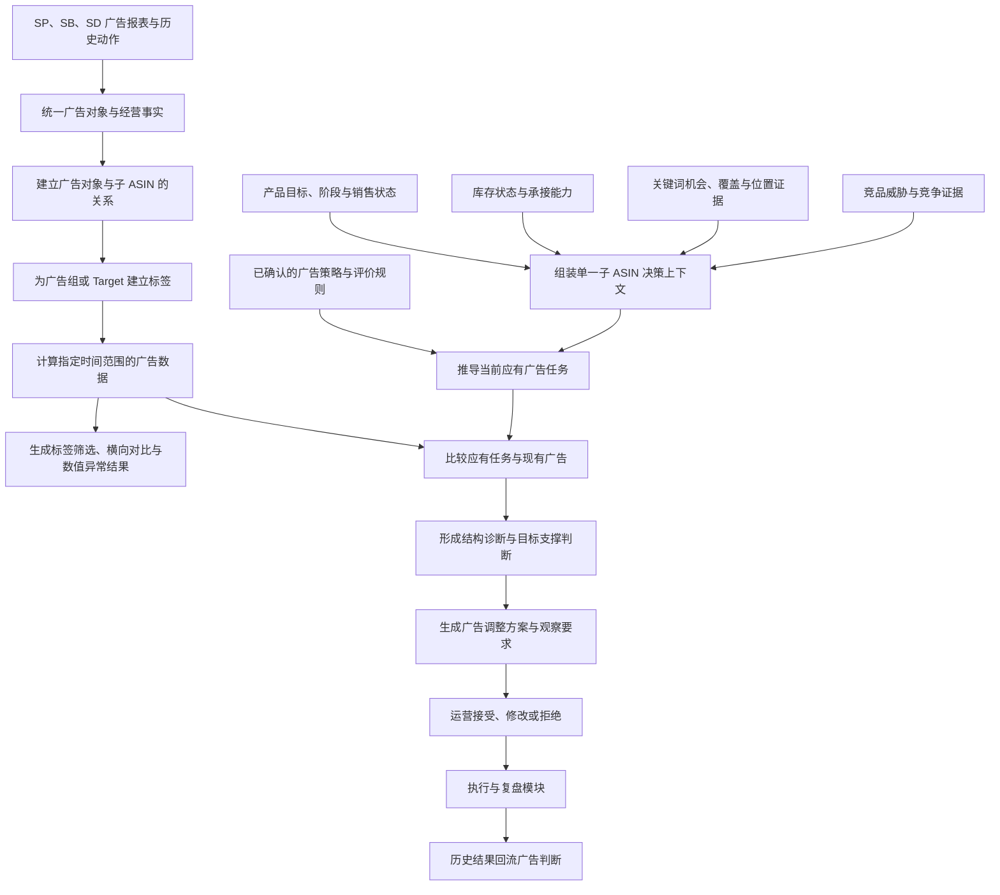

# Bamboocool 广告分析模块两页架构方案

更新时间：2026-08-13

适用范围：广告分类与数据查看、单一子 ASIN 广告决策

方案阶段：页面架构与功能板块确认

## 1. 文档定位

本文档定义广告分析模块的两页架构、页面职责、功能板块、页面流转和上下游关系。

当前方案以功能板块为设计颗粒度：明确运营进入每一页要看懂什么、页面需要组织哪些业务关系、页面最终形成什么结果。具体表格、字段、指标口径、阈值、图表和交互组件在后续数据设计与页面详细设计中展开。

本方案承接现有《Bamboocool 广告分析与决策页架构与决策记录》，并将原有“广告分类与数据查看”和“子 ASIN 广告分析”完善为可支撑完整广告判断的两页结构。

## 2. 模块目标

广告分析模块需要解决四件事：

1. 把分散在 SP、SB、SD 及不同广告报表中的广告对象、推广商品、投放对象和经营结果整理到同一套关系中；
2. 允许运营为广告组或 Target 建立产品、投放对象、广告目的、广告属性和自定义标签，并在任意标签组合下查看区间数据、横向对比和数值异常；
3. 把产品目标、库存约束、关键词机会和竞品压力带入单一子 ASIN，判断现有广告是否支撑当前经营目标；
4. 形成可以由运营接受、修改或拒绝的广告调整方案，再交给执行与复盘模块记录实际动作和 D+3 / D+7 结果。

两个页面使用不同的分析对象：

- 第一页的数据分析对象是“广告对象 × 标签版本 × 时间范围”，默认广告对象为广告组，需要深挖时下钻到 Target；
- 第二页的策略判断对象是“子 ASIN × 当前产品目标 × 决策时间”。

子 ASIN 可以作为第一页的产品标签和筛选条件，但第一页不据此判断产品广告策略。

广告目的需要带生效时间。一个广告组当前承担的目的不能直接用于解释它全部历史表现。

## 3. 两页总体架构

### 3.1 页面分工

#### 广告分类与数据查看

从广告组或 Target 出发，通过标签组织和查看广告数据，让运营能够：

- 给确定的广告对象建立产品、投放对象、广告目的、广告类型和运营自定义标签；
- 按任意标签组合筛选广告对象；
- 查看筛选结果在指定时间内的广告数据；
- 对同一批可比对象进行横向比较；
- 按已配置数值条件、相对自身历史或同组偏离识别异常对象。

该页只回答“这些广告对象的数据表现如何”，不判断广告是否支撑产品目标，也不生成广告调整策略。

#### 单一子 ASIN 广告决策

围绕一个子 ASIN，把产品目标、库存承接、关键词和竞品证据、应有广告任务、现有广告结构与表现放在一起，回答：

- 当前广告应该帮助这个产品完成什么；
- 现有广告实际上在做什么；
- 现有结构和表现是否支撑目标；
- 哪些地方需要保持、观察、调整、暂停、补建或测试；
- 每项建议依据什么、仍有什么不确定性、后续观察什么。

现有广告结构是本页形成判断的核心证据，因此不再拆成独立页面。

### 3.2 系统生成逻辑

系统内部先完成广告事实还原，再形成业务判断。这个生成顺序不要求运营在多个页面之间来回切换。

### 3.3 运营查看路径

运营的典型路径是：

1. 进入广告分类与数据查看，选择广告组或 Target 粒度；
2. 组合产品、投放对象、广告目的、广告属性或自定义标签；
3. 查看筛选对象在指定时间内的数据、横向比较和数值异常；
4. 如果只需查数，到此完成；
5. 如果需要判断“为什么、是否符合产品目标、应该怎么做”，选择关联子 ASIN 进入第二页；
6. 在第二页核对目标、证据、结构、诊断和建议；
7. 接受、修改或拒绝建议，已接受或修改后的建议进入执行与复盘模块。

### 3.4 两页划分原则

两页按照运营任务划分，而不是按照系统计算步骤划分：

- 为广告对象打标签、按标签查数、横向比较和识别数值异常，是一项对象数据分析任务，放在广告分类与数据查看；
- 围绕一个子 ASIN 理解现状并形成方案，是一项完整决策任务，放在单一子 ASIN 广告决策；
- 子 ASIN 在第一页是标签，在第二页才是策略判断对象；
- 广告结构拆解与广告决策使用同一个子 ASIN、同一批证据和同一次判断上下文，因此在第二页连续呈现；
- 系统仍然先还原结构、再推导策略、最后形成建议，但不把这三个步骤机械拆成三个页面。

## 4. 页面一：广告分类与数据查看

### 4.1 页面目标

广告分类与数据查看负责让运营完成一套稳定的广告查数流程：

- 确定本次查看广告组还是 Target；
- 为广告对象补充或确认标签；
- 用标签组合选出一批对象；
- 查看这批对象在指定时间范围内的广告效果；
- 横向比较同粒度、同口径的对象；
- 找出满足数值异常条件或明显偏离的对象。

该页不读取产品目标、库存承接、关键词机会或竞品压力，不判断结构是否支撑产品策略，也不生成预算、竞价、否词、启停或新建广告建议。

### 4.2 页面结构

页面由八个板块组成：

1. 当前范围、对象粒度与数据状态；
2. 广告对象标签体系；
3. 标签组合与对象筛选；
4. 筛选结果数据概览；
5. 数值异常对象；
6. 横向对比；
7. 广告对象数据清单；
8. 广告对象详情与标签历史。

### 4.3 当前范围、对象粒度与数据状态

该板块先确定本次分析的统一粒度：

- 默认以广告组为分析对象；
- 需要深挖时切换到 Target，包括关键词、商品、类目、自动匹配对象或受众；
- Campaign 用于限定范围和查看归属，不与广告组或 Target 混在同一横向比较中；
- 同一次筛选、汇总和比较只使用一种对象粒度。

页面同时说明当前站点、品线、广告类型和时间范围，并明确：

- SP、SB、SD 中哪些数据已经接入；
- 推广商品、投放、搜索词、广告位、预算等关系是否完整；
- 当前广告结果使用什么归因周期和数据截止时间；
- 哪些数据过期、缺失、映射失败或等待人工确认；
- 当前范围内有多少广告对象具备可比较数据。

### 4.4 广告对象标签体系

标签用于描述和选择广告对象，不直接代表策略判断。标签包括：

- 产品关系标签：关联子 ASIN、父体、款式或产品组；
- 投放对象标签：核心词、长尾词、场景词、竞品 ASIN、类目、受众等；
- 广告目的标签：运营已确认的广告任务，以及 AI 建议、待确认或无法识别状态；
- 广告属性标签：SP、SB、SD，手动或自动，匹配方式、广告位等报表已有属性；
- 运营自定义标签：主力组、测试组、历史遗留、观察组等内部分类。

广告后台已有属性自动进入标签，不要求运营重复维护。AI 可以建议产品关系、投放对象角色或广告目的标签，但必须展示依据和确认状态。

广告组标签可以由其下 Target 继承；Target 需要更细分类时可以增加自身标签。系统需要保留标签来自广告组继承、系统属性、AI 建议还是运营确认，不能把不同来源覆盖成一个结果。

目的标签只说明这个对象被归入什么业务类别。第一页不判断这个目的是否正确、是否支撑产品目标或是否应该调整。

即使广告目的暂时无法识别，运营仍然可以使用产品、广告类型、投放对象和自定义标签查数。

### 4.5 标签组合与对象筛选

运营先选择广告组或 Target 粒度，再组合一个或多个标签和时间范围，形成当前对象集合。例如：

- 某个子 ASIN 下的全部 SP 广告组；
- 某类产品中承担同一广告目的的广告组；
- 投放某个关键词或某类关键词的全部 Target；
- 某种广告类型下被标记为测试组的对象；
- 同时满足产品、广告目的和投放对象条件的一批广告对象。

筛选结果始终说明对象粒度、标签条件、时间范围和对象数量，使后续汇总、异常和比较都基于同一个明确范围。

### 4.6 筛选结果数据概览

该板块汇总当前对象集合在所选时间范围内的广告效果，包括报表能够支持的流量、花费、订单、广告销售和效率结果。

汇总结果需要保留广告类型、归因周期、共享推广商品和数据缺失等限制。不同归因周期或不能直接相加的结果分开呈现。

该板块回答“筛选出的这批对象总体数据如何”，不回答“这些数据是否符合产品策略”。

### 4.7 数值异常对象

该板块从当前筛选结果中挑出数值异常对象。异常来源限定为：

- 触发运营已经配置的数值阈值；
- 相比同一对象自身历史触发已经配置的变化条件；
- 相比当前同粒度、同口径对象集合触发已经配置的偏离条件；
- 数据缺失、回补异常、对象映射异常或统计口径异常。

每条异常只说明对象、指标、时间、比较基准和偏离程度。例如“花费超过已配置上限”“转化率较上一周期下降”“同标签对象中 ACoS 明显偏高”。

第一页不继续解释异常为什么发生、是否影响产品目标，也不生成提高竞价、降低预算、否词、暂停或新建广告等动作。

没有配置异常规则时，页面只展示数值变化、排序和比较，不把对象标记为异常。

### 4.8 横向对比

运营可以选中当前筛选结果中的多个广告对象，查看它们在同一时间范围和同一指标口径下的差异。

横向比较必须满足：

- 比较对象处于同一分析粒度；
- 使用相同时间范围和归因口径；
- 指标在相应广告类型和报表中可比；
- 共享或无法归因的结果明确标记；
- 不可比对象不进入排名或均值偏离判断。

运营通过标签自行定义比较范围。系统负责保证粒度和指标口径一致，不替运营把比较结果上升为产品策略结论。

### 4.9 广告对象数据清单

清单中的每一项对应当前选择粒度下的一个广告对象，连续呈现：

- 广告对象及其 Campaign、广告组归属；
- 当前标签及确认状态；
- 所选时间范围内的广告数据；
- 与上一比较周期的数值变化；
- 当前触发的数值异常；
- 共享、混合、缺失或不可比状态。

运营可以在清单中补充或确认标签、选择对象横向比较，或进入对象详情。

### 4.10 广告对象详情与标签历史

运营打开一个广告组或投放对象后，可以查看：

- 它在 Campaign、广告组和投放层级中的位置；
- 关联子 ASIN 与共享范围；
- 当前和历史业务目的；
- 所选时间范围内的完整广告数据和历史趋势；
- 投放对象、搜索词、广告位、预算和推广商品之间的关系；
- 数据来源、时间范围、归因口径和不可归因部分；
- 当前标签的来源、确认状态、生效时间和历史变化。

详情用于核验标签和数据，不展示产品目标、策略诊断或调整建议。

### 4.11 页面输出

广告分类与数据查看最终输出：

1. 当前对象粒度、标签条件、时间范围和数据可用状态；
2. 广告组或 Target 的标签及其确认状态；
3. 筛选对象集合在指定时间内的广告数据；
4. 同粒度、同口径对象之间的横向比较；
5. 按已配置条件、自身历史或同组偏离识别出的数值异常；
6. 可被第二页引用的广告对象、标签、数据事实和异常证据。

## 5. 页面二：单一子 ASIN 广告决策

### 5.1 页面目标

单一子 ASIN 广告决策负责把一个产品的经营目标、上游证据、应有广告任务、现有广告结构和经营表现放在同一个判断上下文中，让运营能够回答：

- 当前产品为什么需要投广告；
- 广告需要完成哪些任务，又受哪些条件限制；
- 当前广告是否已经覆盖这些任务；
- 当前表现是否支撑各自目的；
- 哪些问题需要先补数据或确认目的；
- 哪些地方需要保持、观察、调整、暂停、补建或测试。

### 5.2 页面结构

页面由九个板块组成：

1. 子 ASIN 决策上下文；
2. 产品目标与经营约束；
3. 关键词与竞品证据；
4. 应有广告任务；
5. 现有广告结构与目的；
6. 目标—结构—表现对照；
7. 广告诊断与优先级；
8. 广告调整方案；
9. 运营决定与执行交接。

### 5.3 子 ASIN 决策上下文

页面首先明确当前正在判断哪个子 ASIN，并说明：

- 产品归属、阶段、定位和当前经营目标；
- 本次广告判断使用的数据截止时间和观察周期；
- 当前目标、广告目的和策略规则是否已经确认；
- 广告数据、库存数据、关键词证据和竞品证据是否完整；
- 当前结论是正式判断、条件性判断还是暂时无法判断。

当产品目标、库存状态或上游证据已经变化时，页面需要提示原广告判断可能过期，并重新生成当前版本。

### 5.4 产品目标与经营约束

该板块承接产品库存模块的标准结果，说明：

- 产品当前主要追求规模增长、位置建立、稳定经营、利润改善还是库存处理；
- 当前销量趋势和产品阶段是否支持继续扩量；
- 库存及补货是否能够承接更高流量；
- 是否临近 BD、促销、缺货、入库或高库龄等关键事件；
- 当前可接受的成本、流量和库存边界是否已经配置；
- 哪些限制是硬性条件，哪些只是需要持续观察的条件。

产品目标和约束决定后续广告任务的方向。没有确认的目标和规则不能由广告页面自行补造。

### 5.5 关键词与竞品证据

该板块承接关键词和竞品模块已经形成的证据级结论，不重新复制两页的全部数据。

关键词证据需要说明：

- 哪些关键词存在需求机会；
- 产品与关键词是否匹配；
- 当前自然位置、广告位置和覆盖是否存在缺口；
- 哪些关键词已经取得位置或正在丢失位置；
- 哪些机会受到库存或产品目标限制。

竞品证据需要说明：

- 当前主要竞争压力来自哪些竞品；
- 压力发生在价格、促销、排名、销量、流量还是关键词入口；
- 该信号发生在什么时间、使用什么来源；
- 哪些关系只是同期变化或待验证假设，不能直接写成确定因果。

每条证据可以返回原关键词或竞品页面核验。

### 5.6 应有广告任务

系统根据产品目标、库存约束、关键词和竞品证据，以及客户已确认的广告策略规则，推导当前广告需要承担的任务。

每项任务需要说明：

- 任务服务哪个产品目标；
- 需要争取或保护什么流量；
- 主要作用于哪些关键词、商品、类目、受众或位置；
- 当前优先级和适用时间；
- 需要满足什么成本、库存或风险条件；
- 后续用什么结果判断任务是否得到支持。

正式任务类型由客户确认。当前访谈中出现的大词抢位或冲量、稳定流量、长尾或场景探索、品牌防守、竞品流量、再营销等可以作为任务体系的业务输入，不直接固化为最终标签。

当策略规则尚未确认时，本板块只输出“需要解决的广告任务”和待确认条件，不自动生成精确广告结构、预算或竞价。

### 5.7 现有广告结构与目的

该板块在同一页还原当前子 ASIN 的实际广告结构，包括：

- SP、SB、SD 及其 Campaign、广告组和投放对象；
- 推广商品、关键词、商品、类目、受众、搜索词和广告位之间的关系；
- 每个广告组当前承担的业务目的及确认状态；
- 共享多个子 ASIN 或混合多个目的的真实范围；
- 每个广告目的当前取得的主要经营结果；
- 当前结构中已经确认的缺失、重复、重叠和不可解释区域。

运营可以从诊断或建议定位到具体结构节点，也可以在本页发起目的确认。批量打标签、筛选、查数和横向比较仍回到广告分类与数据查看。

### 5.8 目标—结构—表现对照

该板块是广告决策页的核心。它把“应该完成的任务”和“当前实际广告”逐项对应起来，说明：

- 每项应有任务当前由哪些广告对象承担；
- 当前结构是否缺少承担者、存在多个重复承担者或混合多个目的；
- 当前投放对象和流量来源是否与任务匹配；
- 当前广告结果是否支撑已经确认的目的；
- 当前结构是否受到共享归因、数据缺失或样本不足限制；
- 哪些差距来自结构，哪些来自表现，哪些只是证据尚未补齐。

对照使用与广告目的匹配的指标和比较条件，不用统一 ACoS 判断全部广告。可用判断依据按优先顺序包括：

1. 客户已经确认的目标和阈值；
2. 同一广告对象的自身历史；
3. 相同目的和可比条件下的其他广告对象；
4. 当前产品目标、关键词位置和库存约束形成的条件判断。

以上依据都不具备时，页面只展示现状和证据缺口。

### 5.9 广告诊断与优先级

系统基于目标—结构—表现对照形成诊断。诊断范围包括：

- 产品目标与广告目的不一致；
- 必要广告任务缺失；
- 多个广告组重复承担相同任务；
- 一个广告组混合多个难以同时评价的目的；
- 广告对象与子 ASIN 的关系不清或无法合理归因；
- 当前表现不支撑已经确认的广告目的；
- 关键词机会存在，但广告覆盖或位置不足；
- 竞品压力存在，但当前广告没有形成对应任务；
- 库存无法承接现有或计划中的广告强度；
- 数据、目的、规则或样本不足，暂时无法判断。

每条诊断必须包含：

1. 发生了什么；
2. 影响哪个产品目标或广告任务；
3. 依据哪些广告事实和上游证据；
4. 当前判断有多可靠；
5. 仍缺少什么；
6. 为什么被排在当前优先级。

诊断不把同期变化直接写成因果关系。

### 5.10 广告调整方案

系统把高优先诊断转成运营可以确认的广告调整方案。方案可以包括：

- 保持当前结构和设置；
- 继续观察，等待更完整的数据或样本；
- 调整预算、竞价、广告位、投放对象、匹配方式或否词方向；
- 拆分、合并、暂停、恢复或重新整理现有广告结构；
- 为缺失的广告任务补建新广告或低成本测试；
- 因库存、产品目标或其他前置条件不满足，暂缓扩量或先处理前置问题；
- 先补充目的、映射、阈值或数据，再生成正式建议。

每项方案需要说明：

- 服务的产品目标和广告目的；
- 建议作用的广告对象；
- 建议方向和必要时的建议值；
- 支撑证据与诊断来源；
- 执行前置条件和主要风险；
- 建议观察的结果及 D+3 / D+7 观察要求；
- 当前仍存在的不确定项。

只有客户已确认计算规则、适用条件和调整边界时，系统才输出精确预算、竞价或广告位幅度。规则不足时只输出方向、对象和需要补齐的判断条件。

完整新广告方案属于本页的结构补足能力。当前可以先指出缺少什么任务以及建议测试什么；正式生成 Campaign、广告组、投放对象、预算和竞价方案，需要策略模板和历史验证结果进一步确认。

### 5.11 运营决定与执行交接

运营可以对每项方案：

- 接受 AI 原建议；
- 修改建议后接受；
- 拒绝并记录原因；
- 暂缓，等待数据、规则或外部条件补齐。

进入执行与复盘模块时，需要交接：

- 子 ASIN 和真实广告对象范围；
- 当前广告目的和产品目标；
- 原诊断问题及其证据；
- AI 原建议、运营修改后的计划和未确认项；
- 建议观察方向和必要的时间窗口；
- 本次建议使用的规则、数据和结论版本。

广告决策页不记录实际执行结果，也不计算 D+3 / D+7 效果。实际执行、动作拆解、执行前后值和复盘结论由执行与复盘模块负责。

### 5.12 页面输出

单一子 ASIN 广告决策最终输出：

1. 当前子 ASIN 的产品目标、经营约束和数据状态；
2. 与当前目标相关的关键词和竞品证据；
3. 当前广告应该承担的任务及其判断条件；
4. 可核验的现有广告结构、业务目的和经营表现；
5. 应有任务与现有结构之间的缺失、重复、混合和表现差距；
6. 带证据、可信程度和优先级的广告诊断；
7. 可由运营接受、修改、拒绝或暂缓的广告调整方案；
8. 可直接交给执行与复盘模块的标准建议结果。

## 6. 两页之间的统一规则

### 6.1 统一判断对象

第一页和第二页使用不同的最小对象：

- 第一页的最小数据分析对象是一个广告组或 Target 在某一标签版本和时间范围内的广告数据；
- 第二页的最小策略判断对象是一个子 ASIN 在当前产品目标和决策时间下的广告判断。

子 ASIN 在第一页只用于描述广告对象与产品的关系和筛选数据，不产生产品策略结论。

第二页的广告经营判断最终落到子 ASIN。广告结构可以发生在 Campaign、广告组、投放对象、搜索词、广告位、预算或推广商品层级，但必须说明其服务的子 ASIN 范围。

共享广告对象保留多子 ASIN 关系，不为了页面简化强制归到单一子 ASIN。

### 6.2 统一广告目的

两页使用同一套广告目的、确认状态和历史版本。广告目的发生变化时，需要记录生效时间，并重新确定变化前后的比较范围。

平台已有属性、产品映射、业务目的和运营自定义标签分别管理，不能混为同一类标签。

### 6.3 统一经营结果

两页使用同一套广告经营结果和归因口径。SP、SB、SD 的归因周期、可用指标和业务目的不同，不能直接混加或按统一标准评价。

第一页只做数值汇总、差异比较和数值异常识别；第二页才能结合产品目标和上游证据解释这些数据意味着什么。

### 6.4 统一证据与时间

广告事实、产品目标、库存结果、关键词证据和竞品证据都需要保留来源、时间范围、更新时间和数据状态。

当不同证据的时间不一致、数据过期或口径冲突时，页面明确提示，并降低判断的确定程度。

### 6.5 统一建议边界

第一页不生成任何广告策略建议。数值异常只说明对象、指标、时间、比较基准和偏离程度。

第二页的建议必须由产品目标、应有广告任务、现有结构、经营表现和证据共同形成。没有正式规则时，不输出伪精确的预算、竞价、广告位或结果预测。

第一阶段 AI 只提供判断和建议，运营人工确认并在 Amazon 后台执行。

### 6.6 统一状态与版本

广告目的待确认、关系待确认、诊断已生成、建议待确认、运营已接受、运营已修改、运营已拒绝、等待执行和已交接是不同业务状态。

产品目标、广告目的、规则、数据或上游证据变化后，需要生成新的判断版本，不能覆盖旧结论。

### 6.7 统一页面上下文

从广告分类与数据查看进入单一子 ASIN 广告决策时，保留当前广告对象、标签和时间范围，并由运营选择需要判断的关联子 ASIN。返回第一页时保留原筛选、排序和定位位置。

从诊断、建议或复盘返回时，直接定位到对应的子 ASIN、广告任务和广告结构节点。

### 6.8 统一对外输出

广告分类与数据查看可以向运营总览输出数值异常数量和数据状态，但不输出子 ASIN 策略优先级或调整建议。

单一子 ASIN 广告决策向执行与复盘模块输出标准广告建议。执行与复盘模块向广告决策回流历史动作、复盘结论和下一步问题，不直接覆盖原策略规则。

## 7. 与其他模块的关系

### 7.1 产品库存模块

提供子 ASIN 的产品阶段、经营目标、销量趋势、库存状态、库存承接能力和关键活动。广告模块使用这些结果确定广告方向和限制条件，不重新计算库存。

### 7.2 关键词模块

提供关键词需求、产品匹配、覆盖、自然位置、广告位置和机会或限制结论。广告模块决定是否以及如何把这些证据转成广告任务。

### 7.3 竞品模块

提供竞品价格、促销、排名、销量、流量和关键词入口的可核验证据。广告模块把竞争信号与产品目标和现有广告一起判断，不把竞品同期变化直接当成执行命令。

### 7.4 策略设置

为第一页提供数值异常条件、比较周期和指标口径；为第二页提供产品目标、广告目的体系、策略模板、目标阈值和调整边界。两类规则分开配置，避免把数值异常直接当成策略结论。

### 7.5 执行与复盘模块

接收广告建议和运营决定，记录实际动作，建立 D+3 / D+7 观察结果，并把复盘结论和历史经验回流广告决策。

### 7.6 运营总览

接收第一页形成的数值异常和数据缺口，以及第二页形成的高优先策略问题和待确认建议。运营总览只负责集中定位，不重新计算广告数据或诊断。

## 8. 后续详细设计顺序

1. 确认第一页支持的广告对象粒度，以及广告组与 Target 的关系；
2. 确认产品、投放对象、广告目的、广告属性和自定义标签体系；
3. 设计广告数据表、对象关系、字段口径、归因周期和更新方式；
4. 确认标签筛选后的汇总口径、横向可比条件和数值异常规则；
5. 确认广告组与子 ASIN 的映射、共享关系和可归因边界；
6. 确认产品库存、关键词和竞品模块向第二页交接的标准结果；
7. 确认广告目的体系、产品目标与广告任务之间的对应关系；
8. 设计两页的详细屏幕结构、默认展开状态和下钻方式；
9. 建立第二页诊断类型、建议类型、优先级和不确定性表达；
10. 对齐广告建议与执行复盘模块的交接结构；
11. 选择代表性广告组和子 ASIN，用真实报表分别跑通“标签查数—横向比较—数值异常”和“单品判断—人工执行—D+3 / D+7 复盘”。
