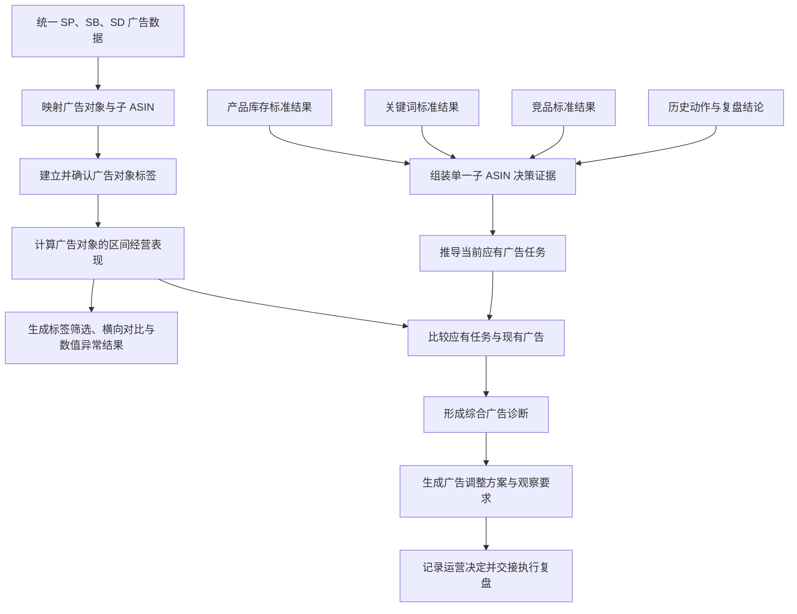

# Bamboocool 广告分析模块必备逻辑与能力清单

更新时间：2026-08-13

上位方案：`Bamboocool-广告分析模块两页架构方案.md`

方案阶段：业务逻辑与计算能力盘点

## 1. 文档定位

本文档承接广告分析模块两页架构，盘点广告分类与数据查看、单一子 ASIN 广告决策共同依赖的业务逻辑与计算能力。

本阶段所指的“能力”，是把广告报表、产品目标、库存结果、关键词证据、竞品证据和历史动作按照确定规则进行归并、识别、比较、评价或推导，生成页面可以直接使用的广告关系、诊断和建议结果。

筛选、搜索、排序、跳转、展开关系树、确认按钮和表格字段不单独算作业务能力。它们是页面使用以下业务结果的方式。

本清单描述广告分析模块的完整目标能力。现有数据和 V4.1.2 Demo 已经支持其中一部分事实整理、目的标签、结构展示和基础诊断；策略规则、阈值、稳定映射及历史反馈仍需按本文继续补齐。

两页生成两类不同的最小业务结果：

- 第一页生成“广告组或 Target × 标签版本 × 时间范围”的广告数据、横向比较和数值异常结果；
- 第二页生成“子 ASIN × 当前产品目标 × 决策时间”的广告策略判断。

子 ASIN 在第一页是产品关系标签，不是策略判断对象。

## 2. 整体能力链



十一项能力共同构成一条连续业务链：

1. 前四项把分散广告数据变成可理解、可比较的当前广告经营事实；
2. 第十项使用这些事实生成第一页的标签筛选、横向对比和数值异常结果；
3. 第五至第九项把产品、库存、关键词和竞品结果转成第二页的应有广告任务、诊断与建议；
4. 第十一项记录运营决定，并与执行复盘形成闭环。

## 3. 能力一：统一广告数据与对象层级

### 3.1 能力目标

将分散在 SP、SB、SD 及不同广告报表中的记录，整理为同一套可关联的广告经营事实。

### 3.2 核心处理逻辑

- 识别 SP、SB、SD 的 Campaign、广告组、推广商品、投放对象、搜索词、广告位、预算和购买商品等对象；
- 还原广告组合、Campaign、广告组、投放对象和推广商品之间的上下级关系；
- 统一广告名称变化、启停状态和对象历史版本，保留前后对应关系；
- 区分关键词投放、商品投放、类目投放、自动投放、受众投放和广告位等不同业务对象；
- 对齐站点、货币、时区、统计日期和数据截止时间；
- 区分 SP 常见的 7 天归因结果与 SB、SD 常见的 14 天归因结果，不直接混成同一口径；
- 保留广告商品销售、其他商品销售、品牌新客、展示份额、预算损失和无效流量等报表能够提供的独立事实；
- 识别重复导入、缺失报表、时间不一致和对象无法关联等数据问题；
- 每项事实保留原始来源、统计范围和数据状态。

### 3.3 标准输出

输出一套统一广告事实集，明确每个广告对象的广告类型、层级位置、关联对象、有效时间、经营结果、归因口径、来源和数据完整程度。

## 4. 能力二：建立广告对象与子 ASIN 的关系及归因边界

### 4.1 能力目标

确定每个广告对象实际服务哪些子 ASIN，以及当前经营结果可以归到什么范围。

### 4.2 核心处理逻辑

- 通过广告 SKU、广告 ASIN、推广商品报表和产品资料建立广告对象与子 ASIN 的直接关系；
- 建立子 ASIN、父 ASIN、款式和广告对象之间的产品归属；
- 识别一个广告组或 Campaign 同时推广多个子 ASIN 的共享关系；
- 识别投放对象相同但推广商品不同、或推广商品相同但目的不同的交叉关系；
- 区分直接可归因结果、只能归到共享广告对象的结果和无法合理拆分的结果；
- 使用购买商品报表识别广告后实际成交商品与推广商品的差异，不把其他 SKU 销售全部视为当前子 ASIN 贡献；
- 关系随广告结构变化时保留生效时间和历史版本；
- 自动映射无法确认时进入人工核对，不强制归到单一子 ASIN。

### 4.3 标准输出

输出每个广告对象的子 ASIN 服务范围、共享或混合状态、关系来源、生效时间、可归因范围和不可归因说明。

## 5. 能力三：建立并管理广告对象标签

### 5.1 能力目标

为广告组或 Target 建立可筛选、可追溯的多维标签，使运营即使暂时无法完成广告策略拆解，也能按确定标签稳定查看广告数据。

### 5.2 核心处理逻辑

- 将 SP、SB、SD、匹配方式、投放类型、广告位等报表已有属性转成系统属性标签；
- 将子 ASIN、父体、款式或产品组关系转成产品关系标签；
- 根据 Target 的实际内容建立关键词、商品、类目、自动匹配对象或受众等投放对象标签；
- 从广告名称、投放对象和运营已有记录中提取广告目的线索，并提出待运营确认的目的标签建议；
- 支持运营建立主力组、测试组、观察组、历史遗留等自定义标签；
- 区分系统已有属性、自动映射、广告组继承、AI 建议和运营确认等标签来源；
- 广告组标签可以由其下 Target 继承，Target 可以增加自身标签，但不能静默覆盖继承来源；
- 支持运营接受、修改、拒绝或标记无法识别；
- 一个广告对象关联多个产品或包含多个目的时，保留共享或混合状态，不为了分类强行选择单一标签；
- 每个标签记录确认状态、生效时间和历史变化；
- 标签发生变化后，历史数据使用当时有效的标签版本组织，不使用当前标签覆盖过去；
- 正式广告目的和运营自定义标签体系由客户确认，系统不自行把示例固化成规则。

### 5.3 标准输出

输出每个广告组或 Target 的多维标签、标签来源、确认状态、共享或混合状态、生效时间和历史版本。

## 6. 能力四：计算广告对象的区间经营表现

### 6.1 能力目标

把广告事实转换为广告组或 Target 在指定时间范围内的经营表现，为第一页标签查数、横向比较和第二页单品判断提供共同事实。

### 6.2 核心处理逻辑

- 分别计算 Campaign、广告组、推广商品、Target、搜索词和广告位层级的可用结果；
- 计算展示、点击、点击率、点击成本、花费、订单、广告销售、转化率、ACoS 和 ROAS 等基础经营结果；
- 在数据具备时计算品牌新客、搜索词展示份额、预算错失、广告商品与其他商品销售、无效流量等专项结果；
- 按广告类型和归因周期保留独立结果，不把不同归因窗口直接相加；
- 按运营选择的时间范围计算区间结果，并明确实际覆盖日期；
- 计算相同广告对象相对自身历史的变化；
- 在对象粒度、标签条件、广告类型、时间和归因口径可比时，形成横向比较结果；
- 标记样本不足、归因不完整、共享广告、数据回补和不可比情况；
- 本能力只形成经营事实和数值差异，不解释是否符合产品目标，也不生成调整建议。

### 6.3 标准输出

输出每个广告对象在指定时间范围内的经营结果、自身历史变化、可比对象差异、数据完整程度和比较限制。

## 7. 能力五：组装单一子 ASIN 广告决策证据

### 7.1 能力目标

将广告判断所需的产品、库存、关键词、竞品和历史复盘结果整理为同一个子 ASIN 决策上下文。

### 7.2 核心处理逻辑

- 读取产品库存模块形成的产品阶段、产品定位、经营目标、销量趋势、库存状态和库存承接能力；
- 读取 BD、促销、预计缺货、预计到货和库龄风险等关键业务事件；
- 读取关键词模块形成的需求机会、产品匹配、覆盖、自然位置、广告位置和位置缺口；
- 读取竞品模块形成的价格、促销、销量、排名、流量和关键词入口威胁证据；
- 读取历史动作、D+3 / D+7 复盘结论和后续建议，作为当前判断的历史证据；
- 将关键词和竞品证据绑定到当前子 ASIN 和当前产品目标；
- 对齐各模块的对象、时间范围、数据截止时间和来源；
- 标记证据过期、时间错位、结论冲突和缺失项；
- 将“观察到的事实”“系统推导的结论”和“运营已确认的目标”分开保存。

### 7.3 标准输出

输出一个带时间、来源和数据状态的子 ASIN 广告决策证据包，包含当前产品目标、经营约束、关键词机会、竞品压力和历史经验。

## 8. 能力六：推导当前应有广告任务

### 8.1 能力目标

根据产品目标和可核验证据，说明广告当前应该帮助子 ASIN 完成哪些经营任务。

### 8.2 核心处理逻辑

- 读取运营已确认的产品目标、产品阶段和广告策略模板；
- 将 GMV、费用或效率、关键词位置、流量获取、品牌保护和库存处理等上层目标拆成广告需要承担的任务；
- 根据关键词需求、匹配程度、覆盖和位置缺口确定需要争取、维持、保护或测试的流量；
- 根据竞品价格、促销、位置和流量信号确定需要继续验证或应对的竞争任务；
- 根据库存承接、补货、Deal 和库龄状态限制扩量时点和强度；
- 区分必须满足的经营约束和可以逐步优化的目标；
- 为每项任务确定适用对象、优先级、适用时间、评价方向和停止条件；
- 正式广告任务类型、目标层级和约束规则由客户确认；
- 规则不足时只输出需要解决的广告任务和待确认条件，不编造具体结构、预算或竞价。

### 8.3 标准输出

输出当前子 ASIN 的应有广告任务清单，明确每项任务服务的产品目标、流量对象、优先级、经营约束、评价方向和未确认条件。

## 9. 能力七：比较应有任务与现有广告结构

### 9.1 能力目标

把当前应有广告任务与现有 SP、SB、SD 结构逐项对应，找出结构覆盖和业务目的上的差距。

### 9.2 核心处理逻辑

- 将每项应有广告任务匹配到当前承担该任务的 Campaign、广告组和投放对象；
- 判断一项任务是否缺少广告对象承担；
- 判断多个广告对象是否重复承担相同任务；
- 判断一个广告对象是否混合多个难以独立评价的目的；
- 判断关键词、商品、类目、受众和广告位是否与任务目标匹配；
- 识别相同投放对象在多个广告组中的重叠关系及潜在竞争风险；
- 识别共享广告对象导致的归属和结果解释限制；
- 区分结构缺失、结构重复、目的不清、对象不匹配和数据不足；
- 结构复杂或共享不直接等同于错误，是否需要调整还要进入综合诊断。

### 9.3 标准输出

输出一份“应有广告任务—现有广告对象”对应结果，明确已覆盖任务、缺失任务、重复承担、混合目的、对象不匹配和归因限制。

## 10. 能力八：评价目标支撑情况并形成综合诊断

### 10.1 能力目标

综合结构差距、目的表现、产品约束和上游证据，判断当前广告是否支撑子 ASIN 的经营目标。

### 10.2 核心处理逻辑

- 先确认产品目标、广告目的和适用规则是否完整；
- 使用客户已确认的目标或阈值评价广告目的是否得到支持；
- 没有正式阈值时，使用同一广告对象自身历史或可比广告对象形成条件性判断；
- 将结构缺失、重复、目的混合和对象不匹配与实际经营结果一起评价；
- 判断关键词机会是否已经被广告覆盖，以及广告位置和自然位置是否与当前目标相符；
- 判断竞品压力是否与当前广告任务存在明显缺口；
- 判断当前投放强度是否与库存承接、产品阶段和关键活动冲突；
- 识别数据不足、目的待确认、样本不足、共享归因和同期事件造成的判断限制；
- 对诊断进行优先排序，并说明影响目标、证据充分程度和处理时效；
- 把事实、分析判断、证据、不确定项和检查方向分开；
- 不因为两个指标同时变化就直接输出确定因果。

### 10.3 标准输出

输出带影响目标、问题类型、优先级、支撑证据、可信程度、不确定项和检查方向的广告诊断结果。

## 11. 能力九：生成广告调整方案与观察要求

### 11.1 能力目标

将综合诊断转换为运营可以理解、确认和交给执行复盘的广告调整方案。

### 11.2 核心处理逻辑

- 每项方案必须绑定子 ASIN、产品目标、广告目的、诊断问题和真实广告对象；
- 根据诊断生成保持、继续观察、调整、暂停、恢复、拆分、合并、补建或测试等方案方向；
- 对存量广告，可以覆盖预算、竞价、广告位、投放对象、匹配方式、否词和启停等调整方向；
- 当应有任务没有现有结构承接时，可以生成结构补足或低成本测试方向；
- 当库存、目标、规则或数据不满足时，优先生成暂缓、补信息或先处理前置问题的方案；
- 说明建议对象、建议方向、主要依据、前置条件、风险和不确定项；
- 根据广告目的说明后续应该观察什么结果；
- 为执行与复盘模块提供 D+3 和必要时 D+7 的建议观察方向，具体观察资格和时间计算由执行与复盘模块完成；
- 只有规则、适用条件和调整边界已确认时，才计算精确预算、竞价或广告位建议值；
- 不承诺无法由数据支持的销量、排名、利润或自然位结果。

### 11.3 标准输出

输出标准广告建议，包括目标、广告目的、建议对象、建议方向或建议值、诊断依据、执行条件、主要风险、不确定项和建议观察方向。

## 12. 能力十：生成标签筛选、横向对比与数值异常结果

### 12.1 能力目标

把广告组或 Target 按标签和时间范围组织成可直接查数、比较和识别数值异常的对象集合。

### 12.2 核心处理逻辑

- 先确定广告组或 Target 粒度，同一批结果不混合不同对象层级；
- 使用产品关系、投放对象、广告目的、广告属性和运营自定义标签定义对象集合；
- 子 ASIN 只作为产品关系标签参与筛选，不触发产品目标判断；
- 按选择的时间范围和归因口径计算对象集合的广告数据；
- 生成每个对象相对自身历史的数值变化；
- 在粒度、时间和指标口径一致时，生成对象之间的横向比较、排序和偏离程度；
- 根据运营已配置的数值阈值识别异常对象；
- 使用运营已配置的变化条件识别相对自身历史的异常；
- 使用运营已配置的偏离条件识别相对当前可比对象集合的异常；
- 没有配置相应异常规则时，只输出数值变化、排序和比较，不标记异常；
- 汇总已确认、待确认、无法识别、共享、混合、数据缺失和映射失败等标签或数据状态；
- 不读取产品目标、库存、关键词或竞品结论，不生成结构诊断、策略优先级和调整建议；
- 页面范围变化时重新计算当前对象集合，不把上一范围的比较结论沿用到新范围。

### 12.3 标准输出

输出当前广告对象集合、标签条件、时间范围、广告数据、历史变化、横向比较、数值异常和数据限制。

## 13. 能力十一：记录运营决定并衔接历史反馈

### 13.1 能力目标

保留广告建议如何被运营处理，并把建议、执行和复盘结果串成可追溯的广告决策历史。

### 13.2 核心处理逻辑

- 保存 AI 原建议、建议依据、建议对象、使用的数据和规则版本；
- 记录运营接受、修改、拒绝或暂缓的决定；
- 运营修改建议时，保留原建议和修改后的计划，不覆盖原值；
- 将已接受或修改后的建议交给执行与复盘模块；
- 交接子 ASIN、广告目的、诊断问题、广告对象、建议方向、观察要求和未确认项；
- 接收执行与复盘模块回流的实际动作、D+3 / D+7 结论、同期变量和下一步问题；
- 把历史复盘作为后续判断证据，不因单次成功或失败自动升级为通用策略；
- 新一轮建议与原诊断、原动作和复盘结果建立来源关系，不覆盖旧记录；
- 产品目标、广告目的、规则或数据变化后生成新决策版本。

### 13.3 标准输出

输出一条完整广告决策记录，包含原判断、AI 建议、运营决定、执行交接状态、历史复盘关系和当前版本。

## 14. 十一项能力与两页及上下游模块的关系

### 14.1 广告分类与数据查看

该页主要使用：

1. 统一广告数据与对象层级；
2. 建立广告对象与子 ASIN 的关系及归因边界；
3. 建立并管理广告对象标签；
4. 计算广告对象的区间经营表现；
5. 生成标签筛选、横向对比与数值异常结果。

该页的核心输出是广告组或 Target 的标签、区间数据、横向比较和数值异常。它不使用第五至第九项策略能力，不输出子 ASIN 策略优先级、原因诊断或调整方案。

### 14.2 单一子 ASIN 广告决策

该页使用第一至第九项和第十一项能力形成完整判断：

1. 读取统一广告事实、产品关系和目的结果；
2. 组装产品、库存、关键词、竞品和历史复盘证据；
3. 推导当前应有广告任务；
4. 比较应有任务与现有广告；
5. 评价目标支撑情况并形成诊断；
6. 生成广告调整方案；
7. 记录运营决定并交接执行复盘。

该页的标准结果是“一个子 ASIN 在当前目标和证据下的广告决策版本”。

### 14.3 产品库存、关键词与竞品模块

广告模块只消费这些模块已经形成的标准业务结果：

- 产品库存模块提供产品目标、销量状态、库存状态和承接能力；
- 关键词模块提供需求、匹配、覆盖、位置和机会或限制证据；
- 竞品模块提供可核验的竞争压力和时间证据。

广告模块不重新建设三套上游分析逻辑，而是负责把它们转成广告任务和最终广告判断。

### 14.4 执行与复盘模块

广告模块输出标准建议和运营决定。执行与复盘模块负责：

- 拆解标准广告动作；
- 记录计划与实际执行差异；
- 建立执行前基线和 D+3 / D+7 窗口；
- 计算动作结果并识别同期变量；
- 形成复盘结论和下一步问题。

广告模块接收这些历史结果作为下一次判断证据，但不在本模块内重复计算动作效果。

## 15. 能力盘点结论

### 15.1 已有基础

现有 V4.1.2 Demo 和客户广告报表已经证明以下方向具备基础：

- SP、SB、SD 广告结构展示；
- 广告组与子 ASIN 的关联；
- 推广商品、投放、搜索词、广告位、预算、受众和购买商品等多类广告数据；
- 广告目的建议、运营确认和共享或混合状态；
- 基于结构、目的、历史变化和证据缺口的基础诊断；
- AI 建议、运营决定和执行复盘的页面衔接。

这些基础不代表完整能力已经落地。现有 Demo 数据属于模拟数据，不能作为客户业务规则或正式阈值。

### 15.2 优先需要确认

广告判断真正可落地前，优先确认：

1. 第一页以广告组和 Target 为分析对象时的正式定义与切换边界；
2. 产品关系、投放对象、广告目的、广告属性和运营自定义标签体系；
3. 标签筛选后的汇总指标、时间范围、归因口径和横向可比条件；
4. 绝对阈值、自身历史变化和同组偏离对应的数值异常规则；
5. 子 ASIN、广告组、推广商品和投放对象的稳定映射方式；
6. 共享广告与混合目的的识别和可归因边界；
7. 正式广告目的体系及每类目的定义；
8. 产品目标如何拆成广告任务；
9. 不同目的需要观察的指标、周期、目标和阈值；
10. 广告费率、ACoS、TACoS 等术语的正式口径和适用层级；
11. 精确预算、竞价、广告位和新广告方案的生成边界；
12. 产品库存、关键词、竞品和复盘模块的标准交接结果。

### 15.3 完整能力闭环

十一项能力全部具备后，广告分析模块才能形成完整闭环：

```text
广告事实整理清楚
        ↓
广告对象关系与标签明确
        ├─→ 按标签查数 → 横向比较 → 数值异常
        │
        └─→ 进入单一子 ASIN 策略判断
        ↓
产品目标和上游证据进入判断
        ↓
形成当前应有广告任务
        ↓
比较现有结构、目的和经营表现
        ↓
输出带证据和边界的广告诊断
        ↓
生成可由运营确认的调整方案
        ↓
人工执行并进入 D+3 / D+7 复盘
        ↓
历史结果回到下一次广告判断
```

广告模块最复杂的能力不是展示广告数据，而是把产品目标、库存约束、关键词机会、竞品压力、现有广告结构和历史结果组织成一条可核验的判断链，并在规则不足时明确停止在事实或条件判断层，不生成伪精确建议。
