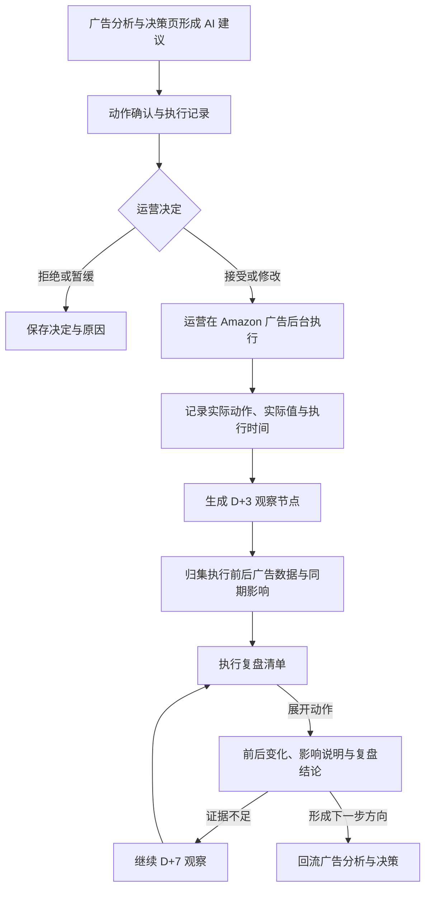

# Bamboocool 执行与复盘模块两页架构方案

更新时间：2026-08-13

适用范围：动作确认与执行记录、执行复盘

方案阶段：页面架构与功能板块确认

## 1. 文档定位

本文档定义执行与复盘模块的两页架构、页面职责、功能板块及页面之间的业务流转。

当前方案以日常广告调整的真实粒度为基础：一次执行通常只是修改预算、竞价、广告位、投放对象或否词等小操作，不为每条动作建立独立复盘页面。复盘总览和单次动作复盘合并为一张可展开的动作复盘清单，运营在同一页面完成定位和查看。

具体字段、表头、指标公式、阈值与页面组件在后续详细设计中展开。

## 2. 模块目标

执行与复盘模块以“可追溯的广告动作记录”为最小业务对象，将以下事实连接起来：

```text
AI 建议
→ 运营决定
→ 实际执行
→ 3 天 / 7 天观察
→ 复盘结论
→ 下一步广告判断
```

模块解决两个运营任务：

1. 记录：运营决定是否执行 AI 建议，并记录自己最终在广告后台做了什么；
2. 复盘：运营集中找到已到观察时间的动作，展开查看执行前后变化并形成简短结论。

第一版只闭环广告动作。价格、Deal、库存、页面内容和竞品变化作为同期影响进入复盘，不作为本模块独立管理的动作。

AI 负责提出建议、整理数据和生成复盘草案；运营负责接受、修改或拒绝建议，在 Amazon 广告后台实际执行，并确认最终结论。第一版不由系统直接修改广告后台。

## 3. 两页总体架构

### 3.1 页面分工

#### 页面一：动作确认与执行记录

承接广告分析与决策页形成的建议。运营查看建议和依据，选择接受、修改、拒绝或暂缓，并在人工执行后记录实际动作和值。

该页回答：

- 系统建议做什么；
- 运营决定怎么处理；
- 运营最终实际做了什么；
- 从什么时候开始观察结果。

#### 页面二：执行复盘

汇总已经执行的广告动作，按观察状态组织为一张复盘清单。运营先在列表中找到到期、异常或需要继续观察的动作，再直接展开该行查看一个适度完整的复盘区。

该页回答：

- 现在哪些动作需要看；
- 动作执行后关键结果怎么变化；
- 是否达到当前广告目的；
- 是否受到其他变化影响；
- 下一步保持、回退、继续观察还是重新判断。

### 3.2 系统生成逻辑



### 3.3 运营查看路径


模块不再设置独立“单次动作复盘页”。复盘展开区属于执行复盘页的一部分，并保留当前筛选和列表位置。

## 4. 页面一：动作确认与执行记录

### 4.1 页面目标

该页负责把广告建议转成可追踪的运营决定和执行事实，让运营清楚记录：

- AI 为什么提出建议；
- 建议对应哪个子 ASIN 和广告对象；
- 运营是否接受；
- 运营是否修改了建议；
- 运营实际执行了什么；
- 什么时候开始观察结果。

该页是一张广告动作记录，不扩展为全站任务中心、团队派单系统或审批系统。

### 4.2 页面结构

页面由以下板块组成：

1. 动作处理概览；
2. 待确认建议；
3. 运营决定与实际执行；
4. 已处理动作记录。

### 4.3 动作处理概览

该板块说明当前查看范围内有多少动作处于：

- 待运营判断；
- 已接受或已修改，等待实际执行；
- 已执行，等待观察；
- 已拒绝或暂缓。

这些数量只用于找到需要处理的动作，不作为经营 KPI。

运营可以按子 ASIN、广告类型、广告对象、动作类型、决定状态和时间范围查看记录。

### 4.4 待确认建议

每条建议以一项可以独立决定的广告调整为单位，展示：

- 子 ASIN 和广告对象；
- 当前广告目的和产品目标；
- 当前发现的问题；
- AI 建议调整什么；
- 希望改善什么结果；
- 主要依据与尚未确认的信息。

如果一条建议包含多个可独立执行的动作，系统拆成多个动作项，同时保留它们属于同一批建议的关系。

运营需要更完整的广告架构、关键词、竞品或库存依据时，返回广告分析与决策页查看，不在动作页重复铺设完整分析内容。

### 4.5 运营决定与实际执行

运营可以形成四种决定：

#### 接受

同意 AI 建议的方向和值。记录进入“待实际执行”，但不能因为接受就视为已经执行。

#### 修改后接受

同意建议方向，但修改动作对象、调整值或范围。页面同时保留 AI 原建议、运营计划和修改原因。

#### 拒绝

不执行建议。页面保存拒绝原因和决定时间，不进入效果复盘。

#### 暂缓

当前缺少广告目的、阈值、库存、Deal 或利润口径等信息。页面记录暂缓原因和需要补充的信息。

运营在 Amazon 广告后台完成操作后，继续记录：

- 实际调整对象；
- 实际动作和值；
- 调整前后差异；
- 实际执行日期或时间；
- 执行人；
- 与原计划不同的原因。

实际执行可以手工填写，也可以从客户现有动作调整表或约定模板导入。系统保留原始记录，并让运营确认系统拆出的广告对象、动作类型和前后值。

客户现有动作表通常只记录执行日期。只有日期、没有具体时刻时，系统标记“时间精确到日”，从下一个完整数据日开始观察，不补造具体执行时刻。

一段记录中包含多项广告调整时，系统尽量拆成多个动作；如果这些动作同时作用于同一对象且无法独立观察，则作为一个组合动作复盘。

### 4.6 已处理动作记录

该板块展示已经接受、修改、拒绝、暂缓或实际执行的记录，帮助运营核对：

- 哪些建议已经处理；
- 哪些动作已经接受但尚未执行；
- AI 建议与实际执行是否一致；
- 哪些动作已经进入复盘；
- 哪些建议因为拒绝或暂缓而结束。

已执行的记录可以进入执行复盘页；建议记录可以返回原广告诊断查看依据。

### 4.7 页面输出

动作确认与执行记录页最终输出：

1. 运营对 AI 建议的决定；
2. AI 建议、运营计划与实际执行的差异；
3. 一条可复盘的实际广告动作记录；
4. 以实际执行日期或时间为起点的观察计划；
5. 拒绝、暂缓或未执行的原因记录。

## 5. 页面二：执行复盘

### 5.1 页面目标

执行复盘页把总览和单条动作复盘合并在一起。运营先通过清单确定“现在哪些动作值得看”，再在当前页面展开动作，查看足够支撑判断的前后结果。

页面不追求为每一个小调整生成复杂报告。一次展开只需说明：

- 实际做了什么；
- 执行前后关键结果怎么变化；
- 有没有明显影响判断的其他事件；
- 当前能形成什么简短结论；
- 下一步怎么处理。

### 5.2 页面结构

页面由以下板块组成：

1. 当前观察范围；
2. 复盘状态概览；
3. 可展开的动作复盘清单；
4. 当前动作复盘展开区；
5. 当前范围复盘结果摘要。

### 5.3 当前观察范围

运营可以按时间范围、子 ASIN、广告目的、广告类型、动作类型和复盘状态查看动作。

页面说明：

- 当前数据更新到什么时间；
- 当前查看 D+3 还是 D+7 结果；
- 哪些广告数据缺失或仍在回补；
- 当前列表覆盖哪些实际执行动作。

### 5.4 复盘状态概览

该板块按实际观察进度组织动作：

- D+3 观察中；
- D+3 已到期，可以复盘；
- D+3 已看，需要继续到 D+7；
- D+7 已到期，可以复盘；
- 已形成结论；
- 数据不足或受到其他动作干扰。

状态数量只用于切换清单范围。页面优先显示已经到期、结果异常、数据不完整和多个动作重叠的记录。

### 5.5 可展开的动作复盘清单

清单每条记录对应一项实际广告动作，收起状态展示：

- 子 ASIN 和广告对象；
- 实际执行动作；
- 执行日期；
- 当前观察节点；
- 关键结果摘要；
- 是否存在同期影响；
- 当前复盘结论。

默认顺序为：已到期未复盘、结果异常、数据或动作有问题、正常观察、已完成。

运营展开一条记录后，复盘内容直接出现在该动作下方或固定的大型展开区中。关闭展开区后仍停留在原列表位置和筛选范围，不进入新的详情页面。

### 5.6 当前动作复盘展开区

展开区保持克制，只承载完成一次小动作复盘所需的信息。

#### 动作对照

展示 AI 原建议、运营决定和实际执行。若运营修改了建议，明确修改了哪里；如果实际执行与计划不同，以实际执行为复盘对象。

#### 执行前后关键结果

按照当前广告目的选择少量关键指标，对比执行前基线、D+3 和必要时 D+7。

例如：

- 调预算或竞价：花费、点击、订单、广告销售和效率变化；
- 否词或调整投放对象：无效点击、搜索词结构、转化和花费变化；
- 调广告位：对应广告位的流量、CPC、转化和销售变化；
- 拆分或关闭广告组：重复覆盖、流量归属和目标广告组表现变化。

系统不为所有动作统一使用 ACoS 作为唯一判断标准，也不把所有可用指标全部铺出。

#### 同期影响

只展示足以影响本次判断的事件，例如：

- 同一对象又发生其他广告调整；
- 同一子 ASIN 同期发生价格、Coupon 或 Deal 变化；
- 出现缺货、补货到仓或库存承接变化；
- 页面内容、关键词位置或重点竞品发生明显变化。

没有明显同期影响时直接标明“未发现已知重大影响”，不显示空的复杂分析区。

#### 复盘结论与下一步

复盘结论固定回答：

1. 动作是否按记录执行；
2. 关键结果向什么方向变化；
3. 是否达到当前广告目的；
4. 当前能否判断；
5. 下一步保持、回退、继续观察或重新分析。

AI 生成简短草案，运营确认或修改。D+3 能形成结论时直接结束；只有样本不足、变化未稳定或数据尚未完整时才继续观察 D+7。

### 5.7 当前范围复盘结果摘要

该板块汇总当前清单中已经形成的结论：

- 达到当前目的；
- 方向改善；
- 未达到目的；
- 出现反向变化；
- 需要继续观察；
- 暂时无法判断。

结果可以按子 ASIN、广告目的和动作类型查看。它用于帮助运营发现重复出现的有效或无效调整，不在样本很少时自动生成通用规则。

### 5.8 页面输出

执行复盘页最终输出：

1. 当前到期、观察中和已经完成的广告动作范围；
2. 每条动作的执行前后关键结果；
3. 对判断有明显影响的同期事件；
4. 达到目的、未达到目的、继续观察或无法判断的简短结论；
5. 经运营确认的下一步方向；
6. 可回流广告分析与决策页的历史动作结果。

## 6. 两页之间的统一规则

### 6.1 统一判断对象

模块最小对象是一条可追溯的广告动作记录。每条可复盘记录对应明确的广告对象、实际动作、实际执行日期或时间和观察计划。

子 ASIN 是广告业务判断的主要归属单元；动作可以发生在 Campaign、广告组、投放对象、搜索词、广告位或预算层级。共享广告对象保留多子 ASIN 关系。

### 6.2 统一动作边界

第一版只对广告动作形成闭环。价格、Deal、库存和页面修改只作为同期影响，不进入动作确认列表，也不单独生成复盘结论。

多个可独立执行、可独立观察的操作拆成多条动作；无法独立观察的同时调整形成一条组合动作。

### 6.3 统一状态规则

- 接受不等于执行；
- 没有实际执行事实，不进入效果复盘；
- 没有执行日期或时间，不开始 D+3 / D+7 计时；
- 拒绝和暂缓保留决定记录，但不做效果复盘；
- D+3 是第一观察节点；
- 只有 D+3 证据不足或业务需要时才继续 D+7；
- 数据不足、多个动作重叠或同期影响过大时，允许输出“无法判断”。

### 6.4 统一时间口径

所有观察以实际执行日期或时间为起点。基线和观察期使用可比较的完整时间窗口，并明确数据覆盖日期、数据回补状态和比较口径。

### 6.5 统一目标口径

复盘指标由当前广告目的、产品目标和动作类型共同决定。系统不能使用统一 ACoS 判断全部动作，也不能在目标或阈值缺失时补造判断标准。

### 6.6 统一事实表达

页面区分：

1. 运营实际做了什么；
2. 执行后数据发生了什么；
3. 同期还发生了什么；
4. 当前能够形成什么判断。

同期变化不能直接写成由本次动作造成。

### 6.7 统一数据状态

真实导入、系统拆解、规则计算、AI 草案、运营确认和数据缺失必须明确标识。客户动作表的原始文本保留，系统拆出的广告对象和前后值需要运营确认。

### 6.8 统一页面上下文

从广告分析页进入动作记录时，保留子 ASIN、广告对象、诊断和建议；从动作记录进入执行复盘时，直接定位对应动作；在复盘清单展开或收起时，保留当前筛选和列表位置。

## 7. 后续详细设计顺序

建议按以下顺序继续：

1. 根据两页输出和能力清单，设计动作记录与执行复盘所需的数据表和字段；
2. 明确广告动作类型、广告对象层级、状态和组合动作规则；
3. 明确不同广告目的所需的少量复盘指标和 D+3 / D+7 判断条件；
4. 设计动作确认与执行记录页的详细信息结构；
5. 设计执行复盘清单的收起状态和展开状态；
6. 使用客户真实动作调整记录和广告报表验证动作拆解与前后对比。
