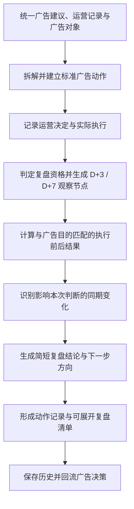

# Bamboocool 执行与复盘模块必备逻辑与能力清单

更新时间：2026-08-13

上位方案：`Bamboocool-执行与复盘模块两页架构方案.md`

方案阶段：业务逻辑与计算能力盘点

## 1. 文档定位

本文档承接执行与复盘模块两页架构，盘点动作确认与执行记录页、执行复盘页共同依赖的业务处理能力。

本阶段所指的“能力”，是将广告建议、运营动作记录、广告报表和同期业务事件按照确定规则归并、拆解、计算或评价，生成页面可以直接使用的动作记录和简短复盘结果。

当前能力设计与两页结构保持一致：一次广告执行通常是一个小操作，系统只生成足够支撑运营判断的复盘，不为每条动作构建复杂分析报告。

搜索、筛选、展开、复制、提醒和页面跳转不单独列为能力。具体数据表、字段、接口和页面组件在下一阶段设计。

## 2. 整体能力链

八项能力共同形成一条连续业务链。前三项将建议和人工记录变成真实动作；中间三项形成可以复盘的前后事实；后两项生成页面结果并保存历史。

## 3. 能力一：统一广告建议、运营记录与广告对象

### 3.1 能力目标

把广告分析页形成的 AI 建议、运营手工记录、客户现有动作调整表和广告后台对象整理到同一条关系中。

### 3.2 核心处理逻辑

- 接收广告分析与决策页输出的子 ASIN、广告目的、诊断问题、证据、AI 建议和预期观察方向；
- 读取运营手工填写或导入的动作记录，并保留原始文本、原始日期和来源；
- 统一 Campaign、广告组、广告 SKU、广告 ASIN、投放对象、搜索词、广告位和预算对象等层级；
- 建立广告对象与子 ASIN、父 ASIN、款式和产品目标的关系；
- 共享或混合多个子 ASIN 的广告对象保留真实范围，不强制归属到单一子 ASIN；
- 将客户动作表中的款号或产品名称映射到工作台产品对象，无法确认时交给运营核对；
- 识别价格、标题、Deal 等非广告记录，并转入同期影响范围。

### 3.3 标准输出

输出统一的“AI 建议—运营记录—广告对象—产品对象”关系，为动作确认、实际执行和复盘提供共同对象。

## 4. 能力二：拆解并建立标准广告动作

### 4.1 能力目标

把一段可能包含多个操作的自然语言记录，转换为可以分别确认和复盘的标准广告动作。

### 4.2 核心处理逻辑

- 识别新建、关闭、暂停、恢复、调整预算、修改竞价、修改广告位比例、增删投放对象、否词、修改匹配方式和拆分广告组等动作；
- 从文本中识别广告对象、调整前值、调整后值、调整方向和适用范围；
- 一段文本包含多项操作时，按可独立执行和可独立观察的边界拆分；
- 多项操作同时作用于同一对象且无法独立观察时，合并为组合动作；
- 保留多条动作来自同一天、同一批次或同一条上游建议的关系；
- 对象不明确、前后值不完整或无法拆分时，保留原文并标记需要运营确认；
- 根据原始来源、广告对象、执行日期和动作内容识别重复导入。

### 4.3 标准输出

输出标准广告动作，包括动作类型、广告对象、产品范围、前后值、原始来源、批次关系、组合关系和确认状态。

## 5. 能力三：记录运营决定与实际执行

### 5.1 能力目标

区分 AI 建议、运营决定和实际执行，确定后续真正需要观察的动作。

### 5.2 核心处理逻辑

- 保存 AI 原建议的对象、方向、建议值和建议依据；
- 记录运营接受、修改后接受、拒绝或暂缓的决定；
- 运营修改建议时，保存修改后的计划和修改原因；
- 接受或修改不直接视为执行，记录保持“待实际执行”；
- 记录真实执行对象、真实前后值、执行日期或时间和执行人；
- 实际执行与运营计划不一致时，保留差异和说明；
- 导入记录只有日期时，标明“时间精确到日”，不补造小时或分钟；
- 拒绝、暂缓、取消和未执行分别保存，不合并成笼统未完成状态；
- 没有可靠实际执行事实的记录不进入效果复盘。

### 5.3 标准输出

输出 AI 建议、运营决定、计划动作和实际执行的完整对照，以及明确的执行状态和复盘对象。

## 6. 能力四：判定复盘资格并生成观察节点

### 6.1 能力目标

判断动作能否进入复盘，并根据实际执行事实生成 D+3 和必要时 D+7 的观察节点。

### 6.2 核心处理逻辑

- 只有存在实际广告动作、执行日期或时间和可识别广告对象的记录才具备复盘资格；
- 拒绝、暂缓、取消、尚未执行和实际信息不完整的记录不进入效果观察；
- 以实际执行日期或时间为起点，确定 D+3 的数据覆盖范围和可复盘日期；
- 只有执行日期时，从下一个完整数据日开始观察；
- 根据广告报表更新和归因回补状态，判断当前数据是否已经可以读取；
- D+3 是第一观察节点；样本不足、变化未稳定或数据尚未完整时再生成 D+7 节点；
- 同一广告对象在观察期内再次发生调整时，判断继续组合观察、重新起算或无法单独复盘；
- 区分观察中、已到期、数据迟到、执行信息缺失和已完成等状态。

### 6.3 标准输出

输出复盘资格、观察起点、D+3 / D+7 日期、当前观察状态和不能复盘的具体原因。

## 7. 能力五：计算与广告目的匹配的执行前后结果

### 7.1 能力目标

为一条小型广告动作计算少量、可比较且与当前广告目的有关的执行前后结果。

### 7.2 核心处理逻辑

- 以实际执行日期或时间为分界，建立可比较的执行前基线和执行后观察窗口；
- D+3 使用执行前后三个完整数据日，必要时 D+7 使用七个完整数据日；
- 排除执行当天的不完整数据，并标明数据缺失或广告归因仍在回补的日期；
- 将前后数据统一到相同站点、货币、广告层级、广告对象和归因口径；
- 读取已确认的广告目的、产品目标和适用阈值；
- 调预算或竞价时，重点计算流量、花费、订单、广告销售和效率变化；
- 否词或调整投放对象时，重点计算无效点击、搜索词结构、转化和花费变化；
- 调整广告位时，重点计算对应位置的流量、CPC、转化和销售变化；
- 拆分或关闭广告组时，重点计算重复覆盖、流量归属和目标广告组表现变化；
- 不使用统一 ACoS 判断所有动作，也不把所有可用广告指标都作为复盘输出；
- 目标或阈值未确认、样本过小或数据不完整时，只输出事实变化和不足原因。

### 7.3 标准输出

输出与当前动作匹配的执行前、D+3 和必要时 D+7 关键结果，包括变化值、变化方向、数据完整程度和是否具备判断条件。

## 8. 能力六：识别影响本次判断的同期变化

### 8.1 能力目标

找出观察窗口内足以影响本次小动作复盘的其他变化，避免把同期结果全部归到本次动作。

### 8.2 核心处理逻辑

- 匹配同一广告对象在观察期内发生的其他预算、竞价、投放、广告位、否词和启停动作；
- 匹配同一子 ASIN 其他广告组的重大调整；
- 匹配价格、Coupon、Deal 和折扣变化；
- 匹配缺货、补货到仓和库存承接变化；
- 匹配标题、主图、五点描述等页面内容修改；
- 匹配关键词位置和重点竞品的明显变化；
- 根据事件时间、对象和产品范围判断与本次动作的重叠程度；
- 只输出足以影响解释的事件，不为普通动作生成冗长环境分析；
- 没有发现已知重大影响时，输出明确的无影响状态；
- 存在多项同期影响时，降低结论确定程度，而不是删除复盘结果。

### 8.3 标准输出

输出影响本次判断的同期广告动作和业务事件，以及其时间、影响范围和对结论的限制。

## 9. 能力七：生成简短复盘结论与下一步方向

### 9.1 能力目标

将实际执行、前后结果和同期影响整理成运营可以快速确认的复盘结论。

### 9.2 核心处理逻辑

- 先判断动作是否按记录执行；实际执行与计划不同，则以实际动作评价；
- 将关键结果与当前广告目的和已配置目标比较；
- 区分达到目的、方向改善、无明显变化、未达到目的和反向变化；
- 同时检查样本量、数据完整程度、归因回补、对象混合和同期影响；
- 区分“执行后观察到变化”和“能够确认由本次动作造成”；
- D+3 证据足够时直接形成结论，不强制等待 D+7；
- D+3 证据不足时说明继续 D+7 的具体原因；
- 结论控制为完成判断所需的短内容，不生成独立长篇复盘报告；
- 下一步只在保持、回退、继续观察、补充数据和重新分析中选择；
- 新调整方向返回广告分析与决策页形成新建议，不自动执行；
- AI 生成草案，运营确认或修改后形成最终结论。

### 9.3 标准输出

输出动作执行情况、关键变化、目标达成状态、同期影响说明、当前结论和下一步方向。

## 10. 能力八：形成动作记录与可展开复盘清单

### 10.1 能力目标

将单条动作及其复盘结果组织成两页可以直接使用的记录、状态和摘要，并保存完整历史。

### 10.2 核心处理逻辑

- 按待运营判断、待实际执行、已执行、已拒绝和已暂缓生成动作记录页状态；
- 按 D+3 观察中、D+3 可复盘、继续 D+7、D+7 可复盘、已形成结论和无法判断生成复盘状态；
- 按到期程度、结果异常、数据问题和正常观察确定复盘清单顺序；
- 为清单收起状态生成动作对象、实际执行、观察节点、关键结果和结论摘要；
- 为清单展开状态生成动作对照、少量前后结果、同期影响、结论和下一步方向；
- 汇总达到目的、方向改善、未达到目的、反向变化、继续观察和无法判断的动作；
- 按子 ASIN、广告目的和动作类型形成范围摘要；
- 保存 AI 原建议、运营决定、实际执行、数据窗口、同期影响、AI 草案和运营最终结论；
- 后续数据回补或结论修改时保留版本，不覆盖已确认的历史事实；
- 新建议由旧复盘产生时，建立旧动作、复盘结论和新建议之间的关系。

### 10.3 标准输出

输出动作确认页的状态概览和动作记录，执行复盘页的可展开清单、范围摘要，以及可回流广告分析与决策页的历史动作结果。

## 11. 八项能力与两个页面的关系

### 11.1 动作确认与执行记录

该页主要依赖：

- 能力一：统一广告建议、运营记录与广告对象；
- 能力二：拆解并建立标准广告动作；
- 能力三：记录运营决定与实际执行；
- 能力四：判定复盘资格并生成观察节点；
- 能力八：形成动作记录与可展开复盘清单。

这些能力共同生成待确认建议、运营决定、实际执行对照、已处理记录和观察起点。

### 11.2 执行复盘

该页主要依赖：

- 能力四：判定复盘资格并生成观察节点；
- 能力五：计算与广告目的匹配的执行前后结果；
- 能力六：识别影响本次判断的同期变化；
- 能力七：生成简短复盘结论与下一步方向；
- 能力八：形成动作记录与可展开复盘清单。

这些能力共同生成复盘状态、动作清单、动作展开内容、范围结果摘要和下一步方向。

### 11.3 广告分析与决策页

广告分析与决策页向本模块提供诊断、证据、AI 建议、广告目的和预期观察方向。

本模块向广告分析与决策页返回：

- 运营是否接受以及如何修改建议；
- 运营实际执行的动作和值；
- D+3 / D+7 的关键结果；
- 同期影响和结论限制；
- 最终复盘结论；
- 需要重新分析的下一步方向。

### 11.4 总览页与数据中心

总览页引用待确认、待记录实际执行和已到复盘节点的数量与摘要，不自行建立另一套动作判断。

数据中心负责广告报表、动作导入、产品与广告映射、价格促销、库存、关键词和竞品数据的接入状态；本模块使用这些数据形成记录与复盘结果。

## 12. 能力盘点结论

执行与复盘模块需要八项连续能力：

1. 统一广告建议、运营记录与广告对象；
2. 拆解并建立标准广告动作；
3. 记录运营决定与实际执行；
4. 判定复盘资格并生成观察节点；
5. 计算与广告目的匹配的执行前后结果；
6. 识别影响本次判断的同期变化；
7. 生成简短复盘结论与下一步方向；
8. 形成动作记录与可展开复盘清单。

这八项能力支撑两页结构：第一页把 AI 建议变成真实的运营动作记录；第二页把全部已执行动作组织成一张可展开的复盘清单。运营不需要进入独立详情页，也不需要为每一个小调整阅读复杂报告。
