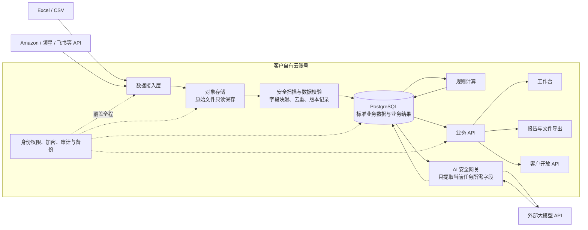

# Bamboocool 数据隐私与数据接入方案

本文供内部产品、技术和交付同事阅读。方案采用客户自有云账号，数据库、文件、密钥和备份都在客户名下。我们负责部署和维护，客户始终掌握数据和云资源。

## 数据安全架构

这张图里的主线很简单：数据从文件或接口进入客户云，先保存原件，再完成校验和标准化；规则与 AI 都使用整理后的数据，结果通过统一业务 API 提供给工作台、报告和客户自己的系统。

## 数据怎么采集

文件上传和 API 接入共用同一个数据入口。运营可以上传从 Amazon、领星、SIF、西柚等工具导出的 CSV、XLSX，也可以上传产品跟进表、动作调整表和库存表。数据源具备稳定接口后，改为定时读取，页面和计算逻辑不用重做。

每个外部接口使用独立的集成账号。凭证放在客户云账号的密钥管理服务中，不写入代码、表格或业务数据库。采集账号默认只读，系统写回使用另一套权限。

## 数据怎么处理和保存

新数据先进入接入区，不直接改变正式经营结果。系统记录来源、统计周期和导入批次，然后检查文件安全、日期时区、货币、广告归因口径及产品和广告对象的映射关系。字段缺失、重复数据或映射冲突留在待处理状态。

通过校验的数据写入 PostgreSQL。不同来源中的同一产品、关键词和广告对象使用统一身份，同时保留原字段、原始值和来源批次。新数据形成新版本，不覆盖已经生成的历史判断和报告。

原始文件保存在客户自己的对象存储中，内部重命名并记录文件哈希，原件只读。解析任务只提取数据，不执行文件内容。系统生成的 Excel、CSV 和报告也保存在这套对象存储中。

## AI 怎么使用数据

外部大模型不能直接连接数据库或浏览客户文件。业务模块先确定问题范围，AI 安全网关再从标准数据中提取当前任务需要的字段，去掉凭证、账号信息和无关内容后调用客户批准的模型服务。

模型返回的分析写回客户数据库，并记录业务对象、数据版本、模型和提示词版本。AI 结果不会覆盖原始数据、规则计算或运营已经确认的决定。

## 数据怎么输出

工作台通过业务 API 读取数据库，浏览器不直接访问数据库。运营总览、库存判断、关键词和竞品证据、广告诊断及执行复盘都从这里取得统一结果。

报告和导出文件由工作台生成，保存在客户对象存储中。客户其他系统可以通过开放 API 读取获授权的数据。需要向 Amazon、领星或飞书写回时，由独立执行通道处理；运营先确认对象和值，系统再提交，并保存执行前值、目标值和外部系统返回结果。

## 权限和日常运维

客户使用自己的企业身份登录并启用多因素认证。管理员、运营、助理和审计人员按工作职责获得相应权限。文件上传、数据查看、导出、配置修改、AI 调用、API 调用和系统写回都有操作记录。

数据库位于客户云项目的私有网络，不直接对公网开放。数据库、文件和备份在存储时加密，系统传输使用加密连接。我们的维护权限由客户临时授予，到期后自动收回。

整套方案使用 PostgreSQL、对象存储和标准业务 API。客户以后更换云平台或改为内网部署时，可以迁移数据和应用，不需要重做业务逻辑。
