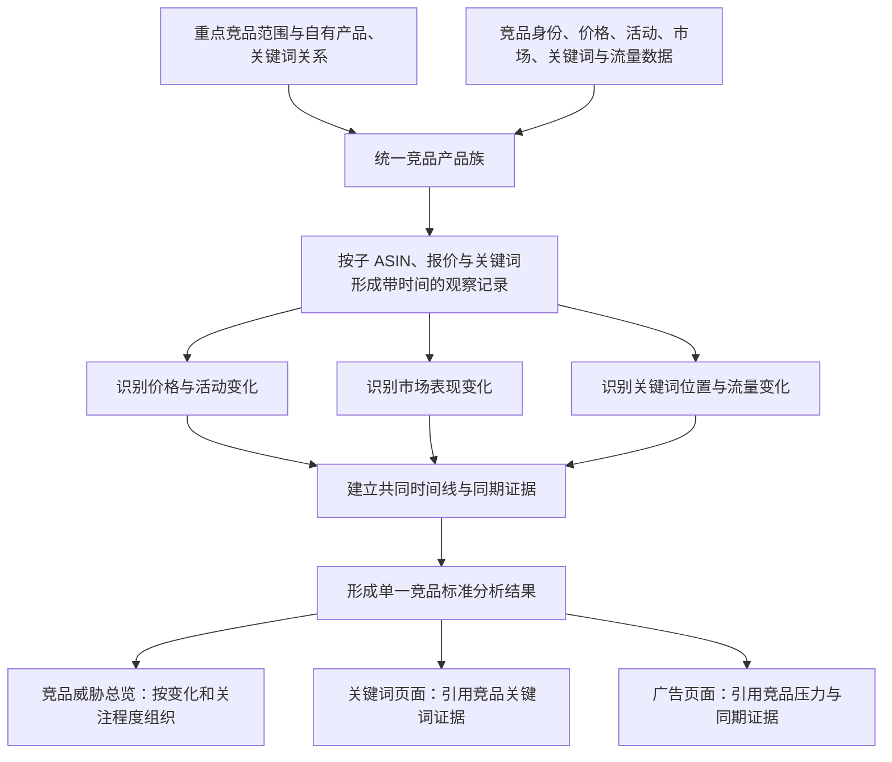
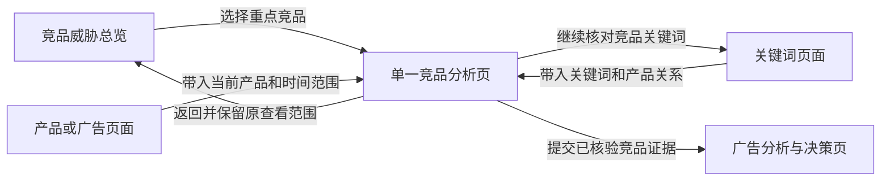
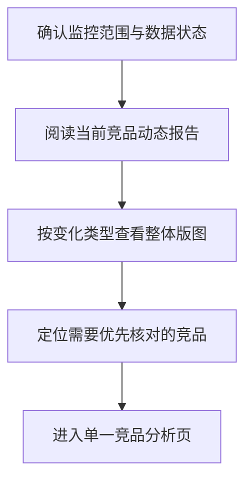
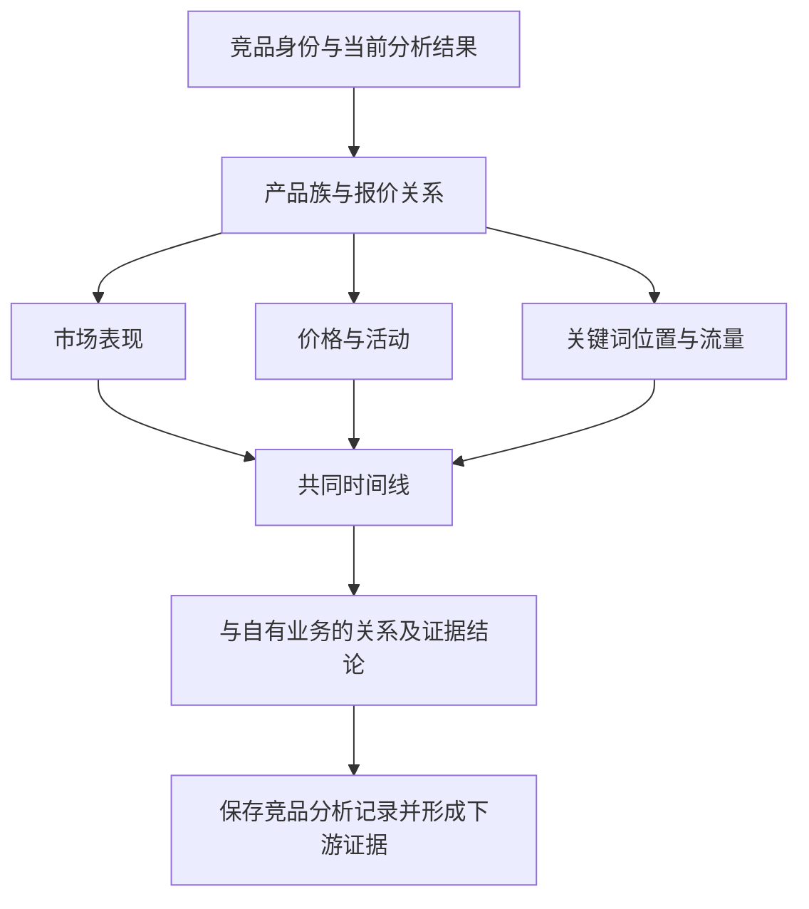

# Bamboocool 竞品分析模块两页架构方案

更新时间：2026-08-13

适用范围：竞品威胁总览、单一竞品分析页

方案阶段：页面架构与功能板块确认

## 1. 文档定位

本文档定义竞品分析模块的整体架构、两类页面的职责、页面板块、页面流转及模块边界。

当前方案以功能板块为设计颗粒度：明确运营在每个页面看到什么业务关系、系统如何形成这些结果，以及竞品证据如何进入关键词和广告判断。具体数据表、字段、更新频率、判断阈值、页面表头和可视化组件在后续详细设计中展开。

## 2. 模块目标

竞品分析模块围绕少量重点竞品持续建立观察记录，将竞品的产品关系、价格与活动、市场表现、关键词位置和流量变化组织成统一的竞品分析结果。

模块的标准判断对象为**重点竞品产品族**：

- 以父 ASIN 作为产品族的主要识别和汇总对象；
- 子 ASIN、具体报价和关键词作为底层观察对象；
- 子 ASIN 的变化只有能够代表整个产品族时才向上汇总；
- 无法归并的差异保留在对应子 ASIN、报价或关键词上，不用产品族结论覆盖。

这套结果服务于三个业务场景：

1. 从全部重点竞品中发现近期值得关注的变化；
2. 从一个竞品出发，核对价格、活动、市场结果和关键词位置之间的时间关系；
3. 将已经核验的竞品证据交给关键词或广告页面继续形成经营判断。

竞品模块是经营判断的证据层。它输出“竞品发生了什么、可能影响哪里、证据是否充分”，不直接输出预算、出价、广告开关或执行命令。

## 3. 两页总体架构

### 3.1 页面分工

#### 竞品威胁总览

从全部重点竞品的标准分析结果中识别近期变化，按照变化类型、关注程度和可能影响范围组织竞品，帮助运营决定先看哪个竞品以及为什么需要关注。

#### 单一竞品分析页

整合一个重点竞品产品族的产品关系、价格与活动、市场表现、关键词位置和流量变化，形成完整、可保存、可追溯的竞品分析结果，是竞品威胁总览的共同基础。

### 3.2 系统生成逻辑

### 3.3 运营查看路径

运营可以从全部竞品中发现变化，也可以带着关键词、产品或广告上下文直接进入单一竞品分析。所有入口最终汇入同一套竞品分析结果。

## 4. 页面一：竞品威胁总览

### 4.1 页面目标

竞品威胁总览负责把分散在不同竞品中的近期变化集中呈现，让运营快速知道：

- 当前监控的是哪些重点竞品；
- 最近哪些竞品发生了值得关注的变化；
- 变化主要来自活动与价格、市场表现、关键词位置还是流量结构；
- 哪些变化可能涉及自己的产品或重点关键词；
- 哪些竞品需要进入详情继续核对；
- 当前结论使用了什么时间范围，证据是否完整。

### 4.2 页面结构

页面由五个板块组成：监控范围与数据状态、竞品动态报告、变化版图、重点竞品区域、分析入口。

### 4.3 监控范围与数据状态

该板块说明当前总览建立在什么业务范围和数据基础上，主要展示：

- 当前站点、品线、子类目和观察时间；
- 已纳入持续监控的重点竞品范围；
- 重点竞品与自有产品、重点关键词之间的已知竞争关系；
- 各类竞品数据更新到什么时间；
- 当前哪些结果来自可直接观察的数据，哪些来自第三方估算或系统推导；
- 是否存在数据过期、观察中断或关键证据缺失。

该板块帮助运营先确认“这份总览覆盖了谁、覆盖到什么时候”，再阅读后续判断。重点竞品范围的增减进入策略设置流程，调整后重新生成总览结果。

### 4.4 竞品动态报告

竞品动态报告从当前范围内的标准竞品分析结果中，提取本周期最值得关注的变化。

报告围绕具体业务事实组织内容：

- 哪个竞品发生了什么变化；
- 变化从什么时候开始、持续了多长时间；
- 哪些价格、活动、市场或关键词证据支撑该变化；
- 可能涉及哪些自有产品或重点关键词；
- 当前能够确认什么、仍需要继续观察什么。

报告内容随当前观察结果变化，但表达结构保持稳定。每项结论都提供对应竞品和证据时间段的分析入口，使运营能够直接进入详情核验。

### 4.5 竞品变化版图

竞品变化版图按照运营实际关心的四类信号组织当前竞争环境：

#### 活动与价格变化

展示哪些重点竞品正在参加活动、结束活动、降价、恢复价格或扩大与自有产品的价格差，以及变化涉及哪些子 ASIN 或报价。

#### 市场表现变化

展示哪些重点竞品的销量量级、类目位置或整体可见度出现明显变化，帮助运营判断竞争压力是否正在扩大或减弱。

#### 关键词位置变化

展示哪些重点竞品在核心品类词、材质词、竞品词或其他重点词上的自然位置、广告位置或覆盖范围发生变化，并标识与自有产品共同竞争的关键词。

#### 流量结构变化

展示哪些重点竞品的主要流量入口或自然、广告、其他流量构成出现变化。第三方只能提供估算时，页面同步说明数据性质和可用范围。

同一竞品可以同时进入多个变化分类。页面保留各类变化的独立证据，不把同期出现的多个信号直接写成因果关系。

### 4.6 重点竞品区域

重点竞品区域按照当前关注程度组织重点竞品产品族，是运营从总览进入深度分析的主要入口。

每个竞品摘要围绕以下业务关系组织：

- 竞品身份、产品定位及与自有产品的竞争关系；
- 当前价格或价格带及近期活动状态；
- 最近发生的主要市场、关键词或流量变化；
- 变化发生在哪些子 ASIN、报价或关键词上；
- 当前关注程度及其明确依据；
- 证据来源、更新时间和完整程度；
- 与自有产品或重点关键词的已知影响范围。

运营可以围绕竞品、品牌、ASIN、变化类型、时间范围和证据状态缩小查看范围。打开一个竞品后进入单一竞品分析页，并保留当前时间、变化类型和关联关键词上下文。

关注优先级以可观察变化、业务竞争关系、可能影响范围和证据完整程度为基础。正式规则确认前，页面采用规则结果与运营手工关注相结合的顺序，不使用缺少业务依据的精确综合分数。

### 4.7 页面输出

竞品威胁总览最终向运营输出：

- 当前重点竞品的监控范围和数据状态；
- 本周期竞品动态报告；
- 按活动价格、市场表现、关键词位置和流量结构组织的变化版图；
- 有明确依据的重点竞品关注顺序；
- 每个重点竞品的完整分析入口。

## 5. 页面二：单一竞品分析页

### 5.1 页面目标

单一竞品分析页负责还原一个重点竞品产品族在指定时间范围内发生的变化，并将分散证据转化为一份结构化、可保存的竞品分析结果。

它主要回答：

- 当前分析的竞品是谁，与自有产品是什么竞争关系；
- 变化发生在整个产品族，还是某个子 ASIN、报价或关键词；
- 价格、活动、市场表现、关键词位置和流量分别发生了什么；
- 多类变化是否在同一时间段共同出现；
- 哪些是事实、哪些是推导、哪些关系暂时不能确认；
- 这些证据可能涉及哪些自有产品和关键词；
- 哪些信息可以交给关键词或广告页面继续判断。

### 5.2 页面结构

页面由七个核心板块和一个分析记录区域组成。

### 5.3 竞品身份与当前分析结果

该板块是详情页的结果索引，展示：

- 当前竞品产品族及其父 ASIN；
- 品牌、品类、产品定位和主要卖点；
- 与自有产品的竞争关系及主要竞争范围；
- 当前活动、价格和市场状态；
- 当前关注程度、主要变化及判断依据；
- 本次分析采用的时间范围和数据状态。

运营可以从这里快速理解“当前为什么要看这个竞品”，并进入对应板块核对形成原因。

### 5.4 产品族与报价关系

该板块解释一个竞品产品族由哪些实际销售对象构成，主要展示：

- 父 ASIN 与子 ASIN 的归属关系；
- 尺码、颜色、包装数等变体差异；
- 同一子 ASIN 下不同报价或卖家的关系；
- 各子 ASIN 的销售状态、价格区间和活动状态差异；
- 本次变化实际发生在哪个子 ASIN 或报价；
- 哪些变化可以代表整个产品族，哪些只能保留在局部对象。

该板块为后续所有趋势和变化提供准确对象基础，避免把单一变体或报价的动作归因到整个竞品产品族。

### 5.5 市场表现看板

该看板展示竞品在指定时间内的市场结果及其变化，主要包括：

- 销量或销售量级的变化；
- 类目与子类目位置的变化；
- 整体可见度或市场表现趋势；
- 评分、评论等产品基础表现的变化；
- 变化开始时间、持续时间和当前状态；
- 结果来自直接观察、第三方估算还是系统推导。

运营通过该看板判断竞品的市场压力是在扩大、维持还是减弱，并定位需要放入共同时间线核对的结果变化。

### 5.6 价格与活动看板

该看板还原竞品价格和活动状态的变化过程，主要展示：

- 日常价格、活动价格和最终成交价格之间的关系；
- Coupon、Deal、折扣和其他可观察活动的开始、变化与结束；
- 价格变化的幅度、持续时间和涉及对象；
- 竞品与对应自有产品之间价格差的变化；
- 活动结束后价格是否恢复以及恢复到什么区间；
- 数据中断或无法确认最终成交价的时间段。

运营通过该看板判断当前竞争压力是否来自短期活动、持续降价或价格带改变，并为共同时间线提供清晰的经营事件。

### 5.7 关键词位置与流量看板

该看板展示竞品通过哪些关键词和流量入口获得可见度，以及这些入口如何变化，主要包括：

- 当前主要关键词入口及其业务分类；
- 重点关键词上的自然位置和可观察广告位置；
- 新增、提升、下降或丢失的关键词覆盖；
- 自有产品与竞品在同一关键词上的位置关系；
- 自然、广告和其他流量构成及其变化；
- 第三方估算无法支持的广告花费、出价或站外流量细节。

运营可以带着竞品、关键词、产品和时间范围进入关键词页面继续核对，不在竞品页重复完成关键词机会判断。

### 5.8 共同时间线

共同时间线是单一竞品分析页的核心证据看板。它将不同来源、不同粒度的观察结果对齐到同一个时间范围，形成至少三条业务轨道：

1. 市场结果轨：销量量级、类目位置和整体可见度；
2. 价格活动轨：价格、Coupon、Deal 和其他经营事件；
3. 关键词流量轨：关键词位置、覆盖范围和流量结构。

必要时增加数据状态轨，标识数据缺失、来源变化和更新中断。

时间线重点表达：

- 每类变化的发生时间、持续时间和结束状态；
- 多类变化是否同期出现；
- 事件发生前后可用于比较的观察窗口；
- 不同数据粒度如何对齐；
- 哪些同期关系有完整证据，哪些关系仍需要更长周期观察。

共同时间线用于建立同期证据，不将相关性直接写成因果。运营可以从分析结论定位到具体对象、时间和证据轨道。

### 5.9 与自有业务的关系及证据结论

该板块将竞品变化放回 Bamboocool 的产品和关键词语境，形成可被下游使用的业务结论，主要展示：

- 当前竞品变化可能涉及哪些自有产品；
- 双方共同竞争哪些重点关键词或市场位置；
- 价格差、活动状态和关键词位置发生了什么变化；
- 已确认的事实、基于规则的推导和仍待核对的假设；
- 当前关注程度及其业务依据；
- 证据覆盖是否足以进入关键词或广告判断；
- 当前需要继续观察的数据和时间窗口。

该板块输出的是证据结论与影响范围，不在这里生成具体广告动作。

### 5.10 分析记录与证据交付

该区域保存本次竞品分析的标准结果，包括分析对象、时间范围、主要变化、同期证据、关注程度、可能影响范围、数据来源和未确认事项。

分析记录支持：

- 与同一竞品的历史分析结果比较；
- 查看关注状态的新增、持续、减弱和解除；
- 从结论追溯到对应观察记录和数据来源；
- 带着竞品、时间、变化类型、关联产品和关键词进入下游页面；
- 在广告页面中引用竞品证据，同时保留返回详情核验的入口。

### 5.11 页面输出

单一竞品分析页最终向运营输出：

- 一个重点竞品产品族的完整对象关系；
- 市场表现、价格活动、关键词位置和流量变化；
- 多类变化在共同时间线上的同期关系；
- 与自有产品和关键词相关的证据结论；
- 事实、推导、假设和缺失数据的明确边界；
- 可保存、可比较、可追溯并可交给下游使用的竞品分析记录。

## 6. 两个页面之间的统一规则

### 6.1 统一业务对象

两个页面共同使用“重点竞品产品族”作为标准判断对象。父 ASIN 承载产品族身份，子 ASIN、报价和关键词承载具体观察。总览中的任何结论都能够回到详情中的具体对象和时间证据。

### 6.2 统一时间范围

总览、详情、关键词页面和广告页面在流转时保留同一观察时间。不同来源粒度不一致时，系统明确展示各自覆盖时间和对齐方式，不把月度估算伪装成每日事实。

### 6.3 统一证据表达

所有竞品结果区分：

- 可直接观察的事实；
- 第三方估算；
- 依据已确认规则形成的系统推导；
- 运营或系统提出、仍需验证的假设；
- 缺失、过期或无法对齐的数据。

每项结果都保留数据来源、数据时间和分析时间。

### 6.4 统一关注程度

关注程度由可观察变化、竞争关系、可能影响范围和证据完整程度共同形成。页面同步展示判断依据；正式规则未确认时保留运营手工调整，不产生无法解释的精确威胁分数。

### 6.5 统一因果边界

价格、活动、市场结果和关键词位置同期出现时，系统表达为“同期变化”或“可能相关”。只有获得能够支持因果判断的额外证据后，才升级为更强结论。

### 6.6 统一页面上下文

从总览、关键词、产品或广告页面进入详情时，保留来源页面、当前产品、关键词、竞品、时间范围和变化类型。返回时恢复原查看范围和浏览位置。

## 7. 与其他模块的关系

### 7.1 上游输入

竞品分析模块使用：

- 策略设置中的重点竞品范围和竞争关系；
- 产品模块中的自有产品身份、产品定位和当前业务目标；
- 关键词模块中的重点关键词、产品关系和位置结果；
- 数据中心中的竞品身份、价格、活动、市场表现、关键词和流量观察数据。

### 7.2 向运营总览输出

运营总览读取本周期最值得关注的竞品变化、涉及范围和证据状态，用于说明当前经营环境，不替代竞品详情。

### 7.3 向关键词页面输出

关键词页面读取竞品在具体关键词上的覆盖、位置及变化证据，用于判断一个关键词当前由谁占据、竞争压力如何以及是否需要继续研究。

### 7.4 向广告页面输出

广告页面读取已经保存的竞品分析记录，包括竞品、时间范围、压力维度、关联产品、关联关键词、可观察事实、证据完整程度和详情入口。广告页面再结合产品、库存、关键词和广告自身表现形成动作判断。

## 8. 当前方案边界

当前竞品模块覆盖：

- 少量重点竞品的持续监控；
- 竞品产品族及父子 ASIN、报价关系；
- 价格、活动、市场表现、关键词位置和流量变化；
- 共同时间线、关注顺序和动态报告；
- 与自有产品、关键词及广告判断的证据关系。

当前方案的输出边界为“形成竞品证据并交给下游判断”。以下内容进入其他阶段或其他模块：

- 竞品库存探测依赖大量买家账号且准确性不足，不作为当前竞品分析结果；
- 竞品广告出价、预算和花费在没有可靠数据来源时不生成估算结论；
- 广告预算、出价和投放动作由广告分析与决策模块形成；
- 完整市场选品、全类目竞品研究和第三方工具全部功能不在当前工作台范围；
- 季节性等尚未被当前业务确认的因素不进入默认关注规则。

## 9. 当前数据基础与落地前提

项目现有竞品表可以支持竞品池、父子 ASIN 关系、品牌品类信息，以及价格、销量量级、类目位置和关键词等静态基线。

现有资料暂时不能单独支撑完整动态分析：

- 当前竞品表是指定周期的静态快照，不能直接形成每日价格、活动和位置时间线；
- 客户已存在每日价格监控流程，但对应历史记录尚未进入项目资料；
- 现有竞品表中的广告与活动相关数据存在缺失，不能视为已经具备稳定监控能力；
- SIF、秀吧、卖家精灵、Softtime 等工具是客户实际使用来源，具体接口、导出方式和可用权限仍需逐项确认；
- V4.1.2 和 V5 中的竞品数值与事件为演示数据，只用于验证页面结构。

因此，页面可以先按两页架构完成详细设计；共同时间线、动态报告和关注顺序的正式运行，需要后续数据设计补齐带观察时间的连续记录。

## 10. 后续详细设计顺序

1. 明确首批重点竞品产品族，以及与自有产品和重点关键词的关系；
2. 设计竞品数据表和字段，明确身份、观察记录、经营事件、关键词位置、流量结构及数据来源；
3. 确认第三方来源、获取方式、更新频率、可用历史和缺失处理；
4. 确认价格活动、市场表现、关键词位置等变化的识别口径；
5. 与运营共同确认关注程度规则和动态报告模板；
6. 细化竞品威胁总览的看板内容与页面状态；
7. 细化单一竞品分析页的共同时间线和标准分析记录；
8. 最后定义竞品证据进入关键词和广告判断时的交接结构。
