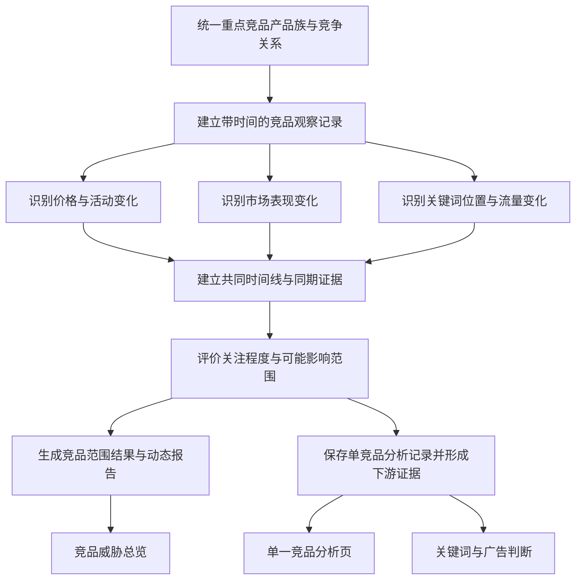

# Bamboocool 竞品分析模块必备逻辑与能力清单

更新时间：2026-08-13

上位方案：`Bamboocool-竞品分析模块两页架构方案.md`

方案阶段：业务逻辑与计算能力盘点

## 1. 文档定位

本文档承接竞品分析模块两页架构，盘点竞品威胁总览和单一竞品分析页共同依赖的业务逻辑与计算能力。

本阶段所指的“功能/能力”，是将竞品身份、价格、活动、市场、关键词和流量等原始数据，按照确定规则完成归并、比较、变化识别、证据组织或评价，生成页面和下游模块可以直接使用的业务结果。

能力清单围绕以下主线展开：

```text
竞品原始数据与持续观察数据
        ↓
统一重点竞品产品族及竞争关系
        ↓
价格活动、市场表现、关键词位置与流量变化
        ↓
共同时间线、关注程度与可能影响范围
        ↓
生成总览、单竞品分析记录和下游竞品证据
```

竞品模块的标准判断对象为重点竞品产品族。父 ASIN 用于识别和汇总产品族，子 ASIN、具体报价和关键词保留为底层观察对象。

## 2. 整体能力链



九项能力共同形成一条连续结果链。价格、市场、关键词和流量变化分别计算，再通过共同时间线形成证据，最终生成总览结果和可交给下游使用的单竞品分析记录。

## 3. 能力一：统一重点竞品产品族与竞争关系

### 3.1 能力目标

将不同来源中的竞品产品和运营指定的监控范围，整理为统一的重点竞品产品族，并建立与自有产品、重点关键词之间的竞争关系。

### 3.2 核心处理逻辑

- 统一品牌、父 ASIN、子 ASIN、商品标题、变体和报价等竞品身份；
- 建立父 ASIN 与子 ASIN 的归属关系；
- 识别同一子 ASIN 下不同卖家、报价和配送方式，避免把报价变化误认为产品族整体变化；
- 按站点、品线和子类目限定当前监控范围；
- 接收运营指定的核心竞品，并记录开始监控、暂停监控和移出监控的状态；
- 记录竞品与自有产品之间的定位、材质、价格带和市场位置等已确认竞争关系；
- 记录竞品与重点关键词之间的已知覆盖关系；
- 保留无法确认父子关系、报价归属或竞争关系的对象，进入待核对状态；
- 记录本次关系建立所使用的来源和规则版本。

### 3.3 标准输出

输出统一的重点竞品产品族清单，明确每个产品族的父子 ASIN、报价关系、监控状态、对应自有产品、关联重点关键词和数据来源。

## 4. 能力二：建立带时间的竞品观察记录

### 4.1 能力目标

将不同时间、不同来源和不同粒度的竞品数据转化为可以连续比较的观察记录，为各类变化识别和共同时间线提供统一基础。

### 4.2 核心处理逻辑

- 按实际观察时间接收竞品身份、价格、活动、市场表现、关键词位置和流量数据；
- 将数据保留在其真实观察对象上，区分产品族、子 ASIN、报价和关键词；
- 区分数据覆盖周期、采集时间和进入系统的时间；
- 统一不同来源的时间口径、单位和业务含义；
- 区分可直接观察的数据、第三方估算、系统推导和运营补充事件；
- 识别重复记录、来源冲突、观察中断、更新过期和异常跳变；
- 数据冲突时保留各来源记录和差异，不用单一数值覆盖；
- 将当前观察与同一对象的历史观察连接，形成连续变化基础；
- 记录每项观察的来源、时间、数据性质和可用状态。

### 4.3 标准输出

输出按产品族、子 ASIN、报价和关键词组织的竞品观察序列，明确每项观察的数值或状态、观察时间、覆盖周期、数据来源和可用程度。

## 5. 能力三：价格与活动变化识别

### 5.1 能力目标

将连续的竞品价格和活动观察转化为可用于总览和共同时间线的价格活动事件。

### 5.2 核心处理逻辑

- 区分日常价格、划线价格、Coupon、Deal、折扣和其他可观察活动；
- 在数据允许时还原运营实际能够看到的最终成交价格；
- 比较当前价格与上一观察、正常价格区间和指定历史周期；
- 识别降价、涨价、活动开始、活动变化、活动结束和价格恢复；
- 计算价格变化幅度、活动持续时间和恢复后的价格区间；
- 识别竞品与对应自有产品之间价格差的变化；
- 判断变化发生在整个产品族、某个子 ASIN还是某个具体报价；
- 多个子 ASIN发生相同变化时，按照覆盖范围判断是否形成产品族事件；
- 数据不足以确认活动价或最终成交价时，输出明确的缺失状态。

### 5.3 标准输出

输出竞品价格活动事件，明确变化类型、发生对象、开始与结束时间、变化幅度、持续时间、当前状态、与自有产品的价格差变化及证据来源。

## 6. 能力四：市场表现变化识别

### 6.1 能力目标

将竞品销量量级、类目位置和其他市场表现观察转化为可比较的市场结果变化。

### 6.2 核心处理逻辑

- 计算同一竞品在连续周期内的销量、销售量级或销售趋势变化；
- 计算类目和子类目位置的提升、下降和持续时间；
- 根据可用数据形成整体可见度或市场表现变化；
- 识别评分、评论等产品基础表现的变化及其发生时间；
- 区分直接观察到的类目位置与第三方估算的销量结果；
- 不同来源的估算口径不一致时分别比较，不跨口径形成伪精确增减；
- 识别短期跳变、持续变化和数据中断；
- 将子 ASIN结果归并到产品族时，保留覆盖范围和代表程度；
- 记录变化使用的比较周期和数据完整程度。

### 6.3 标准输出

输出竞品市场表现变化结果，明确变化方向、变化程度、发生时间、持续状态、涉及对象、数据性质和可信程度。

## 7. 能力五：关键词位置与流量变化识别

### 7.1 能力目标

将竞品关键词入口、自然位置、可观察广告位置和流量结构数据，转化为竞品在市场入口上的变化结果。

### 7.2 核心处理逻辑

- 统一不同来源中的关键词表达，建立同词、近义词和词组关系；
- 将关键词归入品类词、材质词、功能词、场景词、品牌词和竞品词等业务分类；
- 建立竞品产品族、子 ASIN 与关键词之间的覆盖关系；
- 比较同一竞品在同一关键词上的自然位置和可观察广告位置；
- 识别关键词覆盖的新增、提升、下降、丢失和恢复；
- 计算竞品在指定关键词范围内的覆盖变化和主要流量入口变化；
- 在绑定自有产品时，比较双方在同一关键词上的位置关系；
- 比较自然、广告和其他流量构成的变化，并保留第三方估算性质；
- 不用流量占比反推无法直接获得的竞品广告花费、预算或出价；
- 记录关键词位置的观察时间、覆盖范围和来源完整程度。

### 7.3 标准输出

输出竞品关键词与流量变化结果，明确主要关键词入口、位置变化、覆盖变化、流量结构变化、与自有产品的共同竞争关系及数据来源。

## 8. 能力六：共同时间线与同期证据生成

### 8.1 能力目标

将价格活动、市场表现、关键词位置和流量变化对齐到同一时间范围，形成可以核验的同期证据。

### 8.2 核心处理逻辑

- 将市场结果、价格活动和关键词流量变化放入统一观察区间；
- 保留各类数据原始粒度，并说明日、周、月等不同粒度的对齐方式；
- 识别各类事件的开始、持续、结束和重叠时间；
- 为关键事件建立发生前、发生中和发生后的可比较窗口；
- 识别多个信号共同出现、先后出现、独立变化或证据中断的情况；
- 将分析结论连接到具体对象、时间段和原始观察；
- 把可观察事实、系统推导、分析假设和无法确认的关系分开记录；
- 将价格活动与市场结果同期出现表达为同期证据，不直接升级为因果结论；
- 根据信号覆盖和数据完整程度评价本次同期证据是否足以进入下游判断。

### 8.3 标准输出

输出一个重点竞品产品族的共同时间线，包含各类变化轨道、关键事件、前后观察窗口、同期关系、证据性质、未确认事项和证据完整程度。

## 9. 能力七：关注程度与可能影响范围评价

### 9.1 能力目标

综合竞品变化、竞争关系和同期证据，判断一个竞品当前是否值得优先关注，以及可能涉及哪些自有产品和关键词。

### 9.2 核心处理逻辑

- 读取竞品与自有产品、重点关键词之间的已确认竞争关系；
- 评价竞品是否发生价格下降、活动加深、价格差扩大等价格压力；
- 评价竞品市场表现和类目位置是否持续改善或减弱；
- 评价竞品是否在共同竞争的重点关键词上提升位置或扩大覆盖；
- 评价竞品流量入口和流量结构是否发生值得关注的变化；
- 结合变化幅度、持续时间、涉及范围和产品族覆盖程度判断关注程度；
- 结合数据来源、更新时间和证据完整程度调整结论强度；
- 识别可能涉及的自有产品、共同关键词和市场位置；
- 规则未确认时采用可解释的分级结果和运营手工关注，不产生伪精确综合分数；
- 保存本次评价使用的规则版本和判断依据。

### 9.3 标准输出

输出竞品关注程度、关注顺序、主要依据、可能影响的自有产品和关键词、证据完整程度，以及需要继续观察的事项。

## 10. 能力八：竞品范围结果与动态报告生成

### 10.1 能力目标

将单一竞品的标准分析结果按照当前业务范围重新组织，形成竞品威胁总览和本周期动态报告。

### 10.2 核心处理逻辑

- 按站点、品线、子类目、观察周期和监控状态确定当前汇总范围；
- 按活动价格、市场表现、关键词位置和流量结构组织竞品变化；
- 统计各类变化涉及的竞品产品族和可能影响范围；
- 按关注程度、证据完整程度和运营手工关注组织重点竞品顺序；
- 对一个竞品的多类变化保留共同归属，同时避免重复计算竞品数量；
- 从当前范围内提取最值得关注的变化，生成稳定结构的动态报告；
- 报告说明变化对象、发生时间、支撑证据、可能影响范围和未确认事项；
- 将每项报告结论连接到单一竞品的具体分析记录；
- 数据不足时生成范围和缺失说明，不用模拟内容填充报告。

### 10.3 标准输出

输出竞品监控范围结果、变化版图、重点竞品顺序、本周期竞品动态报告及对应的单竞品分析入口。

## 11. 能力九：竞品分析记录、追溯与证据交付

### 11.1 能力目标

保存每次单一竞品分析结果，建立结论与观察数据之间的追溯关系，并形成关键词和广告页面可以直接读取的竞品证据。

### 11.2 核心处理逻辑

- 保存当次竞品对象、分析时间、观察范围和竞争关系；
- 保存价格活动、市场表现、关键词流量和共同时间线结果；
- 保存关注程度、可能影响范围、事实、推导、假设和未确认事项；
- 保存使用的数据来源、数据状态和规则版本；
- 比较当前记录与同一竞品的历史记录；
- 识别关注状态的新增、持续、加重、减弱和解除；
- 建立最终结论到共同时间线、变化结果和原始观察记录的追溯关系；
- 为关键词页面生成包含竞品、关键词、位置变化、时间和证据来源的上下文；
- 为广告页面生成包含竞品、关联产品、压力维度、共同关键词、可观察事实、证据完整程度和详情入口的上下文；
- 下游页面引用后仍保留原分析版本，避免后续数据更新改变当时的判断依据。

### 11.3 标准输出

输出可保存、可比较、可解释的单一竞品分析记录，以及可被关键词页面和广告页面引用的结构化竞品证据。

## 12. 九项能力与两个页面的关系

### 12.1 单一竞品分析页

单一竞品分析页是九项能力的主要承载页面：

- 读取统一的重点竞品产品族、父子 ASIN、报价和竞争关系；
- 使用连续观察记录作为全部分析基础；
- 分别读取价格活动、市场表现、关键词位置和流量变化；
- 使用共同时间线核对多类变化的同期关系；
- 使用关注程度与影响范围评价形成当前竞品结论；
- 保存标准分析记录并提供完整证据追溯；
- 形成关键词和广告页面可以继续使用的竞品证据。

### 12.2 竞品威胁总览

竞品威胁总览主要读取：

- 当前重点竞品范围和竞争关系；
- 单一竞品的最新标准分析结果；
- 各类竞品变化及其发生时间；
- 关注程度、可能影响范围和证据完整程度；
- 按当前业务范围生成的变化版图、重点竞品顺序和动态报告。

### 12.3 关键词页面

关键词页面读取竞品在具体关键词上的覆盖、自然位置、可观察广告位置、变化时间和证据来源，用于继续判断市场需求、竞争状态和自有产品位置。

### 12.4 广告分析与决策页面

广告页面读取已经保存的竞品证据，将竞品价格活动、市场表现和关键词位置变化，与产品目标、库存承接、关键词机会和广告自身表现共同放入广告判断。竞品模块本身不生成广告动作。

### 12.5 运营总览

运营总览读取竞品范围结果中最值得关注的变化、可能影响范围和数据状态，用于形成当天或本周期经营环境摘要。

## 13. 能力盘点结论

竞品分析模块需要形成的核心能力中轴为：

```text
统一重点竞品产品族与竞争关系
        ↓
建立连续竞品观察记录
        ↓
识别价格活动、市场表现、关键词位置与流量变化
        ↓
建立共同时间线与同期证据
        ↓
评价关注程度和可能影响范围
        ↓
生成威胁总览、动态报告和单竞品分析记录
        ↓
向关键词与广告页面交付可追溯竞品证据
```

九项能力最终形成两类标准结果：

1. 面向竞品威胁总览的范围结果，回答“近期先关注谁、发生了什么”；
2. 面向单一竞品分析和下游判断的对象结果，回答“证据是什么、发生在哪里、可能影响什么”。

这两类结果共同把竞品分析从第三方工具中的分散数据，转化为 Bamboocool 经营判断可以直接引用的证据。
