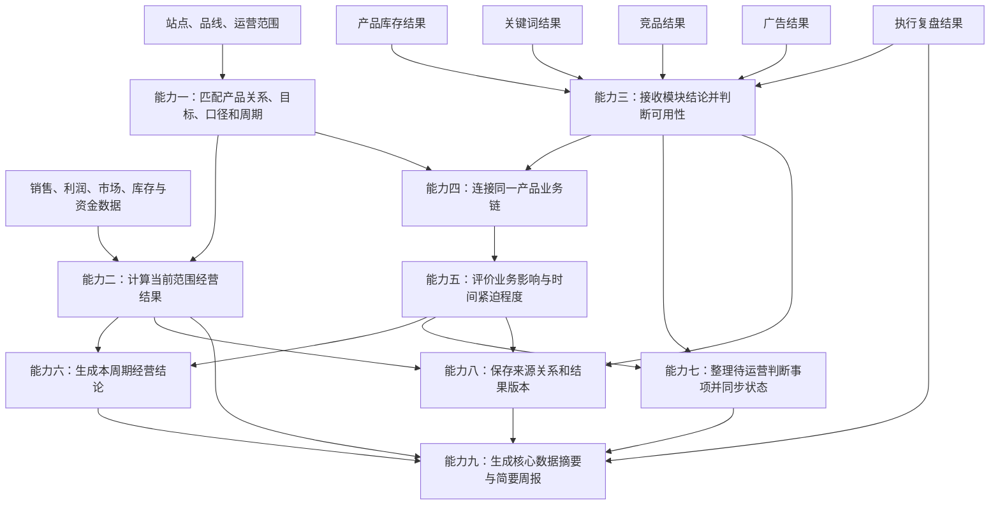

# Bamboocool 运营总览模块必备逻辑与能力清单

更新时间：2026-08-13

适用范围：运营总览页、跨模块经营重点组织、人工判断入口与简要周报生成

## 1. 文档定位

本文档承接《Bamboocool 运营总览模块页面架构方案》，盘点生成经营结果、经营结论、重点风险与机会、待运营判断事项和简要周报所需的完整业务能力。

总览不替代来源模块重新计算专业结论。它负责把不同周期的经营结果和不同模块的标准结论放回同一个业务范围，形成运营可以直接使用的经营判断顺序。

本清单不展开数据表和字段，也不把筛选、排序按钮、页面跳转或组件实现单独列为业务能力。

运营总览需要建立九项核心能力：

1. 业务范围、产品关系与周期匹配；
2. 当前范围经营结果计算；
3. 各模块标准结论接收与可用性判断；
4. 同一产品业务链连接；
5. 重点风险与机会评价；
6. 本周期经营结论生成；
7. 待运营判断事项整理与状态同步；
8. 结论来源与版本追溯；
9. 核心数据摘要与简要周报生成。

## 2. 整体能力链



## 3. 能力一：业务范围、产品关系与周期匹配

### 3.1 能力目标

把来自不同报表和业务模块的结果限制在同一个站点、品线和运营范围内，并为每个结果匹配正确的产品归属、统计周期和比较周期。

### 3.2 核心处理逻辑

系统需要：

- 读取当前固定站点、固定品线和单一运营范围；
- 读取产品、款号、父 ASIN 和子 ASIN 之间的有效关系；
- 读取产品阶段、产品定位和当前产品目标；
- 为销售、利润、市场份额、库存和资金结果匹配已确认的正式口径；
- 为每个经营结果匹配统计周期、比较周期和数据截止时间；
- 保留日、周、30 天和月度结果的周期差异，不强行拼成同一周期；
- 当产品关系、经营目标、口径或比较周期缺失时，标记结果不可直接进入正式结论。

### 3.3 标准输出

输出当前总览使用的统一业务范围、有效产品关系、产品目标、经营口径和周期配置，供经营结果计算、模块结论连接和报告生成共同使用。

## 4. 能力二：当前范围经营结果计算

### 4.1 能力目标

把销售、目标、利润、市场位置和经营约束转成运营可以直接判断的当前业务范围经营结果。

### 4.2 规模与目标计算

系统按照正式口径：

- 计算当前周期销售结果；
- 计算相对经营目标的完成情况；
- 计算相对去年同期、上周或上月等已确认比较基准的变化；
- 区分实际结果、目标结果和预测结果，不把预测写成已实现经营结果。

### 4.3 利润与经营质量计算

系统按照客户最终确认的利润口径：

- 计算当前利润额或利润率；
- 计算相对正式目标或比较周期的变化；
- 判断销售增长是否同时伴随利润改善；
- 当产品成本、物流、广告、仓储等关键成本不完整时，降低结果可用性，不输出伪精确利润判断。

### 4.4 市场位置与经营约束计算

系统需要：

- 按实际可用周期计算市场份额或类目位置变化；
- 对头部类目的市场份额保留月度判断，不转换成日度结果；
- 从库存风险、库龄、资金占用、预投或下单结果中识别当前最重要的经营约束；
- 说明经营增长是否具备库存和资金承接条件。

广告成本口径在 ACoS、TACoS、ACoAS 等术语和公式正式确认前，只保留原始名称和来源，不跨报表混算。

### 4.5 标准输出

输出当前业务范围的经营结果快照，包括规模与目标、利润与经营质量、市场位置和关键经营约束，以及每项结果的周期、来源和可用状态。

## 5. 能力三：各模块标准结论接收与可用性判断

### 5.1 能力目标

把产品库存、关键词、竞品、广告和执行复盘模块输出的不同结果整理成总览可以共同读取的经营关注项，同时保留来源模块的专业判断。

### 5.2 标准结论接收

系统需要从各模块接收：

- 结论对应的业务对象；
- 发生了什么以及当前状态；
- 发生时间、统计周期或预计影响窗口；
- 来源模块已经确认的严重程度或机会程度；
- 与当前产品目标或经营结果的关系；
- 形成结论的主要依据和不确定项；
- 来源结果的更新时间和确认状态。

总览不把所有模块强行转成同一分析模型。产品库存风险、关键词机会、竞品威胁和广告诊断仍保留各自业务语义。

### 5.3 结果可用性判断

系统需要检查：

- 业务对象能否匹配到当前范围；
- 结果是否仍在有效周期内；
- 来源数据是否缺失、过期或计算失败；
- 结论是业务确认、系统计算、第三方估算还是模拟数据；
- 形成结论所需的关键参数是否已经确认；
- 来源模块是否允许该结论进入总览。

无效、过期或证据不足的结果不进入正式经营重点，或者以明确的谨慎状态出现。

### 5.4 标准输出

输出可以进入总览的标准经营关注项，以及被排除或降级使用的结果和原因。

## 6. 能力四：同一产品业务链连接

### 6.1 能力目标

把分散在产品库存、关键词、竞品、广告和执行复盘中的结果连接到同一产品及其当前目标上，让总览能够识别它们是彼此独立的变化，还是同一经营问题的不同证据。

### 6.2 核心处理逻辑

系统需要：

- 通过有效产品关系，把子 ASIN、父 ASIN、款号和产品目标连接起来；
- 把关键词结果连接到对应子 ASIN 及其当前产品目标；
- 把竞品威胁连接到受影响的产品、关键词入口或市场位置；
- 把广告组、投放对象和广告诊断连接到实际推广的子 ASIN；
- 把人工执行记录和 D+3、D+7 复盘连接到原广告建议和原产品；
- 标记共享或混合多个子 ASIN 的广告对象，不强行把全部表现归给单一产品；
- 当多个模块指向同一产品时，形成一组关联结果，但不把同期变化自动写成因果关系。

### 6.3 标准输出

输出以产品和产品目标为主线的跨模块结果关系，说明同一经营对象当前有哪些库存、需求、竞争、广告和执行证据。

## 7. 能力五：重点风险与机会评价

### 7.1 能力目标

从当前可用的经营关注项中选出真正值得运营优先查看的少量对象，并说明为什么它们排在前面。

### 7.2 业务影响评价

系统综合考虑：

- 该结果是否影响销售目标、利润、市场位置或库存资金承接；
- 该结果是否影响当前产品阶段和产品目标；
- 该结果是风险、机会、结构问题还是复盘节点；
- 该结果影响单一子 ASIN、多个产品还是整个当前品线；
- 多个模块是否同时指向同一产品或同一经营矛盾。

### 7.3 时间紧迫程度评价

系统综合考虑：

- 缺货、活动、到仓、库龄、仓储费或复盘节点距离当前还有多长时间；
- 关键词位置、竞品变化或广告表现是否仍处在有效观察窗口；
- 延迟判断是否会使库存无法承接、机会失效或复盘窗口错过；
- 来源结果是否已经过期或尚未达到足够观察周期。

### 7.4 重点顺序生成

系统在保留来源模块严重程度的基础上，结合业务影响、时间紧迫程度、产品重要性、跨模块关联和结果可靠程度形成总览顺序。

正式权重、阈值和展示数量由后续共创确认。在规则未确认前，系统不生成伪精确分数，只输出可解释的优先层级和排序理由。

### 7.5 标准输出

输出当前周期的重点风险与机会顺序。每个结果包含业务对象、发生事项、影响方向、时间窗口、来源模块、可用状态和排序理由。

## 8. 能力六：本周期经营结论生成

### 8.1 能力目标

把经营结果和最高优先级的模块变化整理成一条简短、可回查、不过度推断的经营结论。

### 8.2 核心处理逻辑

系统需要：

- 判断规模、利润、市场位置和经营约束的总体方向；
- 选取对当前经营结果影响最大的少量模块结论；
- 识别增长与承接之间的主要矛盾，例如需求增长但库存无法承接；
- 说明当前最重要的风险、机会或待确认事项；
- 区分事实、判断和建议下一步；
- 对未经验证的关系使用“同期出现”“需要继续核对”等表达；
- 明确列出缺失数据、周期不一致和待确认参数；
- 指向最适合继续判断的来源模块。

### 8.3 标准输出

输出一条本周期经营结论，包括整体结果、最重要变化、主要限制或不确定项、建议回查模块和对应依据。

## 9. 能力七：待运营判断事项整理与状态同步

### 9.1 能力目标

从各模块结果中识别真正需要运营本人做出选择、确认或记录的事项，并跟踪其业务状态。

### 9.2 纳入判断

系统只纳入具备明确人工动作要求的结果，例如：

- 广告目的或 AI 标签需要运营确认；
- 广告诊断已经形成建议方向，需要运营接受、修改或拒绝；
- 运营已经执行，需要补充实际动作内容；
- 广告动作已到 D+3 或 D+7 观察节点，需要完成人工复盘。

仅仅“存在风险”“值得查看”或“系统正在计算”的结果，不自动进入待运营判断事项。

### 9.3 状态同步

系统需要：

- 读取来源事项的当前判断状态；
- 记录运营接受、修改后接受、拒绝或暂不处理的结果；
- 读取实际执行记录和执行时间；
- 根据实际执行时间进入 D+3、D+7 观察阶段；
- 在来源页面状态更新后同步总览；
- 已完成事项退出当前待判断范围，但保留完整历史。

### 9.4 标准输出

输出当前仍需要运营处理的人工判断事项，以及每个事项的来源、业务对象、建议方向、当前状态和下一业务节点。

## 10. 能力八：结论来源与版本追溯

### 10.1 能力目标

确保总览中的每个经营结果、重点关注项和报告结论都能回到形成它的原始范围、来源模块和结果版本。

### 10.2 核心处理逻辑

系统需要：

- 保存经营结果使用的业务范围、数据截止时间、统计周期和比较周期；
- 保存经营关注项对应的来源模块、业务对象和来源结果；
- 保存模块结果更新前后的有效版本；
- 保存总览重点顺序和经营结论生成时引用的结果版本；
- 保证运营进入来源模块后看到同一对象、同一时间范围和同一结论依据；
- 当来源结果更新时，生成新的总览版本，不静默改写已经生成的历史报告；
- 对无法追溯的数据或模拟数据明确降级使用。

### 10.3 标准输出

输出经营结果、经营关注项、经营结论和报告草稿之间的完整来源关系，供页面回查、状态同步和历史解释共同使用。

## 11. 能力九：核心数据摘要与简要周报生成

### 11.1 能力目标

把当前周期已经确认的经营结果、重点变化和广告动作状态整理成可复制的核心数据摘要与可修改的简要周报草稿。

### 11.2 核心数据摘要生成

系统需要：

- 从当前经营结果快照中选择已确认且可直接对外表达的结果；
- 保持销售、利润、市场、库存和动作进度的周期与页面一致；
- 明确标记估算、待确认或未更新结果；
- 生成可以直接复制的简短经营数据摘要；
- 避免为了凑齐固定格式而使用不可靠数据。

### 11.3 简要周报生成

系统需要：

- 按选择的报告周期冻结当时的数据和结论版本；
- 汇总本周期经营结果和相对比较周期的变化；
- 选取最重要的风险、机会和业务限制；
- 汇总广告建议的人工判断、实际执行及 D+3、D+7 进度；
- 生成下一周期需要继续观察的事项；
- 写明数据截止时间、口径、来源和重要不确定项；
- 允许运营修改后复制，不将 AI 草稿视为已确认报告；
- 保存生成时间和使用的结果版本。

简要周报的固定问题、正式生成周期和复制格式仍需与客户共创确认。

### 11.4 标准输出

输出一份可复制的核心数据摘要，以及一份可修改、可复制、可追溯的简要周报草稿和报告版本记录。

## 12. 九项能力与页面板块的关系

### 12.1 业务范围与数据状态

主要读取：

- 能力一输出的业务范围、产品关系和周期配置；
- 能力三输出的结果可用状态；
- 能力八输出的来源和版本关系。

### 12.2 经营结果看板

主要读取：

- 能力一输出的经营口径和比较周期；
- 能力二输出的当前范围经营结果；
- 能力八输出的数据版本和来源关系。

### 12.3 本周期经营结论

主要读取：

- 能力二输出的经营结果快照；
- 能力四输出的跨模块业务链；
- 能力五输出的重点顺序；
- 能力六输出的经营结论；
- 能力八输出的结论依据。

### 12.4 重点风险与机会

主要读取：

- 能力三输出的可用经营关注项；
- 能力四输出的同一产品业务链；
- 能力五输出的业务影响、时间紧迫程度和重点顺序；
- 能力八输出的来源结果。

### 12.5 待运营判断事项

主要读取：

- 能力三输出的模块标准结论；
- 能力七输出的待判断事项和最新状态；
- 能力八输出的原建议、来源结果和版本关系。

### 12.6 核心数据与简要周报

主要读取：

- 能力二输出的经营结果；
- 能力六输出的本周期经营结论；
- 能力七输出的人工判断与复盘进度；
- 能力八输出的结果版本；
- 能力九输出的核心数据摘要和周报草稿。

## 13. 能力盘点结论

运营总览不是一组静态指标，也不是各业务页面的缩略版。它需要完成以下完整业务转换：

```text
统一当前业务范围与正确周期
        ↓
形成当前范围经营结果
        ↓
接收各模块已经形成的标准结论
        ↓
连接同一产品的库存、需求、竞争、广告和执行结果
        ↓
选出当前最重要的风险、机会和待判断事项
        ↓
生成有来源、有边界的经营结论
        ↓
形成可回查的运营入口和可复制的简要周报
```

下一阶段应基于这九项能力继续拆解总览所需的数据表、字段、来源、更新频率和结果版本关系，再进入页面屏幕和前端实现设计。

