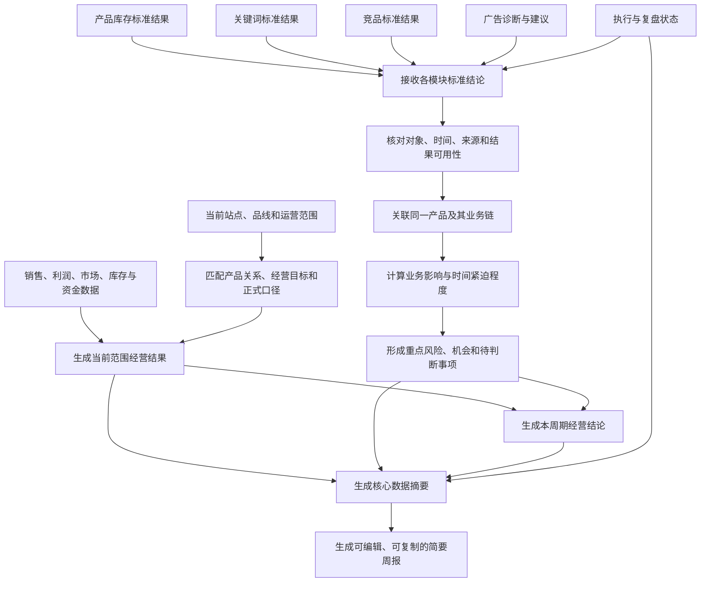
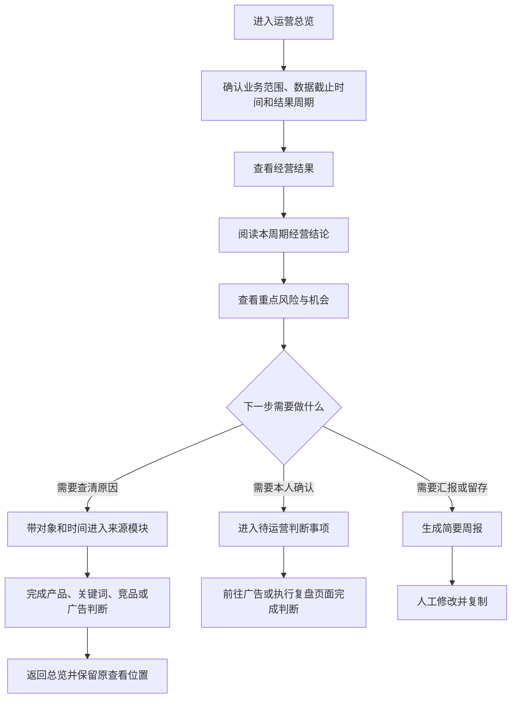

# Bamboocool 运营总览模块页面架构方案

更新时间：2026-08-13

适用范围：固定站点、固定品线、单一运营视角下的运营总览页

## 1. 文档定位

本文档定义运营总览模块的页面目标、页面板块、业务关系、系统生成顺序和运营查看路径。

总览模块采用一页结构。它不重新完成产品库存、关键词、竞品或广告分析，而是把经营结果和各业务模块已经形成的结论组织成运营进入工作台后的第一条判断路径。

本文档只到页面板块和业务关系层级，不提前固定表格字段、筛选项、组件形式和视觉细节。

## 2. 模块边界

### 2.1 总览负责什么

总览负责让运营快速完成四件事：

1. 判断当前品线的经营结果整体怎么样；
2. 找到当前最值得继续查看的少量风险、机会和变化；
3. 找到确实需要运营本人判断或确认的事项；
4. 按需生成可以修改和复制的简要经营周报。

### 2.2 总览不负责什么

总览不负责：

- 重新计算产品库存、关键词、竞品和广告模块内部的专业结论；
- 展开关键词池、竞品明细、广告组明细或子 ASIN 完整盘点；
- 根据未经确认的阈值自行创造异常或广告动作；
- 把所有风险、系统计算过程和数据缺口自动变成待办任务；
- 直接修改广告、补货、价格或促销配置；
- 承担团队管理、多运营比较或多品线切换。

### 2.3 最小业务对象

总览同时使用两类标准业务对象。

#### 经营结果

一个经营结果对应：

```text
当前业务范围 × 一个正式经营口径 × 一个统计周期 × 一个比较周期
```

例如销售结果可以按月统计并与去年同月比较，市场份额可以按月统计并与上月比较。页面每天可以打开，但每个结果仍使用自己的正式周期。

#### 经营关注项

一个经营关注项对应：

```text
来源模块 × 业务对象 × 发生时间或影响窗口 × 一条标准模块结论
```

业务对象可以是子 ASIN、关键词、竞品、广告对象或一条广告执行记录。总览不改变来源模块的判断对象和结论口径。

### 2.4 上下游关系

总览读取以下上游结果：

- 销售、目标、利润、市场份额及库存资金约束形成的经营结果；
- 产品库存模块形成的单一子 ASIN 盘点结果和风险结果；
- 关键词模块形成的需求、覆盖、位置变化和机会证据；
- 竞品模块形成的威胁对象、市场变化和可核验证据；
- 广告模块形成的广告目的、架构诊断和待确认建议；
- 执行与复盘模块形成的人工决策、实际动作及 D+3、D+7 观察状态。

总览向下游提供：

- 带原对象、时间范围和来源结论的模块回查入口；
- 运营当前需要判断的事项入口；
- 可修改、可复制并保留生成依据的简要周报草稿。

## 3. 一页总体架构

运营总览由六个连续板块组成：

1. 业务范围与数据状态；
2. 经营结果看板；
3. 本周期经营结论；
4. 重点风险与机会；
5. 待运营判断事项；
6. 核心数据与简要周报。

AI 作为贯穿页面的解释和总结能力，不单独占据一个与业务内容并列的大板块。

页面阅读主线为：

```text
先确认看的是哪个范围和哪段数据
        ↓
判断经营结果整体变好还是变差
        ↓
找到最值得继续看的业务对象
        ↓
处理确实需要本人判断的事项
        ↓
进入来源模块深挖，或生成简要周报
```

## 4. 系统生成逻辑



系统先形成经营结果和各模块标准结论，再生成总览。总览只对已有结果做范围匹配、关系连接、影响评价和优先顺序组织，不替代来源模块重新分析。

## 5. 运营查看路径



## 6. 板块一：业务范围与数据状态

### 6.1 板块目标

先让运营确认当前总览代表哪个站点、哪个品线、哪个数据截止时间，避免把不同范围和不同更新周期的数据误认为同一时点结果。

### 6.2 板块关系

本板块把三类信息放在一起：

- 当前固定业务范围；
- 页面整体的数据截止时间和最近更新时间；
- 经营结果与外部市场数据之间不同的刷新周期。

页面默认显示简短状态。运营需要核对时，可以继续查看数据来源、更新时间、正式口径、缺失项和待确认参数。

### 6.3 板块输出

运营可以明确知道：

- 当前页面代表的业务范围；
- 哪些结果已经更新到当前周期；
- 哪些结果仍停留在较早周期；
- 哪些结论因为数据缺失或口径待确认只能谨慎使用。

## 7. 板块二：经营结果看板

### 7.1 板块目标

回答“当前这条品线经营得怎么样”，而不是罗列所有经营指标。

### 7.2 经营结果结构

经营结果分为三组业务关系。

#### 规模与目标

把当前销售结果、既定目标和正式比较基准放在一起，说明销售规模是否达到计划，以及相对去年同期或其他确认周期发生了什么变化。

#### 利润与经营质量

把当前利润结果和正式利润口径放在一起，说明销售增长是否同时带来健康利润。利润口径未确认或财务数据尚未更新时，不输出伪精确结论。

#### 市场位置与经营约束

把市场份额或类目位置与当前最重要的库存、库龄、资金占用或下单约束放在一起，说明市场增长是否具备承接条件。

市场份额按客户实际可用周期展示。头部类目的市场份额主要按月判断时，必须明确显示月度结果，不能包装成日变化。

### 7.3 展示原则

- 每个结果必须同时说明统计周期和比较周期；
- 页面每天可打开，不代表每项结果都按日变化；
- 广告成本口径在 ACoS、TACoS、ACoAS 等术语未正式统一前，不混用名称或写入固定判断；
- 库存和资金约束用于解释经营承接，不把全部库存指标复制到总览；
- 经营结果的数量保持克制，未进入整体判断的指标留在来源模块或数据说明中。

### 7.4 板块输出

经营结果看板最终输出一份当前业务范围的经营结果快照，明确规模、利润、市场位置和关键经营约束各自处于什么状态。

## 8. 板块三：本周期经营结论

### 8.1 板块目标

把经营结果和最重要的模块变化整理成一条可读结论，让运营不用自己拼接多个数字。

### 8.2 结论结构

本周期经营结论固定回答：

1. 整体结果变好、变差还是基本稳定；
2. 哪个业务变化最值得关注；
3. 当前最大的承接限制或不确定项是什么；
4. 建议先进入哪个来源模块继续判断。

### 8.3 结论边界

- 结论必须能够回到经营结果或来源模块；
- 只有经过验证的关系才可以写成原因；
- 价格、促销、排名、流量等同期变化，默认表达为共同发生的信号，不直接断言因果；
- 数据不足时明确写出缺失内容，不用自然语言掩盖不确定性。

## 9. 板块四：重点风险与机会

### 9.1 板块目标

把产品库存、关键词、竞品和广告模块当前最值得继续查看的少量对象放在同一个顺序中，让运营知道先看哪里。

### 9.2 关注项范围

本板块可以承接：

- 产品库存已经确认的缺货、超量、可用性、库龄或仓储费风险；
- 关键词已经确认的需求增长、覆盖缺口、自然位或广告位变化；
- 竞品已经确认的价格、促销、排名、销量量级、流量或关键词入口变化；
- 广告已经确认的目的不清、结构混合、重复覆盖、表现与既定目的不一致等诊断；
- 执行与复盘中已经到达观察节点、需要回看的广告动作。

### 9.3 关注项表达

每条关注项需要让运营看懂：

- 发生在什么业务对象上；
- 发生了什么；
- 发生时间或预计影响窗口；
- 为什么会影响当前产品目标或经营结果；
- 结论来自哪个模块，当前是否可靠；
- 应进入哪个来源模块查清完整证据。

这是一组跨模块的经营重点，不按四个模块平均分配展示数量。某个周期没有高影响结果的模块可以不出现。

### 9.4 排序原则

排序优先考虑：

1. 对当前经营目标和产品目标的影响；
2. 风险或机会发生的时间紧迫程度；
3. 是否会阻断库存承接、流量获取或广告判断；
4. 产品阶段、产品定位和业务重要性；
5. 来源结果的可靠程度和确认状态。

正式优先级权重和阈值由后续业务共创确认。总览在规则未确认前保留来源模块的严重程度和明确时间窗口，不自行编造数值权重。

### 9.5 板块输出

本板块输出当前周期的经营重点顺序。运营可以直接从任一关注项进入来源模块，并在返回后继续原来的浏览位置。

## 10. 板块五：待运营判断事项

### 10.1 板块目标

集中呈现确实需要运营做选择、确认或记录的少量事项，避免把“值得关注”误写成“必须执行”。

### 10.2 纳入范围

第一版主要纳入：

- 需要运营确认的广告目的或标签；
- 已有证据支持、需要运营决定是否采纳的广告调整方向；
- 需要补充实际执行内容或拒绝原因的广告动作；
- 已到 D+3 或 D+7 节点、需要人工完成判断的复盘记录。

产品库存、关键词和竞品的风险或机会，默认留在重点风险与机会板块。只有来源模块明确要求运营作出业务选择时，才进入待判断事项。

### 10.3 状态关系

本板块同步展示事项当前处于待判断、已接受、修改后接受、已拒绝、已记录动作或进入复盘的哪一阶段。

运营在来源页面完成判断后，总览同步最新状态；已完成事项退出当前待判断范围，但保留在来源模块和历史记录中。

### 10.4 板块输出

运营得到一组可执行的人工判断入口，但总览本身不执行广告修改，也不成为完整任务管理系统。

## 11. 板块六：核心数据与简要周报

### 11.1 板块目标

减少运营从经营结果、周报看板和动作记录中重复抄写数据的工作。

### 11.2 核心数据摘要

核心数据摘要从当前已经形成的经营结果中提取，保持与页面显示的周期、口径和数据版本一致。运营可以直接复制，不再人工拼接销售、利润、风险和动作进度。

### 11.3 简要周报

简要周报按需生成，不要求每天主动推送，也不占据首屏主要位置。

周报草稿围绕以下内容组织：

- 本周期经营结果；
- 最重要的风险、机会和变化；
- 已完成、待判断和进入复盘的广告动作；
- 下一周期需要继续观察的事项；
- 数据截止时间、统计周期和重要不确定项。

生成后允许运营修改和复制。生成记录保留当时使用的数据版本和结论版本，避免后续数据更新后无法解释原报告。

### 11.4 板块输出

本板块输出可复制的核心数据摘要，以及一份可修改、可追溯的简要周报草稿。

## 12. AI 在总览中的作用

总览 AI 绑定当前业务范围、当前周期和当前页面结果，可以完成：

- 解释当前经营结果；
- 说明为什么某个对象排在前面；
- 指出结论来自哪个业务模块；
- 说明不同结果的周期差异和缺失数据；
- 建议先进入哪个模块继续查看；
- 根据同一套结果生成简要周报草稿。

AI 不在总览中自行创造产品库存规则、关键词机会规则、竞品因果结论或广告调整数值。

## 13. 页面统一规则

### 13.1 统一业务范围

总览、来源模块和报告使用同一个站点、品线和运营范围。第一版不加入多运营、多品线和管理者视角切换。

### 13.2 统一周期表达

每个经营结果和模块结论保留自己的统计周期、比较周期和更新时间。总览不强行把日、周、30 天和月度结果改成同一周期。

### 13.3 统一结论来源

每条重点风险、机会和待判断事项只能引用一个可追溯的来源结果。来源结果更新后，总览同步新版本，不产生另一套独立判断。

### 13.4 统一数据状态

原始数据、系统计算、第三方估算、业务确认结果和模拟演示数据必须区分。真实业务页面不把 Demo 模拟数据当作经营事实。

### 13.5 统一页面上下文

从总览进入来源模块时，保留业务对象、时间范围、来源结论和当前查看位置；返回总览后保留原有浏览状态。

### 13.6 统一人工决策边界

AI 提供结论、依据和建议方向，运营完成最终判断。第一版不由系统直接修改广告、价格、促销或补货计划。

## 14. 页面标准输出

运营总览最终向运营输出：

1. 当前业务范围的经营结果快照；
2. 一条有来源、有周期、有不确定性说明的经营结论；
3. 当前最值得继续查看的风险、机会和变化顺序；
4. 确实需要运营本人判断的事项；
5. 带完整上下文的来源模块入口；
6. 可修改、可复制并可追溯的简要周报草稿。

## 15. 后续详细设计顺序

建议按照以下顺序继续落地：

1. 确认经营结果正式口径、统计周期和比较周期；
2. 确认各模块向总览交付的标准结果及可用状态；
3. 共创重点风险、机会和待判断事项的优先顺序规则；
4. 确认简要周报的固定问题、生成周期和复制格式；
5. 进入总览所需数据表、字段、来源和更新机制设计；
6. 再完成页面屏幕结构、组件、交互和视觉实现。

