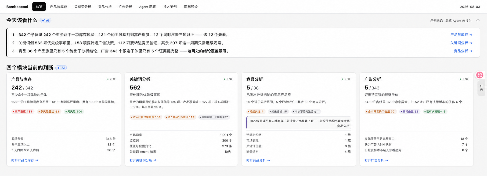

# Image 2 视觉灵感 V2 · 原位精修

## 方向

V2 不是重新设计工作台，而是把现有 Bamboocool 页面从“可用草稿”精修到“成品界面”。每一张图都以真实页面截图为编辑底图。

## 必须保持不变

- Bamboocool 顶部导航、模块命名、黑色选中态和数据日期。
- 浅灰页底、白色内容面、黑灰正文、克制状态色、小型蓝色 AI 徽标。
- 现有页面骨架、业务板块顺序、真实中文文案和关键数值。
- 高密度经营工作台气质，不增加通用后台侧栏，不套新的 SaaS 视觉模板。
- 业务页面使用实面；轻玻璃只用于任务浮层和对象栏。

## 允许精修

- 页面标题、板块标题、结论、数字和辅助信息之间的层级。
- 栅格、对齐、内边距、垂直节奏、边框和留白。
- 表格的列宽、数字对齐、冻结表头、行状态和下钻提示。
- 图表的比例、图例、标注、共同时间轴、基准线和详情联动。
- 同一页面内“数据—关系—判断—AI 解释”的阅读顺序。

## 禁止

- 改导航体系、改品牌标志、加无关模块。
- 大面积蓝色、渐变、深色主题、霓虹、3D 图表、装饰插画。
- 四张等权 KPI 卡片套路、过多胶囊和大圆角卡片。
- Image 2 擅自生成的示例业务事实进入正式实现。

## 校准样张

校准重点：保留现有四卡骨架、顶部导航、黑色规则线、AI 标记和业务密度，只收紧对齐、间距、数字层级、卡片内部结构和链接位置。
